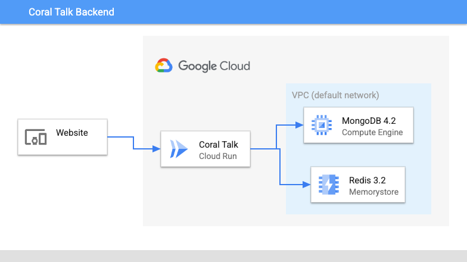

Bruno Patrocinio | Customer Engineer | Google


<p style="background-color:#CAFACA;"><i>Contributed by Google employees.</i></p>

This tutorial describes how to deploy an open-source commenting platform, [Coral Talk](https://docs.coralproject.net/)  on Google Cloud Platform using managed services.

The diagram below shows the general flow: 


The instructions are provided for a Linux development environment, such as [Cloud Shell](https://cloud.google.com/shell/).
However, you can also run the application on Google Compute Engine, Kubernetes, a serverless environment, or outside of
Google Cloud.

This tutorial assumes that you know the basics of the following products and services:

  - [Cloud Run](https://cloud.google.com/run/docs)
  - [Container Registry](https://cloud.google.com/container-registry/docs)
  - [Memorystore](https://cloud.google.com/memorystore/docs)
  - [Compute Engine](https://cloud.google.com/compute/docs)
  - [`gcloud`](https://cloud.google.com/sdk/docs)
  - [Docker](https://docs.docker.com/engine/reference/commandline/run)

## Objectives

* Learn how to create and deploy services using `gcloud` commands.
* Show how to deploy an application with Cloud Run and Memory Store

## Costs

This tutorial uses billable components of Google Cloud, including the following:

*   [Cloud Run](https://cloud.google.com/run)
*   [Compute Engine](https://cloud.google.com/compute)
*   [Memorystore](https://cloud.google.com/memorystore)

Use the [Pricing Calculator](https://cloud.google.com/products/calculator) to generate a cost estimate based on your 
projected usage. 

This tutorial only generates a small amount of Cloud Run requests, which may fall within the free allotment.


## Before you begin


For this tutorial, you need a Google Cloud [project](https://cloud.google.com/resource-manager/docs/cloud-platform-resource-hierarchy#projects).
You can create a new one, or you can select a project that you have already created:

1.  Select or create a Google Cloud project.

    [GO TO THE MANAGE RESOURCES PAGE](https://console.cloud.google.com/cloud-resource-manager)

2.  Enable billing for your project.

    [ENABLE BILLING](https://support.google.com/cloud/answer/6293499#enable-billing)

3. Enable the Cloud Run and Artifact Registry APIs. For details, see [ENABLING APIs](https://cloud.google.com/apis/docs/getting-started#enabling_apis).
   
4. Add role *Artifact Registry Service Agent* in service account `[project-id]-compute@developer.gserviceaccount.com`


## Detailed steps


### Download images and upload to Google Artifact Registry

#### 1.Artifact Registry
```
gcloud artifacts repositories create coral-demo     --repository-format=docker --location=us-central1
gcloud auth configure-docker us-central1-docker.pkg.dev
```

#### 1. Mongo
```
docker pull mongo:4.2
docker tag mongo:4.2 us-central1-docker.pkg.dev/{my-project}/coral-talk/mongo
docker push us-central1-docker.pkg.dev/{my-project}/coral-talk/mongo
```
#### 2. Coral Talk 
```
docker pull coralproject/talk:6
docker tag coralproject/talk:6 us-central1-docker.pkg.dev/{my-project}/coral-talk/talk
docker push us-central1-docker.pkg.dev/{my-project}/coral-talk/talk
```

### Create VPC Network
```
gcloud compute networks create coral --project={my-project} \
--subnet-mode=custom --mtu=1460 --bgp-routing-mode=regional
```

```
gcloud compute networks subnets create talk --project={my-project} \
 --range=10.0.0.0/9 --network=coral --region=us-central1 \
 --secondary-range=serverless=10.130.0.0/28
```

### Create Serverless VPC access
```
gcloud compute networks vpc-access connectors create talk \
--region=us-central1 \
--network=talk \
--range=10.130.0.0/28 \
--min-instances=2 \
--max-instances=3 \
--machine-type=f1-micro
```

### Create Memorystore Redis instance
```
gcloud redis instances create myinstance --size=2 --region=us-central1 \
    --redis-version=redis_3_2
```

### Create Mongo VM
```
gcloud compute instances create-with-container instance-1 \
--project=my-project --zone=us-central1-a --machine-type=f1-micro \
--network-interface=subnet=talk-subnet-poc,no-address \
--service-account={my-project}-compute@developer.gserviceaccount.com \
--boot-disk-size=10GB --container-image=us-central1-docker.pkg.dev/{my-project}/coral-talk/mongo \
--container-restart-policy=always
```

### Create Coral Talk Service in Cloud Run
```
gcloud run deploy coralproject \
--image=us-central1-docker.pkg.dev/{my-project}/coral-talk/talk \
--concurrency=80 \
--platform=managed \
--region=us-central1 \
--project=my-project
```

- Add environment variables `MONGODB_URI`, `REDIS_URI` and `SIGNING_SECRET`
- Add VPC Connector
  
### Access service url to config Coral Talkl
You've successfully deployed the Mongo and Coral Talk docker containers to Registry, configured your serverless instances to connect directly to your Virtual Private Cloud network, configured a Memorystore Redist instance, and set up a VM using the Mongo container, and deployed Coral Talk Service to Cloud Run.

## Cleaning up

To avoid incurring charges to your Google Cloud account for the resources used in this tutorial, you can delete the project.

Deleting a project has the following consequences:

- If you used an existing project, you'll also delete any other work that you've done in the project.
- You can't reuse the project ID of a deleted project. If you created a custom project ID that you plan to use in the
  future, delete the resources inside the project instead. This ensures that URLs that use the project ID, such as
  an `appspot.com` URL, remain available.

To delete a project, do the following:

1.  In the Cloud Console, go to the [Projects page](https://console.cloud.google.com/iam-admin/projects).
2.  In the project list, select the project you want to delete and click **Delete**.
3.  In the dialog, type the project ID, and then click **Shut down** to delete the project.

## What's next


- Learn more about [Cloud developer tools](https://cloud.google.com/products/tools).
- Try out other Google Cloud features for yourself. Have a look at our [tutorials](https://cloud.google.com/docs/tutorials).
