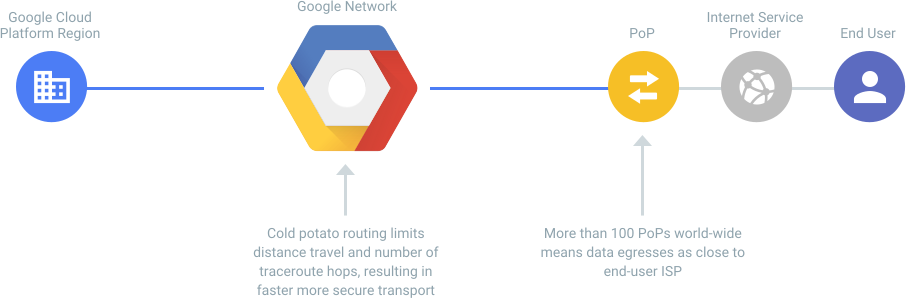
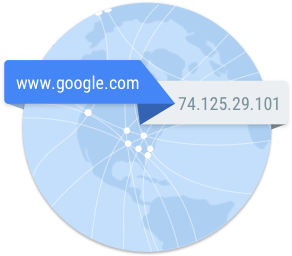

# The Top 3 Concerns


These factors determined the choices I made in writing this guide:

1. Security & Privacy
2. Cost
3. Performance

## Security & Privacy

Google Cloud is not targeted towards consumers. It is targeted towards businesses and developers/programmers. There are no real privacy concerns here, because this service is enterprise and government grade: customers of Google Cloud are typically in Education, Financial Services, Government, Healthcare & Life Sciences, Media and Entertainment, and Retail. In order to secure customers in these industries, Google Cloud abides by stringent compliance policies.

You can see more about how Google Cloud handles security, transparency, privacy, and compliance here: https://cloud.google.com/security/

Running a VPN service on Google's Cloud is a vastly superior option over trusting an unknown 3rd party VPN provider with your data.

## Cost

You get a lot for nothing. A free server running on 1 shared vCPU with 0.6GB of RAM, a cloud based firewall, and a spiffy app and website to monitor everything is nothing very special. Many providers offer this.

The real juicy stuff is in the network connectivity you get for no cost: a static **Anycast IPv4 address**.

## Performance


### Network

#### Anycast IPv4 Address

This significantly outperforms other public cloud offerings.

With the Premium Tier Network, inbound traffic from your tablet/phone/computer to your Pi-Hole in Google Cloud goes over Google’s private, high performance network at the POP closest to you. Google delivers outbound traffic returning from Pi-Hole in Google Cloud to your tablet/phone/computer on Google’s network, and exits at the POP closest to you. *You can be anywhere in the world.*

Routers will select the desired path on the basis of number of hops, distance, lowest cost, latency measurements or based on the least congested route.



This means that most of this traffic will reach your device with a single hop to your ISP: so you enjoy minimum congestion (latency), and maximum performance.


### DNS



DNS latency is caused by the following 2 concerns:

1. latency between the client and the DNS resolving server
2. latency between the resolving servers and other name servers

Choosing a DNS server with the lowest latency is the simplest way to address concern #1.

#### Use Google Public DNS

Google's Public DNS has the lowest latency to your Pi-Hole, because it resolves completely within Google's internal private Premium Tier network. A round trip ping to Google's Public DNS from within Google's Cloud is 0.16ms, whereas a provider such as Cloudflare with direct peering to Google's network has a ping of 16ms.


### CPU

#### Cipher

The cipher which offers the quickest performance hinges on features the CPU has available. The Intel CPUs on Google Compute Engine support AES and RDRAND at the hardware level, so we benefit from using GCM over CBC.

1. Verify the processor has the AES/AES-NI instruction set with this command:

```
lscpu
```

  The Flags should show:

  > ```
  > rdrand
  > ```

2. Verify the correct BIOS configuration is present with this command:

```
grep -o aes /proc/cpuinfo
```

  The output should read:

  >```
  > aes
  > ```

3. Verify if AES-NI optimized drivers are loaded into Linux with this command:

```
sort -u /proc/crypto | grep module
```

  The following modules should be in the list:

  > ```
  > module       : aesni_intel
  > module       : aes_x86_64
  > ```

4. Verify if OpenSSL is configured to take advantage of AES-NI with this command:

```
openssl engine
```

  The output should read:

  > ```
  > (rdrand) Intel RDRAND engine
  > (dynamic) Dynamic engine loading support
  > ```

  Source: https://kazoo.ga/quick-benchmark-cbc-vs-gcm/

#### Encryption Level

128 bit encryption offers a 40% savings on CPU time over 256 bit encryption.

Source: https://crypto.stackexchange.com/a/23
