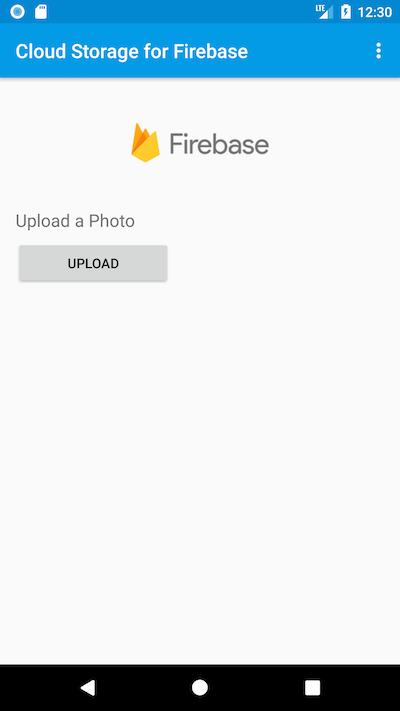
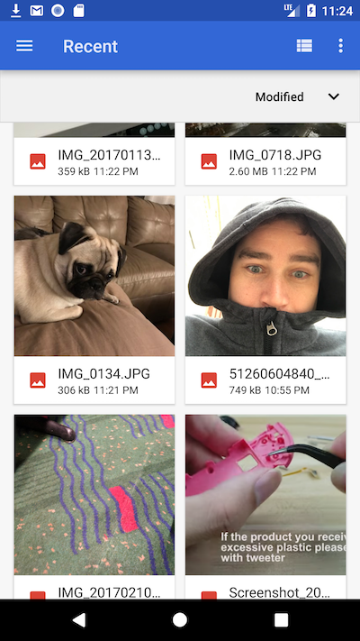
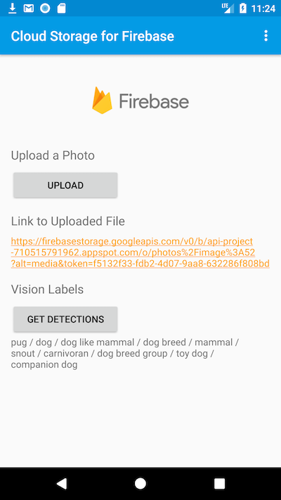
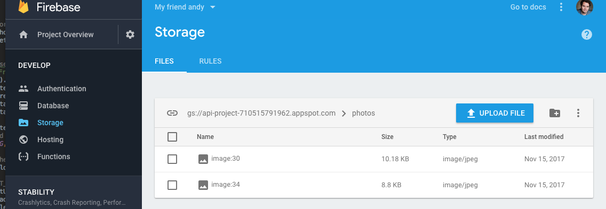
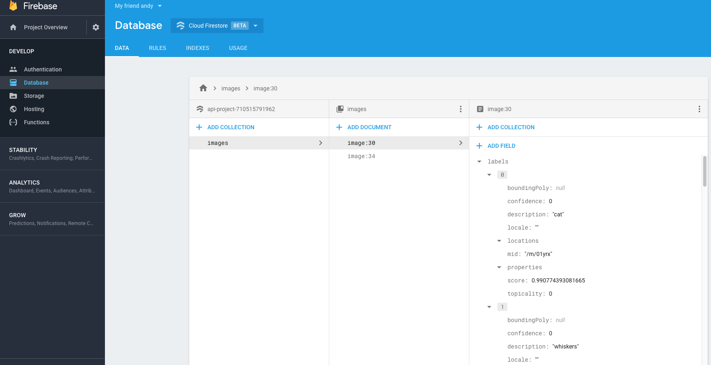

# Adding Computer Vision to your Android App

Recently, Sara Robinson authored an excellent post explaining one approach
to [Adding Computer Vision to your App](https://medium.com/@srobtweets/adding-computer-vision-to-your-ios-app-66d6f540cdd2).
In the post, she introduces the following pattern:

* Use Firebase Auth native client to upload to Firebase Storage
* Use Cloud Functions to access Vision API and store the result in Firestore
* Access Cloud Firestore from device to retrieve the API Result

Sara uses iPhone X in her application, and as a Pixel 2 owner, I felt like I
was missing out. I wanted in on that sweet, sweet image classification and had
to roll my own Android app. I started from the Firebase storage quickstart for
Android and produced a quick proof of concept.

Let's start by checking out a short demo of how my proof of concept works.
First, you upload an image to Firebase storage from your Android device:

After the image is uploaded, a link to the uploaded file is presented in the
app, exactly the same as in the sample app. Then the app retrieves the
detected labels for the image and presents them.

Let's take a closer look at how each of the steps is performed.

If you want to follow along, start by getting the Firebase quickstart samples.

    git clone https://github.com/firebase/quickstart-android

The storage sample is in the quickstart-android/storage folder and you can find
the instructions for configuring it on [the Firebase Cloud Storage site](https://firebase.google.com/docs/storage/android/start).

You will also need to initialize the project sources folder by installing the
Firebase SDK and calling `firebase init` with Storage, Functions, and
Firestore.

## Step 1: Upload a file to Firebase Storage

For this step, I just used the functionality of the sample app. In the sample
app, a service, MyUploadService, is implemented to upload a file outside of the
main application thread. 

The [**uploadFromUri** function in the sample app](https://github.com/firebase/quickstart-android/blob/master/storage/app/src/main/java/com/google/firebase/quickstart/firebasestorage/MainActivity.java#L174)
illustrates the bulk of the operations performed by the provided service.

After the file is uploaded, the __fileUri__ is passed in an **Intent** so that
the **MainActivity** class can retrieve the file data. This is done in the sample
app in the [**MyUploadService** activity's **broadcastUploadFinished** method](https://github.com/firebase/quickstart-android/blob/master/storage/app/src/main/java/com/google/firebase/quickstart/firebasestorage/MyUploadService.java#L127).

When working on the app, I was able to check that the storage operation was
working by visiting the Firebase console for storage and seeing the uploaded
files:

## Step 2: Analyze the image and publish label data to Firestore
Now that the files are successfully uploading to Firebase Storage, it's time
to process the file using a Cloud functions call. This operation is virtually
identical to the Cloud functions API call made by Sara in her post but I'm
retrieving just label data instead of label and web annotation data.

The following code, specified in `index.js` in my functions folder, loads the
required libraries for Firebase and Google Cloud Vision and then transfers the
API call result to Firestore.

    const Vision = require("@google-cloud/vision");
    const functions = require('firebase-functions');
    const admin = require('firebase-admin');

    const vision = new Vision();
    admin.initializeApp(functions.config().firebase);
    const db = admin.firestore();

    exports.callVision = functions.storage.object().onChange(event => {
        const object = event.data;
        const fileBucket = object.bucket;
        const filePath = object.name;
        const gcsPath = `gs://${fileBucket}/${filePath}`;
        const req = {
          source: {
            imageUri: gcsPath
          }
        };

        // Call the Vision API's web detection and safe search detection endpoints
        console.log(`doingrequest: ${req}`);
        return vision.labelDetection(req).then(response => {
            let labels = response[0].labelAnnotations;
            return {labels: labels};
        }).then((visionResp) => {
            let imageRef = db.collection('images').doc(filePath.slice(7));
            return imageRef.set(visionResp);
        })
        .catch(err => {
            console.log('vision api error', err);
        });
    });

This step took a little coaxing from the Firebase console and a few calls to
`firebase deploy` and tracing the errors using the {...} Functions menu on
the Firebase console but when I finally got it working, I was able to see the
results in the Firestore section of the console:

Of note, you can now see the indexed label data on the right-most column of the
console.

## Step 3: Manually retrieve the label data from Firestore
I reused and relabeled the "Download" button from the Firebase Storage sample
app to manually trigger the retrieval of the Label data from Firestore. To do
this, I just updated the button name to button_detections in the app resources
and replaced the UI strings as appropriate. Then I added a new method
retrieveMetadata to the click handler for the button.

    @Override
    public void onClick(View v) {
       int i = v.getId();
       if (i == R.id.button_camera) {
           launchCamera();
       } else if (i == R.id.button_sign_in) {
           signInAnonymously();
       } else if (i == R.id.button_detections) {
           retrieveMetadata();
           updateUI(mAuth.getCurrentUser());
       }
    }

The following code shows how I retrieve the metadata for the last uploaded image by using the Firestore API.

    private void retrieveMetadata () {

       DocumentReference docRef = mFirestore.collection("images").document(mFileUri.getLastPathSegment());

       docRef.get().addOnCompleteListener(new OnCompleteListener<DocumentSnapshot>() {
           @Override
           public void onComplete(@NonNull Task<DocumentSnapshot> task) {
               if (task.isSuccessful()) {
                   DocumentSnapshot document = task.getResult();
                   if (document.exists()) {
                       Log.d(TAG, "DocumentSnapshot data: " + task.getResult().getData());
                       mResponse = ("" +  task.getResult().getData()).replaceAll("=", ":");
                   } else {
                       Log.d(TAG, "No such document");
                       mResponse = "No stored label data";
                   }
               } else {
                   Log.d(TAG, "get failed with ", task.getException());
               }
           }
       });
    }

Note that I probably should be doing this in a separate service but for the
purposes of my proof of concept, this should be sufficient. Also, I'm replacing
the proto-style object characters with JSON-style object characters because
I'll be manually filtering the result data in **UpdateUI**.

When **UpdateUI** is called, the sample app checks the stored member variable
__mResponse__ and then filters the label description strings from the result
data.

    if (mResponse != null) {
       // Manually filter the proto message to the label descriptions
       ArrayList<String> labels = new ArrayList<String>();
       String labelstr = "";
       for (String it : mResponse.split(",")) {
           if (it.split(":")[0].contains("description")) {
               labels.add(it.split(":")[1]);
               labelstr += it.split(":")[1] + " / ";
           }
       }

       // Remove trailing slash
       labelstr = labelstr.substring(0, labelstr.length() - 2);
       Log.d(TAG,"Found: " + labels.size() + " labels.");
       ((TextView) findViewById(R.id.response_data))
               .setText(labelstr);
    }

## Conclusions and Next Steps
With the help of Sara's blog post, it was incredibly easy to update the
Firebase Storage sample app to work with the Vision API and return results to
an Android device. What's exciting is that this approach to accessing the
Google Cloud Machine Learning features is not restricted to just the Vision
API. For example, if you wanted to use the translation API with the NMT model,
you could employ a similar approach but by storing text data instead of photo
data.

If you wanted to "productionize" this app, you should probably do the following:

* Fix all my UI - Create label bubbles instead of just formatted text
* Enable user auth to prevent abuse of your API quota
* Move the operations done with Firestore to a separate service
* Eliminate data polling for Firestore data

**See Also:**
* [Kotlin example app using Firebase with Cloud Functions for Computer Vision](https://github.com/joaobiriba/ARCalories)
* [Adding Computer Vision to your iOS App](https://medium.com/@srobtweets/adding-computer-vision-to-your-ios-app-66d6f540cdd2)

