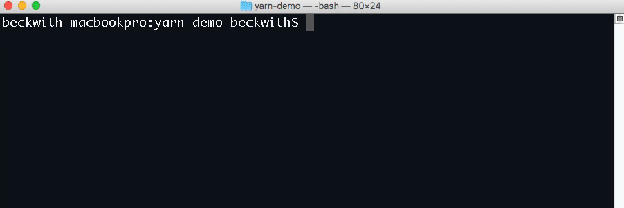
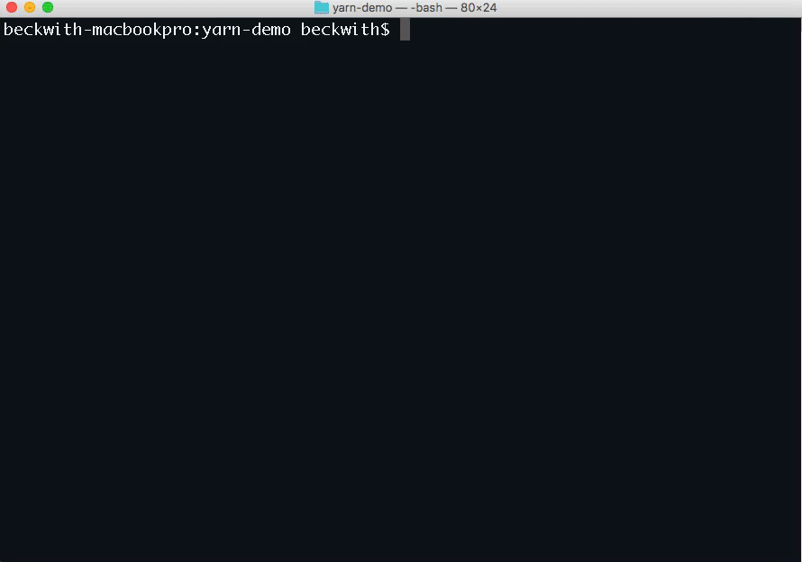

[Yarn](https://yarnpkg.com/) is a package management tool that makes it easy and fast to install [npm](https://www.npmjs.com/) modules for [node.js](https://nodejs.org).

## Getting started

To install yarn, follow the [installation instructions](https://yarnpkg.com/en/docs/install).

You can use Yarn to manage your dependencies on App Engine. To install a package, and automatically save it to your `package.json` run:

    yarn add google-cloud

Running this command will save the dependency into your `package.json`, and create a `yarn.lock` file in the current directory. Don't delete this file!  It will track the exact version of every package you need to run your application. 

## Deploying to App Engine

To use yarn for your deployments to App Engine - all you need is a `yarn.lock` in your application directory. Then, just deploy:

    gcloud app deploy

If App Engine finds a `yarn.lock` in the application directory, yarn will be used to perform the npm installation.  

And that's it! If you have any other questions about Node.js on Google Cloud Platform, be sure to [join us](https://gcp-slack.appspot.com) on our [Slack channel](https://googlecloud-community.slack.com/messages/nodejs/).
