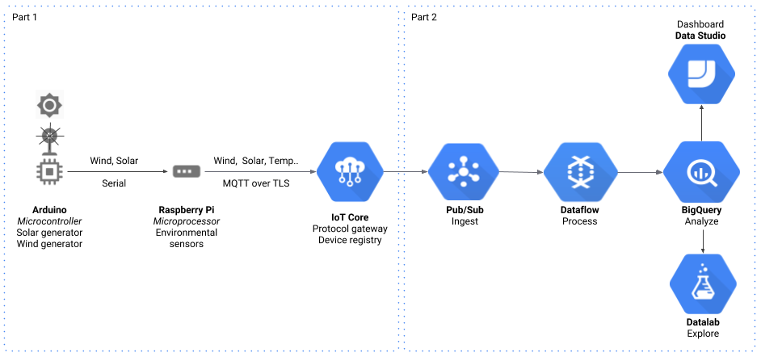
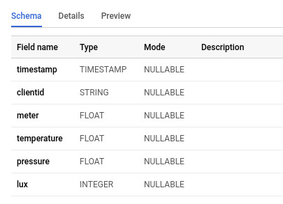
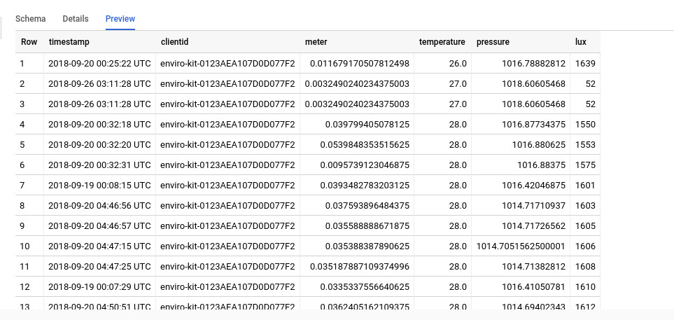
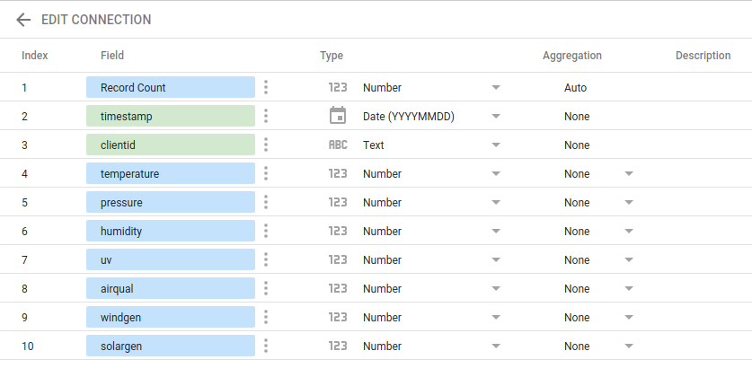
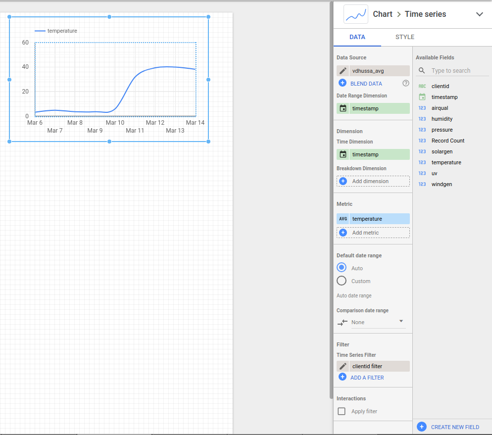
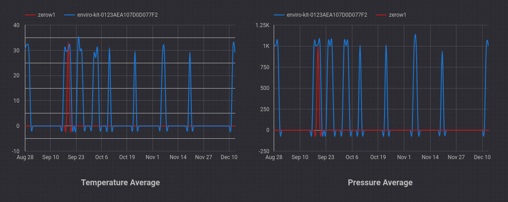

Varun Dhussa | Solutions Architect | Google Cloud

Markku Lepisto | Solutions Architect | Google Cloud

This two-part tutorial demonstrates how to control an [Arduino Microcontroller](https://www.arduino.cc/) with a [Raspberry Pi](https://www.raspberrypi.org/), connect the devices to [Google Cloud IoT Core](https://cloud.google.com/iot-core/), post sensor data from the devices, and analyze the data in real time. [Part 1](https://cloud.google.com/community/tutorials/ardu-pi-serial-part-1) of the tutorial created a 'hybrid' device, combining the strengths of a Linux-based microprocessor with internet connectivity and TLS stack, together with a constrained microcontroller for analog I/O.

## Part 2 objectives

- Process sensor data from PubSub using Dataflow
- Store processed sensor data in Google BigQuery
- Create a report dashboard Using Google Data Studio
- Create a notebook on Cloud Datalab

**Figure 1.** *End to end architecture*



## Before you begin

This tutorial assumes you already have a [Google Cloud Platform](https://console.cloud.google.com/freetrial) account set up and have [Part 1](https://cloud.google.com/community/tutorials/ardu-pi-serial-part-1) of the tutorial working

## Costs

This tutorial uses billable components of GCP, including:

- Cloud IoT Core
- Cloud Pub/Sub
- Cloud Dataflow
- Google BigQuery
- Cloud Datalab

This tutorial should not generate any usage that would not be covered by the [free tier](https://cloud.google.com/free/), but you can use the [Pricing Calculator](https://cloud.google.com/products/calculator/) to generate a cost estimate based on your projected production usage.

## Enable Cloud Dataflow for your project
Execute the first six steps in the Cloud Dataflow [Quickstart](https://cloud.google.com/dataflow/docs/quickstarts/quickstart-python) *on your local development environment e.g laptop*.

## Enable Google BigQuery for your project
Execute the first three steps in the Google BigQuery [Quickstart](https://cloud.google.com/bigquery/docs/quickstarts/quickstart-web-ui).

## Install environment dependencies and Google Cloud SDK
1. Clone source repository

    ```
    $ git clone https://github.com/GoogleCloudPlatform/community.git
    ```
2. Change to the app directory

    ```
    $ cd community/tutorials/ardu-pi-serial-part-2
    ```
3. Create and activate the virtual environment

    ```
    $ virtualenv my_virtual_env
    $ . ./my_virtual_env/bin/activate
    $ pip install -r beam-requirements.txt
    ```

4. Follow the steps in this [guide](https://cloud.google.com/sdk/install) to install Cloud SDK

## Create a BigQuery Dataset

[BigQuery](https://cloud.google.com/bigquery/) is Google's fully managed serverless and highly scalable enterprise data warehouse solution.

A BigQuery [dataset](https://cloud.google.com/bigquery/docs/datasets-intro) contains tables and views in a specified single region or a geography containing multiple regions. Follow the [instructions](https://cloud.google.com/bigquery/docs/datasets) to create a dataset in your project. The dataset location can only be specified while creating it. More details are available [here](https://cloud.google.com/bigquery/docs/locations).

## Start Cloud Dataflow job

[Cloud Dataflow](https://cloud.google.com/dataflow/) is a fully-managed service for transforming and enriching data in stream (real time) and batch (historical) modes with equal reliability and expressiveness using the [Apache Beam SDK](https://beam.apache.org/). 

Select your preferred Cloud Dataflow [service region](https://cloud.google.com/dataflow/docs/concepts/regional-endpoints).

Run the command below to start the Apache Beam pipeline on the Cloud Dataflow runner.

```
$ python -m beam-solarwind --project <project-name> \
--topic <pubsub-topic-name (eg: projects/my-project/topics/my-topic)> \
--temp_location gs://<gcs-bucket>/tmp \
--setup_file ./setup.py \
--region <your preferred region> \
--runner DataflowRunner \
--output "<BigQuery table dataset.tablename (eg:my_dataset.my_table)>" \
--output_avg "<BigQuery average table dataset.table_avg (eg: my_dataset.my_avg_table)>" 
```

Go to the [Cloud Dataflow](https://console.cloud.google.com/dataflow) interface in the Google Cloud Console and select your newly created Dataflow job to see your pipeline.

**Figure 2.** *Example Cloud Dataflow pipeline*


The first part of the Cloud Dataflow job sets up the pipeline options with the required parameters passed via the command line parameters (shown above). The `streaming mode` option is also enabled. To allow access to the modules available in the main session, the `save_main_session` flag is set. After this, the beam pipeline object is created.

```
    args, pipeline_args = parser.parse_known_args(argv)
    options = PipelineOptions(pipeline_args)
    options.view_as(SetupOptions).save_main_session = True
    options.view_as(StandardOptions).streaming = True
    p = beam.Pipeline(options=options)

```

The first two steps of the Cloud Dataflow pipeline read incoming events from Cloud Pub/Sub and then parse the JSON text.

```
    records = (p | 'Read from PubSub' >> beam.io.ReadFromPubSub(
        topic=args.topic) | 'Parse JSON to Dict' >> beam.Map(
            json.loads))

```

There are two branches at the next step. The one on the right in the figure above, writes the incoming stream of events to the raw BigQuery table. The table is created if it does not exist.

```
    # Write to the raw table
    records | 'Write to BigQuery' >> beam.io.WriteToBigQuery(
        args.output,
        schema=Schema.get_warehouse_schema(),
        create_disposition=beam.io.BigQueryDisposition.CREATE_IF_NEEDED,
        write_disposition=beam.io.BigQueryDisposition.WRITE_APPEND)

```

The one on the left aggregates the events and writes them to the BigQuery average table.

1. Use the timestamp in the event object and emit it with the object. This is then used to create a sliding window of 300 seconds which starts every 30 seconds.

    ```
    records | 'Add timestamp' >> beam.ParDo(AddTimestampToDict()) |
         'Window' >> beam.WindowInto(beam.window.SlidingWindows(
             300, 60, offset=0))
    ```
2. At the next stage, the record is emitted as a `key-value` tuple, in which the `clientid` is the key and the object is the value.

    ```
    'Dict to KeyValue' >> beam.ParDo(AddKeyToDict())
    ```
3. The elements are grouped by the clientid key, and the average of all the metrics (temperature, pressure etc) is calculated.

    ```
    'Group by Key' >> beam.GroupByKey() |
    'Average' >> beam.ParDo(CountAverages())
    ```
4. The calculated average values are written to the BigQuery average table. The table is created if it does not exist.

    ```
    'Write Avg to BigQuery' >> beam.io.WriteToBigQuery(
         args.output_avg,
         schema=Schema.get_avg_schema(),
         create_disposition=BigQueryDisposition.CREATE_IF_NEEDED,
         write_disposition=BigQueryDisposition.WRITE_APPEND))
    ```


## View results in BigQuery
1. Ensure that the client from [Part 1](https://cloud.google.com/community/tutorials/ardu-pi-serial-part-1) is running and posting data to Cloud PubSub through Cloud IoT Core
2. Go to the [BigQuery UI](https://console.cloud.google.com/bigquery) in Google Cloud Console
3. In the BigQuery menu, select your project `my_project_id`
4. Select the dataset `my_dataset`
5. Select the table `my_table`:
    1.  View the table schema
    2.  See table details
6.  Run the following queries to see the latest data:
    1. Select the latest 20 records from the raw table:

        ``` select * from <my_dataset>.<my_table>
            order by timestamp DESC
            limit 20;
        ```
    2. The average table adds a single row for each time window. Run the query below to select the latest 20 records.

        ``` select * from <my_dataset>.<my_avg_table>
            order by timestamp DESC
            limit 20;
        ```

**Figure 3.** *BigQuery table schema*



**Figure 4.** *BigQuery table preview*



## Create a Google Data Studio report

Google Data Studio is a managed and easy to use tool that allows creation and sharing of dashboards and reports.

1. Go to the [Google Data Studio UI](https://datastudio.google.com)
2. Click on the `+` button to create a new blank report
3. Add a new Data Source

    **Figure 5** *Create a data source*

    

    1. Click on the `+ Create New Data Source` button
    2. Select the `BigQuery by Google` connector
    3. Select the BigQuery project `my_project_id`, dataset `my_dataset` and table `my_table` and click `Connect`
    4. All the schema fields (such as clientid, temperature, pressure etc) would be auto-selected. 
    5. Click on `Add to report` and confirm by clicking the button in the popup
4. Create a new chart

    **Figure 6.** *Create a new chart*

    

    1. Click on Add a Chart from the menu bar
    2. Select a line chart
    3. Select Date and Time range dimensions as the timestamp column
    4. Select the clientid field as the breakdown dimension
    5. Select a metric (eg. temperature) and aggregation (eg. AVG)
    6. Add a Text Box and label the chart
    7. Repeat the steps above for additional metrics (eg: pressure)

**Figure 7.** *Data Studio Report*



## Create a Cloud Datalab notebook

Cloud Datalab is an easy to use interactive tool for data exploration which is built on [Jupyter](https://jupyter.org/). The Jupyter Notebook is an open-source web application that allows you to create and share documents that contain live code, equations, visualizations and narrative text.

1. Go to the [Cloud Datalab quickstart](https://cloud.google.com/datalab/docs/quickstart) and follow the first four steps
2. Go to the [notebooks page](http://localhost:8081/notebooks/datalab/notebooks/)
3. Click the Upload button to add `community/tutorials/ardu-pi-serial-part2/solarwindreport.ipynb` to Cloud Datalab
4. Click on the notebook to open and edit it
    1. Set the project_id eg. `my_project_id`
    2. Set the dataset name eg. `my_dataset`
    3. Set the raw table name eg. `my_table`
    4. Set the average table name eg. `my_avg_table`
    5. Set the location eg. `my_location` *The [location](https://cloud.google.com/bigquery/docs/locations) must match that of the dataset(s) referenced in the query*
    6. Set the client id eg. `my_client_name`
5. From the `Kernel` menu in the menu bar, select `python3`
6. Click `Run` in the menu bar to execute the notebook

## Clean up
1. [Clean up](https://cloud.google.com/datalab/docs/quickstart#clean-up) the Cloud Datalab environment
2. Delete the Google Data Studio report
    1. Go to the [Google Data Studio UI](https://datastudio.google.com)
    2. In the menu section, click on the 3 dot menu next to the report name
    3. Select `Remove`
3. Stop the [Cloud Dataflow](https://cloud.google.com/dataflow/docs/guides/stopping-a-pipeline) job
4. Delete the GCS bucket

    ```
    $ gsutil rm -r gs://<gcs-bucket>
    ```

5. Delete the [Google BigQuery dataset](https://cloud.google.com/bigquery/docs/managing-datasets#deleting_a_dataset)

    ```
    $ bq rm -r <my_dataset>
    rm: remove dataset 'my_project_id:my_dataset'? (y/N) y
    ```

6. To delete a project, do the following:
    1. In the GCP Console, go to the [Projects page](https://console.cloud.google.com/iam-admin/projects).
    2. In the project list, select the project you want to delete and click **Delete project**.
    3. In the dialog, type the project ID, and then click **Shut down** to delete the project.

    **Figure 6.** Deleting the project

    

## What's next

- Check out the new [tutorial](https://cloud.google.com/community/tutorials/sigfox-gw) on using the Sigfox [Sens'it Discovery V3](https://www.sensit.io/) device with this integration and learning how to encode and decode its binary data and configuration payloads, as well as store the data in real-time in Cloud BigQuery.
- Learn more about [IoT on Google Cloud Platform](https://cloud.google.com/solutions/iot/).
- Learn more about [Big data analytics on Google Cloud Platform](https://cloud.google.com/solutions/big-data/), to turn your IoT data into actionable insights
- Try out other Google Cloud Platform features for yourself. Have a look at our [tutorials](https://cloud.google.com/docs/tutorials).
