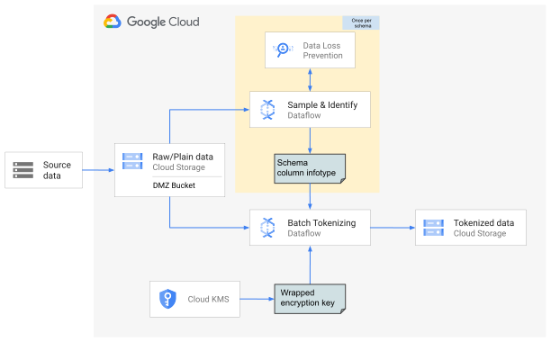
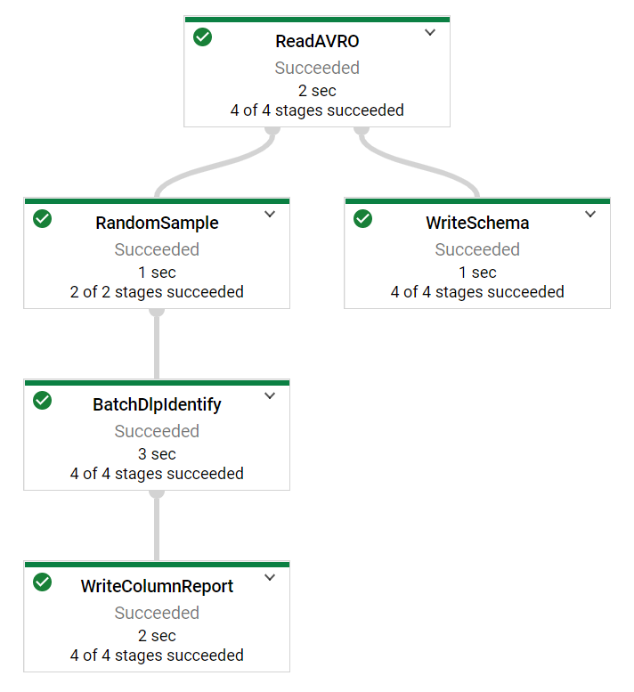
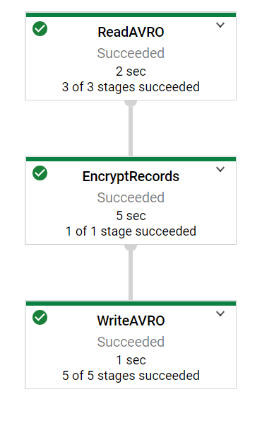

Anant Damle | Solutions Architect | Google


This document discusses how to identify and tokenize data with an automated data transformation pipeline to detect sensitive data like personally identifiable information (PII), using Cloud Data Loss Prevention [(Cloud DLP)](https://cloud.google.com/dlp) and [Cloud KMS](https://cloud.google.com/kms). De-identification techniques like encryption lets you preserve the utility of your data for joining or analytics while reducing the risk of handling the data by obfuscating the raw sensitive identifiers.

To minimize the risk of handling large volumes of sensitive data, you can use an automated data transformation pipeline to create de-identified datasets that can be used for migrating from on-premise to cloud or keep a de-identified replica for Analytics. Cloud DLP can inspect the data for sensitive information when the dataset has not been characterized, by using [more than 100 built-in classifiers](https://cloud.google.com/dlp/docs/infotypes-reference). 

During enterprise migration to cloud, one of the most haunting challenge is to migrate sensitive data. Most of the times the data is from structured systems/source like Avro or Parquet files. Using Cloud DLP to classify and de-identify each record of such a file is not typically required. Using symmetric encryption to tokenize data in columns already classified as sensitive can save time and cost to de-identify such data.

This document is intended for a technical audience whose responsibilities include data security, data processing, or data analytics. This guide assumes that you're familiar with data processing and data privacy, without the need to be an expert.

## Architecture



The solution is comprised of two pipelines.
  1. Sample + Identify
  1. Tokenize

The __sample & identify pipeline__ extracts a small number of sample records from the source files. The identify pipeline then decomposes each sample into columns to identify info-type information using Cloud DLP. The sample & identifying pipeline outputs the schema of the file and each column's detected info-types into Cloud Storage.

The __tokenize pipeline__ uses the schema information from the _identifying pipeline_ along with user specified tokenizing columns and enveloped data encryption key. The tokenizing pipeline performs following of transforms on each of the records in the source file:
  1. Unwrap data-encryption key using Cloud KMS
  1. convert each record into flat record
  1. tokenize required values using [deterministic AEAD](https://github.com/google/tink/blob/master/docs/PRIMITIVES.md#deterministic-authenticated-encryption-with-associated-data) encryption.
  1. Nest the flat record into Avro record
  1. Write Avro file with encrypted fields

### Concepts
* [Envelope Encryption](https://cloud.google.com/kms/docs/envelope-encryption) is a form of multiple layers of keys for encrypting data, which is the process of encrypting a key with another key.
* [Cloud KMS](https://cloud.google.com/kms) provides easy management of encyrption keys at scale.
* [Tink](https://github.com/google/tink) is an open-source library that provides easy and secure APIs for handling encryption/decryption. It
  reduces common crypto pitfalls with user-centered design, careful implementation and code reviews, and extensive
  testing. At Google, Tink is one of the standard crypto libraries, and has been deployed in hundreds of products and
  systems. Tink natively integrates with Cloud KMS for use with envelope encryption technique.
* [Deterministic AEAD encryption](https://github.com/google/tink/blob/master/docs/PRIMITIVES.md#deterministic-authenticated-encryption-with-associated-data) is used by to serve following purposes:
  1. Permits use of the cipher-text as join keys. The deterministic property of the cipher ensures that cipher-text for the same plain-text is always the same. Using this property one can safely use the encrypted data for performing statistical analysis like cardinality analysis, frequency analysis etc.
  1. store signed plain-text within the cipher to assert authenticity.
  1. reversability, use of 2-way encyrption algorithm permits reversing the algorithmn to obtain original plain-text. Hashing does not permit such operations.

* [Cloud Data Loss Prevention](https://cloud.google.com/dlp) is a Google Cloud service that provides data classification, de-identification and re-identification features, allowing you to easily manage sensitive data in your enterprise.

* __Record Flattening__ is the process of converting nested/repeated records as flat table. Each leaf-node of the record gets a unique identifier. This flattening process enables sending data to DLP for identification purposes as the DLP API supports a simple [data-table](https://cloud.google.com/dlp/docs/examples-deid-tables).

   Consider a contact record, for **Jane Doe**, it has a nested and repeated field `contacts`.
   ```json
   {
      "name": "Jane Doe",
      "contacts": [
      {
         "type": "WORK",
         "number": 2124567890  
      },
      {
         "type": "HOME",
         "number": 5304321234
      }
      ]
   }
   ```
   
   Flattening this record yields a [FlatRecord]() with following data. Notice the `values` map, which demonstrates that each leaf node of the contact record is mapped using a [JsonPath](https://goessner.net/articles/JsonPath/) notation.
   The `keySchema` shows a mapping between the leaf value's key's to a schema key to demonstrate that leaf-nodes of same type share the same key-schema, for example: `$.contacts[0].contact.number` is logically same as `$.contacts[1].contact.number` as both of them have the same key-schema `$.contacts.contact.number`.
   
   ```json
   {
      "values": {
       "$.name": "Jane Doe",
       "$.contacts[0].contact.type": "WORK",
       "$.contacts[0].contact.number": 2124567890,
       "$.contacts[1].contact.type": "WORK",
       "$.contacts[1].contact.number": 5304321234   
      },
   
      "keySchema": {
       "$.name": "$.name",
       "$.contacts[0].contact.type": "$.contacts.contact.type",
       "$.contacts[0].contact.number": "$.contacts.contact.number",
       "$.contacts[1].contact.type": "$.contacts.contact.type",
       "$.contacts[1].contact.number": "$.contacts.contact.number"   
      }
   }
   ```

## Prerequisites

This tutorial assumes some familiarity with shell scripts and basic knowledge of Google Cloud.

## Objectives

1. Understand record sampling and identify sensitive columns using DLP.
1. Use of symmetric encryption to tokenize data using KMS wrapped data-encryption key.

## Costs

This tutorial uses billable components of Google Cloud, including the following:

* [Dataflow](https://cloud.google.com/dataflow/pricing)
* [Cloud Storage](https://cloud.google.com/storage/pricing)
* [Cloud Data Loss Prevention](https://cloud.google.com/dlp/pricing)
* [Cloud KMS](https://cloud.google.com/kms/pricing)

Use the [pricing calculator](https://cloud.google.com/products/calculator) to generate a cost estimate based on your
projected usage.

## Before you begin

For this tutorial, you need a Google Cloud [project](https://cloud.google.com/resource-manager/docs/cloud-platform-resource-hierarchy#projects). To make
cleanup easiest at the end of the tutorial, we recommend that you create a new project for this tutorial.

1. [Create a Google Cloud project](https://console.cloud.google.com/projectselector2/home/dashboard).
1. Make sure that [billing is enabled](https://support.google.com/cloud/answer/6293499#enable-billing) for your Google
   Cloud project.
1. [Open Cloud Shell](https://console.cloud.google.com/?cloudshell=true).

   At the bottom of the Cloud Console, a [Cloud Shell](https://cloud.google.com/shell/docs/features) session opens and
   displays a command-line prompt. Cloud Shell is a shell environment with the Cloud SDK already installed, including
   the [gcloud](https://cloud.google.com/sdk/gcloud/) command-line tool, and with values already set for your current
   project. It can take a few seconds for the session to initialize.

1. Enable APIs for Data Catalog, BigQuery, Pub/Sub, Dataflow, and Cloud Storage services with the following command:
   ```shell script
   gcloud services enable \
   bigquery.googleapis.com \
   storage.googleapis.com \
   compute.googleapis.com \
   dataproc.googleapis.com \
   dataflow.googleapis.com \
   dlp.googleapis.com \
   kms.googleapis.com
   ```

## Setting up your environment

1. In Cloud Shell, clone the source repository and go to the directory for this tutorial:
   ```shell script
   git clone https://github.com/GoogleCloudPlatform/auto-data-tokenize.git
   cd auto-data-tokenize/
   ```
   > Use the following till this repo is open-sourced.
   > ```shell script
   > gcloud source repos clone automatic-dlp --project=google.com:anantd
   > ```

1. Use a text editor to modify the `set_variables.sh` file to set required environment variables.
   ```shell script
   # The GCP KMS resource URI
   export MAIN_KMS_KEY_URI="gcp-kms://projects/auto-dlp/locations/asia-southeast1/keyRings/sym-wrapper-key/cryptoKeys/sym-1"

   # The JSON file containing the TINK Wrapped data-key to use for encryption
   export WRAPPED_KEY_FILE="dek.json"
   # The Google Cloud project to use for this tutorial
   export PROJECT_ID="<your-project-id>"

   # The Compute Engine region to use for running Dataflow jobs and create a temporary storage bucket
   export REGION_ID="<compute-engine-region>"

   # define the GCS bucket to use as temporary bucket for Dataflow
   export TEMP_GCS_BUCKET="<name-of-the-bucket>"

   # Name of the service account to use (not the email address)
   export DLP_RUNNER_SERVICE_ACCOUNT_NAME="<service-account-name-for-runner>"

   # Name of the GCP KMS key ring name
   export KMS_KEYRING_ID="<key-ring-name>"

   # name of the symmetric kms-key-id
   export KMS_KEY_ID="<key-id>"

   # The JSON file containing the TINK Wrapped data-key to use for encryption
   export WRAPPED_KEY_FILE="<path-to-the-data-encryption-key-file>"
   ````

1. Run the script to set the environment variables:
   ```shell script
   source set_variables.sh
   ```

## Creating resources

The tutorial uses following resources
 * _Service account_ to run data flow pipelines enabling fine-grain access control
 * A symmetric Cloud KMS managed _Key Encryption key_, this is used to wrap the actual data encryption key
 * _Cloud Storage bucket_ for temporary data storage and test data

### Create service accounts

We recommend that you run pipelines and samplper with fine-grained access control to improve access partitioning. If
your project does not have a user-created service account, create one using following instructions.

You can use your browser by going to [**Service
accounts**](https://console.cloud.google.com/projectselector/iam-admin/serviceaccounts?supportedpurview=project)
in the Cloud Console.

1. Create a service account to use as the user-managed controller service account for Dataflow:
   ```shell script
   gcloud iam service-accounts create  ${DLP_RUNNER_SERVICE_ACCOUNT_NAME} \
   --project="${PROJECT_ID}" \
   --description="Service Account for Tokenizing sampler and pipeline." \
   --display-name="Tokenizing Sampler & pipeline"
   ```
1. Create a custom role with required permissions for accessing DLP, Dataflow and KMS:
   ```shell script
   export TOKENIZING_ROLE="tokenizing_runner"

   gcloud iam roles create ${TOKENIZING_ROLE} \
   --project=${PROJECT_ID} \
   --file=tokenizing_runner_permissions.yaml
   ```

1. Apply the custom role to the service account:
   ```shell script
   gcloud projects add-iam-policy-binding ${PROJECT_ID} \
   --member="serviceAccount:${DLP_RUNNER_SERVICE_ACCOUNT_EMAIL}" \
   --role=projects/${PROJECT_ID}/roles/${TOKENIZING_ROLE}
   ```
1. Assign the `dataflow.worker` role to allow the service account to allow it to run as a Dataflow worker:
   ```shell script
   gcloud projects add-iam-policy-binding ${PROJECT_ID} \
   --member="serviceAccount:${DLP_RUNNER_SERVICE_ACCOUNT_EMAIL}" \
   --role=roles/dataflow.worker
   ```

1. Create and download the credential file of the service account to allow calling Google Cloud services with this
   service-account's credentials.
   ```shell script
   gcloud iam service-accounts keys create \
   service-account-key.json \
   --iam-account="${DLP_RUNNER_SERVICE_ACCOUNT_EMAIL}"
   ```

### Create Key encryption key

The data would be encrypted using a Data Encryption Key (DEK). You will
use [envelope encryption](https://cloud.google.com/kms/docs/envelope-encryption) technique to encrypt the DEK using a
Key in [Cloud KMS](https://cloud.google.com/kms), this ensures that the DEK can be safely stored without compromising
it.

1. Create KMS Key-ring
   ```shell script
   gcloud kms keyrings create --project ${PROJECT_ID} --location ${REGION_ID} ${KMS_KEYRING_ID}
   ```
1. Create KMS symmetric key to use for encrypting your data encryption key.
   ```shell script
   gcloud kms keys create --project ${PROJECT_ID} --keyring=${KMS_KEYRING_ID} --location=${REGION_ID} --purpose="encryption" ${KMS_KEY_ID}
   ```
1. Download and unpack the latest version of [Tinkey](https://github.com/google/tink/blob/master/docs/TINKEY.md). Tinkey
   is an opensource utility to create wrapped encryption keys.
   ```shell script
   mkdir tinkey/
   tar zxf tinkey-<version>.tar.gz -C tinkey/
   alias tinkey='${PWD}/tinkey/tinkey'
   ```

1. Create a new wrapped data encryption key.
   ```shell script
   tinkey create-keyset \
   --master-key-uri="${MAIN_KMS_KEY_URI}" \
   --key-template=AES256_SIV \
   --credential="service-account-key.json" \
   --out="${WRAPPED_KEY_FILE}" \
   --out-format=json
   ```

### Create Cloud Storage bucket

Create a Cloud Storage bucket for storing test data and Dataflow staging location.

```shell script
gsutil mb -p ${PROJECT_ID} -l ${REGION_ID} "gs://${TEMP_GCS_BUCKET}"
```

### Copy test data to Cloud Storage

You can use your own file datasets or copy the included demo dataset (`userdata.avro` or `userdata.parquet`).

```shell script
gsutil cp userdata.avro gs://${TEMP_GCS_BUCKET}
```

## Compile modules

You need to compile all the modules to build executables for deploying the sampler and tokenize pipelines.

```shell script
mvn clean generate-sources compile package
```

> Add `-Dmaven.test.skip=true` flag to skip running tests.

## Run Sampler pipeline

Run the sampling pipeline to identify sensitive components/columns in the data you need to tokenize.

The pipeline extracts `sampleSize` number of records, flattens the record and identifies sensitive columns
using [Data Loss Prevention (DLP)](https://cloud.google.com/dlp). Cloud DLP provides functionality
to [identify](https://cloud.google.com/dlp/docs/inspecting-text) sensitive information-types. The DLP identify methods
supports only flat tables, Avro/Parquet files contain nested and/or repeated fields that need to be flattened.

### Launch sampler pipeline

```shell script
sampler_pipeline --project="${PROJECT_ID}" \
--region="${REGION_ID}" \
--runner="DataflowRunner" \
--serviceAccount=${DLP_RUNNER_SERVICE_ACCOUNT_EMAIL} \
--gcpTempLocation="gs://${TEMP_GCS_BUCKET}/temp" \
--stagingLocation="gs://${TEMP_GCS_BUCKET}/staging" \
--workerMachineType="n1-standard-1" \
--sampleSize=500 \
--fileType="AVRO" \
--inputFilePattern="gs://${TEMP_GCS_BUCKET}/userdata.avro" \
--reportLocation="gs://${TEMP_GCS_BUCKET}/dlp_report/"
```

The pipeline detects for all the standard information types supported by DLP.
Use `--observableInfoTypes` to provide custom info-types you need to detect.

### Pipeline DAG



### Retrieve report

The sampling pipeline outputs the Avro schema (or converted for Parquet) of the files and columnn report with sensitive
information types.

```shell script
mkdir -p dlp_report/ && rm dlp_report/*.json
gsutil -m cp "gs://${TEMP_GCS_BUCKET}/dlp_report/*.json" dlp_report/
```

List all the column names that have been identified.

```shell script
cat dlp_report/col-*.json | jq .columnName
```
The output will match the following list.

```text
"$.kylosample.birthdate"
"$.kylosample.cc"
"$.kylosample.email"
"$.kylosample.first_name"
"$.kylosample.ip_address"
"$.kylosample.last_name"
```

You can view the details of the identified column by issuing `cat` command for the file.

```shell script
cat dlp_report/col-kylosample-cc-00000-of-00001.json
```

Following is a snippet of one such column.
```json
{
  "columnName": "$.kylosample.cc",
  "infoTypes": [
    {
      "infoType": "CREDIT_CARD_NUMBER",
      "count": "394"
    }
  ]
}
```

> The `"count"` value will vary based on the randomly selected samples.

## Launch tokenizing pipeline

The sampling pipeline used a small number of samples from the original dataset to identify sensitive informaiton using
DLP. The tokenizing pipeline would process the entire dataset and encrypt the desired columns using the provided Data
Encryption Key (DEK).

```shell script
tokenize_pipeline --project="${PROJECT_ID}" \
--region="${REGION_ID}" \
--runner="DataflowRunner" \
--serviceAccount=${DLP_RUNNER_SERVICE_ACCOUNT_EMAIL} \
--workerMachineType="n1-standard-1" \
--schema="$(<dlp_report/schema.json)" \
--tinkEncryptionKeySetJson="$(<${WRAPPED_KEY_FILE})" \
--mainKmsKeyUri="${MAIN_KMS_KEY_URI}" \
--fileType="AVRO" \
--inputFilePattern="gs://${TEMP_GCS_BUCKET}/userdata.avro" \
--outputDirectory="gs://${TEMP_GCS_BUCKET}/encrypted/" \
--tokenizeColumns="$.kylosample.cc" \
--tokenizeColumns="$.kylosample.email"
```

The pipeline executes asynchronously on Dataflow. You can check the progress by following the JobLink printed
```
INFO: JobLink: https://console.cloud.google.com/dataflow/jobs/<your-dataflow-jobid>?project=<your-project-id>
```


### Verify encrypted result

Load the output files into BigQuery to verify that `tokenizeColumns` have been encrypted.

1. Create a BigQuery dataset for tokenized data
   Replace <i><bigquery-region></i> with a region of your choice.

   ```shell script
   bq --location=<bigquery-region> \
   --project_id="${PROJECT_ID}" \
   mk --dataset tokenized_data
   ```

1. Load tokenized data to a BigQuery table.
   ```shell script
   bq load \
   --source_format=AVRO \
   --project_id="${PROJECT_ID}" \
   "tokenized_data.TokenizedUserdata" \
   "gs://${TEMP_GCS_BUCKET}/encrypted/*"
   ```
1. Check some records to confirm that `email` and `cc` fields have been encrypted.
  ```shell script
  bq query \
  --project_id="${PROJECT_ID}" \
  "SELECT first_name, encrypted_email, encrypted_cc FROM tokenized_data.TokenizedUserdata LIMIT 10"
  ```
## Cleaning up

To avoid incurring charges to your Google Cloud account for the resources used in this tutorial, you can delete the project:

1.  In the Cloud Console, go to the [**Manage resources** page](https://console.cloud.google.com/iam-admin/projects).
1.  In the project list, select the project that you want to delete and then click **Delete**.
1.  In the dialog, type the project ID and then click **Shut down** to delete the project.


## What's next

* Learn more about [Cloud DLP](https://cloud.google.com/dlp)
* Learn more about [Cloud KMS](https://cloud.google.com/kms)
* Learn about [Inspecting storageand databases for sensitive data](https://cloud.google.com/dlp/docs/inspecting-storage)
* Handling [De-identification and re-identification of PII in large-scale datasets using DLP](https://cloud.google.com/solutions/de-identification-re-identification-pii-using-cloud-dlp)
