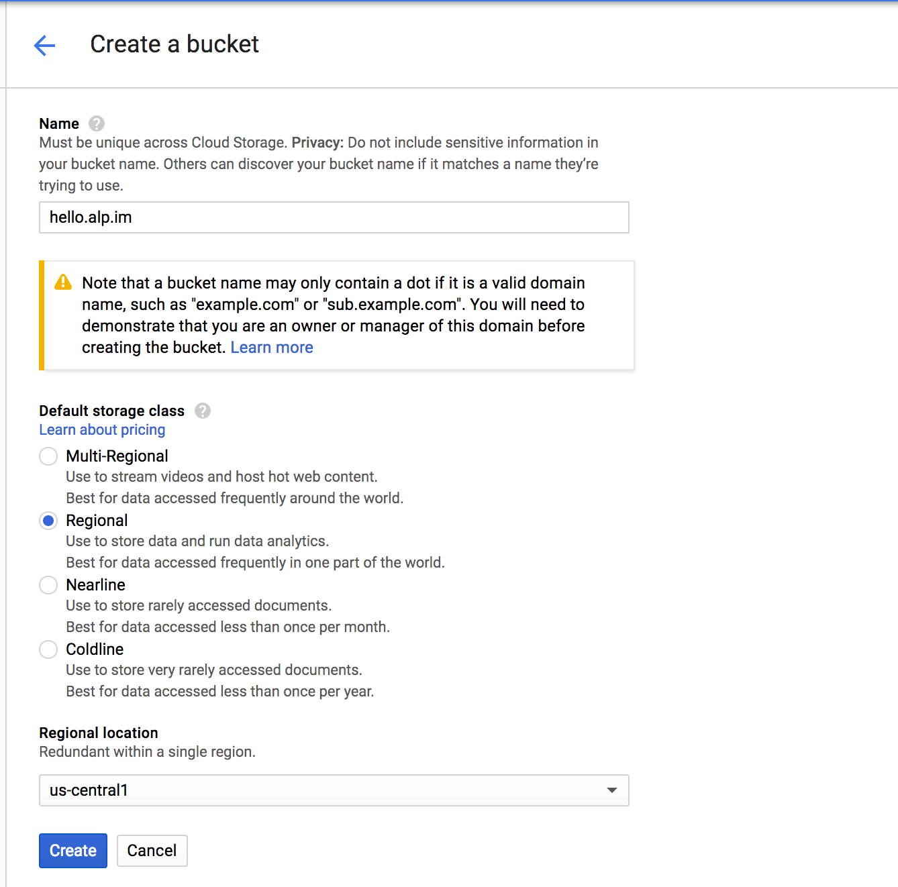
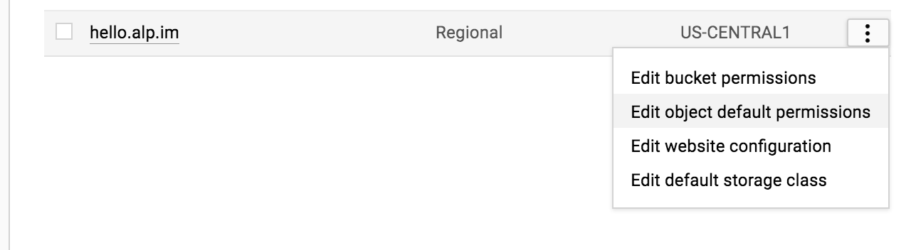
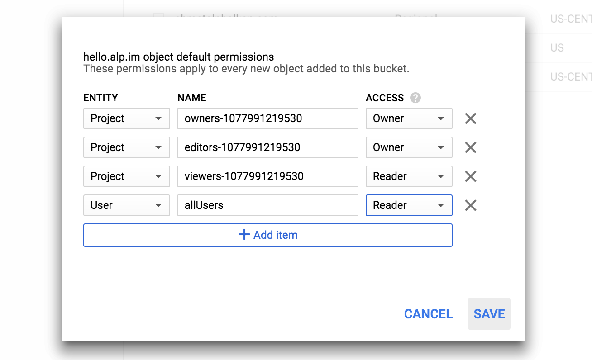
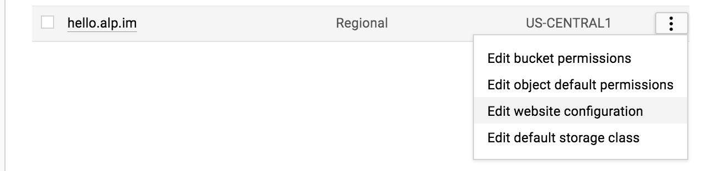
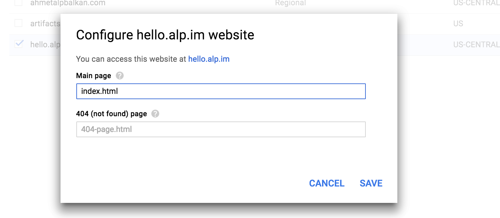
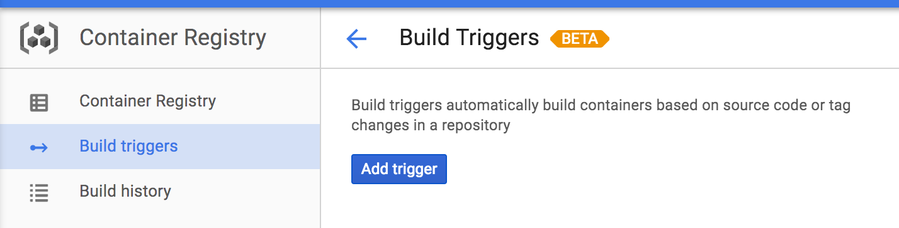
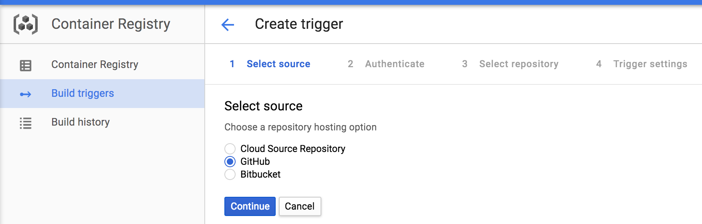
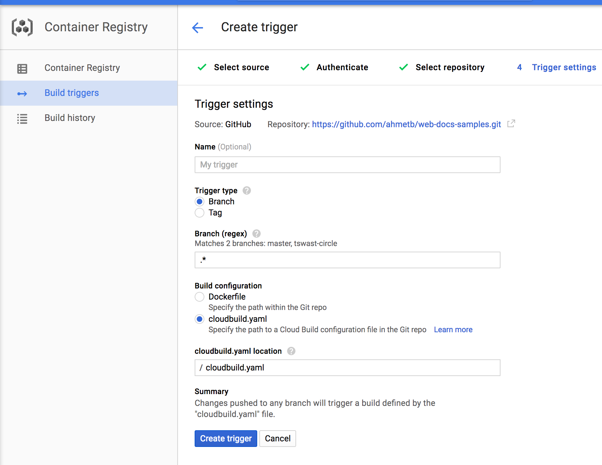
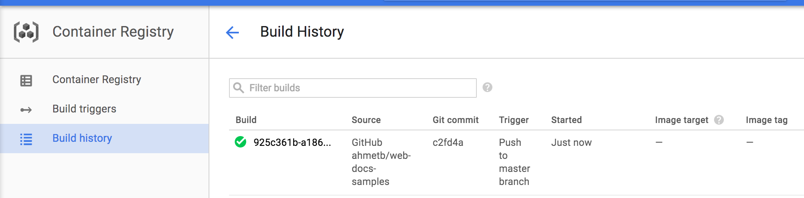
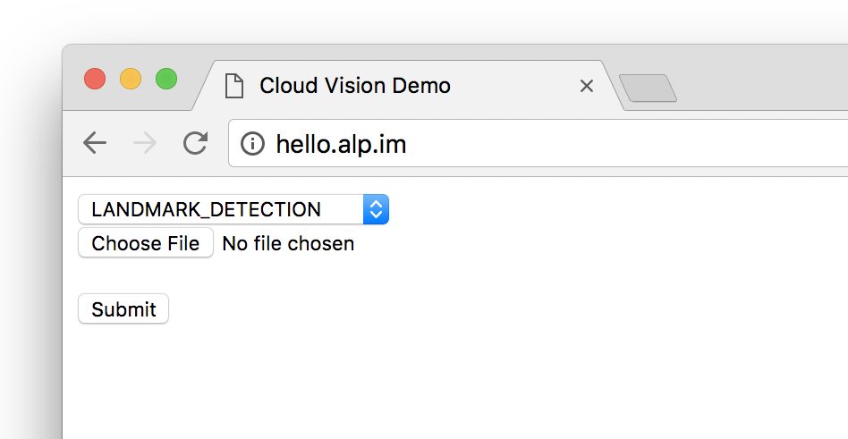

This tutorial shows how to automate publishing a static HTML website using a
custom domain name to Google Cloud Storage using the [Google Cloud Container
Builder][gcb].

## Objectives

- Automatically publish changes to your static website from the source control
  repository.

## Before you begin

1. Make sure you have a custom domain name (e.g. example.com).
1. Make sure the source code for your static website is hosted on a GitHub or
   BitBucket repository.
1. Make sure you verified ownership of your domain on [Google Webmaster
   Central][gwc]. (Do not include `http://` or `https://` in the URL for the
   purposes of this demo.)
1. Make sure you have a Project on Google Cloud Console to host your website.

## Set up a storage bucket

By uploading your website contents as files to Google Cloud Storage, you can
[host your static website][gcs-hosting] on buckets. First, we need to create a
bucket. Head to [Storage][p6n-storage] section of Google Cloud Console and type
in your domain name (e.g. `www.example.com`) and create the bucket:



After the bucket is created, we need to make it readable by everyone. Go to the
[Storage Browser][p6n-storage] on Cloud Console and click the menu icon to the
right of the bucket, then select “Edit Object Default Permissions”:



Then add the user `allUsers` with “Reader” role and click “Save”:



Now, we need to configure the storage bucket with serving a static website.
Click the “Edit Website Configuration” button on the bucket list:



Specify Main page as "index.html" and Save:



Now, configure your domain name’s DNS records to [create a CNAME
record][gcs-hosting] that points to the Google Cloud Storage. This makes clients
requesting your website point to the Google Storage APIs.

## Set up automated builds

We will use [Google Cloud Container Builder][gcb] and the [Build Triggers][bt]
feature to make sure we upload our website automatically every time we push a
new git commit to our source repository.

> Note: If you do not have a repository on GitHub, you can fork [this sample
> repository][sample-repo] for the purposes of this tutorial.

Head over to the Container Registry &rarr; [Build Triggers][p6n-triggers]
section on Google Cloud Console and click “Add trigger”:



Then select GitHub as the source of your repository. In the next screen you may
be asked to authorize access to your GitHub account and repositories. This is
needed for Google Cloud Source Repositories to mirror and create commit hooks on
your GitHub repositories.



Then, pick your repository from the list. If you forked the sample repository
above, pick it here:


In the next screen

- give this Build Trigger a name (e.g. publish-website)
- choose Build Configuration "cloudbuild.yaml"
- choose Trigger Type ”Branch”
- type cloudbuild.yaml to the file location



Now, create a `cloudbuild.yaml` file with the following contents on your
repository. Note that you can add files to your repository on GitHub website, or
by cloning the repository on your development machine:

```yaml
steps:
  - name: gcr.io/cloud-builders/gsutil
    args: ["-m", "rsync", "-r", "-c", "-d", "./vision/explore-api", "gs://hello.alp.im"]
```

This YAML file declares a build step with `gsutil -m rsync` command and makes
sure that the website is uploaded to the storage bucket. The `-m` flag
accelerates upload by processing multiple files in parallel and the `-c` flag
avoids re-uploading unchanged files.

The last command in the `args` is the name of your storage bucket prefixed with
`gs://`.

In our sample repository, we wanted to upload `vision/explore-api/` directory,
if you would like to upload your entire repository to the storage bucket, make
sure to change the value to `.` in the YAML file.

After saving the file, commit and push the changes:

    git add cloudbuild.yaml
    git commit -m 'Add build configuration'
    git push

### Trigger the first build

Once you push the `cloudbuild.yaml` file to your repository and create the Build
Trigger, we can now kick off the first build manually. Head over to the Google
Cloud Console [Build Triggers][p6n-triggers] section, click “Run Trigger” and
choose the the branch (i.e. master) to build.


Now click the “Build history” on the left and watch the build job execute and
succeeed:



Remember that after now, every commit pushed to any branch of your GitHub
repository will trigger a new build and publish contents to your website. If you
need to change which git branches or tags you use for publishing, you can update
the Build Trigger configuration.

## Try it out

Point your browser to your website URL and see if it works



## Clean up

After you no longer need the artifacts of this tutorial, you can clean up the
following resources on the Google Cloud Console to prevent incurring:

- Storage: delete bucket named as your website
- Container Registry &rarr; Build Triggers: delete build trigger.
- Development &rarr; Repositories: delete mirrored repository.

[gcb]: https://cloud.google.com/container-builder/
[gwc]: https://www.google.com/webmasters/verification/
[gcs-hosting]: https://cloud.google.com/storage/docs/hosting-static-website
[p6n-storage]: https://console.cloud.google.com/storage/browser
[p6n-triggers]: https://pantheon.corp.google.com/gcr/triggers
[bt]: https://cloud.google.com/container-builder/docs/creating-build-triggers
[sample-repo]: https://github.com/GoogleCloudPlatform/web-docs-samples
