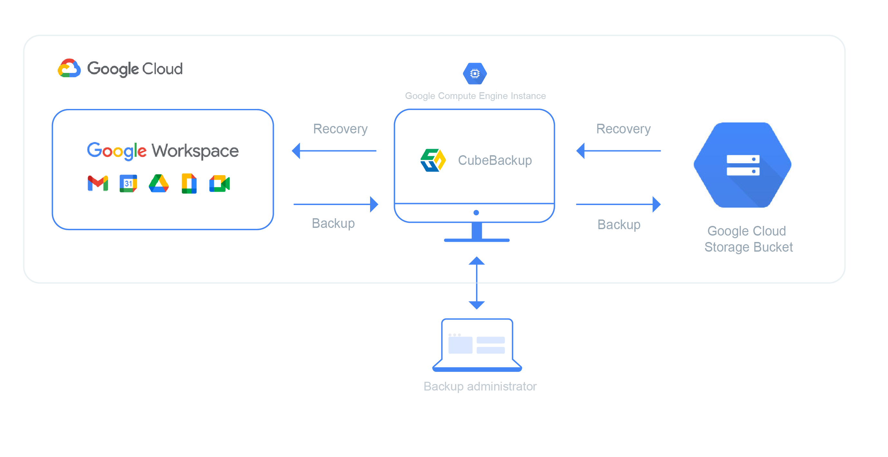
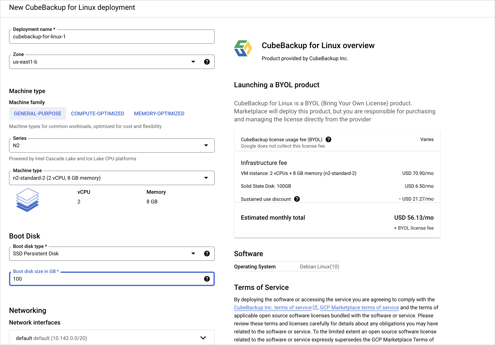

Jerry Wang | co-founder | CubeBackup

<i>Contributed by the Google Cloud community. Not official Google documentation.</i>

This tutorial describes how to set up a backup solution using [CubeBackup](https://www.cubebackup.com) to automatically backup Google Workspace data in your organization to your own Google Cloud Storage bucket. This tutorial is for Google Workspace administrators, security operators, and Google Workspace partners.

To use this tutorial, you need basic knowledge of Google Compute Engine, Google Cloud Storage and CubeBackup.

It is always important to make backups of your Google Workspace business data. Although Google’s cloud service is very reliable, it cannot protect against data loss caused by accidental or deliberate human error, like mistaken deletions, incorrect data hand-off from former employees, or even disgruntled insiders or malicious hackers. A reliable backup and restore solution like CubeBackup can act as a life-line when faced with this kind of data loss.

CubeBackup is a self-hosted application for Google Workspace.  Deploying CubeBackup on Google Cloud Platform offers an efficient, stable, and resilient backup for your Google Workspace business data. See [CubeBackup's website](https://cubebackup.com) for more information.

## Objectives

* Launch CubeBackup on a Google Cloud Compute Engine VM instance.
* Create a service account for CubeBackup.
* Create a Google Cloud Storage bucket to store the backup data.
* Configure CubeBackup and start the backup.

## Costs

This tutorial uses billable components of Google Cloud, including the following:

*  [Compute Engine](https://cloud.google.com/compute)

For organizations with more than 100 employees, an **e2-standard-2** VM instance with 8GB RAM is recommended for running the backup service.

*  [Cloud Storage](https://cloud.google.com/storage)

The pricing for Google Cloud Storage varies depending on the storage class and the location of your bucket. Considering both the data storage cost and the data processing cost, the **Coldline Storage** class is recommended for storing your Google Workspace backups.

Use the [pricing calculator](https://cloud.google.com/products/calculator) to generate a Google Cloud cost estimate based of your projected usage.

In addtion to the cost of Google Cloud, you also need to pay for the license of CubeBackup. CubeBackup is licensed on a per-user basis:  
*   *$5/user/year* for Google Workspace Business/Enterprise organizations.
*   *$2/user/year* for Google Workspace Education/Nonprofit organizations.
*   An unlimited 14-day trial of CubeBackup is available to all new users.

## Before you begin

1.  Create a new Google Cloud project in the [Cloud Console](https://console.cloud.google.com/).
1.  [Enable billing for your project](https://cloud.google.com/billing/docs/how-to/modify-project).

## Deploy CubeBackup on Google Cloud using Google Cloud Image

As a Google Workspace backup solution, CubeBackup is available on the [Google Cloud Marketplace](https://cloud.google.com/marketplace). Using the CubeBackup virtual machine images on the marketplace, you can easily launch a CubeBackup instance with only a few clicks.

1. Search for “CubeBackup” in the Google Cloud Marketplace. You will see 3 results: *CubeBackup for Linux*, *CubeBackup for Windows*, and *CubeBackup for Docker*. Click whichever image you desire.
1. On the CubeBackup image page, click **LAUNCH**.  
   Google APIs, like *Compute Engine API*, *Cloud Deployment Manager V2 API*,and *Cloud Runtime Configuration API*, are required to deploy a VM from Marketplace. If prompted with the *Required APIs* dialog, click **ENABLE** to proceed. 

1. On the CubeBackup deployment page, configure the *Deployment name*, *Zone*, *Machine type*, and *Boot Disk size* for your VM.  
    * Please select the Zone which is closest to your organization, or in accordance with the data policy of your organization or country.
    * CubeBackup requires no less than 4 GB of memory (8GB is strongly recommended) and 100GB for the boot disk.
    * If you’d like to access the web console from the Internet, please be sure to allow HTTP and HTTPS traffic in the Firewall section.

1.  When all parameters have been properly set, click **DEPLOY** to start the VM instance. The deployment process may take one or two minutes to complete.
1.  Once the CubeBackup image is successfully deployed and the new VM is running, the CubeBackup service will have been installed and automatically started. After creating a Google Cloud Storage bucket, you can click **VISIT THE SITE** to start the initial configuration of CubeBackup.

##  Create a Google Cloud Storage bucket for the backup data

When CubeBackup has been successfully deployed on the Compute Engine VM, you can start to create a Google Cloud Storage bucket to store the backup data.

1. In your Google Cloud Console, Select **STORAGE** > **Cloud Storage** > **Browser** from the navigation menu.
1. Click **CREATE BUCKET** on the *Cloud Storage Browser* page.
1. In the *Create a bucket* page, enter a valid name for the bucket and click **CONTINUE**.
1. Choose a location type for the bucket (*Region* or *Multi-region* is recommended), and select a location for the bucket, then click **CONTINUE**.  
Please note that you should select the location based on the security & privacy policy of your organization. For example, for EU organizations, you may need to select a European data center to be in accordance with GDPR.  If possible, try to choose the same location as your Compute Engine VM.
1. Choose a default storage class for the backup data (*Coldline* is recommended), then click **CONTINUE**.   
The pricing of Google Cloud Storage varies depending on location and storage class. Please see [Cloud Storage Pricing](https://cloud.google.com/storage/pricing) for more information. 
1. Choose *Uniform* as the Access control type, and click **CONTINUE**.  
1. Leave other options as default, then click **CREATE**.
CubeBackup itself has object versioning and data encryption functions, so there is no need to enable the *Object versioning*, *Retention policy*, or *Data Encryption* for this bucket. Otherwise, this may result in unnecessary file duplication and extra costs. 

## Tutorial body

Break the tutorial body into as many sections and subsections as needed, with concise headings.

### Use short numbered lists for procedures

Use numbered lists of steps for procedures. Each action that the reader must take should be its own step. Start each step with the action, such as *Click*, 
*Run*, or *Enter*.

Keep procedures to 7 steps or less, if possible. If a procedure is longer than 7 steps, consider how it might be separated into sub-procedures, each in its
own subsection.

### Provide context, but don't overdo the screenshots

Provide context and explain what's going on.

Use screenshots only when they help the reader. Don't provide a screenshot for every step.

Help the reader to recognize what success looks like along the way. For example, describing the result of a step helps the reader to feel like they're doing
it right and helps them know things are working so far.

## Cleaning up

Tell the reader how to shut down what they built to avoid incurring further costs.

### Example: Cleaning up

To avoid incurring charges to your Google Cloud account for the resources used in this tutorial, you can delete the project.

Deleting a project has the following consequences:

- If you used an existing project, you'll also delete any other work that you've done in the project.
- You can't reuse the project ID of a deleted project. If you created a custom project ID that you plan to use in the
  future, delete the resources inside the project instead. This ensures that URLs that use the project ID, such as
  an `appspot.com` URL, remain available.

To delete a project, do the following:

1.  In the Cloud Console, go to the [Projects page](https://console.cloud.google.com/iam-admin/projects).
1.  In the project list, select the project you want to delete and click **Delete**.
1.  In the dialog, type the project ID, and then click **Shut down** to delete the project.

## What's next

Tell the reader what they should read or watch next if they're interested in learning more.

### Example: What's next

- Watch this tutorial's [Google Cloud Level Up episode on YouTube](https://youtu.be/uBzp5xGSZ6o).
- Learn more about [AI on Google Cloud](https://cloud.google.com/solutions/ai/).
- Learn more about [Cloud developer tools](https://cloud.google.com/products/tools).
- Try out other Google Cloud features for yourself. Have a look at our [tutorials](https://cloud.google.com/docs/tutorials).
