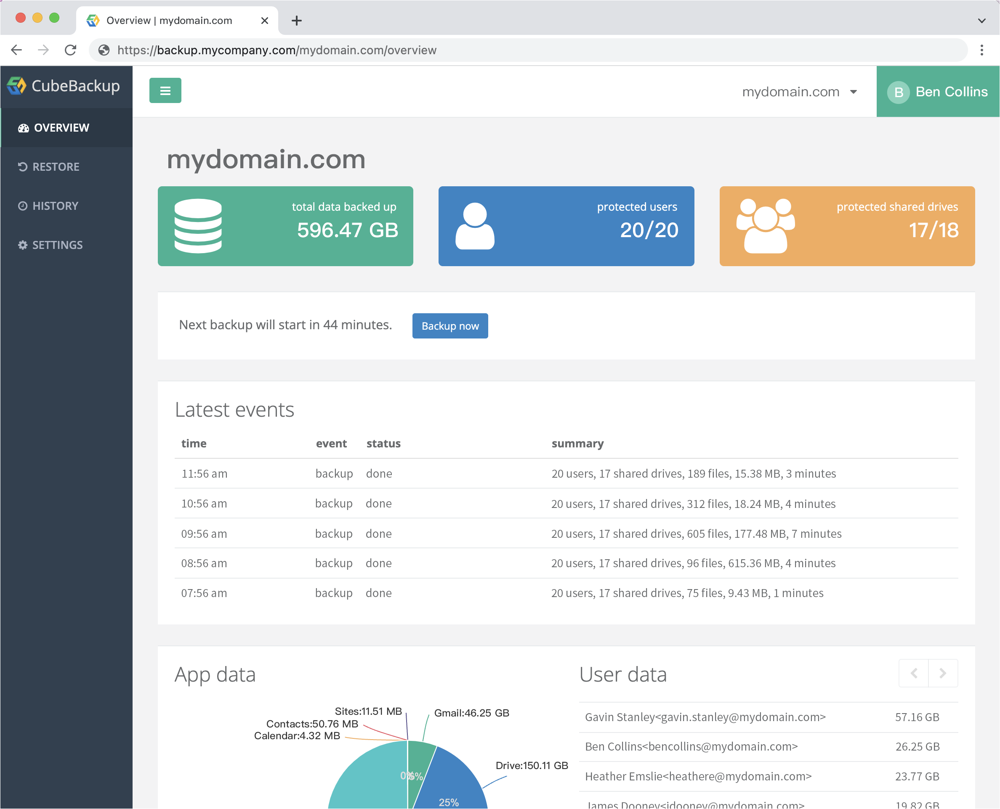

Jerry Wang | Product Manager | CubeBackup

<i>Contributed by the Google Cloud community. Not official Google documentation.</i>

This tutorial describes how to set up a backup solution using CubeBackup to automatically backup Google Workspace data in your organization to your own Google Cloud Storage bucket. This tutorial is for Google Workspace administrators, security operators, and Google Workspace partners.

To use this tutorial, you need basic knowledge of Google Compute Engine, Google Cloud Storage and CubeBackup.

It is always important to make backups of your Google Workspace business data. Although Google’s cloud service is very reliable, it cannot protect against data loss caused by accidental or deliberate human error, like mistaken deletions, incorrect data hand-off from former employees, or even disgruntled insiders or malicious hackers. A reliable backup and restore solution like CubeBackup can act as a life-line when faced with this kind of data loss.

CubeBackup is a self-hosted application for Google Workspace.  Deploying CubeBackup on Google Cloud Platform offers an efficient, stable, and resilient backup for your Google Workspace business data. See [CubeBackup's website](https://cubebackup.com) for more information.

## Objectives

* Launch CubeBackup on a Google Cloud Compute Engine VM instance.
* Create a service account for CubeBackup.
* Create a Google Cloud Storage bucket to store the backup data.
* Configure CubeBackup and start the backup.

## Costs

This tutorial uses billable components of Google Cloud, including the following:

*  [Compute Engine](https://cloud.google.com/compute)

For organizations with more than 100 employees, an **e2-standard-2** VM instance with 8GB RAM is recommended for running the backup service.

*  [Cloud Storage](https://cloud.google.com/storage)

The pricing for Google Cloud Storage varies depending on the storage class and the location of your bucket. Considering both the data storage cost and the data processing cost, the **Coldline Storage** class is recommended for storing your Google Workspace backups.

Use the [pricing calculator](https://cloud.google.com/products/calculator) to generate a Google Cloud cost estimate based of your projected usage.

In addtion to the cost of Google Cloud, you also need to pay for the license of CubeBackup. CubeBackup is licensed on a per-user basis:  
*   *$5/user/year* for Google Workspace Business/Enterprise organizations.
*   *$2/user/year* for Google Workspace Education/Nonprofit organizations.
*   An unlimited 14-day trial of CubeBackup is available to all new users.

## Before you begin

1.  Create a new Google Cloud project in the [Cloud Console](https://console.cloud.google.com/).
1.  [Enable billing for your project](https://cloud.google.com/billing/docs/how-to/modify-project).

## Deploy CubeBackup on Google Cloud using Google Cloud Image

As a Google Workspace backup solution, CubeBackup is available on the [Google Cloud Marketplace](https://cloud.google.com/marketplace). Using the CubeBackup virtual machine images on the marketplace, you can easily launch a CubeBackup instance with only a few clicks.

1. Search for “CubeBackup” in the Google Cloud Marketplace. You will see 3 results: *CubeBackup for Linux*, *CubeBackup for Windows*, and *CubeBackup for Docker*. Click whichever image you desire.
1. Click **LAUNCH** on the CubeBackup image page.  
   Google APIs, like *Compute Engine API*, *Cloud Deployment Manager V2 API*,and *Cloud Runtime Configuration API*, are required to deploy a VM from Marketplace. If prompted with the *Required APIs* dialog, click **ENABLE** to proceed. 

1. On the CubeBackup deployment page, configure the *Deployment name*, *Zone*, *Machine type*, and *Boot Disk size* for your VM.  
    * Please select the Zone which is closest to your organization, or in accordance with the data policy of your organization or country.
    * CubeBackup requires no less than 4 GB of memory (8GB is strongly recommended) and 100GB for the boot disk.
    * If you’d like to access the web console from the Internet, please be sure to allow HTTP and HTTPS traffic in the Firewall section.
    
1.  When all parameters have been properly set, click **DEPLOY** to start the VM instance. The deployment process may take one or two minutes to complete.
1.  Once the CubeBackup image is successfully deployed and the new VM is running, the CubeBackup service will have been installed and automatically started. After creating a Google Cloud Storage bucket, you can click **VISIT THE SITE** to start the initial configuration of CubeBackup.

##  Create a Google Cloud Storage bucket for the backup data

When CubeBackup has been successfully deployed on the Compute Engine VM, you can start to create a Google Cloud Storage bucket to store the backup data.

1. In your Google Cloud Console, Select **STORAGE** > **Cloud Storage** > **Browser** from the navigation menu.
1. Click **CREATE BUCKET** on the *Cloud Storage Browser* page.
1. In the *Create a bucket* page, enter a valid name for the bucket and click **CONTINUE**.
1. Choose a location type for the bucket (*Region* or *Multi-region* is recommended), and select a location for the bucket, then click **CONTINUE**.  
You should select the location based on the security & privacy policy of your organization. For example, for EU organizations, you may need to select a European data center to be in accordance with GDPR.  If possible, try to choose the same location as your Compute Engine VM.
1. Choose a default storage class for the backup data (*Coldline* is recommended), then click **CONTINUE**.   
The pricing of Google Cloud Storage varies depending on location and storage class. Please see [Cloud Storage Pricing](https://cloud.google.com/storage/pricing) for more information. 
1. Choose *Uniform* as the Access control type, and click **CONTINUE**.  
1. Leave other options as default, then click **CREATE**.

CubeBackup itself has object versioning and data encryption functions, so there is no need to enable the *Object versioning*, *Retention policy*, or *Data Encryption* for this bucket. Otherwise, this may result in unnecessary file duplication and extra costs. 

## Initial configuration for Google Workspace backup through CubeBackup console

1. Open the initial configuration wizard.  
After launching the CubeBackup Compute Engine VM and creating the Cloud Storage bucket, you can open the CubeBackup console by visiting *http://\<ComputeEngineVM-IP\>* from your web browser. Follow the configuration wizard to complete the initial configuration of CubeBackup.
 
1. Choose the Google Cloud Storage bucket to store the backup data.  
In the “Set up data storage location” step, choose *Google Cloud storage* as the Storage type, and leave the Data Index path as it is. Enter the name of the bucket you just created, then click **Next**. 
            
1. Create a Google Service account.  

    In step 3 in the wizard, you must supply the service account key file, along with the Google Workspace domain name and domain administrator.

    First, enable necessary APIs in your project:

    *  Open the *API Library* page by selecting **APIs & services** > **Library** from the navigation menu.
    *  Search for **Google Drive API**, then on the *Google Drive API* page, click **ENABLE**.
    *  Return to the *API Library* page and follow the same steps to enable **Google Calendar API**, **Gmail API**, **Admin SDK API**, and **Google People API**.

    Next, you will need to create a Google Service account:

    *  Select **IAM & Admin** > **Service Accounts** in the navigation menu.
    *  Click **+CREATE SERVICE ACCOUNT**.
    *  In the “Service account details” step, enter a name for the service account (*e.g., cubebackup*) and click **CREATE AND CONTINUE**.
    *  In the second step, select “Basic” > “Owner” (or “Project” > “Owner”) as the Role, then click **CONTINUE**.
    *  Click **DONE** directly in the “Grant users access to this service account” step.
    *  On the Service accounts page, click the email of the service account you just created. This should take you to the Service account details page.
    *  Select the **KEYS** tab of the service account.
    *  Click **ADD KEY** > **Create new key**.
    *  Select **JSON** as the key type, then click **CREATE**.
    *  Close the dialog that pops up and save the generated JSON key file locally.
 
    Now, return to the CubeBackup configuration wizard, click the **Choose File** button and select the service account JSON key file just generated. After the Google Workspace domain name, the domain administrator, and the service account key file are all set, click **Next**.
            
1.  Authorize domain-wide access to the service account.

    The newly created service account needs to be authorized to access your Google Workspace data through Google APIs. 
*  Sign in to the [Google Admin console](https://admin.google.com/) using a domain administrator account.
*  Select **Security** > **Access and data control** > **API controls** from the main menu.
*  Click **MANAGE DOMAIN WIDE DELEGATION** in the *Domain wide delegation* section.
*  Click **Add new** on the *Domain-wide Delegation* page.
*  In the **Client ID** field, paste the Client ID copied from the step 4 of the configuration wizard.
*  In the **OAuth Scopes** field, copy and paste the following scopes, then Click **AUTHORIZE**.

        https://www.googleapis.com/auth/admin.directory.domain.readonly,
        https://www.googleapis.com/auth/admin.directory.user.readonly,
        https://www.googleapis.com/auth/admin.directory.orgunit.readonly,
        https://mail.google.com/,
        https://www.googleapis.com/auth/drive,
        https://www.googleapis.com/auth/calendar,
        https://www.googleapis.com/auth/contacts, 
        https://sites.google.com/feeds/  

    The service account has now been authorized to make API calls in your domain. In the CubeBackup configuration wizard Step 4, click the **Next** button to see if all changes have been successful. Please note that Google Workspace domain-wide authorization may need some time to propagate, so if any error message pops up, please retry after a few minutes.

5\. Complete other configurations.

In the following steps, you can select the Google Workspace users you would like to backup. For Google Workspace Business/Enterprise/Education/Nonprofit organizations, you also can configure which Shared Drives to backup.

In the final step, you can set the administrator and password for the CubeBackup console. CubeBackup supports multiple administrators with different roles, so you can add more administrative accounts later in the console, if you wish.

When the initial configuration of CubeBackup completes, you will automatically log into the CubeBackup web console.
 
##  Start to backup Google Workspace data

The backup service runs automatically in the background, and the first backup will be initiated in one hour. You can also click the **Backup now** button on the Overview page to manually start the first backup.

    

CubeBackup employs an incremental backup algorithm. The first backup is a full backup of all data for Google Workspace accounts and Shared Drives, but in subsequent backups, only new or modified data will be added to the backup. Since the initial backup will download all Google Drive & Shared drives files, Gmail messages, Contacts and Calendar data in your domain, it may take a considerably long time. All subsequent backups will be much faster and should complete more quickly.

The speed and progress of the backup are displayed on the CubeBackup Overview page. Since the backup service keeps running in the background, you can close the web console page and return at any time to check the backup progress.

You will also receive a progress report generated by your CubeBackup server each day (or each week/month), depending on the settings of the Email report.

CubeBackup backs up multiple Google Workspace accounts in parallel.  In most cases,  2~10 accounts are being backed up simultaneously. If your Google Compute Engine VM is powerful and has at least 16GB,  you can manually [change the configuration to speed up the backup performance](https://www.cubebackup.com/docs/faq/gsuite-backup-parallel/).

You can also open the SETTINGS page for [more setting options of CubeBackup](https://www.cubebackup.com/docs/user_guide/more_configuration/).

## Restore and export data

CubeBackup allows you to restore a whole account or any individual files/messages. Not only can you recover deleted data, but you can also recover files or folders to any previous status, or even restore data to a different Google Workspace account.

#### Point in time recovery

CubeBackup works similarly to [Git](https://git-scm.com/) or <a href="https://en.wikipedia.org/wiki/Time_Machine_(macOS)">Mac Time Machine</a>, making it easy to restore data to a previous point in time. For example, if you’d like to recover a Google Drive file or a folder to a previous status:

1.  Select the user or Shared drive on the RESTORE page.
2.  Select the file or folder that you’d like to revert. The search feature can help you locate files quickly and easily.
3.  Select the right date and time point you’d like to revert to from the timeline in the left panel. You can also click the **Versions** button of a file to browse its history versions. 
4.  Once you find the correct version, click **Restore**.

By default,  the corresponding version will be restored to a new folder named “*Restored \<date-time\>*” in the user’s own Google Drive. You can also specify a target folder for the restoration if you wish.

#### Restore data to a different Google Workspace account

Not only can the backup data be restored to its owner’s account, CubeBackup also supports restoring data from one Google Workspace account to another. This can be helpful when a user has left your organization and a different user will be taking over his responsibilities and files.

CubeBackup even allows restoring data to an account in a different domain. This provides flexibility when your organization has multiple domains, or when you are migrating from one domain to another.

#### Export data

CubeBackup also allows you to export your backups of Google Drive files, Gmail messages, Contacts, or Calendar events to your computer.  

* The data is exported as a zip file. 
* For privacy reasons, the data export feature is disabled by default. However, the administrator of CubeBackup can [turn on this option by modifying the configuration file](https://www.cubebackup.com/docs/tutorials/enable-data-export/).
* Exporting a large number of files/messages may take a long time; however, you can safely allow the data export to run in the background. Later, you can check on the progress of the export from the HISTORY page and download the zip file from there.

## Monitor the status of backup, restore, and export operations

From the HISTORY page in the CubeBackup web console, you can access detailed status information about each backup and restore operation.

* On the **HISTORY** > **Backup** page, all backup records are listed in chronological order. The backup status, time duration, error count, and data size are displayed for each backup. Click on a backup entry, and you will be directed to a page with detailed backup statistics for each user and each shared drive.

* On the **HISTORY** > **Restore** page, all restore records are listed in chronological order, from which you can view the restore operator, description, status, time duration, data size, and other useful information. Click the number in the Files column to open a list of restored files/messages/contacts/calendar events. If there were any errors, you can click the number in the Errors column to see a detailed error report.

* On the **HISTORY** > **Export** page, all export records are listed in chronological order. The information on the Export page is similar to the Restore page, except that you can also download the exported zip file from here.

CubeBackup also keeps detailed log files containing all backup and restore operations, error messages, and web dashboard access records. These log files are located in the *<installation directory>/log* directory.

## Cleaning up

If you have only used this tutorial for testing purposes, to avoid incurring charges to your Google Cloud account for the resources used in this tutorial, you can delete the project.

Deleting a project has the following consequences:

- If you used an existing project, you'll also delete any other work that you've done in the project.
- Custom project IDs are lost. When you created this project, you might have created a custom project ID that you want to use in the future. To preserve the URLs that use the project ID, delete selected resources inside the project instead of deleting the whole project.

To delete a project, do the following:

1.  In the Cloud Console, go to the [Projects page](https://console.cloud.google.com/iam-admin/projects).
1.  In the project list, select the project you want to delete and click **Delete**.
1.  In the dialog, type the project ID, and then click **Shut down** to delete the project.

## What's next

- Learn more about [CubeBackup for Google Workspace](https://www.cubebackup.com).
- Try out other Google Cloud features for yourself. Have a look at our [tutorials](https://cloud.google.com/docs/tutorials).
