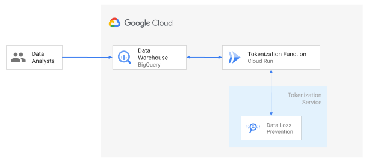

Anant Damle | Solutions Architect | Google

<p style="background-color:#CAFACA;"><i>Contributed by Google employees.</i></p>

This document discusses how to detect and tokenize sensitive data like personally identifiable information (PII) in BigQuery tables with simple SQL based functions, using Cloud Data Loss Prevention [(Cloud DLP)](https://cloud.google.com/dlp). De-identification techniques like encryption lets you preserve the utility of your data for joining or analytics while reducing the risk of handling the data by tokenizing/obfuscating the raw sensitive identifiers.

Enterprises may have policy or regulatory requirements to only store tokenized data in their DataWarehouses, and a need to quickly reidentify the tokenized data for reports generation. To minimize the risk of handling large volumes of sensitive data, you can use an [automated data transformation pipeline](https://github.com/GoogleCloudPlatform/auto-data-tokenize) to create de-identified datasets that can be used for migrating from on-premises to cloud. You can use this project to either replace that pipeline with a SQL query for de-identification and quick reidentification or only for reidentification.

Cloud DLP can inspect the data for sensitive information when the dataset has not been characterized, by using [more than 100 built-in classifiers](https://cloud.google.com/dlp/docs/infotypes-reference). Using DLP to tokenize the data requires complex data pipelines/applications. This solution aims to help your data analysts/engineers/scientists to achieve the same outcome throught Simple SQL functions using BigQuery [Remote Functions](https://cloud.google.com/blog/products/data-analytics/extending-bigquery-functions) which are a powerful way to extend the functionality of BigQuery.

This document demonstrates a reference implementation of tokenizing structured data in [BigQuery](https://cloud.google.com/bigquery) using DLP and remote function (hosted on [Cloud Run](https://cloud.google.com/run)).

This document is intended for audience whose responsibilities include data security, data processing, or data analytics. This guide assumes that you're familiar with data processing and data privacy, without the need to be an expert and run simple shell and SQL scripts.

## Objectives

 * Deploy Cloud Run service providing DLP based tokenization functionality
 * Create BigQuery Remote functions
 * Verify encryption using DLP

## Costs

This tutorial uses billable components of Google Cloud, including the following:

* [BigQuery](https://cloud.google.com/bigquery/pricing)
* [Cloud Build](https://cloud.google.com/build/pricing)
* [Cloud Run](https://cloud.google.com/run/pricing)
* [Data Loss Prevention](https://cloud.google.com/dlp/pricing)

Use the [pricing calculator](https://cloud.google.com/products/calculator) to generate a cost estimate based on your
projected usage.

## Architecture



## Before you begin

For this tutorial, you need a Google Cloud [project](https://cloud.google.com/resource-manager/docs/cloud-platform-resource-hierarchy#projects). To make
cleanup easiest at the end of the tutorial, we recommend that you create a new project for this tutorial.

1.  [Create a Google Cloud project](https://console.cloud.google.com/projectselector2/home/dashboard).
1.  Make sure that [billing is enabled](https://support.google.com/cloud/answer/6293499#enable-billing) for your Google
    Cloud project.
1.  [Open Cloud Shell](https://console.cloud.google.com/?cloudshell=true).

    At the bottom of the Cloud Console, a [Cloud Shell](https://cloud.google.com/shell/docs/features) session opens and
    displays a command-line prompt. Cloud Shell is a shell environment with the Cloud SDK already installed, including
    the [gcloud](https://cloud.google.com/sdk/gcloud/) command-line tool, and with values already set for your current
    project. It can take a few seconds for the session to initialize.

1.  In Cloud Shell, clone the source repository and go to the directory for this tutorial:

        git clone https://github.com/GoogleCloudPlatform/bq-dlp-external-function.git
        cd bq-dlp-external-function/


## Deployment script

1.  Use a text editor to modify the `deploy.sh` file to set the Google Cloud project id and the cloud region that you want to deploy the resources:
1. Run the script

    ```shell
    ./deploy.sh
    ```

1. Once the script successfully completes resources creation,
   visit [BigQuery Console](https://console.cloud.google.com/bigquery)
   to run the test SQL script

   ```sql
   SELECT
     pii_column,
     fns.dlp_freetext_encrypt(pii_column) AS dlp_encrypted,
     fns.aes128ecb_encrypt(pii_column) AS aes_encrypted,
     fns.aes128ecb_decrypt(fns.aes128ecb_encrypt(pii_column)) AS aes_decrypted,
    FROM
      UNNEST(
        [
            'My name is John Doe. My email is john@doe.com',
            'Some non PII data',
            '212-233-4532',
            'some script with simple number 1234']) AS pii_column
   ```


## Detailed Deployment steps

In case you want to customize the deployment, please follow following steps:

### Setting up your environment

1.  Enable APIs for Compute Engine, Cloud Storage, Dataproc, and Cloud SQL services:

    ```shell
    gcloud services enable \
    bigquery.googleapis.com \
    bigqueryconnection.googleapis.com \
    cloudbuild.googleapis.com \
    cloudkms.googleapis.com \
    containerregistry.googleapis.com \
    dlp.googleapis.com \
    run.googleapis.com
    ```

1. In Cloud Shell, set the [Cloud Region](https://cloud.google.com/compute/docs/regions-zones#available) that you want to create your BigQuery and Cloud Run resources in:

    ```shell
    PROJECT_ID=""
    REGION="asia-southeast1"
    CLOUD_RUN_SERVICE_NAME="bq-tokenize-fns"
    ```

### Deploy Cloud Run service

1. Deploy Cloud Run by compiling and deploying Container using [Cloud Build](https://cloud.google.com/build):

    ```shell
    gcloud builds submit \
    --project ${PROJECT_ID} \
    --tag "gcr.io/${PROJECT_ID}/${CLOUD_RUN_SERVICE_NAME}" &&
    gcloud beta run deploy ${CLOUD_RUN_SERVICE_NAME} \
    --image="gcr.io/${PROJECT_ID}/${CLOUD_RUN_SERVICE_NAME}:latest" \
    --execution-environment=gen2 \
    --platform=managed \
    --region="${REGION}" \
    --no-allow-unauthenticated \
    --update-env-vars=PROJECT_ID=${PROJECT_ID} \
    --project ${PROJECT_ID}
    ```

    > **Note:** You should use [Cloud Secrets](https://cloud.google.com/secrets) to store and [set the Environment Variable](https://cloud.google.com/run/docs/configuring/secrets) `AES_KEY` for AES Encryption key

1. Retrieve and save the Cloud Run URL:

    ```shell
    RUN_URL=$(gcloud run services describe ${CLOUD_RUN_SERVICE_NAME} --region asia-southeast1 | grep URL | sed -r 's/URL:\s+//')
    ```

### Create DLP Didentify Templates

DLP [Deidentify templates](https://cloud.google.com/dlp/docs/creating-templates-deid) makes managing deidentification and inspection easy to document and manage.

    ```shell
    DEID_TEMPLATE=$(curl -X POST \
    -H "Authorization: Bearer `gcloud auth print-access-token`" \
    -H "Accept: application/json" \
    -H "Content-Type: application/json" \
    -H "X-Goog-User-Project: ${PROJECT_ID}" \
    --data-binary "@sample_dlp_deid_config.json" \
    "https://dlp.googleapis.com/v2/projects/${PROJECT_ID}/locations/${REGION}/deidentifyTemplates")

    DEID_TEMPLATE_NAME=$(echo ${DEID_TEMPLATE} | jq -r '.name')
    ```

   > **Note:** Recommended practice is to use KMS Wrapped Key for DLP encryption.
   >
   > This document uses unwrapped key for simplification of demo purpose.

### Create BigQuery Remote Functions

1. Create BigQuery connection for accessing Cloud Run:

    ```shell
    bq mk --connection \
    --display_name='External Tokenization Function Connection' \
    --connection_type=CLOUD_RESOURCE \
    --project_id="${PROJECT_ID}" \
    --location="${REGION}" \
    ext-${CLOUD_RUN_SERVICE_NAME}
    ```

1. Find the BigQuery Service Account used for the connection:

    ```shell
    CONNECTION_SA=$(bq --project_id ${PROJECT_ID} show --connection ${PROJECT_ID}.${REGION}.ext-${CLOUD_RUN_SERVICE_NAME} | grep 'serviceAccountId' | sed -r 's/.*serviceAccountId\"\:\s*\"//' | sed -r 's/\"}\s*//')
    ```

1. Grant the BigQuery connection Service Account Cloud Run Invoker role for accessing the Cloud Run:

    ```shell
    gcloud projects add-iam-policy-binding ${PROJECT_ID} \
    --member="serviceAccount:${CONNECTION_SA}" \
    --role='roles/run.invoker'
    ```

### Create BQ Dataset for remote functions

1. Define the BigQuery dataset to create remote functions:

    ```shell
    BQ_FUNCTION_DATASET="fns"
    ```

1. Create the dataset if it doesn't exist:

    ```shell
    bq mk --dataset \
    --project_id ${PROJECT_ID} \
    --location ${REGION} \
    ${BQ_FUNCTION_DATASET}
    ```

### Create BigQuery Remote functions

#### Create AES Remote functions

1. Create AES tokenization function:

    ```shell
    bq query --project_id ${PROJECT_ID} \
    --use_legacy_sql=false \
    "CREATE OR REPLACE FUNCTION ${BQ_FUNCTION_DATASET}.aes128ecb_encrypt(v STRING)
    RETURNS STRING
    REMOTE WITH CONNECTION \`${PROJECT_ID}.${REGION}.ext-${CLOUD_RUN_SERVICE_NAME}\`
    OPTIONS (endpoint = '${RUN_URL}', user_defined_context = [('mode', 'tokenize'),('algo','aes')]);"
    ```

1. Create AES reidentify function:

    ```shell
    bq query --project_id ${PROJECT_ID} \
    --use_legacy_sql=false \
    "CREATE OR REPLACE FUNCTION ${BQ_FUNCTION_DATASET}.aes128ecb_decrypt(v STRING)
    RETURNS STRING
    REMOTE WITH CONNECTION \`${PROJECT_ID}.${REGION}.ext-${CLOUD_RUN_SERVICE_NAME}\`
    OPTIONS (endpoint = '${RUN_URL}', user_defined_context = [('mode', 'reidentify'),('algo','aes')]);"
    ```

#### Create DLP Remote functions

1. Create DLP tokenization function:

    ```shell
    bq query --project_id ${PROJECT_ID} \
    --use_legacy_sql=false \
    "CREATE OR REPLACE FUNCTION ${BQ_FUNCTION_DATASET}.dlp_freetext_encrypt(v STRING)
    RETURNS STRING
    REMOTE WITH CONNECTION \`${PROJECT_ID}.${REGION}.ext-bq-tokenize-fn\`
    OPTIONS (endpoint = '${RUN_URL}', user_defined_context = [('mode', 'tokenize'),('algo','dlp'),('dlp-deid-template','${DEID_TEMPLATE_NAME}')]);"
    ```


## Verify Tokenization

Execute the following query to observe that the remote function is tokenizing and reidentifying the data using SQL:

1. Using [BigQuery Workspace](https://console.cloud.google.com/bigquery)

    ```sql
    SELECT
        pii_column,
        fns.dlp_freetext_encrypt(pii_column) AS dlp_encrypted,
        fns.aes128ecb_encrypt(pii_column) AS aes_encrypted,
        fns.aes128ecb_decrypt(fns.aes128ecb_encrypt(pii_column)) AS aes_decrypted
    FROM
        UNNEST(
        [
            'My name is John Doe. My email is john@doe.com',
            'Some non PII data',
            '212-233-4532',
            'some script with simple number 1234']) AS pii_column
    ```

1. Using Cloud Shell run the following command to run the query on BigQuery:

    ```shell
    bq query --project_id ${PROJECT_ID} \
    --use_legacy_sql=false \
    "
    SELECT
      pii_column,
      ${BQ_FUNCTION_DATASET}.dlp_freetext_encrypt(pii_column) AS dlp_encrypted,
      ${BQ_FUNCTION_DATASET}.aes128ecb_encrypt(pii_column) AS aes_encrypted,
      ${BQ_FUNCTION_DATASET}.aes128ecb_decrypt(fns.aes128ecb_encrypt(pii_column)) AS aes_decrypted
    FROM
      UNNEST(
        [
          'My name is John Doe. My email is john@doe.com',
          'Some non PII data',
          '212-233-4532',
          'some script with simple number 1234']) AS pii_column"
    ```

   Expected Output:


    |  pii_column  |  dlp_encrypted  |  aes_encrypted  |  aes_decrypted  |
    | -----------  | -----------  | -----------  | -----------  |
    | My name is John Doe. My email is john@doe.com | My name is John Doe. My email is BQ_TOK_FN(40):AQy6lGvwKR+AiiRqJpEr+nBzZUzOcjXkXamUugU= | qWnwDEY3bDTCV/azveHnxUm24z/DvUcVLZWHyN4Rg16ISvqswcuYXNXsOyI4/d8M | My name is John Doe. My email is john@doe.com |
    | Some non PII data                             | Some non PII data                                                                       | 37Agm90CqzGXwerJxai/Tf89ffRN9FpPkuuDW+rz7ns=                     | Some non PII data                             |
    | Some non PII data                             | Some non PII data                                                                       | 37Agm90CqzGXwerJxai/Tf89ffRN9FpPkuuDW+rz7ns=                     | Some non PII data                             |
    | Some non PII data                             | Some non PII data                                                                       | 37Agm90CqzGXwerJxai/Tf89ffRN9FpPkuuDW+rz7ns=                     | Some non PII data                             |

## Cleaning up

To avoid incurring charges to your Google Cloud account for the resources used in this tutorial, you can delete the project:

1.  In the Cloud Console, go to the [**Manage resources** page](https://console.cloud.google.com/iam-admin/projects).
1.  In the project list, select the project that you want to delete and then click **Delete** .
1.  In the dialog, type the project ID and then click **Shut down** to delete the project.


## What's next

* Learn more about [BigQuery Remote Functions](https://cloud.google.com/bigquery/docs/reference/standard-sql/remote-functions)
* Learn more about [Cloud DLP](https://cloud.google.com/dlp)
* Learn more about [Cloud KMS](https://cloud.google.com/kms)
* Learn about [Inspecting storage and databases for sensitive data](https://cloud.google.com/dlp/docs/inspecting-storage)
* Handling [De-identification and re-identification of PII in large-scale datasets using DLP](https://cloud.google.com/solutions/de-identification-re-identification-pii-using-cloud-dlp)

## Disclaimer
**License**: Apache 2.0

This is not an official Google product.
