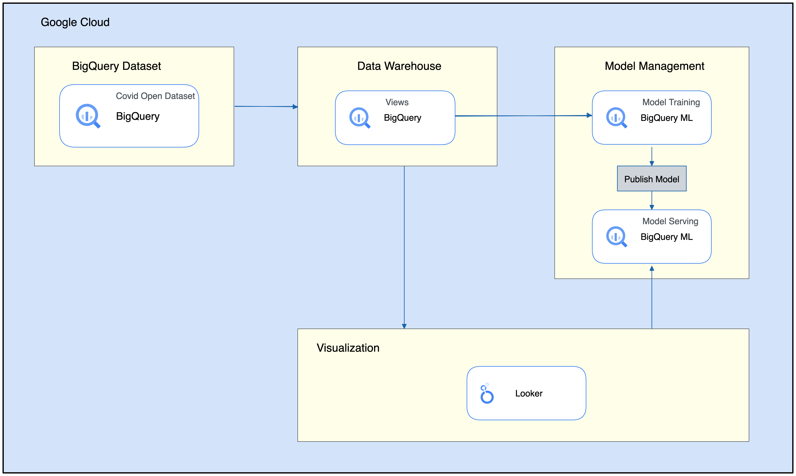

Kanchana Patlolla | Customer Engineer | Google  
San Thongprasert | Customer Engineering Manager | SADA

<i>Contributed by Google & SADA employees.</i>

This tutorial is intended to provide a quick start tutorial for how to create [BigQueryML] (https://cloud.google.com/bigquery-ml/) model and integrate the prediction results with [Looker] (https://www.looker.com/) to familiarize yourself with BigQueryML syntax and how quickly it is for you to train your own machine learning model with BigQuery with minimal coding required. 

This document is intended for a technical audience whose responsibilities include data engineering, data analytics, or data science. This document assumes that you're familiar with BigQuery, without the need to be an expert. This document assumes some familiarity with navigation of BigQuery and basic knowledge of Google Cloud.

## Costs

This tutorial uses billable components of Google Cloud and Looker, including the following:

* [BigQuery](https://cloud.google.com/bigquery/pricing)
* [BigQuery Machine Learning](https://cloud.google.com/bigquery-ml/pricing)
* [Looker](https://www.looker.com/product/pricing/)

Use the [pricing calculator](https://cloud.google.com/products/calculator) to generate a cost estimate based on your projected usage.

## Objectives

This solution is intended to describe a solution for how to create a machine learning model in BigQuery with visualization in Looker. This solution comprises of:

  * BigQuery ML
  * BigQuery Public Dataset
  * BigQuery Views
  * Looker

## Before you begin

For this tutorial, you need a Google Cloud [project](https://cloud.google.com/resource-manager/docs/cloud-platform-resource-hierarchy#projects). To make cleanup easiest at the end of the tutorial, we recommend that you create a new project for this tutorial. Additionally, you will need to have access to a [LookML instance with admin permission](https://docs.looker.com/admin-options).

1.  [Create a Google Cloud project](https://console.cloud.google.com/projectselector2/home/dashboard).
1.  Make sure that [billing is enabled](https://support.google.com/cloud/answer/6293499#enable-billing) for your Google Cloud project.
1.  [Open Cloud Shell](https://console.cloud.google.com/?cloudshell=true).

    At the bottom of the Cloud Console, a [Cloud Shell](https://cloud.google.com/shell/docs/features) session opens and displays a command-line prompt. Cloud Shell is a shell environment with the Cloud SDK already installed, including the [gcloud](https://cloud.google.com/sdk/gcloud/) command-line tool, and with values already set for your current project. It can take a few seconds for the session to initialize.

1.  Enable APIs for BigQuery services:

        gcloud services enable \
        bigquery.googleapis.com

1. [Create LookML Project](https://docs.looker.com/data-modeling/getting-started/create-projects)

    If you access is 'developer' level, you will need to request for an admin to create connection to your BigQuery project and dataset once your BigQuery dataset has been created

## Repository Structure
This folder contains different set of files generate Looker dashboard and SQL query that can be used to generate BigQuery view to support the machine learning model training.

- [BigQuery 2021 view](/BigQuery/county_2021_view.sql) - query to generate a view within BigQuery using COVID19 open data which will be used for machine learning model training
- [BigQuery 2022 view](/BigQuery/county_2022_view.sql) - query to generate a view within BigQuery using COVID19 open data which will be used for prediction process
- [BigQueryML model training](/BigQuery/kmeans_model_training.sql) - query to train and store a BigQueryML model within BigQuery
- [BigQueryML model prediction](/BigQuery/kmeans_predict_model.sql) - illustrative query to run prediction on BQML model via SQL statement
- [Looker view](/Views/county_covid_model.view.lkml) - fields for running prediction against a trained model in BigQuery and supporting the Dashboard
- [Looker dashboard](Dashboard/bqml_consumer_dashboard.lookml) - Example dashboard that can be leveraged to display the batch prediction results against BQ model

## Step by step guide
1. Create or leverage existing GCP project to create BigQuery dataset
2. Once dataset has been created in BigQuery, [create two BigQuery view](https://cloud.google.com/bigquery/docs/views#creating_a_view) using the provided [county_2021_view](/BigQuery/county_2021_view.sql) and [county_2022_view](/BigQuery/county_2022_view.sql) queries.
3. [Create BigQuery ML kmeans clustering model](https://cloud.google.com/bigquery-ml/docs/reference/standard-sql/bigqueryml-syntax-create#create_model_syntax) using [provided query](/BigQuery/kmeans_model_training.sql). You will have to update the query with appropriate project and dataset information
4. Create a connection from Looker to BigQuery dataset
5. Import / create a new view in Looker. Leverage the [provided sample view](/Views/county_covid_model.view.lkml) to generate a batch prediction against the trained model in BigQuery
6. Import [dashboard lookml file](Dashboard/bqml_consumer_dashboard.lookml) / create a new dashboard from the view

## Cleaning up

To avoid incurring charges to your Google Cloud account for the resources used in this tutorial, you can delete the project:

1.  In the Cloud Console, go to the [**Manage resources** page](https://console.cloud.google.com/iam-admin/projects).
1.  In the project list, select the project that you want to delete and then click **Delete**.
1.  In the dialog, type the project ID and then click **Shut down** to delete the project.

## What's next

* Learn more about [BigQuery](https://cloud.google.com/bigquery).  
* Expand the use case to leverage other dataset to combine insights with the [BigQuery ML model](https://cloud.google.com/bigquery-ml/docs/) that you have just created
