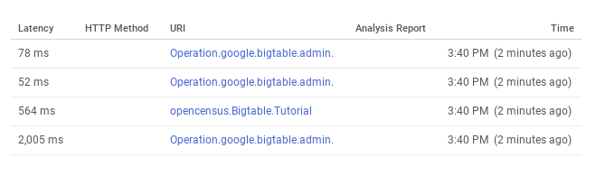
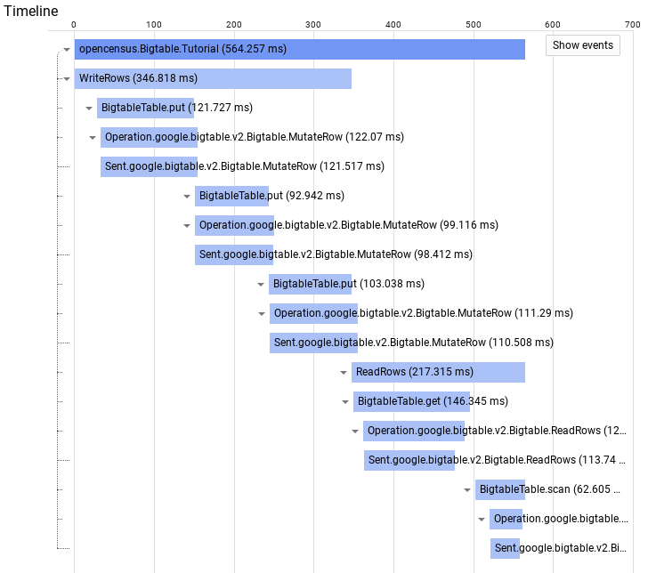

This tutorial shows how to implement client-side tracing in your Cloud Bigtable workloads 
using OpenCensus and Stackdriver. While Cloud Bigtable surfaces a number of helpful server-side 
metrics with Stackdriver, applications can realize added benefits from implementing client-side tracing.
For example, server-side metrics do not give you a window into the round-trip latency of calls made to your 
Cloud Bigtable endpoint, which can only be surfaced using client-side tracing.

## Costs

This tutorial uses the following billable components of Google Cloud Platform (GCP):

*   Google Compute Engine
*   Cloud Bigtable
*   Stackdriver

You can use the [Pricing Calculator](https://cloud.google.com/products/calculator/) to generate a cost
estimate based on your projected usage.

New GCP users might be eligible for a [free trial](https://cloud.google.com/free/).

We recommend that you deploy this tutorial into an ephemeral project, which can then be deleted once you’re done.

## Before you begin

### Create a new project

1.  In the GCP Console, go to the [Manage resources page](https://console.cloud.google.com/cloud-resource-manager).
2.  Select a project, or click **Create Project** to create a new GCP project.
3.  In the dialog, name your project. Make a note of your generated project ID.
4.  Click **Create** to create a new project.

### Initialize the environment

1.  Start a [Cloud Shell instance](https://console.cloud.google.com/home/dashboard?cloudshell%3Dtrue).

2.  Enable the Google Compute Engine and Cloud Memorystore for Redis Admin APIs by running this command in Cloud Shell:

        gcloud services enable compute.googleapis.com \
                               bigtable.googleapis.com \
                               logging.googleapis.com
    

## Creating a Cloud Bigtable instance

In Cloud Shell, create a Cloud Bigtable development instance:

    gcloud bigtable instances create cbt-oc \
        --cluster=cbt-oc \
        --cluster-zone=us-central1-c \
        --display-name=cbt-oc \
        --instance-type=DEVELOPMENT

## Create and configure a Compute Engine VM

Create a Compute Engine VM with the necessary security scopes by running the following commands from Cloud Shell. 

    gcloud compute instances create trace-client  --zone=us-central1-c \
    --scopes="https://www.googleapis.com/auth/bigtable.admin.table,\
    https://www.googleapis.com/auth/bigtable.data,\
    https://www.googleapis.com/auth/logging.write,\
    https://www.googleapis.com/auth/monitoring.write,\
    https://www.googleapis.com/auth/trace.append"

## Deploying the Java application

1.  Log in to the VM

        gcloud compute ssh trace-client --zone=us-central1-c
        
1.  Run the following command to install Git, the Java 8 JDK, and Maven:

        sudo apt-get install git openjdk-8-jdk maven -y

1.  Clone the source repository for this tutorial:

        git clone https://github.com/GoogleCloudPlatform/community.git
        
Update the Java application with some configuration specific to your project.

1.  Navigate to the folder containing the Java source:

        cd community/tutorials/bigtable-oc/java/
        
1.  Configure the application code to use the current project ID:
 
        PROJECT_ID=`curl http://metadata.google.internal/computeMetadata/v1/project/project-id -H "Metadata-Flavor: Google"`
        sed -i "s/my-project-id/$PROJECT_ID/g" src/main/java/com/example/bigtable/App.java

1.  Configure the application code to use the `cbt-oc` Bigtable instance:

        sed -i "s/my-bigtable-instance-id/cbt-oc/g" src/main/java/com/example/bigtable/App.java
        
1.  Run the following maven commands to build and run the program:

        mvn package -DskipTests --quiet
        mvn exec:java -Dexec.mainClass=com.example.bigtable.App --quiet

## Viewing traces with Stackdriver Trace

1.  Go to the [Stackdriver Trace console](https://cloud.google.com/console/traces)

1.  Select **Trace List** on the left side to show a table similar to the following:

    

The tracing label **opencensus.Bigtable.Tutorial** in the **Timeline** is the name of 
the outermost tracing scope that is defined in the code snippet above.

If you select **opencensus.Bigtable.Tutorial**, you'll be taken to a view 
that shows more information about the call chain, along with other useful 
information such as lower-level tracing and operation-level call latencies.

For instance, each of the series of write and read rows are encapsulated 
by the lower level, user-defined  **WriteRows** and **ReadRows** tracing spans respectively. 

Below **ReadRows**, you can first see the get operation, followed by the table scan operations.

The other items included in the trace list, such as **Operation.google.bigtable.admin.v2.BigtableTableAdmin.CreateTable**,  
occurred outside of the manually defined tracing scope, so these are included as separate operations in the list.

## Cleaning up

Since this tutorial uses multiple GCP components, please be sure to delete the associated resources once you are done.
