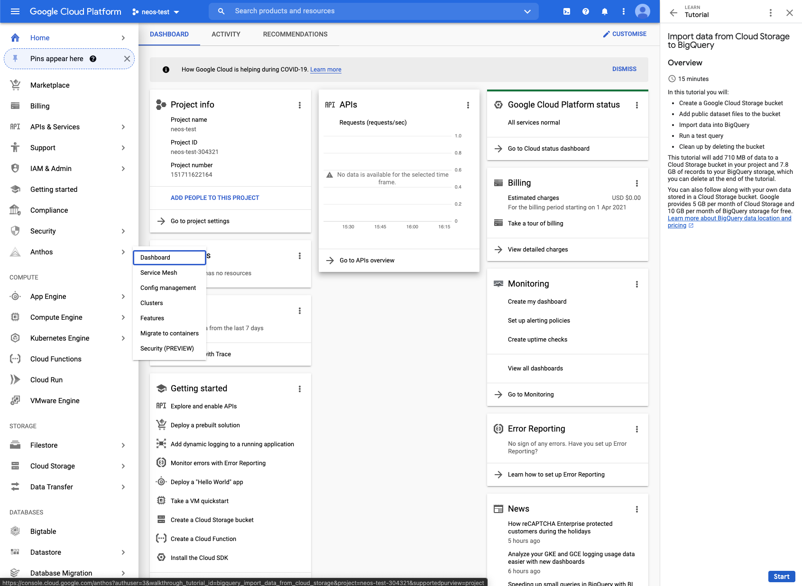

# Import Data from Cloud Storage with BigQuery

Terrence Ryan | Developer Advocate | Google

<i>Contributed by Google employees.</i>

Use this interactive tutorial to walk through the steps of importing Cloud 
Storage into BigQuery.  There will be step by step instructions on the right of 
the Cloud Console to guide you. 

    

    