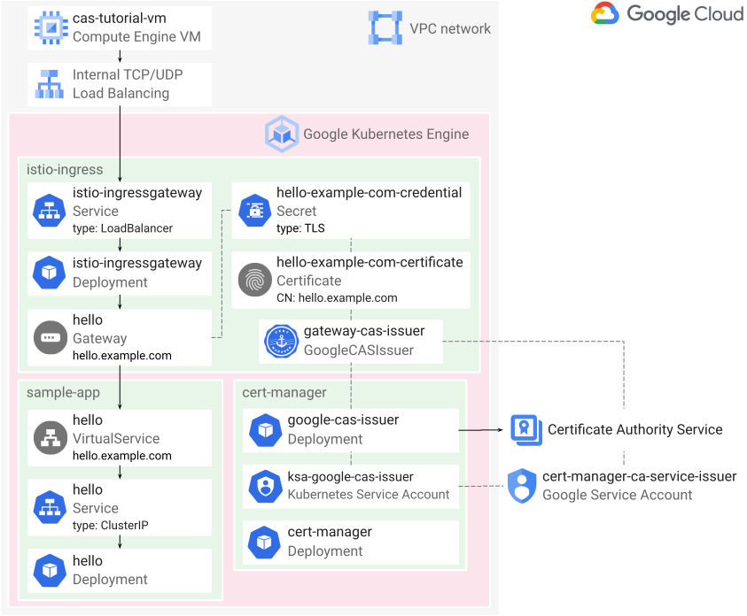

Halvard Skogsrud | Solutions Architect | Google

# Automating TLS certificate management for Istio ingress gateway using Certificate Authority Service

This tutorial shows platform operators how to use the Certificate Authority
Service issuer for cert-manager to automate TLS certificate management for the
Istio ingress gateway. The certificates enable the ingress gateway to terminate
HTTPS and other TLS traffic originating from clients in your VPC network but
outside the service mesh. The steps describe how to set up regular TLS, and
there's a brief description of how to extend the solution to mTLS traffic. The
tutorial assumes basic familiarity with Kubernetes, Istio, and TLS.

## Introduction

Istio provisions TLS certificates to every workload in the service mesh. These
certificates enable encrypted and
[mutually authenticated TLS (mTLS)](https://cloud.google.com/service-mesh/docs/security/security-overview#mutual_tls)
communication between workloads in the service mesh. The certificates are
issued and signed by the
[certificate authority (CA) for your service mesh](https://istio.io/v1.11/docs/concepts/security/#high-level-architecture).
If you use
[Anthos Service Mesh](https://cloud.google.com/service-mesh/docs), the
certificates are issued and signed by
[one of the supported CAs](https://cloud.google.com/service-mesh/docs/security-overview).

However, Istio doesn't automatically provision certificates to the
[ingress gateway](https://istio.io/v1.11/docs/tasks/traffic-management/ingress/secure-ingress/)
for external traffic entering the service mesh. A common solution is to use the
open source [cert-manager](https://cert-manager.io/) tool to
[automate the management of ingress gateway certificates](https://istio.io/v1.11/docs/ops/integrations/certmanager/).

cert-manager requests certificates from an
[issuer](https://cert-manager.io/docs/concepts/issuer/), which represents a
[certificate authority (CA)](https://wikipedia.org/wiki/Certificate_authority).
[Certificate Authority Service (CA Service)](https://cloud.google.com/certificate-authority-service/docs)
is a Google Cloud service where you can create your own private CAs.
cert-manager can request certificates from your CA in CA Service by using the
open source
[external issuer for CA Service](https://github.com/jetstack/google-cas-issuer).

A private CA can issue TLS certificates that authenticate and encrypt traffic
inside an internal network. Istio ingress gateways can be set up to allow
incoming traffic from clients that are inside your VPC network but outside the
service mesh. You can use a private CA in CA Service to issue certificates for
the Istio ingress gateway.

This tutorial shows you how to create a private CA in CA Service, and how to
set up cert-manager and the CA Service issuer to automate TLS certificate
provisioning and renewal for the Istio ingress gateway.

The diagram below shows the resources you provision in this tutorial.
You provision
[Internal TCP/UDP Load Balancing](https://cloud.google.com/load-balancing/docs/internal)
for the Istio ingress gateway by
[adding the annotation `cloud.google.com/load-balancer-type: "Internal"`](https://cloud.google.com/kubernetes-engine/docs/how-to/internal-load-balancing)
to the `istio-ingressgateway` Kubernetes Service. The internal TCP/UDP load
balancer is not a proxy, so it doesn't terminate TCP connections or perform
TLS handshakes. Instead, it routes connections to the pods of the
`istio-ingressgateway` Deployment.

The `hello-example-com-credential` Secret contains a certificate and a private
key. The `hello` Gateway configures the pods of the `istio-ingressgateway`
Deployment to use this certificate and private key to perform TLS handshakes
for incoming requests to the service mesh with the host name
`hello.example.com`.



The pods of the `ca-service-issuer` Deployment in the `cert-manager` namespace
request certificates from the CA that you create in CA Service. You create a
[Cloud Identity and Access Management (IAM)](https://cloud.google.com/iam/docs)
policy binding that allows the `ca-service-isser` pods to impersonate a Google
service account using
[Workload Identity](https://cloud.google.com/kubernetes-engine/docs/how-to/workload-identity).
You grant this Google service account permissions to request certificates from
your CA in CA Service by creating a Cloud IAM policy binding on your CA.

## Objectives

-   Create a
    [Google Kubernetes Engine (GKE)](https://cloud.google.com/kubernetes-engine/docs)
    cluster.
-   Install Istio.
-   Deploy cert-manager.
-   Create certificate authorities using CA Service.
-   Deploy and configure the CA Service issuer controller for cert-manager.
-   Verify the solution by deploying a sample application and a certificate
    from CA Service.

## Costs

This tutorial uses the following billable components of Google Cloud:

-   [CA Service](https://cloud.google.com/certificate-authority-service/pricing)
-   [Compute Engine](https://cloud.google.com/compute/all-pricing)
-   [GKE](https://cloud.google.com/kubernetes-engine/pricing)

To generate a cost estimate based on your projected usage, use the
[pricing calculator](https://cloud.google.com/products/calculator).
New Google Cloud users might be eligible for a free trial.

When you finish this tutorial, you can avoid continued billing by deleting the
resources you created. For more information, see [Cleaning up](#cleaning-up).

## Before you begin

1.  [Sign in](https://accounts.google.com/Login) to your Google Account.

    If you don't already have one,
    [sign up for a new account](https://accounts.google.com/SignUp).

2.  In the Cloud Console, on the project selector page, select or create a
    project.

    **Note:** If you don't plan to keep the resources that you create in this
    tutorial, create a project instead of selecting an existing project. After
    you finish this tutorial, you can delete the project, removing all
    resources associated with the project.

    [Go to the project selector page](https://console.cloud.google.com/projectselector2/home/dashboard)

3.  Make sure that billing is enabled for your Google Cloud project.
    [Learn how to confirm billing is enabled for your project.](https://cloud.google.com/billing/docs/how-to/modify-project)

4.  In the Cloud Console, go to Cloud Shell and clone the repository containing
    the sample code.

    [Go to Cloud Shell](https://console.cloud.google.com/cloudshell/editor?cloudshell_git_repo=https%3A%2F%2Fsource.developers.google.com%2Fp%2Fhalvard-193600%2Fr%2Fca-service-istio-gateway-tutorial&cloudshell_git_branch=main&shellonly=true)


    Click **Confirm** to clone the Git repository into your Cloud Shell home
    directory.

    A Cloud Shell session opens and displays a command-line prompt. Cloud Shell
    is a shell environment with the Cloud SDK already installed, including the
    `gcloud` command-line tool. It can take a few seconds for the session to
    initialize. You use Cloud Shell to run all the commands in this tutorial.

5.  Set the Google Cloud project you want to use for this tutorial:

    ```sh
    gcloud config set core/project PROJECT_ID
    ```

    where `PROJECT_ID` is your
    [Cloud project ID](https://cloud.google.com/resource-manager/docs/creating-managing-projects).

6.  Enable the GKE and CA Service APIs:

    ```sh
    gcloud services enable container.googleapis.com privateca.googleapis.com
    ```

## Creating a GKE cluster

1.  In Cloud Shell, create a GKE cluster:

    [embedmd]:# (01-cluster/create-gke-cluster.sh sh /CLUSTER_NAME=/ /"\$ZONE"/)
    ```sh
    CLUSTER_NAME=${CLUSTER_NAME:-istio-ingress-cert-manager-ca-service}
    PROJECT_ID=${PROJECT_ID:-$(gcloud config get-value core/project)}
    ZONE=${ZONE:-us-central1-f}

    gcloud container clusters create "$CLUSTER_NAME" \
        --enable-ip-alias \
        --num-nodes 4 \
        --release-channel regular \
        --scopes cloud-platform \
        --workload-pool "$PROJECT_ID.svc.id.goog" \
        --zone "$ZONE"
    ```

    The CA Service issuer for cert-manager requires that you set the
    `cloud-platform` scope on the cluster nodes.

    The `--workload-pool` argument enables
    [Workload Identity](https://cloud.google.com/kubernetes-engine/docs/how-to/workload-identity),
    which allows the Kubernetes service account used by the CA Service issuer
    controller pods to impersonate a Google service account. This is the
    recommended way for GKE applications to consume services provided by Google
    APIs. By using Workload Identity, the CA Service issuer controller pods can
    access the CA Service API without downloading a
    [key file](https://cloud.google.com/iam/docs/creating-managing-service-account-keys)
    for the Google service account.

    This command uses the `us-central1-f` zone. You can use a
    [different zone or region](https://cloud.google.com/compute/docs/regions-zones/)
    for your cluster.

2.  Use [kpt](https://kpt.dev) to set your Google user account as a cluster
    admin in the
    [ClusterRoleBinding](https://kubernetes.io/docs/reference/access-authn-authz/rbac/)
    manifest file:

    [embedmd]:# (01-cluster/create-gke-cluster.sh sh /kpt fn eval/ /$/)
    ```sh
    kpt fn eval 01-cluster --image gcr.io/kpt-fn/apply-setters:v0.2 -- "cluster-admin-user=$(gcloud config get-value core/account)"
    ```

    kpt is an extensible command-line tool for packaging, customizing,
    validating, and applying Kubernetes resources.

    This command updates the subject name in the ClusterRoleBinding manifest.

    [embedmd]:# (01-cluster/cluster-role-binding.yaml yaml /apiVersion/ $)
    ```yaml
    apiVersion: rbac.authorization.k8s.io/v1
    kind: ClusterRoleBinding
    metadata:
      name: cluster-admin-binding
    roleRef:
      apiGroup: rbac.authorization.k8s.io
      kind: ClusterRole
      name: cluster-admin
    subjects:
    - apiGroup: rbac.authorization.k8s.io
      kind: User
      name: $CLOUDSDK_CORE_ACCOUNT # kpt-set: ${cluster-admin-user}
    ```

3.  Initialize the kpt package in the `01-cluster` directory:

    [embedmd]:# (01-cluster/create-gke-cluster.sh sh /kpt live init/ /$/)
    ```sh
    kpt live init 01-cluster --name gke-cluster --namespace inventory
    ```

    kpt tracks resources it applies to the cluster. Tracking allows kpt to
    [prune](https://kpt.dev/book/06-deploying-packages/?id=pruning)
    resources by deleting them from the cluster if you delete the resource
    manifest and run `kpt live apply` again.

    This command uses a namespace called `inventory` to store the
    [ResourceGroup](https://kpt.dev/book/06-deploying-packages/) resource used
    to group and track applied resources. You can use a different name and
    namespace in your own environment.

4.  Apply the manifest to create the ClusterRoleBinding:

    [embedmd]:# (01-cluster/create-gke-cluster.sh sh /kpt live apply/ /$/)
    ```sh
    kpt live apply 01-cluster --reconcile-timeout 2m --output events
    ```

    This ClusterRoleBinding grants the `cluster-admin` ClusterRole to your
    Google user account. You need this ClusterRole to install Istio.

## Installing the Istio control plane

1.  In Cloud Shell, download the
    [`istioctl`](https://istio.io/v1.11/docs/reference/commands/istioctl/)
    command-line tool and add it to your `PATH`:

    [embedmd]:# (02-istio/install-istio.sh sh /^mkdir/ /^export PATH$/)
    ```sh
    mkdir -p "${HOME}/bin"
    ISTIO_VERSION=${ISTIO_VERSION:-$(curl -sSL https://api.github.com/repos/istio/istio/releases | jq -r '.[].name' | grep '^Istio 1\.11' | grep -Ev 'alpha|beta|rc' | sort -k2rV | head -n1 | cut -d' ' -f2)}
    curl -L "https://github.com/istio/istio/releases/download/${ISTIO_VERSION}/istioctl-${ISTIO_VERSION}-$(go env GOOS)-$(go env GOARCH).tar.gz" | tar -zxC "${HOME}/bin" istioctl
    PATH=${HOME}/bin:$PATH
    export PATH
    ```

    This snippet downloads the latest 1.11.x patch version of `istioctl`.

    You use the `istioctl` tool to generate Istio installation manifests.

2.  Generate installation manifests for the Istio
    [custom resource definitions (CRDs)](https://kubernetes.io/docs/concepts/extend-kubernetes/api-extension/custom-resources/)
    and
    [control plane](https://istio.io/v1.11/docs/ops/deployment/architecture/)
    using the `istioctl` tool and an
    [Istio operator](https://istio.io/v1.11/docs/reference/config/istio.operator.v1alpha1/)
    manifest:

    [embedmd]:# (02-istio/install-istio.sh sh /istioctl manifest generate --filename 02-istio\/istio-control/ /$/)
    ```sh
    istioctl manifest generate --filename 02-istio/istio-control-plane-operator.yaml --output 02-istio/control-plane
    ```

3.  Initialize the Istio control plane package:

    [embedmd]:# (02-istio/install-istio.sh sh /kpt live init 02-istio\/control/ /$/)
    ```sh
    kpt live init 02-istio/control-plane --name istio-control-plane --namespace inventory
    ```

4.  Apply the Istio control plane installation manifests:

    [embedmd]:# (02-istio/install-istio.sh sh /kpt live apply 02-istio\/control/ /$/)
    ```sh
    kpt live apply 02-istio/control-plane --reconcile-timeout 10m --output events
    ```

## Installing the Istio ingress gateway

1.  Reserve a
    [static internal IP address](https://cloud.google.com/compute/docs/ip-addresses/reserve-static-internal-ip-address)
    to use for the Istio ingress gateway internal TCP/UDP load balancer:

    [embedmd]:# (02-istio/install-istio.sh sh /REGION=/ /'value\(address\)'\)/)
    ```sh
    REGION=${REGION:-us-central1}
    LOAD_BALANCER_IP=$(gcloud compute addresses create \
        istio-ingress-gateway-ilb \
        --region "$REGION" \
        --subnet default \
        --format 'value(address)')
    ```

    This command reserves a random IP address from the `default` subnet in the
    `us-central1` region. You can use a different subnet and region, but the
    region must be the region that contains the zone(s) your GKE cluster uses.

2.  Set the load balancer IP address on the Istio ingress gateway operator
    manifest:

    [embedmd]:# (02-istio/install-istio.sh sh /kpt fn eval 02-istio/ /$/)
    ```sh
    kpt fn eval 02-istio --image gcr.io/kpt-fn/apply-setters:v0.2 -- "load-balancer-ip=$LOAD_BALANCER_IP"
    ```

    This command updates the `loadBalancerIP` field in the Istio ingress
    gateway operator manifest.

    [embedmd]:# (02-istio/istio-ingressgateway-operator.yaml yaml /apiVersion/ $)
    ```yaml
    apiVersion: install.istio.io/v1alpha1
    kind: IstioOperator
    metadata:
      name: istio-ingressgateway-operator
      annotations:
        config.kubernetes.io/local-config: "true"
    spec:
      profile: empty
      hub: gcr.io/istio-release
      components:
        ingressGateways:
        - name: istio-ingressgateway
          namespace: istio-ingress # kpt-set: ${gateway-namespace}
          enabled: true
          k8s:
            overlays:
            - apiVersion: apps/v1
              kind: Deployment
              name: istio-ingressgateway
              patches:
              - path: spec.template.metadata.annotations
                value:
                  inject.istio.io/templates: gateway
              - path: spec.template.metadata.labels.sidecar\.istio\.io/inject
                value: "true"
              - path: spec.template.spec.containers[name:istio-proxy]
                value:
                  name: istio-proxy
                  image: auto
            service:
              loadBalancerIP: $LOAD_BALANCER_IP # kpt-set: ${load-balancer-ip}
            serviceAnnotations:
              networking.gke.io/load-balancer-type: Internal
              networking.gke.io/internal-load-balancer-allow-global-access: "true" # kpt-set: ${allow-global-access}
    ```

    The service field `loadBalancerIP` specifies
    [the IP address to use for the load balancer](https://cloud.google.com/kubernetes-engine/docs/how-to/service-parameters#lb_ip).
    If you leave out this field, the load balancer will use an
    [ephemeral IP address](https://cloud.google.com/compute/docs/ip-addresses).

    The annotation `networking.gke.io/load-balancer-type: "Internal"` on the
    ingress gateway means that GKE will provision resources for
    [Internal TCP/UDP Load Balancing](https://cloud.google.com/load-balancing/docs/internal)
    in front of the Istio ingress gateway pods. If you remove this annotation,
    GKE instead provisions resources for
    [external TCP/UDP Network Load Balancing](https://cloud.google.com/load-balancing/docs/network).

    The optional annotation
    `networking.gke.io/internal-load-balancer-allow-global-access: "true"`
    allows clients from any region in your VPC network to access the internal
    TCP/UDP load balancer.

    The annotation `config.kubernetes.io/local-config: "true"` causes kpt to
    ignore this manifest when you apply manifests to your cluster.

2.  Create an installation manifest for the Istio ingress gateway using the
    `istioctl` tool and an Istio operator manifest:

    [embedmd]:# (02-istio/install-istio.sh sh /istioctl manifest generate --filename 02-istio\/istio-ingress/ /$/)
    ```sh
    istioctl manifest generate --filename 02-istio/istio-ingressgateway-operator.yaml --output 02-istio/ingressgateway
    ```

    The resources in the installation manifest enable
    [auto-injection for gateway deployments](https://istio.io/v1.11/docs/setup/additional-setup/gateway/)
    using the `inject.istio.io/templates: gateway` annotation and the
    `sidecar.istio.io/inject: "true"` label on the `istio-ingressgateway`
    Deployment.

3.  (Optional) Inspect the generated ingress gateway installation manifest in
    a text editor. Open the file
    `02-istio/ingressgateway/Base/Pilot/IngressGateways/IngressGateways.yaml`.

    The generated manifest contains the following ingress gateway resources:

    - ServiceAccount
    - Deployment
    - PodDisruptionBudget
    - Role
    - RoleBinding
    - HorizontalPodAutoscaler
    - Service

4.  Initialize the Istio ingress gateway package:

    [embedmd]:# (02-istio/install-istio.sh sh /kpt live init 02-istio\/ingress/ /$/)
    ```sh
    kpt live init 02-istio/ingressgateway --name istio-ingressgateway --namespace inventory
    ```

5.  Apply the Istio ingress gateway installation manifest:

    [embedmd]:# (02-istio/install-istio.sh sh /kpt live apply 02-istio\/ingress/ /$/)
    ```sh
    kpt live apply 02-istio/ingressgateway --reconcile-timeout 10m --output events
    ```

## Installing cert-manager

1.  In Cloud Shell, download the cert-manager installation manifest:

    [embedmd]:# (03-cert-manager/install-cert-manager.sh sh /CERT_MANAGER_VERSION=/ /cert-manager.yaml"/)
    ```sh
    CERT_MANAGER_VERSION=${CERT_MANAGER_VERSION:-1.5.3}
    curl -Lo 03-cert-manager/cert-manager.yaml "https://github.com/jetstack/cert-manager/releases/download/v${CERT_MANAGER_VERSION}/cert-manager.yaml"
    ```

2.  Initialize the cert-manager package:

    [embedmd]:# (03-cert-manager/install-cert-manager.sh sh /kpt live init/ /$/)
    ```sh
    kpt live init 03-cert-manager --name cert-manager --namespace inventory
    ```

3.  Apply the cert-manager installation manifest:

    [embedmd]:# (03-cert-manager/install-cert-manager.sh sh /kpt live apply/ /$/)
    ```sh
    kpt live apply 03-cert-manager --reconcile-timeout 5m --output events
    ```

## Configuring CA Service

In this section, you create a root CA and a subordinate CA in CA Service. You
create separate
[CA pools](https://cloud.google.com/certificate-authority-service/docs/ca-pool)
for the root CA and subordinate CA.

For simplicity, you use the same project for the GKE cluster and the root and
subordinate CAs in this tutorial. In your own environment, you can use a
different project for the GKE cluster and the CAs.

**Note:** In your own environment, you can create a subordinate CA in CA
Service from an existing root CA in your organization. If you do this, you do
not need to create a root CA in CA Service. We recommend you consult the
documentation on how to
[create a subordinate CA from an external CA](https://cloud.google.com/certificate-authority-service/docs/creating-certificate-authorities#subordinate-external).

1.  In Cloud Shell, define the location that you want to use for your root CA
    and subordinate CA in CA Service:

    [embedmd]:# (04-ca-service/configure-ca-service.sh sh /CA_LOCATION=/ /$/)
    ```sh
    CA_LOCATION=${CA_LOCATION:-us-central1}
    ```

    This tutorial uses the `us-central1` location. You can use a different
    location. You can list the available CA Service locations using this
    command: `gcloud privateca locations list`.

2.  Create a CA pool to use for the root CA:

    [embedmd]:# (04-ca-service/configure-ca-service.sh sh /ROOT_CA_POOL=/ /enterprise$/)
    ```sh
    ROOT_CA_POOL=${ROOT_CA_POOL:-root-ca-pool-tutorial}
    gcloud privateca pools create "$ROOT_CA_POOL" \
        --location "$CA_LOCATION" \
        --tier enterprise
    ```

3.  Create and enable a root CA:

    [embedmd]:# (04-ca-service/configure-ca-service.sh sh /ROOT_CA=/ /root_unconstrained/)
    ```sh
    ROOT_CA=${ROOT_CA:-root-ca-tutorial}
    gcloud privateca roots create "$ROOT_CA" \
        --auto-enable \
        --key-algorithm "ec-p384-sha384" \
        --location "$CA_LOCATION" \
        --pool "$ROOT_CA_POOL" \
        --subject "CN=Example Root CA, O=Example Organization" \
        --use-preset-profile root_unconstrained
    ```

    To view the available options to customize the root CA, run this
    command: `gcloud privateca roots create --help`.

4.  Create a CA pool to use for the subordinate CA:

    [embedmd]:# (04-ca-service/configure-ca-service.sh sh /SUBORDINATE_CA_POOL=/ /devops$/)
    ```sh
    SUBORDINATE_CA_POOL=${SUBORDINATE_CA_POOL:-subordinate-ca-pool-tutorial}
    gcloud privateca pools create "$SUBORDINATE_CA_POOL" \
        --location "$CA_LOCATION" \
        --tier devops
    ```

5.  Create and enable a subordinate CA:

    [embedmd]:# (04-ca-service/configure-ca-service.sh sh /SUBORDINATE_CA=/ /subordinate_server_tls_pathlen_0/)
    ```sh
    SUBORDINATE_CA=${SUBORDINATE_CA:-subordinate-ca-tutorial}
    gcloud privateca subordinates create "$SUBORDINATE_CA" \
        --auto-enable \
        --issuer-location "$CA_LOCATION" \
        --issuer-pool "$ROOT_CA_POOL" \
        --key-algorithm "ec-p256-sha256" \
        --location "$CA_LOCATION" \
        --pool "$SUBORDINATE_CA_POOL" \
        --subject "CN=Example Server TLS CA, O=Example Organization" \
        --use-preset-profile subordinate_server_tls_pathlen_0
    ```

    The `--use-preset-profile` option configures the subordinate CA to use the
    [Subordinate server TLS](https://cloud.google.com/certificate-authority-service/docs/certificate-profile#sub-server-tls)
    certificate profile. This profile enables the subordinate CA to issue
    server TLS certificates.

    If you want to enable the subordinate CA to issue both client and server
    TLS certificates for mTLS, use the
    [Subordinate mTLS](https://cloud.google.com/certificate-authority-service/docs/certificate-profile#sub-mtls)
    certificate profile instead.

    To view the available options to customize the subordinate CA, run this
    command: `gcloud privateca subordinates create --help`.

## Installing the CA Service issuer controller

The
[CA Service issuer controller](https://github.com/jetstack/google-cas-issuer)
allows cert-manager to request certificates using CA Service. The controller
uses the cert-manager
[external issuer](https://cert-manager.io/docs/configuration/external/)
extension mechanism.

1.  In Cloud Shell, create a
    [Google service account](https://cloud.google.com/iam/docs/service-accounts):

    [embedmd]:# (05-ca-service-issuer/install-ca-service-issuer.sh sh /GSA_NAME=/ /gserviceaccount\.com/)
    ```sh
    GSA_NAME=${GSA_NAME:-cert-manager-ca-service-issuer}
    gcloud iam service-accounts create "$GSA_NAME" \
        --display-name "CA Service issuer for cert-manager"
    GSA=$GSA_NAME@$PROJECT_ID.iam.gserviceaccount.com
    ```

    The CA Service issuer controller uses this service account to authenticate
    to the
    [CA Service APIs](https://cloud.google.com/certificate-authority-service/docs/apis).

2.  Create a
    [Cloud Identity and Access Management (IAM) policy binding](https://cloud.google.com/iam/docs/reference/rest/v1/Policy)
    that allows the Google service account to request certificates from the CA
    pool that contains your subordinate CA:

    [embedmd]:# (05-ca-service-issuer/install-ca-service-issuer.sh sh /gcloud privateca pools add-iam-policy-binding/ /certificateRequester/)
    ```sh
    gcloud privateca pools add-iam-policy-binding "$SUBORDINATE_CA_POOL" \
        --location "$CA_LOCATION" \
        --member "serviceAccount:$GSA" \
        --role roles/privateca.certificateRequester
    ```

3.  Download the CA Service issuer controller installation manifest:

    [embedmd]:# (05-ca-service-issuer/install-ca-service-issuer.sh sh /CA_SERVICE_ISSUER_VERSION=/ /ca-service-issuer\.yaml/)
    ```sh
    CA_SERVICE_ISSUER_VERSION=${CA_SERVICE_ISSUER_VERSION:-v0.5.3}
    curl --location "https://github.com/jetstack/google-cas-issuer/releases/download/${CA_SERVICE_ISSUER_VERSION}/google-cas-issuer-${CA_SERVICE_ISSUER_VERSION}.yaml" --output 05-ca-service-issuer/ca-service-issuer.yaml
    ```

4.  Query the manifest to find the name of the Kubernetes service account used
    by the CA Service issuer controller pods:

    [embedmd]:# (05-ca-service-issuer/install-ca-service-issuer.sh sh /KSA=/ /$/)
    ```sh
    KSA=$(kubectl apply -f 05-ca-service-issuer/ca-service-issuer.yaml --dry-run=client -o jsonpath='{.items[*].spec.template.spec.serviceAccountName}')
    ```

5.  Create a Cloud IAM policy binding that allows the
    Kubernetes service account (`KSA`) in the `cert-manager` namespace to
    impersonate the Google service account (`GSA`) using
    [Workload Identity](https://cloud.google.com/kubernetes-engine/docs/how-to/workload-identity):

    [embedmd]:# (05-ca-service-issuer/install-ca-service-issuer.sh sh /gcloud iam service-accounts add-iam-policy-binding/ /workloadIdentityUser/)
    ```sh
    gcloud iam service-accounts add-iam-policy-binding "$GSA" \
        --member "serviceAccount:$PROJECT_ID.svc.id.goog[cert-manager/$KSA]" \
        --role roles/iam.workloadIdentityUser
    ```

6.  Add the Workload Identity annotation `iam.gke.io/gcp-service-account` to
    the Kubernetes service account in the CA Service issuer controller
    manifest:

    [embedmd]:# (05-ca-service-issuer/install-ca-service-issuer.sh sh /kustomize cfg annotate/ /=\$GSA"/)
    ```sh
    kustomize cfg annotate 05-ca-service-issuer \
        --kind ServiceAccount \
        --name "$KSA" \
        --namespace cert-manager \
        --kv "iam.gke.io/gcp-service-account=$GSA"
    ```

    This annotation informs GKE that the Kubernetes service account can
    impersonate the Google service account to access Google APIs.

7.  Initialize the CA Service issuer controller package:

    [embedmd]:# (05-ca-service-issuer/install-ca-service-issuer.sh sh /kpt live init/ /$/)
    ```sh
    kpt live init 05-ca-service-issuer --name ca-service-issuer-controller --namespace inventory
    ```

8.  Apply the CA Service issuer controller package to your GKE cluster:

    [embedmd]:# (05-ca-service-issuer/install-ca-service-issuer.sh sh /kpt live apply/ /$/)
    ```sh
    kpt live apply 05-ca-service-issuer --reconcile-timeout 5m --output events
    ```

## Creating a certificate issuer

1.  In Cloud Shell, set your Cloud project ID and subordinate CA location in
    the issuer manifest:

    [embedmd]:# (06-cert-issuer/create-cert-issuer.sh sh /kpt fn eval/ /CA_LOCATION"/)
    ```sh
    kpt fn eval 06-cert-issuer --image gcr.io/kpt-fn/apply-setters:v0.2 -- \
        "gcloud.core.project=$PROJECT_ID" \
        "ca-location=$CA_LOCATION"
    ```

    This updates the `project` field in the GoogleCASIssuer manifest.

    [embedmd]:# (06-cert-issuer/gateway-cas-issuer.yaml yaml /apiVersion/ $)
    ```yaml
    apiVersion: cas-issuer.jetstack.io/v1beta1
    kind: GoogleCASIssuer
    metadata:
      name: gateway-cas-issuer # kpt-set: ${issuer}
      namespace: istio-ingress # kpt-set: ${gateway-namespace}
    spec:
      caPoolId: subordinate-ca-pool-tutorial # kpt-set: ${ca-pool}
      location: us-central1 # kpt-set: ${ca-location}
      project: $PROJECT_ID # kpt-set: ${gcloud.core.project}
    ```

2.  Initialize the certificate issuer package:

    [embedmd]:# (06-cert-issuer/create-cert-issuer.sh sh /kpt live init/ /$/)
    ```sh
    kpt live init 06-cert-issuer --name cert-issuer --namespace inventory
    ```

3.  Create a certificate
    [issuer](https://github.com/jetstack/google-cas-issuer#configuring-the-issuer):

    [embedmd]:# (06-cert-issuer/create-cert-issuer.sh sh /kpt live apply/ /$/)
    ```sh
    kpt live apply 06-cert-issuer --reconcile-timeout 3m --output events
    ```

    This issuer allows cert-manager to provision certificates from your
    subordinate CA pool in the same namespace as your Istio ingress gateway
    Deployment.

    You must create the issuer in the same namespace as your Istio ingress
    gateway deployment. Adjust the namespace if you use a different namespace
    for the Istio ingress gateway deployment in your own environment.

    **Note:** You can create a
    [cluster issuer](https://github.com/jetstack/google-cas-issuer#configuring-the-issuer)
    instead of a namespace-scoped issuer. A cluster issuer can provision
    certificates for any namespace in the cluster.

## Deploying a sample application

To verify that cert-manager can use the CA Service issuer to obtain
certificates from CA service, deploy a sample application with Istio request
routing configuration and a certificate for the Istio ingress gateway.

1.  View the Certificate, Gateway, and Virtual Service resources that are part
    of the sample app package in the `07-sample-app` directory.

    [embedmd]:# (07-sample-app/certificate.yaml yaml /apiVersion/ $)
    ```yaml
    apiVersion: cert-manager.io/v1
    kind: Certificate
    metadata:
      name: hello-example-com-certificate
      namespace: istio-ingress # kpt-set: ${gateway-namespace}
    spec:
      secretName: hello-example-com-credential # kpt-set: ${certificate-secret}
      commonName: hello.example.com # kpt-set: ${host}
      dnsNames:
      - hello.example.com # kpt-set: ${host}
      duration: 24h
      renewBefore: 8h
      issuerRef:
        group: cas-issuer.jetstack.io
        kind: GoogleCASIssuer
        name: gateway-cas-issuer # kpt-set: ${issuer}
    ```

    [embedmd]:# (07-sample-app/gateway.yaml yaml /apiVersion/ $)
    ```yaml
    apiVersion: networking.istio.io/v1beta1
    kind: Gateway
    metadata:
      name: hello # kpt-set: ${gateway-name}
      namespace: istio-ingress # kpt-set: ${gateway-namespace}
    spec:
      selector:
        istio: ingressgateway
      servers:
      - hosts: # kpt-set: ${virtual-service-namespace-host}
        - sample-app/hello.example.com # kpt-set: ${namespace}/${host}
        port:
          name: https-hello
          number: 443
          protocol: HTTPS
        tls:
          credentialName: hello-example-com-credential # kpt-set: ${certificate-secret}
          mode: SIMPLE
    ```

    [embedmd]:# (07-sample-app/virtual-service.yaml yaml /apiVersion/ $)
    ```yaml
    apiVersion: networking.istio.io/v1beta1
    kind: VirtualService
    metadata:
      name: hello
      namespace: sample-app # kpt-set: ${namespace}
    spec:
      hosts:
      - hello.example.com # kpt-set: ${host}
      gateways:
      - istio-ingress/hello # kpt-set: ${gateway-namespace}/${gateway-name}
      http:
      - route:
        - destination:
            host: hello # kpt-set: ${service-name}
            port:
              number: 8080 # kpt-set: ${port}
    ```

    Note the following about these manifests:

    -   The Certificate namespace matches the Istio ingress gateway deployment
        namespace.

    -   The `secretName` field in the Certificate matches the `credentialName`
        field in the Gateway. This allows the Istio ingress gateway to use the
        certificate provisioned by cert-manager to terminate TLS traffic
        destined to `hello.example.com`.

    -   The Gateway and Virtual Service use different namespaces. This is a
        common pattern that restricts changes to host-based routing in the
        Gateway to the set of users with permissions to make changes to
        resources in Istio namespaces. Changes to resources in these namespaces
        is typically restricted to platform administrators, since changes
        affect the entire service mesh.

        Changes to routing by other request fields, such as URL path, is
        permitted by anyone with edit access to the Virtual Service in the
        `sample-app` namespace. This allows application administrators to make
        changes to fine-grained routing rules without coordinating with
        platform administrators.

    -   The Gateway manifest specifies `SIMPLE` TLS, not mTLS. If you want to
        configure the gateway for mTLS, set the
        [TLS mode](https://istio.io/v1.11/docs/reference/config/networking/gateway/#ServerTLSSettings-TLSmode)
        of the Gateway to `MUTUAL`.

    The kpt package for the sample app defines a number of
    [setters](https://catalog.kpt.dev/apply-setters/v0.2/)
    that you can use to customize the manifests.

    If you want to explore other configuration options, we recommend you read
    the API documentation for the
    [Certificate](https://cert-manager.io/docs/reference/api-docs/#cert-manager.io/v1.Certificate),
    [Gateway](https://istio.io/v1.11/docs/reference/config/networking/gateway/),
    and
    [Virtual Service](https://istio.io/v1.11/docs/reference/config/networking/virtual-service/)
    resources.

2.  In Cloud Shell, initialize the sample app package:

    [embedmd]:# (07-sample-app/deploy-sample-app.sh sh /kpt live init/ /$/)
    ```sh
    kpt live init 07-sample-app --name sample-app --namespace inventory
    ```

3.  Deploy the sample app:

    [embedmd]:# (07-sample-app/deploy-sample-app.sh sh /kpt live apply/ /$/)
    ```sh
    kpt live apply 07-sample-app --reconcile-timeout 5m --output events
    ```

    When you deploy the sample app, the CA Service issuer requests a TLS
    certificate from the subordinate CA for the ingress gateway. The output
    includes the following:

    ```terminal
    certificate.cert-manager.io/hello-example-com-certificate is InProgress: Issuing certificate as Secret does not exist
    ```

## Verifying the solution

In this section, you create a Compute Engine VM instance to verify that you can
send HTTPS requests to the sample app from outside the GKE cluster. You need
SSH access to the VM instance, and this is
[preconfigured](https://cloud.google.com/vpc/docs/firewalls#more_rules_default_vpc)
if you use the
[default network](https://cloud.google.com/vpc/docs/vpc#default-network).

If you don't have SSH access, follow the
[firewall rules documentation](https://cloud.google.com/vpc/docs/using-firewalls)
to create a firewall rule that allows incoming TCP connections on port 22.

**Note:** If you don't want to create a VM instance with a public IP address,
you can use
[TCP forwarding with Identity-Aware Proxy](https://cloud.google.com/iap/docs/tcp-forwarding-overview)
to enable authenticated and authorized SSH access from outside the VPC network
to VM instances that do not have public, routable IP addresses. If you use
TCP forwarding with Identity-Aware Proxy, add the `--tunnel-through-iap` flag
to all `gcloud compute` commands in this section.

1.  In Cloud Shell, save the public key certificate of your root CA to a file:

    [embedmd]:# (08-verify-https/verify-https.sh sh /gcloud privateca roots describe/ /root-ca\.crt/)
    ```sh
    gcloud privateca roots describe "$ROOT_CA" \
        --location "$CA_LOCATION" \
        --pool "$ROOT_CA_POOL" \
        --format 'value(pemCaCertificates)' > root-ca.crt
    ```

    **Note:** You do not need to treat this certificate as a secret credential.
    It contains only the public key of the root CA, not the private key. All
    clients using your service will receive a copy of this certificate as part
    of the TLS handshake.

2.  Create a Compute Engine VM instance in the same VPC network
    as the GKE cluster:

    [embedmd]:# (08-verify-https/verify-https.sh sh /gcloud compute instances create/ /$/)
    ```sh
    gcloud compute instances create cas-tutorial-vm --no-scopes --no-service-account --zone "$ZONE"
    ```

3.  Copy the root CA certificate to the VM instance using `scp`:

    [embedmd]:# (08-verify-https/verify-https.sh sh /gcloud compute scp/ /$/)
    ```sh
    gcloud compute scp root-ca.crt cas-tutorial-vm:~ --zone "$ZONE"
    ```

4.  SSH to the VM instance and use `curl` to send a HTTPS request from the
    VM instance to the sample app:

    [embedmd]:# (08-verify-https/verify-https.sh sh /gcloud compute ssh/ /https.*$/)
    ```sh
    gcloud compute ssh cas-tutorial-vm --zone "$ZONE" \
        --command "curl --silent --cacert root-ca.crt \
            --resolve hello.example.com:443:$LOAD_BALANCER_IP \
            https://hello.example.com/ | head -n1"
    ```

    The output looks like this:

    ```terminal
    Hello, world!
    ```

    This response shows that you successfully sent the HTTPS request. The
    sample app responded with the message you see in the terminal output.

    The `curl` command you execute from the VM instance via SSH does the
    following:

    -   The `--silent` flag suppresses response download progress reporting in
        the terminal output.

    -   The `--cacert` flag instructs `curl` to verify that the server
        certificate was issued by either the root CA you created in this
        tutorial, or by a subordinate CA of the root CA.

        If you omit this flag, `curl` will attempt to verify the server
        certificate using the default CA bundle of your operating system, such
        as the [`ca-certificates`](https://packages.debian.org/stable/ca-certificates)
        on Debian. The verification will fail because the default CA bundle
        does not include the root CA you created in this tutorial.

    -   The `--resolve` flag instructs `curl` to use `$LOAD_BALANCER_IP` as the
        IP address for requests to host `hello.example.com` on port 443.

        If you omit this flag, `curl` will attempt to use DNS to resolve the
        `hello.example.com` host name, and this DNS resolution will fail
        because there is no DNS entry for this host name.

    -   The command pipes the `curl` output to `head -n1`. This means that the
        command output in the terminal only includes the first line of the
        response body.

    If you want to see more details of the TLS handshake and the server
    certificate, add `--verbose` as an additional flag to the `curl` command.

## Troubleshooting

If the CA Service issuer controller doesn't create the TLS certificate secret,
view the logs of the CA Service issuer controller:

```sh
kubectl logs deployment/google-cas-issuer --namespace cert-manager
```

If you run into other problems with this tutorial, we recommend that you review
these documents:

-   [CA Service frequently asked questions](https://cloud.google.com/certificate-authority-service/docs/faqs)
-   [CA Service known limitations](https://cloud.google.com/certificate-authority-service/docs/known-limitations)
-   [Istio operations common problems](https://istio.io/docs/ops/common-problems/)
-   [GKE troubleshooting](https://cloud.google.com/kubernetes-engine/docs/troubleshooting)
-   [Troubleshooting Kubernetes clusters](https://kubernetes.io/docs/tasks/debug-application-cluster/debug-cluster/)

## Automating the setup

You can automate the setup process from this tutorial by using the provided
setup script:

```terminal
./setup.sh
```

You see the following in your terminal at the end of the script output:

```terminal
Hello, world!
```

## Configuring an mTLS gateway

This tutorial configures the Istio ingress gateway for simple TLS, not mTLS. If
you want to set up the gateway for mTLS, do the following:

1.  Set the
    [TLS mode](https://istio.io/v1.11/docs/reference/config/networking/gateway/#ServerTLSSettings-TLSmode)
    of the Istio Gateway resource to `MUTUAL`.

2.  Enable the subordinate CA in CA Service to issue client TLS certificates by
    using the
    [mTLS certificate profile `subordinate_mtls_pathlen_0`](https://cloud.google.com/certificate-authority-service/docs/certificate-profile#mtls),
    or create another subordinate CA using the
    [client TLS certificate profile ``](https://cloud.google.com/certificate-authority-service/docs/certificate-profile#client-tls).

## Cleaning up

To avoid incurring continuing charges to your Google Cloud Platform account for
the resources used in this tutorial you can either delete the project or delete
the individual resources.

### Deleting the project

**Caution:**  Deleting a project has the following effects:

-   **Everything in the project is deleted.** If you used an existing project
    for this tutorial, when you delete it, you also delete any other work
    you've done in the project.
-   **Custom project IDs are lost.** When you created this project, you might
    have created a custom project ID that you want to use in the future. To
    preserve the URLs that use the project ID, such as an `appspot.com` URL,
    delete selected resources inside the project instead of deleting the whole
    project.

In Cloud Shell, delete the project:

```sh
echo GOOGLE_CLOUD_PROJECT=$GOOGLE_CLOUD_PROJECT
gcloud projects delete $GOOGLE_CLOUD_PROJECT
```

### Deleting the resources

If you want to keep the Google Cloud project you used in this tutorial, delete
the individual resources:

1.  In Cloud Shell, delete the GKE cluster:

    [embedmd]:# (cleanup.sh sh /gcloud container clusters delete/ /$/)
    ```sh
    gcloud container clusters delete "$CLUSTER_NAME" --zone "$ZONE" --async --quiet
    ```

2.  Delete the Cloud IAM policy binding for the subordinate CA pool:

    [embedmd]:# (cleanup.sh sh /gcloud privateca pools remove-iam-policy-binding/ /certificateRequester/)
    ```sh
    gcloud privateca pools remove-iam-policy-binding "$SUBORDINATE_CA_POOL" \
        --location "$CA_LOCATION" \
        --member "serviceAccount:$GSA" \
        --role roles/privateca.certificateRequester
    ```

3.  Disable and schedule deletion of the subordinate CA and root CA:

    [embedmd]:# (cleanup.sh sh /gcloud privateca subordinates disable/ /\"\$ROOT_CA_POOL\" --ignore-active-certificates --quiet/)
    ```sh
    gcloud privateca subordinates disable "$SUBORDINATE_CA" --location "$CA_LOCATION" --pool "$SUBORDINATE_CA_POOL" --quiet
    gcloud privateca subordinates delete "$SUBORDINATE_CA" --location "$CA_LOCATION" --pool "$SUBORDINATE_CA_POOL" --ignore-active-certificates --quiet

    gcloud privateca roots disable "$ROOT_CA" --location "$CA_LOCATION" --pool "$ROOT_CA_POOL" --quiet
    gcloud privateca roots delete "$ROOT_CA" --location "$CA_LOCATION" --pool "$ROOT_CA_POOL" --ignore-active-certificates --quiet
    ```

4.  Delete the Cloud IAM policy binding for the Google service account:

    [embedmd]:# (cleanup.sh sh /gcloud iam service-accounts remove-iam-policy-binding/ /workloadIdentityUser/)
    ```sh
    gcloud iam service-accounts remove-iam-policy-binding "$GSA" \
        --member "serviceAccount:$PROJECT_ID.svc.id.goog[cert-manager/$KSA]" \
        --role roles/iam.workloadIdentityUser
    ```

5.  Delete the Google service account:

    [embedmd]:# (cleanup.sh sh /gcloud iam service-accounts delete/ /$/)
    ```sh
    gcloud iam service-accounts delete "$GSA" --quiet
    ```

6.  Delete the reserved load balancer IP address:

    [embedmd]:# (cleanup.sh sh /gcloud compute addresses delete/ /$/)
    ```sh
    gcloud compute addresses delete istio-ingress-gateway-ilb --region "$REGION" --quiet
    ```

7.  Delete the Compute Engine VM instance:

    [embedmd]:# (cleanup.sh sh /gcloud compute instances delete/ /$/)
    ```sh
    gcloud compute instances delete cas-tutorial-vm --zone "$ZONE" --quiet
    ```

## What's next

-   Explore other
    [CA Service how-to guides](https://cloud.google.com/certificate-authority-service/docs/how-to).
-   Learn more about
    [Anthos Service Mesh](https://cloud.google.com/service-mesh/docs/overview),
    an Istio-based suite of tools that helps you monitor and manage a reliable
    service mesh on-premises and on Google Cloud.
-   Explore
    [Anthos Service Mesh how-to guides](https://cloud.google.com/service-mesh/docs/how-to).
-   Learn how to
    [expose service mesh applications to the Internet using GKE Ingress](https://cloud.google.com/architecture/exposing-service-mesh-apps-through-gke-ingress).
-   Try out other Google Cloud features for yourself. Have a look at our
    [tutorials](https://cloud.google.com/architecture).
