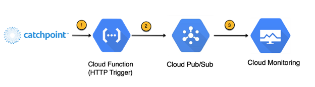
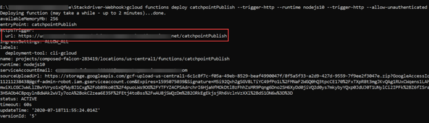
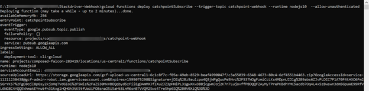
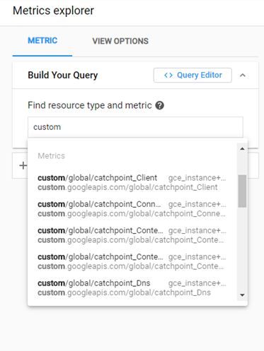

Dritan Suljoti | Chief Product and Technology Officer | Catchpoint Systems, Inc.

<i>Contributed by the Google Cloud community. Not official Google documentation.</i>

[Catchpoint’s digital experience monitoring platform](https://www.catchpoint.com/platform) provides instant insight into the performance of networks, apps, and digital services. The following tutorials provide two methods of ingesting and visualizing data from Catchpoint within GCP. The first method delivers data to Grafana for the visualization and analysis, and the second uses Metrics Explorer in Google Cloud Monitoring.

[Method 1 - Catchpoint to Grafana](.\Catchpoint%20to%20Grafana.md)

[Method 2 - Catchpoint to Cloud Monitoring](.\Catchpoint%20to%20GCM.md)

[Google Cloud Monitoring](https://cloud.google.com/monitoring) provides visibility into the performance, uptime, and overall health of applications. [Catchpoint’s digital experience monitoring platform](https://www.catchpoint.com/platform) provides the most extensive fleet of network telemetry probes in the world, as well as tools for capturing real user experience metrics. In this tutorial, you will learn how to set up a pipeline that takes data captured by Catchpoint and processes it to Google Cloud Monitoring for visualization and analysis in Metrics Explorer.  

The dataflow from Catchpoint to Cloud Monitoring works as follows:

1.	Catchpoint posts data to a Cloud Function (HTTP Webhook).
1.	The Cloud Function uses Pub/Sub to propagate the data to configured channels.
1.	Cloud Monitoring receives the data from the Pub/Sub channel, where it is available for visualization using Metrics Explorer

## Objectives

1.	Set up GCP data pipeline
1.	Configure Catchpoint
1.	Set up Cloud Monitoring
1.	Configure Metric Explorer in Cloud Monitoring

## Costs

This tutorial uses billable components of Google Cloud, including the following:

- [Cloud Functions](https://cloud.google.com/functions)
- [App Engine](https://cloud.google.com/appengine/docs/flexible/python)

Use the [pricing calculator](https://cloud.google.com/products/calculator) to generate a cost estimate based on your projected usage.

## Before you begin

### 1. Create a new project in Google Console or reuse an existing project
Refer to [Creating and managing projects | Resource Manager Documentation](https://cloud.google.com/resource-manager/docs/creating-managing-projects) for steps to create a new project. You will need the Google Project ID when configuring the Catchpoint script.
### 2. Install the Monitoring Client Libraries
Please refer to [Monitoring Cloud Libraries | Cloud Monitoring](https://cloud.google.com/monitoring/docs/reference/libraries) for instructions on installing the client libraries and setting up authentication. 
### 3. Enable Monitoring API
The Monitoring API must be enabled and have authorized users. Follow the steps in [Enabling the Monitoring API | Cloud Monitoring](https://cloud.google.com/monitoring/api/enable-api) to enable and authorize use of the Monitoring API v3 using either the Cloud SDK or the Cloud console. 
### 4. Enable Cloud Functions
Follow the steps in the [Cloud Pub/Sub Tutorial | Cloud Functions](https://cloud.google.com/functions/docs/tutorials/pubsub) to enable the use of Cloud Functions and Cloud Pub/Sub APIs. This tutorial leverages Node.js.

*Some steps in this tutorial are performed via the Google Cloud Console, and others via the Cloud SDK Shell. The tutorial assumes you are familiar with accessing and using these tools.*

## Tutorial body

### Set up GCP data pipeline
1.	Clone the Catchpoint Stackdriver integration repository to your local machine from [here](https://github.com/catchpoint/Integrations.GoogleCloudMonitoring). The Stackdriver-Webhook folder has the required Node.js script to set up the ingestion of data and writing of data to Cloud Monitoring.
1.	Edit [Stackdriver-Webhook/.env](https://github.com/catchpoint/Integrations.GoogleCloudMonitoring/blob/master/Stackdriver-Webhook/.env) and update the GoogleProjectId to your project’s Project ID. Refer to [Using Environment Variables](https://cloud.google.com/functions/docs/env-var) for more information on environment variables.
1.	Open Google Cloud SDK Shell and navigate to the directory where the Node.js scripts were cloned:

        cd <path to cloned directory>

1.	Set/change the project property in the core section to the current project:

        gcloud config set project <your project ID>

1.	Run the following command to deploy the Publish Function:  

        gcloud functions deploy catchpointPublish \
            --trigger-http \
            --runtime nodejs10 \
            --trigger-http \
            --allow-unauthenticated

    ***Note:** this function creates a topic using the TopicName value from the .env file. By default this name is “catchpoint-webhook”. If you want to use a different name then you must change this value in the .env file before running the command.*
1.	Capture the HTTP Trigger URL after the deployment is successful. You will need this when configuring Catchpoint.
 
1.	Run the following command to deploy the Subscribe Function: 
            gcloud functions deploy catchpointSubscribe \
            --trigger-topic catchpoint-webhook \
            --runtime nodejs10 \
            --allow-unauthenticated \
 
    ***Note:** This command assumes you have used the default topic name, “catchpoint-webhook”. If you used a different topic name, then replace the topic name in this command with yours.*
	
### Configure Catchpoint
1.	Navigate to [Catchpoint API Detail](https://portal.catchpoint.com/ui/Content/Administration/ApiDetail.aspx). (See [Catchpoint Webhook document](https://support.catchpoint.com/hc/en-us/articles/115005282906) for additional information.)
1.	Click Add URL under Test Data Webhook
1.	Input the HTTP Trigger URL you generated in the previous section in the URL field.
1.	Under "Format" you can choose “JSON” to have Catchpoint send its default data payload in JSON format, or you can choose “Template” if you want to customize the data payload. Steps 5-8 are only necessary if you choose Template.
1.	Click "Select Template"
1.	Click "Add New"
1.	Input a Name for this template and select "JSON" as the format.
1.	Input valid JSON specifying the format of the payload that will be posted to the Webhook. Each value in the template is set using a Macro, which will be replaced with actual data at runtime. See [Test Data Webhook Macros]((https://support.catchpoint.com/hc/en-us/articles/360008476571)) for all available options. Here is a sample JSON template containing recommended macros:
        {
        "TestName": "${TestName}",
        "TestURL": "${testurl}",
        "TimeStamp": "${timestamp}",
        "NodeName": "${nodeName}",
        "PacketLoss": "${pingpacketlosspct}",
        "RTTAvg": "${pingroundtriptimeavg}",
        "DNSTime": "${timingdns}", 
        "Connect": "${timingconnect}", 
        "SSL": "${timingssl}", 
        "SendTime": "${timingsend}",
        "WaitTime": "${timingwait}", 
        "Total": "${timingtotal}"
        }
1.	Click “Save” at the bottom of the page.
### Set up Cloud Monitoring
1. Create a Workspace: open Google Cloud Console, go to Monitoring, and select Overview. This creates a workspace for you automatically.
1. Select Metrics Explorer in the Monitoring navigation pane.
1. Enter the monitored resource name in the "Find resource type and metric" text box.
    

    Catchpoint metrics are represented in Metrics Explorer using Custom Metrics with “catchpoint_” prepended to their original name. For example, if a metric is named “DNS” in Catchpoint, the corresponding Custom Metric in Metric Explorer will be named “catchpoint_DNS”.
    
    You can filter your query results based on the Catchpoint Node Name and Test ID, which are included as labels on each data point.
    
    For more information on Custom Metrics, see [Creating custom metrics | Cloud Monitoring](https://cloud.google.com/monitoring/custom-metrics/creating-metrics)
At this point your data pipeline is fully configured and you can create custom Charts and Dashboards in Google Cloud Monitoring to visualize your Catchpoint Data. Please refer to [ Creating charts | Cloud Monitoring](https://cloud.google.com/monitoring/charts/) for more information.
    
## Cleaning up
To avoid incurring charges to your Google Cloud account for the resources used in this tutorial, you can delete the project.
Deleting a project has the following consequences:
- If you used an existing project, you'll also delete any other work that you've done in the project.
- You can't reuse the project ID of a deleted project. If you created a custom project ID that you plan to use in the future, delete the resources inside the project instead. This ensures that URLs that use the project ID, such as an appspot.com URL, remain available.
To delete a project, do the following:
1.	In the Cloud Console, go to the Projects page.
1.	In the project list, select the project you want to delete and click Delete.
1.	In the dialog, type the project ID, and then click Shut down to delete the project.
