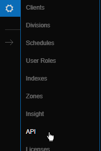
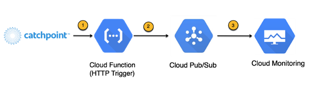
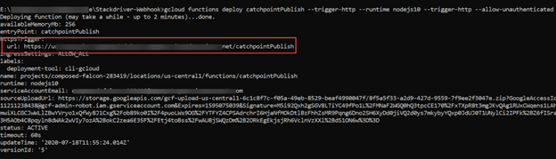
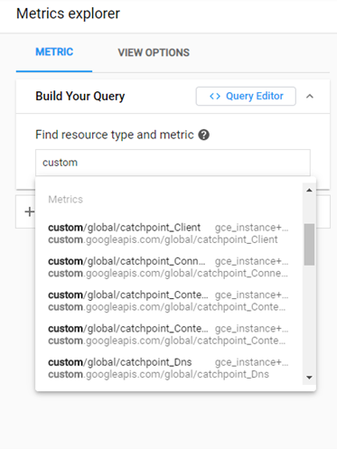

# Google Cloud Platform Network Performance Monitoring using Catchpoint

## Overview

Catchpoint digital experience monitoring tools provide instant insights into the performance of networks, apps, and digital services. Customers gain visibility with network telemetry metrics for ISPs, Cloud Endpoints, and Virtual Machine SaaS Endpoints. The data Catchpoint collects helps with diagnosing issues, reducing recovery times, enforcing SLAs, and general performance troubleshooting.

This guide outlines multiple approaches for ingesting Catchpoint data into Google Cloud Platform.

## Rework
- How to enable enhanced capabilities to leverage BigQuery for querying the large data set metrics
- How to realize the vision of a single pane for all network performance monitoring and analysis

## Catchpoint Supported Test Types

- Synthetic Monitoring from any location
  - Create transactional tests to replicate user workflows. This augments the passive [Real User Monitoring](https://en.wikipedia.org/wiki/Real_user_monitoring#:~:text=Real%20user%20monitoring%20(RUM)%20is,server%20or%20cloud%2Dbased%20application.&text=The%20data%20may%20also%20be,intended%20effect%20or%20cause%20errors).
- Network Layer Tests from any location
  - Layer 3 (traceroute, ping), Layer 4 (TCP, UDP), DNS and BGP.

For more information, please refer to the [Catchpoint Platform](https://www.catchpoint.com/platform) documentation.

---

This guide highlights two approaches to consuming Catchpoint test data within GCP:

- [Creating a GCP Data Ingestion Pipeline for Catchpoint Test data](#creating-a-gcp-data-ingestion-pipeline-for-catchpoint-test-data)
- [Catchpoint and Cloud Monitoring Integration](#catchpoint-and-cloud-monitoring-integration)

---

# Method 1: Creating a GCP Data Ingestion Pipeline for Catchpoint Test Data

## Pipeline Architecture


## Steps from Catchpoint to Grafana:

1. Catchpoint sends data via predefined webhook. The template is configured within the Catchpoint portal (see next section for more details.)
2. An HTTP webhook is set up in GCP using App Engine to ingest Catchpoint data. 
3. App Engine uses [Pub-Sub](https://cloud.google.com/pubsub) to propagate data to configured channels.
4. A [Dataflow](https://cloud.google.com/dataflow/) job listens to the Pub/Sub channel and inserts a BigQuery accessible dataset.
5. Data is sent to [BigQuery](https://cloud.google.com/bigquery) along with the Catchpoint schema.
6. Grafana's BigQuery plugin is used as a data source to visualize the data.

## Configuration Details

This section explains each configuration step in detail and provides example scripts. The configuration process consists of two main tasks:

1. [GCP Pipeline Setup](#gcp-pipeline-setup)
2. [Catchpoint Setup](#catchpoint-setup)

### GCP Pipeline Setup

Before App Engine deployment, a Pub/Sub topic must be created to receive and distribute data. Pub/Sub enables data to be ingested from one data source and streamed to another. For this tutorial, the Publisher topic hosts the data subject (push data) and the Subscriber to the topic forwards the data to a streaming service.

[How to create a Topic](https://cloud.google.com/pubsub/docs/quickstart-console#create_a_topic)

1. Create a Publisher topic
    

2. Create a Subscription to receive messages
    

#### Build a Webhook in GCP

A webhook (web-application) is needed to post data from vendors. The app listens on the defined URL and pushes the data to the Pub/Sub created in the previous step.

To create the `/cppush` testing webhook used in this example, use the **go** script in the GCS bucket [here](https://storage.googleapis.com/webhook-catchpoint/main.go).

Once downloaded, replace the following configuration variables with valid values:

```config
DefaultCloudProjectName: <your-project-id>
CatchpointTopicProd: <pub-sub-topic-name>
CatchpointPushURL: <URL> # in this example it is /cppush
```

[App Engine Deployment reference](https://cloud.google.com/appengine/docs/standard/go/building-app#deploying_your_web_service_on)

#### BigQuery dataset and data tables

Once the Pub/Sub topics are set up and data is flowing, BigQuery needs the data in order to run analytics. Before the pipeline can be created, the BigQuery table needs to be set up.

[How to create a BigQuery table](https://cloud.google.com/bigquery/docs/tables)


To create the main and dead_letter tables, refer to the documentation for the [main table](https://storage.cloud.google.com/netperf-bucket/CatchPoint%20-%20main%20table?cloudshell=true) and [dead_letter table](https://storage.cloud.google.com/netperf-bucket/Dead_Letter%20table?cloudshell=true).

#### Build an Ingestion Pipeline

In this example, Cloud DataFlow is used to input data. The DataFlow code can be found [here](https://github.com/pupamanyu/beam-pipelines/tree/master/perf-data-loader).

To match the Catchpoint test data schema, `metric.java` needs to be changed. A sample Catchpoint `metric.java` file can be found [here](https://storage.cloud.google.com/netperf-bucket/CatchPoint%20-%20metric.java).

Once `metric.java` is changed, the job is ready to be deployed.
_Note - This java build requires Java8. To switch to Java8 on cloud shell run this command:_

```sh
sudo update-java-alternatives \
  -s java-1.8.0-openjdk-amd64 && \
  export JAVA_HOME=/usr/lib/jvm/java-8-openjdk-amd64/jre
```

To build the Fat Jar, execute the following command from within the project root directory:

```sh
./gradlew clean && ./gradlew shadowJar
```

To run the pipeline, replace the variables in the following command with valid values, then execute it from within the project root directory:

```sh
cd build/libs && java -jar perf-data-loader-1.0.jar \
  --dataSet=<target-dataset> \
  --table=<target-table> \
  --deadLetterDataSet=<dead-letter-dataset> \
  --deadLetterTable=<dead-letter-table> \
  --runner=DataflowRunner \
  --project=<gcp-project-name> \
  --subscription=projects/<gcp-project-name>/subscriptions/<pub-sub-subscription> \
  --jobName=<pipeline-job-name>
```

To update the pipeline, replace the variables in the following command with valid values, then execute it from within the project root directory:

```sh
$ cd build/libs && java -jar perf-data-loader-1.0.jar \
  --dataSet=<target-dataset> \
  --table=<target-table> \
  --deadLetterDataSet=<dead-letter-dataset> \
  --deadLetterTable=<dead-letter-table> \
  --runner=DataflowRunner \
  --project=<gcp-project-name> \
  --subscription=projects/<gcp-project-name>/subscriptions/<pub-sub-subscription> \
  --jobName=<existing-pipeline-job-name>
  --update
```

##### A sample deployed job


#### Configure Grafana

Grafana is available in the Google Cloud Marketplace. A guide to deploying Grafana in your GCP project is available [here](https://console.cloud.google.com/marketplace/details/click-to-deploy-images/grafana).

Grafana offers a plugin for BigQuery as a data source. Step-by-step instructions for using the plugin can be found [here](https://grafana.com/grafana/plugins/doitintl-bigquery-datasource).

#### Sample Grafana dashboards


---

### Catchpoint setup

After the GCP ingestion pipeline is built, Catchpoint tests must be configured to post data to the GCP webhook.

#### Create a Catchpoint WebHook

1. Navigate to [Catchpoint API Detail](https://portal.catchpoint.com/ui/Content/Administration/ApiDetail.aspx). See [Catchpoint Webhook document](https://support.catchpoint.com/hc/en-us/articles/115005282906) for additional information.  


2. Select **Add Url** under **Test Data Webhook**  


    i. Under "URL" add the url for the webhook application created in the previous section  
    ii. Under "Format" select "Template Radio Button"  
    iii. Click "Select Template"  
    iv. Click "Add New"  
    

3. Provide a name and select "JSON" as the format.
    - See the [Test Data Webhook Macros](https://support.catchpoint.com/hc/en-us/articles/360008476571) for options
    - Sample JSON template containing recommended macros

    ```json
    {
        "TestName": "${TestName}",
        "TestURL": "${testurl}",
        "TimeStamp": "${timestamp}",
        "NodeName": "${nodeName}",
        "PacketLoss": "${pingpacketlosspct}",
        "RTTAvg": "${pingroundtriptimeavg}",
        "DNSTime": "${timingdns}", 
        "Connect": "${timingconnect}", 
        "SSL": "${timingssl}", 
        "SendTime": "${timingsend}",
        "WaitTime": "${timingwait}", 
        "Total": "${timingtotal}"
    }
    ```

4. Click "Save" at the bottom of the page.

---

# Method 2: Catchpoint and Cloud Monitoring Integration

Cloud Monitoring provides visibility into the performance, uptime, and overall health of applications. It collects metrics, events, and metadata from Google Cloud, Amazon Web Services, hosted uptime probes, application instrumentation, and a variety of common application components including Cassandra, Nginx, Apache Web Server, Elasticsearch, and many others. Operations ingests that data and generates insights via dashboards, charts, and alerts. Cloud Monitoring alerting supports collaboration through integrations with Slack, PagerDuty, and more.

This guide provides steps to configure data ingestion from Catchpoint into [Google Cloud Monitoring](https://cloud.google.com/monitoring)

## Simplified Data Ingestion Pipeline



## Configuration Steps

1. Create a new project in Google Console or reuse an existing project

2. Enable Monitoring API

3. Enable Cloud Functions

4. Set up GCP data pipeline

5. Set up Cloud Monitoring

6. Set up Catchpoint

7. Create Dashboards and Metric Explorer in Cloud Monitoring

## Configuration Details

### 1\. Create a new project in Google Console or reuse an existing project

Google Cloud projects form the basis for creating, enabling, and using all Google Cloud services including managing APIs, enabling billing, adding and removing collaborators, and managing permissions for Google Cloud resources. Refer to [Creating and managing projects | Resource Manager Documentation](https://cloud.google.com/resource-manager/docs/creating-managing-projects) for steps to create a new project.  
_The Project id is used to configure the Catchpoint Integration script._

### 2\. Enable Monitoring API  

The Monitoring API must be enabled and have authorized users. Follow the steps in [Enabling the Monitoring API | Cloud Monitoring](https://cloud.google.com/monitoring/api/enable-api) to enable and authorize use of the Monitoring API v3. The Monitoring API can be enabled using either the Cloud SDK or the Cloud console. Both these approaches have been explained in the referenced guide.

### 3\. Enable Cloud Functions  

Follow the steps in [Cloud Pub/Sub Tutorial | Cloud Functions Documentation](https://cloud.google.com/functions/docs/tutorials/pubsub) to enable the use of Cloud Functions and Cloud Pub/Sub APIs. This tutorial leverages Node.js. The referenced guide contains information to set up your development environment.

### 4\. Set up GCP data pipeline  

Clone the Catchpoint Stackdriver integration repository to your local machine from [here](https://github.com/catchpoint/Integrations.GoogleCloudMonitoring). In this example, we will be using the push model to ingest data from Catchpoint to Cloud Monitoring. The Stackdriver-Webhook folder has the required Node.js script to set up the ingestion of data and writing of data to Cloud monitoring.  
Update the GoogleProjectId to the Project Id above in the [.env file](https://github.com/catchpoint/Integrations.GoogleCloudMonitoring/blob/master/Stackdriver-Webhook/.env). Refer to [Using Environment Variables | Cloud Functions Documentation](https://cloud.google.com/functions/docs/env-var) for information on how to set up environment variables.

       `index.js` snippet to set the Google Project Id.  

        ```javascript
        'use strict';
        const monitoring = require('@google-cloud/monitoring');
        const { PubSub } = require('@google-cloud/pubsub');
        const path = require('path')
        const dotenv = require('dotenv')
        dotenv.config({ path: path.join(\_\_dirname, '.env') });
        const pubsub = new PubSub();
        const googleProjectId = process.env.GoogleProjectId;
        ```

### Create cloud functions to stream data to an ingestion pipeline

1. Open Google Cloud SDK Shell and navigate to the directory where the Node.js scripts were cloned.  
`cd <path to cloned directory>`

2. To set/change the project property in the core section, run:  
`gcloud config set project my-project`

3. Next, we will deploy two cloud functions to handle data injection from Catchpoint. We will be leveraging Pub/Sub, which is an asynchronous messaging service that decouples services that produce events from services that process events. Refer to [https://cloud.google.com/pubsub/docs/overview](https://cloud.google.com/pubsub/docs/overview) to learn more about how these functions are useful.

    In this integration, we are utilizing Catchpoint's ability to push data to a webhook.  This is the recommended approach for ingesting Catchpoint data into Cloud monitoring as it provides the flexibility to adapt to new metrics as they are introduced in Catchpoint, and ensures you get data from the Catchpoint platform in real time.  

     _**TIP:** Using Catchpoint REST APIs_

    _If you need to leverage the PULL model to integrate with Catchpoint, you can look at an example that leverages Catchpoint REST APIs in the Github repository_ [_here_](https://github.com/catchpoint/Integrations.GoogleCloudMonitoring)_. The catchpoint-rest-api.js contains code which leverages the Catchpoint Performance API to pull data from Catchpoint. If you use this approach, you can skip the Cloud Function setup and proceed to the Cloud Monitoring setup._

    A. HTTP triggers are used to invoke cloud functions with an HTTP request. Additional information is available [here](https://cloud.google.com/functions/docs/calling/http).  
    The publish function gets triggered by an HTTP POST from Catchpoint. This function then publishes to the topic specified while deploying the subscriber.  
    **The Publish function**  

        ```javascript
        /**
        Publishes a message to a Google Cloud Pub/Sub Topic.
        */

        exports.catchpointPublish = async (req, res) => {
            console.log(`Publishing message to topic ${topicName}.`);
            const pubsub = new PubSub();
            const topic = pubsub.topic(topicName);
            const data = JSON.stringify(req.body);
            const message = Buffer.from(data, 'utf8');

            try {
                await topic.publish(message);
                res.status(200).send(`Message published to topic ${topicName}.`);
            } catch (err) {
                console.error(err);
                res.status(500).send(err);
                return Promise.reject(err);
            }
        };
        ```

        **Deploy Publish function**

        1. Run the following command:  

        ```sh
        gcloud functions deploy catchpointPublish \
            --trigger-http \
            --runtime nodejs10 \
            --trigger-http \
            --allow-unauthenticated
        ```

        2. Copy the URL after the deployment is successful. This is needed to set up the Catchpoint Webhook in Step 6.1:

        

    B. Pub/Sub Trigger  
    A Cloud Function can be triggered by messages published to [Pub/Sub topics](https://cloud.google.com/pubsub/docs) in the same Cloud project as the function. More information on calling Pub/Sub Topics is available [here](https://cloud.google.com/functions/docs/calling/pubsub).  

        **The Subscribe function**

        The subscribe function subscribes to the topic we are publishing the Catchpoint data to, and then feeds it to Stackdriver.

        ```javascript
        /*
        Triggered from a message on Google Cloud Pub/Sub topic.
        */

        exports.catchpointSubscribe = (message) => {
            const data = Buffer.from(message.data, 'base64').toString();
            const catchpointData = JSON.parse(data);
            postToGoogleMonitoring(catchpointData);
        };
        ```

        **Deploy Subscribe function**

        1. Run the following command:  
        _Note: Either create the topic separately before deploying or specify it directly while deploying. If the topic is not already created, this command automatically creates a new topic._  

        ```sh
        gcloud functions deploy catchpointSubscribe
            --trigger-topic catchpoint-webhook
            --runtime nodejs10
            --allow-unauthenticated
        ```

        

        2. Set the TopicName environment variable using the same topic name you used to deploy the Subscribe function. Update the TopicName variable in the .env file at [https://github.com/catchpoint/Integrations.GoogleCloudMonitoring/blob/master/Stackdriver-Webhook/.env](https://github.com/catchpoint/Integrations.GoogleCloudMonitoring/blob/master/Stackdriver-Webhook/.env). Refer to [https://cloud.google.com/functions/docs/env-var](https://cloud.google.com/functions/docs/env-var) for information on how to set up environment variables.  

        ```sh
        gcloud pubsub topics create <topic-name>
        ```

        The topic will be referenced in `index.js` as below

        ```javascript
        const topicName = process.env.TopicName;
        ```

4. Set up Cloud Monitoring:  

To use Cloud Monitoring, you must have a Google Cloud project with billing enabled. The project must also be associated with a Workspace. Cloud Monitoring uses Workspaces to organize monitored Google Cloud projects.

In the Google Cloud Console, go to Monitoring -> Overview. This will create a workspace for you automatically.


We will be using the Monitoring Client Libraries to write data to Cloud Monitoring in index.js. Please refer to [Monitoring Client Libraries | Cloud Monitoring](https://cloud.google.com/monitoring/docs/reference/libraries) for instructions on installing the client library and setting up authentication. You must complete this before leveraging them in the Node.js script.

The postToGoogleMonitoring function in index.js parses the data posted from Catchpoint, constructs a timeseries object, and writes this data to Cloud Monitoring.

Catchpoint gives you the ability to collect end-user performance data from their probes deployed in multiple Countries, Cities and ISPs across the globe. Consider a Catchpoint monitor that monitors a webpage: Catchpoint collects metrics like DNS, Connect, SSL, Wait(TTFB), Load, Time To Interactive(TTI), First Paint, and many others, enabling you to triangulate issues. For example, suppose the Time to Interactive (TTI) for a page has suddenly increased. The other metrics would help you determine whether DNS or the network is causing the issue.

In order to provide the benefit of correlation, the function posts all of Catchpoint's key metrics to Cloud Monitoring. Since Catchpoint metrics are not predefined in GCP, we take advantage of GCP's "custom metrics" feature. Refer to [Creating custom metrics | Cloud Monitoring](https://cloud.google.com/monitoring/custom-metrics/creating-metrics)for more information on this.

If the metric name in Catchpoint is "DNS", we create a custom metric called "catchpoint_DNS" in Cloud Monitoring.

The below snippet of code parses Catchpoint data and constructs a timeseries object:

```javascript
for (var i = 0; i < metrics.length; i++) {
    let metricValue = response.Summary.Timing[metrics[i]];
    let dataPoint = parseDataPoint(metricValue);
    let metric = 'catchpoint\_' + metrics[i];
    
    timeSeriesData[i] = parseTimeSeriesData(metric, dataPoint, testId, nodeName);
}
```

To ensure that each data point remains associated with its original Location and Monitor ID in Catchpoint, we specify these values as labels.

Below is the snippet of code that shows the construction of the time series data:

```javascript
function parseTimeSeriesData(metric, dataPoint, testId, nodeName) {
    const timeSeriesData = {
        metric: {
            type: 'custom.googleapis.com/global/' + metric,
            labels: {
                Test_id: testId,
                Node: nodeName
            },
        },
        resource: {
            type: 'global',
            labels: {
                project_id: googleProjectId,
            },
        },
        points: [dataPoint]
    };

    return timeSeriesData;
}
```

Finally, we use the `writeRequest` function to write the time series data into Cloud Monitoring. Below is the snippet of code that writes the data:

```javascript
const client = new monitoring.MetricServiceClient();
const writeRequest = {
    name: client.projectPath(googleProjectId),
    timeSeries: timeSeriesData
};
```

### 6\. Set up Catchpoint:

Go to Settings -> API in Catchpoint


Under Test Data Webhook, click on "Add Url". Enter the Webhook Url you got after deploying the publish function from Step 4.3.A in the URL section.


You can leverage the default JSON payload posted by Catchpoint or create a template with specific metrics similar to the BigQuery integration example.

### 7\. Create Dashboards and Metric Explorer in Cloud Monitoring

Once all the above pieces are set up and the data starts flowing into Cloud Monitoring, you have the ability to use Metric Explorer to perform analysis and also create Dashboards.

To view the metrics for a monitored resource using Metrics Explorer, do the following:

i. In the Google Cloud Console, go to Monitoring  
   [Google Cloud Platform](https://console.cloud.google.com/monitoring)

ii. In the Monitoring navigation pane, click on Metrics Explorer.

iii. Enter the monitored resource name in the Find resource type and metric text box.

  

iv. Metrics explorer also allows to filter data points using the labels node name or test id.


v. Add all the required metrics and optionally save the chart to a dashboard. 
   [Metrics Explorer | Cloud Monitoring](https://cloud.google.com/monitoring/charts/metrics-explorer)

vi. Navigate to Monitoring->Dashboards to check out the metrics. Here is a sample Dashboard that shows Catchpoint data in Cloud Monitoring –


While creating the charts, you have the ability to choose different visualizations and also select the required statistical aggregation. In the Dashboard above, we are looking at 95p.

Refer to [Creating charts | Cloud Monitoring](https://cloud.google.com/monitoring/charts) for more information on creating charts and Dashboards.
