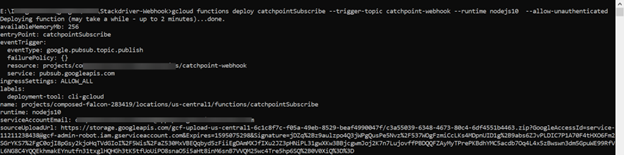

# GCP Network Performance Monitoring using Catchpoint

## Overview

Catchpoint is a monitoring tool to provide instant insight into the digital experience of performance of all networks, apps, and digital services. Customers will gain visibility into network telemetry metrics from ISP to Cloud Endpoints(Urls, IP-endpoints) and from VM to SaaS Endpoints. This data will aid with troubleshooting by diagnosing performance issues, and provide customers and internal teams to define service SLAs.

This guide walks through multiple approaches for ingesting Catchpoint data into GCP as it :

- enables enhanced capabilities such as leveraging BigQuery for querying the large data set metrics
- realizing the end vision of having a single pane for all network performance monitoring and analysis

## Catchpoint Test Types

The different types of test that Catchpoint supports are:

- Synthetic Monitoring from any location : Create transactional user-tests to replicate active [RUM](<https://en.wikipedia.org/wiki/Real_user_monitoring#:~:text=Real%20user%20monitoring%20(RUM)%20is,server%20or%20cloud%2Dbased%20application.&text=The%20data%20may%20also%20be,intended%20effect%20or%20cause%20errors.>)
- Network Layer Tests from any location: Layer 3(traceroute,ping), Layer 4(TCP,UDP), DNS and BGP

For more information, please refer [here](https://www.catchpoint.com/platform). Once the relevant tests have been created, this guide highlights two approaches to consume the Catchpoint test data within GCP:

1. [Creating a GCP Data Ingestion Pipeline for Catchpoint Test data](https://docs.google.com/document/d/1KuIc-A45aFJ3eK-Rm46nyf_bsR_TvPD2MhXU9Qd_Z_U/edit?ts=600b384e#heading=h.96l8hfgcpy6x)
2. [Catchpoint and Cloud Monitoring Integration](https://docs.google.com/document/d/1KuIc-A45aFJ3eK-Rm46nyf_bsR_TvPD2MhXU9Qd_Z_U/edit?ts=600b384e#heading=h.p33702x5820f)

## Creating a GCP Data Ingestion Pipeline for Catchpoint Test Data

Pipeline Architecture

The below diagram highlights the end-to-end data ingestion pipeline within GCP :


In the above pipeline

- Catchpoint sends the data to a webhook i.e Push Model. The push template is configured within the catchpoint portal(will be explained in the next section)
- Webhook runs in GCP using App Engine.
- App Engine sends the received stream data to [Pub-Sub](https://cloud.google.com/pubsub) task
- [Dataflow](https://cloud.google.com/dataflow/?utm_source=google&utm_medium=cpc&utm_campaign=na-US-all-en-dr-skws-all-all-trial-e-dr-1009135&utm_content=text-ad-none-any-DEV_c-CRE_340589866253-ADGP_Hybrid+%7C+AW+SEM+%7C+SKWS+%7C+US+%7C+en+%7C+EXA+~+Storage+%26+Database+~+Dataflow+~+Cloud+Dataflow-KWID_43700042346838980-kwd-528052584691&utm_term=KW_cloud%20dataflow-ST_Cloud+Dataflow&gclid=Cj0KCQjwpNr4BRDYARIsAADIx9xd5hGvM-WMMYsYtsENYQry2cg0KycRgChB-Xtb1RZ_o08XnRdM6ToaAi-sEALw_wcB) job that listens to the Pub/Sub will parse the data in JSON format and insert the data to BigQuery dataset
- The processed data is finally sent to [BigQuery](https://cloud.google.com/bigquery/?utm_source=google&utm_medium=cpc&utm_campaign=na-US-all-en-dr-bkws-all-all-trial-b-dr-1009135&utm_content=text-ad-none-any-DEV_c-CRE_235570504981-ADGP_Hybrid+%7C+AW+SEM+%7C+BKWS+%7C+US+%7C+en+%7C+Multi+~+BigQuery-KWID_43700032622217098-aud-388092989001:kwd-69378810644&gclid=Cj0KCQjwpNr4BRDYARIsAADIx9w7m64nmbxvAVLJWIqqn3X6tg5DqpK8jdGPQ9TGf6Uo_xMa3ekFXBkaAvIQEALw_wcB) with the Catchpoint Schema.
- Grafana(running on GCP VM) uses BigQuery as the data source to visualize the data. Grafana has a BQ plugin.

Configuration Details

In this section we'll explain each configuration step in detail. We will also provide links for explanations on how to set up each component and those scripts that are used in the examples. The configuration details has two main tasks:

- [GCP Pipeline Setup](https://docs.google.com/document/d/1KuIc-A45aFJ3eK-Rm46nyf_bsR_TvPD2MhXU9Qd_Z_U/edit?ts=600b384e#heading=h.ytup525q5dqj)
- [Creating the Catchpoint Setup](https://docs.google.com/document/d/1KuIc-A45aFJ3eK-Rm46nyf_bsR_TvPD2MhXU9Qd_Z_U/edit?ts=600b384e#heading=h.xpxkt04y4bh4)

1. GCP pipeline setup

1. Creating pub-sub topics to stream data to an ingestion pipeline

Before we deploy our application in App Engine, we need to create a Pub/Sub topic to receive and distribute data. Pub-sub enables data to be streamed to the final data source. Pub topic will host the data subject(receive data) and the sub that subscribes to the pub topic will forward data to streaming service

(Reference to create a Topic: [https://cloud.google.com/pubsub/docs/quickstart-console#create_a_topic](https://cloud.google.com/pubsub/docs/quickstart-console#create_a_topic))

Create a Pub topic:


Create a subscription to receive messages sent to above topic(settings as follows) :


1. Building a Webhook in GCP

We need to build a webhook (web-application) for vendors to post data. The app will listen on the /URL you defined and is used to push the data out to a Pub/Sub created in the above step.

You can find the go script in the GCS bucket [here](https://storage.googleapis.com/webhook-catchpoint/main.go) to create the /cppush testing webhook we used in this example for Catchpoint. You would have to make changes to the variable-values in the go-script. The important ones are :

DefaultCloudProjectName : <your-project-id>

CatchpointTopicProd : <your pub-sub topic name>

CatchpointPushURL : < URL> , in this example it is /cppush

For reference on how do deploy an app engine app:

[https://cloud.google.com/appengine/docs/standard/go/building-app#deploying_your_web_service_on](https://cloud.google.com/appengine/docs/standard/go/building-app#deploying_your_web_service_on)

1. Create BigQuery dataset and data tables

Now that we have our data flowing into Pub/Sub, we need to move that data to BigQuery, so that we can run some analytics on the data. We need to create the BigQuery table before we can create the pipeline.

Please refer to this link on how to create a BigQuery table: [https://cloud.google.com/bigquery/docs/tables](https://cloud.google.com/bigquery/docs/tables)

Create a BigQuery dataset in your project:


You can find the sample scripts to create your main table [here](https://storage.cloud.google.com/netperf-bucket/CatchPoint%20-%20main%20table?cloudshell=true) and dead_letter table [here](https://storage.cloud.google.com/netperf-bucket/Dead_Letter%20table?cloudshell=true).

1. Building an Ingestion Pipeline

We will be using Cloud DataFlow to input data. The DataFlow code can be found [here](https://github.com/pupamanyu/beam-pipelines/tree/master/perf-data-loader).

Metric.java needs to be changed based on the test data format we receive from CatchPoint. You can find a sample of CatchPoint metric.java file [here](https://storage.cloud.google.com/netperf-bucket/CatchPoint%20-%20metric.java?cloudshell=true).

Once you created the metric.java file, you can build and deploy the job:

Note: This java build requires Java8. To switch to Java8 on cloud shell run the command below:

sudo update-java-alternatives -s java-1.8.0-openjdk-amd64 &amp;&amp; export JAVA_HOME=/usr/lib/jvm/java-8-openjdk-amd64/jre

=> To Build the Fat Jar, execute the below command from within the project root directory

$ ./gradlew clean &amp;&amp; ./gradlew shadowJar

=> To run the pipeline, execute the below command from within the project root directory

$ cd build/libs &amp;&amp; java -jar perf-data-loader-1.0.jar \

     --dataSet=<Target DataSet>  \

     --table=<Target Table> \

     --deadLetterDataSet=<Dead Letter DataSet> \

     --deadLetterTable=<Dead Letter Table> \

     --runner=DataflowRunner \

     --project=<GCP Project Name>\

     --subscription=projects/<GCP Project Name>/subscriptions/<PubSub Subscription> \

     --jobName=<Pipeline Job Name>

=> To update the pipeline, execute the below command from within the project root directory

$ cd build/libs &amp;&amp; java -jar perf-data-loader-1.0.jar \

     --dataSet=<Target DataSet>  \

     --table=<Target Table> \

     --deadLetterDataSet=<Dead Letter DataSet> \

     --deadLetterTable=<Dead Letter Table> \

     --runner=DataflowRunner \

     --project=<GCP Project Name>\

     --subscription=projects/<GCP Project Name>/subscriptions/<PubSub Subscription> \

     --jobName=<Existing Pipeline Job Name> \

     --update

A sample deployed job will be like this:


1. Configuring Grafana

Grafana is available in the GCP market place. You can deploy Grafana in your GCP project using [this](https://console.cloud.google.com/marketplace/details/click-to-deploy-images/grafana?filter=category%3Amonitoring&id=7f529a97-13af-4bcd-8050-3c5a63369d33&authuser) link.

Grafana offers a plugin for BigQuery as a data source. You can find step by step instructions [here](https://grafana.com/grafana/plugins/doitintl-bigquery-datasource).

Below are some examples of Grafana dashboard displays:


1. Catchpoint setup

Now we have the GCP ingestion pipeline built, we need to make the CatchPoint tests to post data to the GCP webhook.

Follow these steps to create a webhook on CatchPoint portal:

- On the [Catchpoint dashboard](https://portal.catchpoint.com/), select the &quot;GEAR&quot; icon from the left menu bar.

Select the &quot;API&quot; Option. See [Catchpoint Webhook document](https://support.catchpoint.com/hc/en-us/articles/115005282906) for additional information.


- Select &quot;Add Url&quot; under &quot;Test Data Webhook&quot;


- Under &quot;URL&quot; add the url for the webhook application created in the previous section
- Under &quot;Format&quot; select &quot;Template Radio Button&quot;
- Click &quot;Select Template&quot;
- Click &quot;Add New&quot;


- Provide a name and select &quot;JSON&quot; as the format.
- Here is an example of a JSON formatted template with some recommended macros

| { &quot;TestName&quot;: &quot;${TestName}&quot;, &quot;TestURL&quot;: &quot;${testurl}&quot;, &quot;TimeStamp&quot;: &quot;${timestamp}&quot;, &quot;NodeName&quot;: &quot;${nodeName}&quot;, &quot;PacketLoss&quot;: &quot;${pingpacketlosspct}&quot;, &quot;RTTAvg&quot;: &quot;${pingroundtriptimeavg}&quot;, &quot;DNSTime&quot;: &quot;${timingdns}&quot;, &quot;Connect&quot;: &quot;${timingconnect}&quot;, &quot;SSL&quot;: &quot;${timingssl}&quot;, &quot;SendTime&quot;: &quot;${timingsend}&quot;, &quot;WaitTime&quot;: &quot;${timingwait}&quot;, &quot;Total&quot;: &quot;${timingtotal}&quot;} |
| -------------------------------------------------------------------------------------------------------------------------------------------------------------------------------------------------------------------------------------------------------------------------------------------------------------------------------------------------------------------------------------------------------------------------------------------------------------------------------------------------------------------------------------------------------------------------------------------------------------- |

- See [https://support.catchpoint.com/hc/en-us/articles/360008476571](https://support.catchpoint.com/hc/en-us/articles/360008476571) for additional information and options
- Click &quot;Save&quot; at the bottom of the page.

## Catchpoint and Cloud Monitoring Integration

Cloud Monitoring provides visibility into the performance, uptime, and overall health of applications. It collects metrics, events, and metadata from Google Cloud, Amazon Web Services, hosted uptime probes, application instrumentation, and a variety of common application components including Cassandra, Nginx, Apache Web Server, Elasticsearch, and many others. Operations ingests that data and generates insights via dashboards, charts, and alerts. Cloud Monitoring alerting helps you collaborate by integrating with Slack, PagerDuty, and more.

We will be looking at ingesting data from Catchpoint into Cloud Monitoring.

[https://cloud.google.com/monitoring](https://cloud.google.com/monitoring)

Data Ingestion Pipeline


Configuration Steps

1. Create a new project in Google Console or reuse an existing project

1. Enable Monitoring API

1. Enable Cloud Functions

1. GCP data pipeline setup

1. Cloud Monitoring set up

1. Catchpoint set up

1. Create Dashboards and Metric Explorer in Cloud Monitoring

Configuration Details

1. Create a new project in Google Console or reuse an existing project

Google Cloud projects form the basis for creating, enabling, and using all Google Cloud services including managing APIs, enabling billing, adding and removing collaborators, and managing permissions for Google Cloud resources.

Refer to [Creating and managing projects | Resource Manager Documentation](https://cloud.google.com/resource-manager/docs/creating-managing-projects) for steps to create a new project.

Keep the Project ID handy as we will be using it later in the node JS script which has the integration logic.

1. Enable Monitoring API

Before you can use the Monitoring API, you must enable it and authorize users to access it.

Follow the steps in [Enabling the Monitoring API | Cloud Monitoring](https://cloud.google.com/monitoring/api/enable-api) to enable and authorize use of the Monitoring API v3.

You can enable monitoring API either using the Cloud SDK or within the Cloud console. Both these approaches have been explained in the referenced guide.

1. Enable Cloud Functions

Follow the steps in [Cloud Pub/Sub Tutorial | Cloud Functions Documentation](https://cloud.google.com/functions/docs/tutorials/pubsub) to enable the use of Cloud Functions and Cloud Pub/Sub APIs. The referenced guide also helps you set up your development environment.

In this implementation, we will be leveraging Node.js.

1. GCP data pipeline setup

1. Clone the Catchpoint Stackdriver integration repository to your local machine from [**here**](https://github.com/catchpoint/Integrations.GoogleCloudMonitoring). In this example, we will be using the push model to ingest data from Catchpoint to Cloud Monitoring. The Stackdriver-Webhook folder has the required Node.js script to set up the ingestion of data and writing of data to Cloud monitoring.

Set the GoogleProjectId environment variable by using the ID from step1. Update the GoogleProjectId variable in the .env file at [https://github.com/catchpoint/Integrations.GoogleCloudMonitoring/blob/master/Stackdriver-Webhook/.env](https://github.com/catchpoint/Integrations.GoogleCloudMonitoring/blob/master/Stackdriver-Webhook/.env). Refer to [Using Environment Variables | Cloud Functions Documentation](https://cloud.google.com/functions/docs/env-var) for information on how to set up environment variables.

We will be referencing this in the index.js file as below –

```javascript
'use strict';

const monitoring = require('@google-cloud/monitoring');

const { PubSub } = require('@google-cloud/pubsub');

const path = require('path')

const dotenv = require('dotenv')

dotenv.config({ path: path.join(\_\_dirname, '.env') });

const pubsub = new PubSub();

const googleProjectId = process.env.GoogleProjectId;
```

    1. Creating cloud functions to stream data to an ingestion pipeline

    1. Open Google Cloud SDK Shell and navigate to the directory where the Node.js scripts were cloned -

    cd <path to cloned directory>

1. To set/change the project property in the core section, run:  
   `gcloud config set project my-project`

1. Next, we will deploy two cloud functions to handle data injection from Catchpoint. We will be leveraging Pub/Sub, an asynchronous messaging service that decouples services that produce events from services that process events. Refer to [https://cloud.google.com/pubsub/docs/overview](https://cloud.google.com/pubsub/docs/overview) for understanding more about how these functions are useful.

In this integration, we are using Catchpoint's ability to push data to a webhook.  This is the recommended approach for ingesting Catchpoint data into Cloud monitoring as it gives you the flexibility of adapting to new metrics being added on Catchpoint side and also ensure you get data in real time from the Catchpoint platform.

__***TIP: Using Catchpoint REST APIs***__

_In case you need to leverage the PULL model to integrate with Catchpoint, you can look at the example that leverages Catchpoint REST APIs in the Github repository_ [_here_](https://github.com/catchpoint/Integrations.GoogleCloudMonitoring)_. The catchpoint-rest-api.js has the code to leverage the Catchpoint performance API to pull data from Catchpoint. If you use this approach, you can skip the cloud function step up and go over to the Cloud Monitoring Set Up._

1. HTTP trigger

HTTP triggers are used to invoke cloud functions with a HTTP request. More on this - [https://cloud.google.com/functions/docs/calling/http](https://cloud.google.com/functions/docs/calling/http)

The pub function gets triggered by a HTTP POST from Catchpoint. This function then publishes to the topic specified while deploying the subscriber (refer to step b.)

Below is the snippet of the Publish function

```javascript
/**
Publishes a message to a Google Cloud Pub/Sub Topic.
*/

exports.catchpointPublish = async (req, res) => {
    console.log(`Publishing message to topic ${topicName}.`);
    const pubsub = new PubSub();
    const topic = pubsub.topic(topicName);
    const data = JSON.stringify(req.body);
    const message = Buffer.from(data, 'utf8');

    try {
        await topic.publish(message);
        res.status(200).send(`Message published to topic ${topicName}.`);
    } catch (err) {
        console.error(err);
        res.status(500).send(err);
        return Promise.reject(err);
    }
};
```

**Deploy publish function:**

Run the below command

```sh
gcloud functions deploy catchpointPublish
  --trigger-http  
  --runtime nodejs10
  --trigger-http 
  --allow-unauthenticated
```

Copy the URL after the deploy is successful. You will need this to set up the webhook in Catchpoint in Step 6.1.


1. Pub/Sub Trigger

Cloud Functions can be triggered by messages published to [Pub/Sub topics](https://cloud.google.com/pubsub/docs) in the same Cloud project as the function. More on this here - [https://cloud.google.com/functions/docs/calling/pubsub](https://cloud.google.com/functions/docs/calling/pubsub)

The subscriber function subscribers to the topic to which we publish the Catchpoint data. It then feeds it to Stackdriver.

Below is the snippet of the Subscribe function

```javascript
/*
Triggered from a message on Google Cloud Pub/Sub topic.
*/

exports.catchpointSubscribe = (message) => {
    const data = Buffer.from(message.data, 'base64').toString();
    const catchpointData = JSON.parse(data);
    postToGoogleMonitoring(catchpointData);
};
```

**Deploy Subscribe function:**

Run the below command -

```sh
gcloud functions deploy catchpointSubscribe
  --trigger-topic catchpoint-webhook
  --runtime nodejs10
  --allow-unauthenticated
```



Note: You can either create the topic separately before deploying as below or alternatively specify it directly while deploying. If the topic is not created, the above command automatically creates a new topic.

```sh
gcloud pubsub topics create _ **MY_TOPIC** _
```

1. Set the TopicName environment variable using the same topic name you used to deploy the Subscribe function. Update the TopicName variable in the .env file at [https://github.com/catchpoint/Integrations.GoogleCloudMonitoring/blob/master/Stackdriver-Webhook/.env](https://github.com/catchpoint/Integrations.GoogleCloudMonitoring/blob/master/Stackdriver-Webhook/.env). Refer to [https://cloud.google.com/functions/docs/env-var](https://cloud.google.com/functions/docs/env-var) for information on how to set up environment variables.

We will be referencing this in the index.js file as below

```javascript
const topicName = process.env.TopicName;
```

1. Cloud Monitoring set up

To use Cloud Monitoring, you must have a Google Cloud project with billing enabled. The project must also be associated with a Workspace. Cloud Monitoring uses Workspaces to organize monitored Google Cloud projects.

In the Google Cloud Console, go to Monitoring -> Overview. This will create a workspace for you automatically for the first time.


We will be using the Monitoring Client Libraries to write data to Cloud Monitoring in index.js. Please refer to [Monitoring Client Libraries | Cloud Monitoring](https://cloud.google.com/monitoring/docs/reference/libraries) for instructions on installing the client library and setting up authentication. You must complete this before leveraging them in the Node.js script.

The postToGoogleMonitoring function in index.js handles parsing of the data posted from Catchpoint, constructs a timeseries object and writes this data to Cloud Monitoring.

Catchpoint gives you the ability to collect end user performance data from their probes deployed in multiple Countries, Cities and ISPs across the globe. Consider a Catchpoint monitor that monitors a webpage. Catchpoint collects metrics like DNS, Connect, SSL, Wait(TTFB), Load , Time To Interactive(TTI), First Paint and many more. These metrics help you triangulate issues. For example, let's say the Time to Interactive (TTI) for a page increased, the additional metrics help you understand whether it is the DNS or the network causing the issue.

We wanted to have the benefit of correlation and posted all the key metrics from Catchpoint to Cloud Monitoring. Since Catchpoint metrics are not predefined in GCP, we are using the concept of custom metrics. Refer to [Creating custom metrics | Cloud Monitoring](https://cloud.google.com/monitoring/custom-metrics/creating-metrics)for more information on this.

If the metric name is DNS in Catchpoint, we are creating a custom metric called catchpoint_DNS in Cloud Monitoring.

The below snippet of code parses Catchpoint data and constructs a timeseries object

```javascript
for (var i = 0; i < metrics.length; i++) {
    let metricValue = response.Summary.Timing[metrics[i]];
    let dataPoint = parseDataPoint(metricValue);
    let metric = 'catchpoint\_' + metrics[i];
    
    timeSeriesData[i] = parseTimeSeriesData(metric, dataPoint, testId, nodeName);
}
```

We wanted to ensure that each data point is associated with the prober location and monitor ID in Catchpoint. These are specified as labels.

Below is the snippet of code that shows the construction of the time series data –

```javascript
function parseTimeSeriesData(metric, dataPoint, testId, nodeName) {
    const timeSeriesData = {
        metric: {
            type: 'custom.googleapis.com/global/' + metric,
            labels: {
                Test_id: testId,
                Node: nodeName
            },
        },
        resource: {
            type: 'global',
            labels: {
                project_id: googleProjectId,
            },
        },
        points: [dataPoint]
    };

    return timeSeriesData;
}
```

Finally, we use the `writeRequest` function to write the time series data into Cloud Monitoring. Below is the snippet of code that writes the data -

```javascript
const client = new monitoring.MetricServiceClient();
const writeRequest = {
    name: client.projectPath(googleProjectId),
    timeSeries: timeSeriesData
};
```

1. Catchpoint setup

1. Webhook set up:

Go to Settings -> API in Catchpoint


Under Test Data Webhook, click on Add Url. Enter the Webhook Url you got after deploying the publish function from Step 4.3.a in the URL section.


You can leverage the default JSON payload posted by Catchpoint or create a template with specific metrics similar to the BigQuery integration example.

1. Dashboards and Metric Explorer in Cloud Monitoring

Once all the above pieces are set up and the data starts flowing into Cloud Monitoring, you have the ability to use Metric Explorer to perform analysis and also create Dashboards.

To view the metrics for a monitored resource using Metrics Explorer, do the following:

1. In the Google Cloud Console, go to Monitoring  
   [Google Cloud Platform](https://console.cloud.google.com/monitoring)

1. In the Monitoring navigation pane, click on Metrics Explorer.

1. Enter the monitored resource name in the Find resource type and metric text box.

  

1. Metrics explorer also allows to filter data points using the labels node name or test id.


1. Add all the required metrics and optionally save the chart to a dashboard. 
   [Metrics Explorer | Cloud Monitoring](https://cloud.google.com/monitoring/charts/metrics-explorer)

1. Navigate to Monitoring->Dashboards to check out the metrics. Here is a sample Dashboard that shows Catchpoint data in Cloud Monitoring –


While creating the charts, you have the ability to choose different visualizations and also select the required statistical aggregation. In the Dashboard above, we are looking at 95p.

Refer to [Creating charts | Cloud Monitoring](https://cloud.google.com/monitoring/charts) for more information on creating charts and Dashboards.
