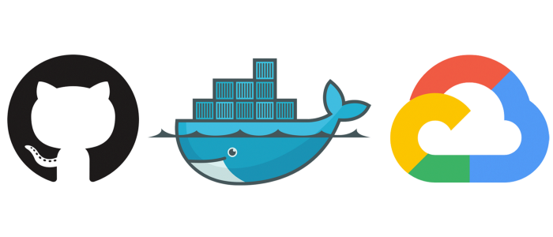
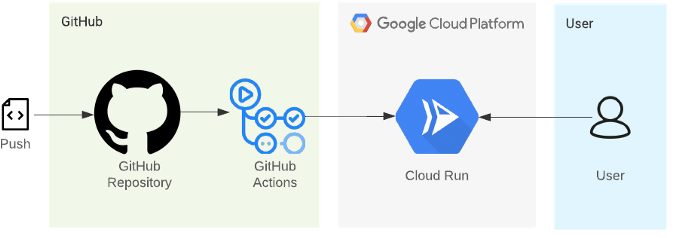
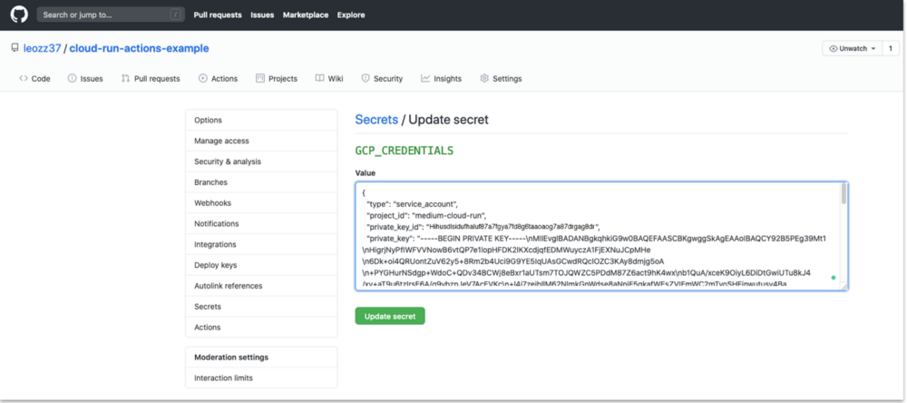
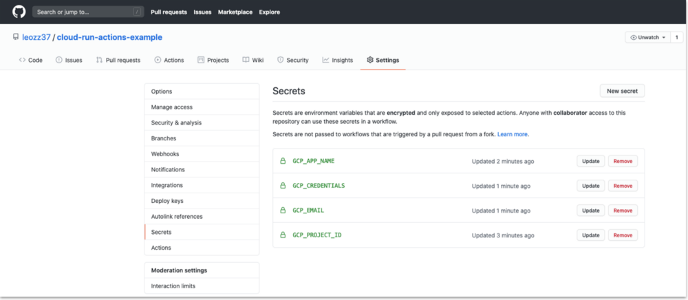
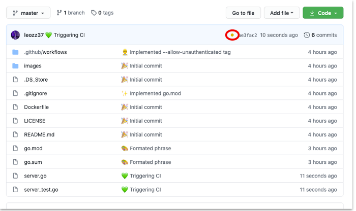
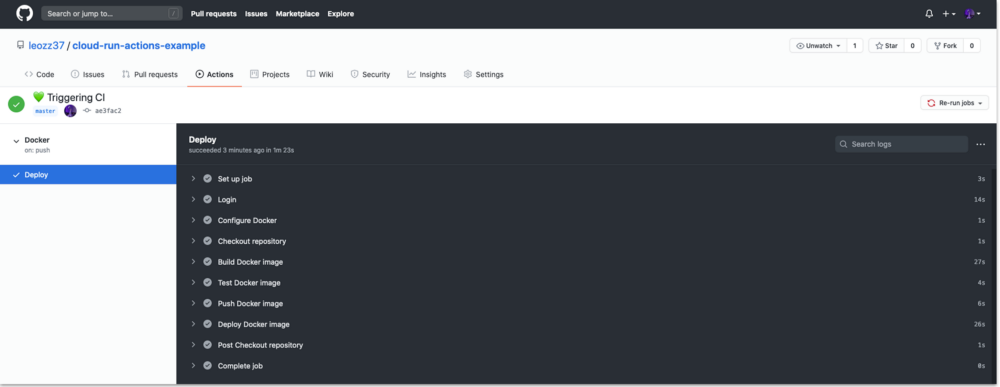
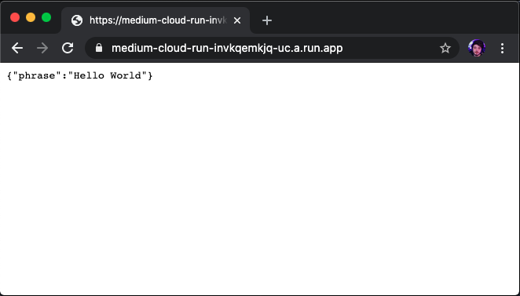

In this article, we will be setting up step by step an environment for automated building, testing, and deployment, using Docker and Google Cloud Run.

## Objectives

*   Create a simple REST API with Golang.
*   Write a unit test for our code.
*   Create a Dockerfile.
*   Create a GitHub Action workflow yml file to deploy our code on Cloud Run.
*   Make it acessible for anyone.

## Costs

This tutorial uses billable components of Google Cloud, including the following:

*   [Cloud Run](https://cloud.google.com/run)
*   [Cloud Storage](https://cloud.google.com/storage)

This tutorial should not generate any usage that would not be covered by the [free tier](https://cloud.google.com/free/), but you can use the [Pricing Calculator](https://cloud.google.com/products/calculator/) to generate a cost estimate based on your projected production usage.

## Before you begin

This tutorial assumes that you're using an Unix operating system.

I’ll use the [Google Cloud CLI](https://cloud.google.com/sdk/install) to set up our environment but feel free to use the web console.

## Getting started



Since we are talking Docker, the language you are using it's not important, but in this tutorial, I will be using Golang. Furthermore, I won’t go into deep explanation of the sample code and its Dockerfile, since it’s the same idea for any technology.

First, let’s take a look into our infrastructure:



Every time we push to our GitHub repository, it will trigger a GitHub Actions Workflow, that will build and test our code. If it builds and every test passes, our container will be deployed to Cloud Run, making it accessible to everyone.

I created a [repository](https://github.com/leozz37/cloud-run-actions-example) with all the code used here, make sure to check it out (and follow me on GitHub!).

This is how our work tree will look like:

```txt
|_.github/
  |_workflows/
    |_GCP-Deploy.yml
|_Dockerfile
|_go.mod
|_server_test.go
|_server.go
```

So let’s get our hands dirty!

### Golang

Let’s write a simple Golang code and a test for it. Since what our application does, doesn’t matter (for this tutorial), let’s use a simple example that returns a JSON with a "Hello World".

```golang
package main

import (
	"encoding/json"
	"log"
	"net/http"
	"os"

	"github.com/gorilla/mux"
)

type Phrase struct {
	Text string `json:"phrase"`
}

func HelloWorld() Phrase {
	return Phrase{
		Text: "Hello world",
	}
}

func GetPhrase(w http.ResponseWriter, r *http.Request) {
	json.NewEncoder(w).Encode(HelloWorld())
}

func main() {
	router := mux.NewRouter()
	router.HandleFunc("/", GetPhrase).Methods("GET")

	port := os.Getenv("PORT")
	log.Print("Started API on port: " + port)
	log.Fatal(http.ListenAndServe(":"+port, router))
}
```

And a unit test for the Hello World function, that verifies if the function is returning a “Hello World” string.

```golang
package main

import (
	"testing"
)

func TestHelloWorld(t *testing.T) {
	var expected Phrase

	expected.Text = "Hello world"
	result := HelloWorld()

	if expected.Text != result.Text {
		t.Errorf("Phrase was incorrect, got: %s, want: %s.", result.Text, expected.Text)
	}
}
```

Golang needs a module file, telling all the code dependencies. Create a GitHub repository (but don't push your code yet), copy its URL and run the following command:

```bash
$ go mod init $"YOUR_GITHUB_URL"
```

> Should look like this:
>
> $ go mod init github.com/leozz37/cicd-actions-cloud-run

### Docker

Let's write a Dockerfile for our code.

```docker
FROM golang:alpine
ENV CGO_ENABLED=0

WORKDIR /app
COPY . .

RUN go mod download
RUN go build -o main .

EXPOSE $PORT

CMD [ "./main" ]
````

Cloud Run sets an environment variable for the port, and they recommend that you get that port from the environment. But you can set a custom port if you need it.

### Google Cloud Run

To make your life easier, export these environment variables so you can copy and paste the commands used here. Choose whatever name you want, but the $PROJECT_ID has to be a unique name.

```bash
export PROJECT_ID=
export ACCOUNT_NAME=
```

> Should look like this:
>
> $ export PROJECT_ID=project-example
>
> $ export ACCOUNT_NAME=account-example

Now login with your Google account, create a project, and select that project:

```bash
$ gcloud auth login

$ gcloud projects create $PROJECT_ID

$ gcloud config set project $PROJECT_ID
```

Enable the billing for your project (create a billing profile if you don’t have one) and enable the services we are going to use:

```bash
$ open "https://console.cloud.google.com/billing/linkedaccount?project=$PROJECT_ID"

$ gcloud services enable cloudbuild.googleapis.com run.googleapis.com containerregistry.googleapis.com
```

We need to create a service account and give it Cloud Run admin, Storage Admin, and Service Account User roles (we can’t provide all of them at once, so you have to run the command three separate times).

```bash
$ gcloud iam service-accounts create $ACCOUNT_NAME \
    --description="Cloud Run deploy account" \
    --display-name="Cloud-Run-Deploy"

$ gcloud projects add-iam-policy-binding $PROJECT_ID \
    --member=serviceAccount:$ACCOUNT_NAME@$PROJECT_ID.iam.gserviceaccount.com \
    --role=roles/run.admin

$ gcloud projects add-iam-policy-binding $PROJECT_ID \
    --member=serviceAccount:$ACCOUNT_NAME@$PROJECT_ID.iam.gserviceaccount.com \
    --role=roles/storage.admin
  
$ gcloud projects add-iam-policy-binding $PROJECT_ID \
    --member=serviceAccount:$ACCOUNT_NAME@$PROJECT_ID.iam.gserviceaccount.com \
    --role=roles/iam.serviceAccountUser
```

We also need to generate a JSON file with our credentials, so our GitHub Workflow can authenticate into GCP.

```bash
$ gcloud iam service-accounts keys create key.json \
    --iam-account $ACCOUNT_NAME@$PROJECT_ID.iam.gserviceaccount.com
```

It will create a key.json file with your credentials, we will use its content later to GitHub authenticate into GCP.

### GitHub

On GitHub, we need to set up some secrets environment in our repository. They are the following:

-    GCP_PROJECT_ID = It's your $PROJECT_ID
-    GCP_APP_NAME = Choose a name for your app
-    GCP_EMAIL = It's the email from the service account we created, look like this:
    $ACCOUNT_NAME@$PROJECT_ID.iam.gserviceaccount.com
-    GPC_CREDENTIALS = It's the content from the JSON that we just created (key.json)

> Should look like this:
>
> GCP_PROJECT_ID = project-example
>
> GCP_APP_NAME = app-name
>
> GCP_EMAIL = account-name@project-example.iam.gserviceaccount.com

Cat the key.json content and paste it on GCP_CREDENTIALS secret.



Your secrets should look like this:



Now we just need to create a yml file telling which commands our workflow should runs. In you project directory, create a folder called ".github" and create another one inside it called "workflows".

Create a "GCP-Deploy.yml" file and copy this content inside it:

You work tree should look like this:

```txt
|_.github/
  |_workflows/
    |_GCP-Deploy.yml
```

```yml
name: Docker

on:
  push:
    branches: [ master ]
  pull_request:
    branches: [ master ]

jobs:

    deploy:

        name: Setup Gcloud Account
        runs-on: ubuntu-latest
        env:
          IMAGE_NAME: gcr.io/${{ secrets.GCP_PROJECT_ID }}/${{ secrets.GCP_APP_NAME }}
        steps:

        - name: Login
          uses: GoogleCloudPlatform/github-actions/setup-gcloud@master
          with:
            GCP_PROJECT_ID: ${{ secrets.GCP_PROJECT_ID }}
            service_account_email: ${{ secrets.GCP_EMAIL }}
            service_account_key: ${{ secrets.GCP_CREDENTIALS }}

        - name: Configure Docker
          run: gcloud auth configure-docker --quiet

        - name: Checkout repository
          uses: actions/checkout@v2

        - name: Build Docker image
          run: docker build . -t $IMAGE_NAME

        - name: Test Docker image
          run: docker run $IMAGE_NAME sh -c "go test -v"

        - name: Push Docker image
          run: docker push $IMAGE_NAME

        - name: Deploy Docker image
          run: gcloud run deploy ${{ secrets.GCP_PROJECT_ID }} --image $IMAGE_NAME --region us-central1 --platform managed
```

Now commit all your changes and push it to GitHub, then go to your repository home page. While your building is running, you should see a yellow ball over your file list:



And if you go into your Actions (click the yellow ball), you can see in real time your steps being executed:



You can list your services and get its link, and access it on your browser:

```bash
$ gcloud run services list
```



And that’s it! Now every change you made into your project and push it into the master branch, GitHub will build, test, and deploy it automatically.

### Cleaning up

To avoid incurring charges to your Google Cloud account for the resources used in this tutorial, you can delete the project.

Deleting a project has the following consequences:

- If you used an existing project, you'll also delete any other work that you've done in the project.
- You can't reuse the project ID of a deleted project. If you created a custom project ID that you plan to use in the
  future, delete the resources inside the project instead. This ensures that URLs that use the project ID, such as
  an `appspot.com` URL, remain available.

To delete a project, do the following:

1.  In the Cloud Console, go to the [Projects page](https://console.cloud.google.com/iam-admin/projects).
1.  In the project list, select the project you want to delete and click **Delete project**.
1.  In the dialog, type the project ID, and then click **Shut down** to delete the project.

    

### Example: What's next

- Learn more about [Cloud developer tools](https://cloud.google.com/products/tools).
- Try out other Google Cloud features for yourself. Have a look at our [tutorials](https://cloud.google.com/docs/tutorials).