Prasad Alle | Customer Engineer, Data and Analytics Specialist | Google

<i>Contributed by Google employees.</i>

Many enterprise customers build data processing pipelines for a [Data Lake](https://en.wikipedia.org/wiki/Data_lake) on Google Cloud. They often have [Hybrid and multi-cloud architecture patterns](https://cloud.google.com/solutions/hybrid-and-multi-cloud-architecture-patterns) and use CI/CD tools, yet see challenges with version control, building, testing and deploying pipelines seamlessly across their global development teams.

Data Engineers, data scientists and data analysts across global teams can easily adapt the methodologies from CI/CD practices to help to ensure high quality, maintainability, and adaptability of the Data Lake data processing pipelines. This blog post will provide organizations a hands-on and immersive experience that details how to:

*  Set up a continuous integration/continuous delivery (CI/CD) pipeline for Data Lake’s data processing pipelines by implementing CI/CD methods with Terraform, Github and Cloud Build using the popular GitOps methodology. 
*  Build serverless data processing and CI/CD pipelines

This blog is part 1 of two part series

1.  Building CI/CD pipelines for Data Lake - Part 1 (For serveless data services GCS, Dataflow and BigQuery)
1.  Building CI/CD pipelines for Data Lake - Part 2 (For Apache Spark applications on Dataproc)

You will use the following Google Cloud services and open source tools through out the blog:

[Cloud Storage](https://cloud.google.com/storage/) is a highly available, durable object store to store any amount of data.  We will use it to store raw / unprocessed sample data.

[Dataflow](https://cloud.google.com/dataflow) is a serverles unified batch and streaming data processing service. We are using Google provided open-source Dataflow template to build a [Cloud Storage Text to BigQuery](https://cloud.google.com/dataflow/docs/guides/templates/provided-batch#gcstexttobigquery) data processing pipeline.

[BigQuery](https://cloud.google.com/bigquery) is a serverless, highly scalable, and cost-effective multi-cloud data warehouse designed for business agility. We are using BigQuery to store processed data for analytics use.

[Cloud Build](https://cloud.google.com/cloud-build) to create a CI/CD pipeline for building, deploying, and testing a data-processing workflow, and the data processing itself. 

[Github](https://github.com/) is a distributed version-control system for tracking changes in source code during software development. We are using git to store and version control data processing pipelines and terraform infrastructure-as-code models.

[Terraform](https://www.terraform.io/) is an open source tool that uses “Infrastructure as Code” to provision and manage any [Google Cloud resources](https://cloud.google.com/docs/terraform). We use terraform to create a data processing pipeline using  “Infrastructure as code”.

## Deployment Architecture
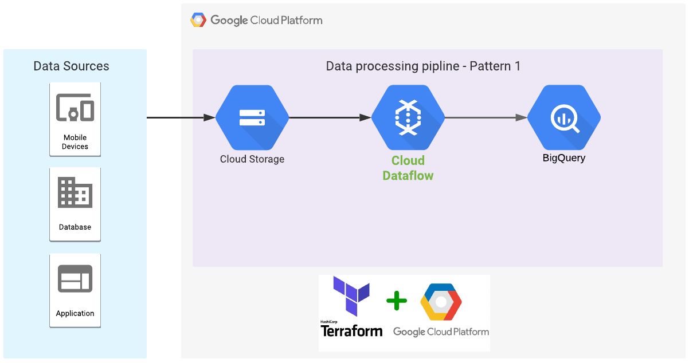

In this solution, you will build a serverless data processing pipeline  as shown in the architecture above:

1.  Create a GCS Bucket 
1.  Load sample data, define schema and mapping files 
1.  Create a Dataflow pipeline 
1.  Create Dataset and Table in BigQuery 
1.  Load data into the BigQuery Table.

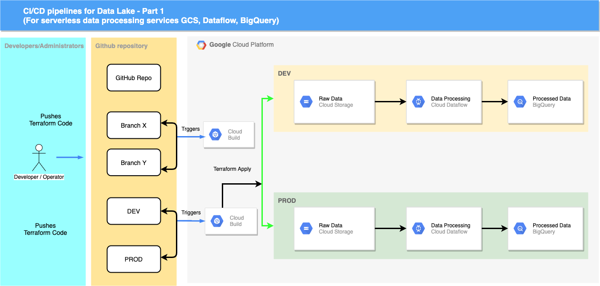

In addition to a serverless data processing pipeline, you will build a CI/CD pipeline for data processing (shown in architecture diagram 1) that enables version control - allowing you to  build, test and deploy this code into various environments.

### Prerequisites
>  * Google Cloud Account (If you don’t already have one, [sign up for a new account](https://accounts.google.com/SignUp) and Create a Google Cloud project: In the [Cloud Console](https://console.cloud.google.com/project))
>  * Github Account (If you already don’t have one, [sign up for a new account](https://github.com/join))

### Costs
This blog uses the following billable components of Google Cloud:

* [Cloud Storage](https://cloud.google.com/storage/pricing)
* [Dataflow](https://cloud.google.com/dataflow/pricing)
* [BigQuery](https://cloud.google.com/bigquery/pricing)
* [Cloud Build](https://cloud.google.com/cloud-build/pricing)

To generate a cost estimate based on your projected usage, use the [pricing calculator](https://cloud.google.com/products/calculator).

> **Note**: If you don't plan to keep the resources that you create in this blog, create a project instead of selecting an existing project. After you finish these steps, you can delete the project, removing all resources associated with the project.

> **Note**: While implementing this architecture in your production environment, make sure to consider factors like security, monitoring, failure handling, and any operational issues.

> **Note**: Sample data is sourced from [http://eforexcel.com/](http://eforexcel.com/) and if you want to use the complete dataset [click here](http://eforexcel.com/wp/wp-content/uploads/2017/07/1500000%20CC%20Records.zip). These are not real transactions data and should not be used for any other purpose other than testing.

## Deployment walk through

1.  Setup your environment and grant required permissions
1.  Set up your GitHub repository
1.  Create Cloud Storage bucket to store your Data Lake raw data and mapping files
1.  Connect Cloud Build to your GitHub repository
1.  Create a build trigger to respond to changes in your GitHub repository
1.  Make changes in a feature branch
1.  Promote changes to the development environment.
1.  Promote changes to the production environment

## 1. Setting up your environment

In this blog, you run commands in [Cloud Shell](https://cloud.google.com/shell/docs). Cloud Shell is a shell environment with the Cloud SDK already installed, including the gcloud command-line tool, and with values already set for your current project. Cloud Shell can take several minutes to initialize.

1.  Let’s set up some environment variables to use. Ensure you updated the values to accurately reflect your environment:

        SA_ID=datalake-deployer (SA=Service Account)

        PROJECT_ID=$(gcloud config list --format 'value(core.project)')

        PROJECT_NUMBER=$(gcloud projects describe "${PROJECT_ID}" --format='get(projectNumber)')

        SA_EMAIL=$SA_ID@$PROJECT_ID.iam.gserviceaccount.com

        BUCKET_NAME=$PROJECT_ID

        GITHUB_USERNAME=[Insert your Github Username here]

1.  Enable the required APIs:

        gcloud services enable cloudbuild.googleapis.com compute.googleapis.com bigquery-json.googleapis.com storage.googleapis.com dataflow.googleapis.com --project $PROJECT_ID

1.  Create service account:

        gcloud iam service-accounts create $SA_ID \
          --display-name $SA_ID \
          --project $PROJECT_ID

1.  Add the appropriate IAM roles to the Data Lake service account you have just created:

        for role in bigquery.admin storage.admin dataflow.admin compute.admin dataflow.worker; do \
          gcloud projects add-iam-policy-binding $PROJECT_ID \
          --member="serviceAccount:$SA_EMAIL" \
          --role="roles/$role"; \
          done

1.  Add the appropriate IAM roles to the default Cloud Build service account:

        for role in bigquery.admin storage.admin dataflow.admin compute.admin dataflow.worker; do \
          gcloud projects add-iam-policy-binding $PROJECT_ID \
          --member="serviceAccount:$PROJECT_NUMBER@cloudbuild.gserviceaccount.com" \
          --role="roles/$role"; \
        done

1.  Add the Cloud Build service account as a serviceAccountUser of the Data Lake service account within the project:

        gcloud iam service-accounts add-iam-policy-binding \
           $SA_EMAIL \
          --member="serviceAccount:$PROJECT_NUMBER@cloudbuild.gserviceaccount.com" \
          --role=roles/iam.serviceAccountUser \
          --project $PROJECT_ID

1.  Keep PROJECT_ID and SA_EMAIL for further use in the blog:

        echo $PROJECT_ID

        echo $SA_EMAIL
    
## 2. Setting up your GitHub repository

You use a single Git repository to define your cloud infrastructure and orchestrate this infrastructure by having different branches corresponding to different environments:

*   The *dev* branch contains the latest changes that are applied to the development environment.

*   The *prod* branch contains the latest changes that are applied to the production environment.

With this infrastructure, you can always reference the repository to know what configuration is expected in each environment and to propose new changes by first merging them into the *dev* environment. You then promote the changes by merging the *dev* branch into the subsequent *prod* branch.

### To get started, clone the [GoogleCloudPlatform community](https://github.com/GoogleCloudPlatform/community) repository

1.  In Cloud Shell, clone this GoogleCloudPlatform community repository

        cd ~

        git clone https://github.com/GoogleCloudPlatform/community.git

1.  Ceate a new git repo (ex:cicd-datalake-part-1) in your github account

    [Ceate a new git repo](https://docs.github.com/en/free-pro-team@latest/github/getting-started-with-github/create-a-repo)

1.  Add existing project to your new repository

        cd ~/community/tutorials/cicd-datalake-part-1/

        echo "# cicd-datalake-part-1" >> README.md
        git init
        git add .
        git commit -m "commit CICD data lake project"
        git branch -M dev
        git branch -M prod

        git remote add origin https://github.com/$GITHUB_USERNAME/cicd-datalake-part-1.git

        git push -u origin dev
        git push -u origin prod

### The code in this repository is structured as follows:

1.  The *environments/* folder contains subfolders that represent environments, such as *dev* and *prod* data processing pipelines, which provide logical separation between workloads at different stages of maturity - development and production, respectively. Although it's a good practice to have these environments as similar as possible, each subfolder has its own Terraform configuration to ensure they can have unique settings as necessary.

1.  The *testdata/* folder contains the test data and mapping scripts to build data processing pipeline

1.  The cloudbuild.yaml file is a build configuration file that contains instructions for Cloud Build, such as how to perform tasks based on a set of steps. This file specifies a conditional execution depending on the branch Cloud Build is fetching the code from, for example:

      * For *dev* and *prod* branches, the following steps are executed:
          * terraform init
          * terraform plan
          * terraform apply
      * For dev and prod branches, the following steps are executed:
          * terraform init for all environments subfolders
          * terraform plan for all environments subfolders

The reason *terraform init* and *terraform plan* run for all environments subfolders is to make sure that the changes being proposed hold for every single environment. This way, before merging the pull request, you can review the plans to make sure access is not being granted to an unauthorized entity.

## 3. Setting up your GCS Buckets

Create a GCS bucket to store raw unprocessed  sample data files and mapping files required to build data processing pipelines.

1.  Setup GCS Bucket (region of the gcs bucket is based on your region)

        gsutil mb -c standard -l us-west1 gs://$BUCKET_NAME

1.  Upload the contents from *testdata* folder into gcs bucket, created in previous step

        cd ~/community/tutorials/cicd-datalake-part-1/testdata

    Copy the downloaded test data (raw, unprocessed data) and schema files from github repository to your gcp bucket

        gsutil cp *.* gs://$BUCKET_NAME

        gsutil ls gs://$BUCKET_NAME

## 4. Connecting Cloud Build to your GitHub repository

This section shows how to install the [Cloud Build GitHub app](https://github.com/marketplace/google-cloud-build). This installation allows one to connect a GitHub repository to a Google Cloud project so that Cloud Build can automatically apply Terraform manifests each time a new branch is created or code is pushed to GitHub.

The following steps provide instructions for installing the app only for the **[Your new repository created for CICD]**, but you can choose to install the app for more or all your repositories

1.  Go to the GitHub Marketplace page for the Cloud Build app:
      [https://github.com/marketplace/google-cloud-build](https://github.com/marketplace/google-cloud-build)

1.  If this is your first time configuring an app in GitHub, click **Setup with Google Cloud Build**. Otherwise, click **Edit your plan**, select your billing information and, in the **Edit your plan** page, click **grant this app access**.

    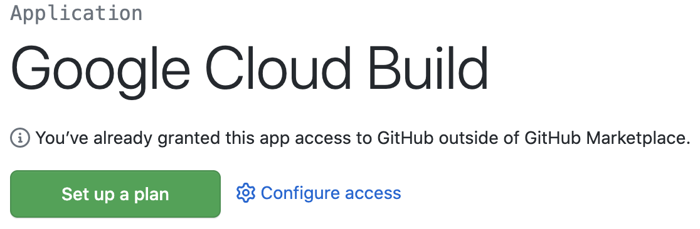

1.  In the **Install Google Cloud Build** page, select **Only select repositories** and enter **Your-github-username**/cicd-datalake-part-1 to connect to your repository.

1.  Click **Install**.

1.  Sign in to Google Cloud.
    The **Authorization** page is displayed. You are asked to authorize the Cloud Build GitHub app to connect to Google Cloud.
    
    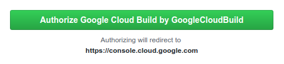

1.  Click **Authorize Google Cloud Build by GoogleCloudBuild**.
    You are redirected to the Cloud Console.

1.  Select the Google Cloud project you are working on and if you agree to the terms and conditions, select the checkbox, and then click **Next**.

1.  In the **Repository selection** step, select **Your-github-username**/cicd-datalake-part-1 to connect to your Google Cloud project, and then click **Connect repository**.

1.  Click **Skip for now** in the next screen

1.  Click **Done**

The Cloud Build GitHub app is now configured, and your GitHub repository is linked to your Google Cloud project. From now on, any changes to the GitHub repository will trigger Cloud Build executions, which report the results back to GitHub by using [GitHub Checks](https://developer.github.com/v3/checks/).

## 5. Configure a build trigger to respond to changes in your GitHub repository

From the previous steps, you have a configuration to establish connectivity between Code Build and your GitHub repositories. Now create a trigger in the Cloud build to respond to changes in the GitHub repository to test and run your infrastructure for data processing pipelines.

1.  Navigate to the Cloud Build in the Cloud console and Click on **CREATE TRIGGER** in the Triggers navigation plane.

1.  Provide **Name** and **Description** for your trigger

1.  In the Event section, select **Push to a branch**

1.  In the **Source section**
      * Select **your repository** in the **repository dropdown box**
      * Select **.*(any branch)** in **Branch Drop down box**

1.  In the Build Configuration section, select **Cloud Build configuration file**

1.  In the Advanced section, Click the Add Variable button and Add your environment variables like ProjectID, ServiceAccountEmail,Region,SourceDatabucket. Naming standard like below. (You have created these variable as part of **Setting up your environment** and **Setting up your GCS Bucket** section)

        _PROJECT_ID= YourProjectID (solutions-295116)
	    _REGION=You region where you are testing this CI/CD Pipeline (ex:us-west1)
	    _SERVICE_ACCOUNT_EMAIL=Your service account email created in the environment setup section (ex:datalake-deployer@solutions-295116.iam.gserviceaccount.com or use echo $SA_EMAIL on the cloud cli to find out yours)
        _SOURCE_GCS_BUCKET= Your source files GCS bucket, Created in the bucket creation section (ex:solutions-295116 (you have used same name as project name)

      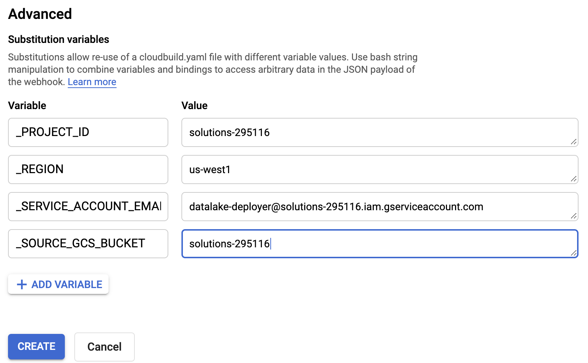

1.  Click Create

## 6. Make changes in a new feature branch

By now, you have most of your environment configured. So it's time to make some code changes in your development environment and test the Build trigger.

1.  On GitHub, navigate to the main page of your repository (cicd-datalake-part-1).

1.  Make sure you are in the *dev* branch.

    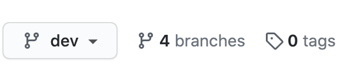

1.  To open the file for editing, go to the **environments/dev/main.tf** file and click the pencil icon.

1.  Add some comments like  **“#cicd-datalake-part-1”**  to main.tf.

1.  Add a commit message at the bottom of the page, such as **cicd-datalake-part-1**, and select **Create a new branch for this commit**.
 
1.  Click the **Propose change**.

1.  On the following page, click **Create pull request** to open a new  pull request with your change.

    Once your pull request is open, a Cloud Build job is automatically initiated.

1.  Click **Show all checks** and wait for the check to become green.

    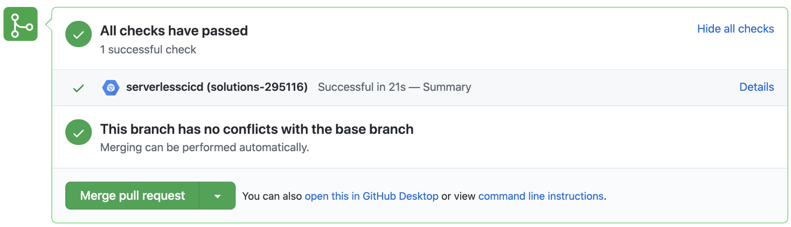

1.  In the Cloud Console, go to the **Cloud Build History** page and see build details.

1.  Now you made sure you don’t have any build exceptions and ready to promote changes to *DEV* branch

## 7. Promoting changes to the development environment

You have a pull request waiting to be merged. It's time to apply the state you want to your *dev* environment.

1.  On GitHub, navigate to the main page of your repository (cicd-datalake-part-1).

1.  Under your repository name, click **Pull requests**.

1.  Click the **pull request you just created**.

1.  Click **Merge pull request**, and then click **Confirm merge**.

    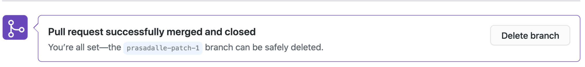

1.  Check that a new Cloud Build has been triggered in the Cloud Console **Cloud Build History** Page, Make sure it is successful.

    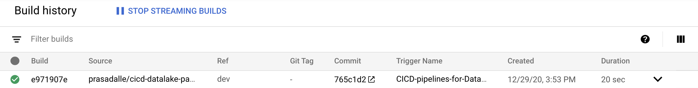

1.  Once the Cloud Build successful run. It will create a data processing pipeline in the *Dev* environment with the following actions.

      1.  Create Dataflow Job

      1.  Create Dataset and Table in BigQuery (I have used dev_datalake_demo,prod_datalake_demo as a dataset name, sample_userdata as a table name, you can change that in main.tf if needed)

      1.  Load data from GCS bucket to BigQuery Table           	

1.  Open Data flow window in the Cloud Console to check the job status

    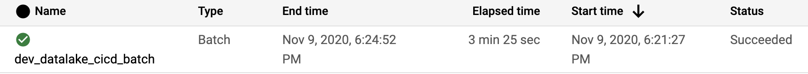

1.  After successful completion of the Dataflow job, a BigQuery Dataset and table will be created and have loaded the data csv file in GCS bucket to BigQuery Table.

    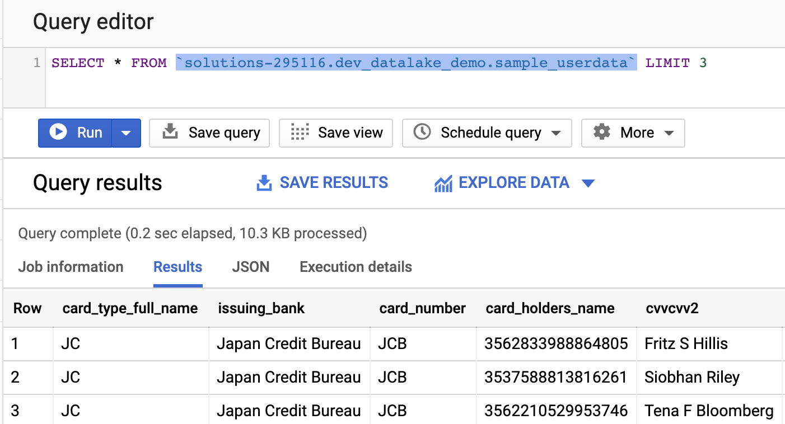

## 8. Promoting changes to the production environment

Now that you have your development environment fully tested, you can promote your data processing pipeline code to production.

1.  On GitHub, navigate to the main page of your repository (cicd-datalake-part-1).

1.  Click **New pull request**.

1.  For **base**, select prod and for **compare**, select *dev*.
    
    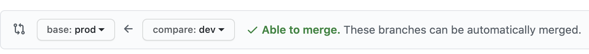

1.  Click **Create pull request**

1.  For **title**, enter a title such as Promoting DataLake changes, and then click **Create pull request**.

1.  Review the proposed changes, including the terraform plan details from Cloud Build, and then click **Merge pull request**.

1.  Click **Confirm merge**.
	
    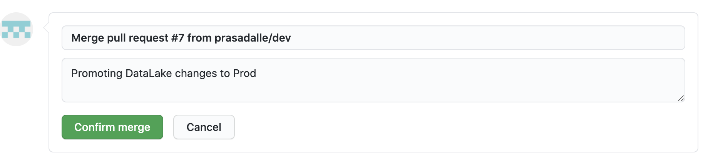

    
 
1.  In the Cloud Console, open the **Build History** page to see your changes being applied to the production environment.

    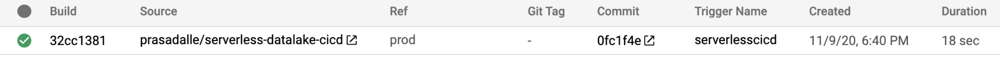

1.  Open Data flow window to see the job status

    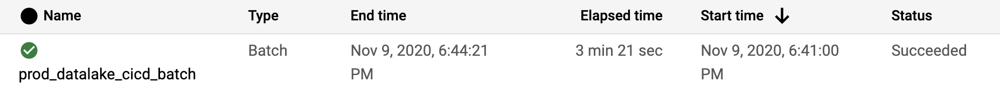
   
1.  Wait for the Dataflow to finish, and then check BigQuery to make sure the job created the production dataset and tables.
    
    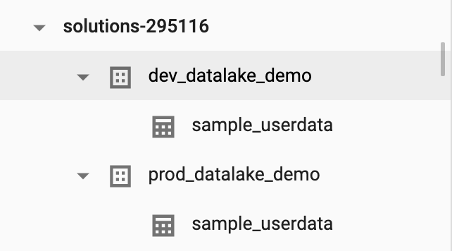

    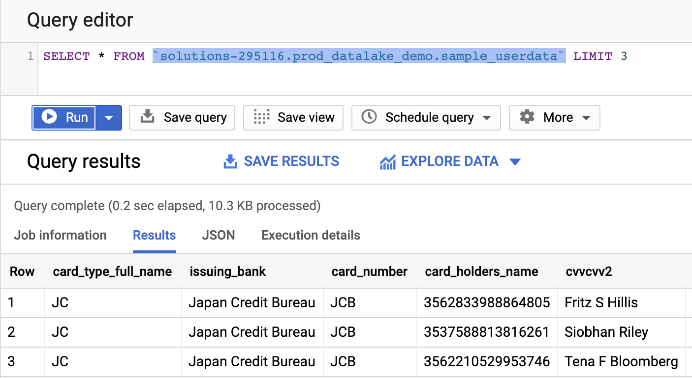

## Conclusion

In this post, you learned how to implement serverless data processing pipelines on Google Cloud using GCS, DataFlow, BigQuery and  CI/CD of data processing pipelines using Cloud Build, Terraform and Github.

## Cleaning up resources
To avoid incurring charges to your Google Cloud Platform account for the resources used in this blog Delete Project or Delete the individual resources (GCS bucket, BigQuery Table and Dataset, Cloud Build Trigger) created part of this blog in the Project.

### What's next

- Learn more about [Google Cloud developer tools](https://cloud.google.com/products/tools).
- Try out other Google Cloud features for yourself. Have a look at our [tutorials](https://cloud.google.com/docs/tutorials).
