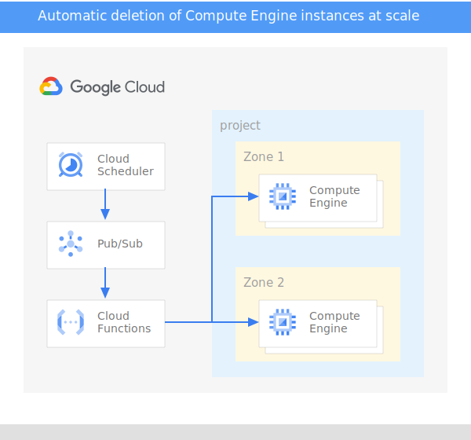

# Cleaning up Compute Engine instances at scale

## Summary

This tutorial offers a simple, serverless and scalable mechanism to automatically delete, or "[garbage collect](https://en.wikipedia.org/wiki/Garbage_collection_(computer_science))", Compute Engine instances after a fixed time period.  Some use cases where this may be prove useful:

* Developers or testers create one-off instances for testing features, but may not always remember to manually delete them.
* Workflows that require dynamically spinning up a large number of GCE worker instances to perform a certain task.  While best practice is to have instances delete themselves after the task is complete, but ensuring that this always happens can be difficult if the task is distributed or some workers abort due to errors.

This solution leverages the following GCP components: 

*   **Compute Engine**
*   **Cloud Scheduler**
*   **Pub/Sub** 
*   **Cloud Functions**

*Figure 1: High-level overview of the solution*

### How does it work? 

Each Compute Engine instance in scope is assigned two labels: 

*   **TTL** (Time to Live): which indicates (in minutes) after how much time this VM will not be needed and can be deleted.
*   **ENV** : it indicates that the instance is part of the pool of VMs that can be checked regularly and can be deleted if TTL is reached. 

The overall flow is the following: 

1. We create a Cloud Scheduler cron job which will be triggered regularly (e.g each 5 minutes). The config of the Cloud scheduler contains the values of the label of the pool of VMs to target (e.g ENV= test). Optionally, it can also contain the name of the zone where the VMs to target are deployed. The format is the following: 

		'{"zone":"us-west1-b", "label":"env=test"}'

2. Once the cron job is triggered, Cloud Scheduler will push a message with the payload above to a Pub/Sub topic. 
3. A Cloud Function is subscribed to the Pub/Sub topic. Each time triggered, it will perform the following: 
    1.  Read the payload of the Pub/Sub message
    2. Extract the **label** and the **zone**
    3. Filter all the GCE instances which have the label in question ( the zone could also be used to as a filter)
    4. Iterate through instance and perform the following: 
        1. Read the value of label **TTL** of each instance 
        2. Calculate **Delta** = the difference between the current time and the creation time of each instance 
        3. If **Delta> TTL** , the instance will be deleted. If not, nothing will be done.

### Prerequisites

* If you don’t already have one, create a
    [Google Account](https://accounts.google.com/SignUp).

* Create and configure a Google Cloud project.
    1. In the [Google Developers Console](https://console.developers.google.com/project), select
      **Create Project**.
    2. [Enable Project Billing](https://support.google.com/cloud/answer/6293499#enable-billing)
    3. Open [Cloud Shell][https://cloud.google.com/shell/docs/using-cloud-shell] and create an App Engine app. This is required by Cloud Scheduler:

           gcloud app create --region=us-central
    
    4. Enable the APIs used by this tutorial:

           gcloud services enable appengine.googleapis.com cloudbuild.googleapis.com \
             cloudfunctions.googleapis.com cloudscheduler.googleapis.com compute.googleapis.com \
             pubsub.googleapis.com
    
Important: This tutorial uses several billable components of Google Cloud
Platform. To estimate the cost of running this sample:

* Assume you run a single `f1-micro` Google Compute Instance for a total of
  15 minutes on one day while you test the sample. After which, you delete
  the project, releasing all resources.  That's **0.25 hours per month**.
* Cloud Scheduler is free for up to **3 jobs per month**.

Use the [Google Cloud Platform Pricing Calculator](https://cloud.google.com/products/calculator/#id=beb5326f-90c3-4842-9c3f-a3761b40fbe3)
to generate a cost estimate based on this projected usage. New Cloud Platform
users may be eligible for a [free trial](http://cloud.google.com/free-trial).

### Clone the sample code

To clone the GitHub repository, run the following command in Cloud Shell:

    git clone https://github.com/GoogleCloudPlatform/community

Change directories to the `cleaning-up-at-scale` directory. The exact path
depends on where you placed the directory when you cloned the sample files from
GitHub.

    cd community/tutorials/cleaning-up-at-scale

### Create Pub/Sub topic

1.  Create the Pub/Sub topic that you will push messages to.

    gcloud pubsub topics create unused-instances

The topic is now listed under `gcloud pubsub topics list`.  You can also see the topic
in the console:

Big Data > Pub/Sub

### Create Cloud Function

Deploy the Cloud Function that will monitor the Pub/Sub topic and clean up instances.

    gcloud functions deploy clean-unused-instances --trigger-topic=unused-instances --runtime=nodejs12 --entry-point=cleanUnusedInstances

### Create Cloud Scheduler job

Next, we configure Cloud Scheduler to push a message containing target label every
minute to the Pub/Sub topic `unused-instances` that we just created.

    gcloud scheduler jobs create pubsub clean-unused-instances-job --schedule="* * * * *" \
      --topic=unused-instances --message-body='{"label":"env=test"}'

The `schedule` is specified in [unix-cron format](https://cloud.google.com/scheduler/docs/configuring/cron-job-schedules).
A `*` in every field means the job runs every minute, every hour, every day of the month,
every month, every day of the week.  More simply put, it runs once per minute.

Note: If scanning large amounts of VMs, running less often (say, once an hour) is likely sufficient.

The job is now visible in `gcloud scheduler jobs list`.  You can also see the jobs 
in the console:

Tools > Cloud Scheduler 

Scheduler execution logs for the job are visible via the Logs link for each job.

### Create a test instance to clean up

Create a test instance labeled `env=test` with a two-minute TTL.

    gcloud compute instances create cleanup-test --zone=us-central1-a --machine-type=f1-micro \
      --labels=env=test,ttl=2

Check that the new instance has started successfully.

    gcloud compute instances list

Wait two minutes and rerun the command.  The instance should be automatically deleted.

    gcloud compute instances list

You can also see the Cloud Function execution results, including the name of the deleted instance, under Cloud Function Logs in the console.

### Clean up

Now that you have tested the sample, delete the cloud resources you created to
prevent further billing for them on your account.

* Delete the Cloud Scheduler job.

    You can delete the job from the Cloud Scheduler section of the
    [Developers Console](https://console.developers.google.com).

* Delete the Cloud Pub/Sub topic.
    You can delete the topic and associated subscriptions from the Cloud Pub/Sub
    section of the [Developers Console](https://console.developers.google.com).

## License

Copyright 2020 Google Inc. All Rights Reserved.

Licensed under the Apache License, Version 2.0 (the "License");
you may not use this file except in compliance with the License.
You may obtain a copy of the License at

http://www.apache.org/licenses/LICENSE-2.0

Unless required by applicable law or agreed to in writing, software
distributed under the License is distributed on an "AS IS" BASIS,
WITHOUT WARRANTIES OR CONDITIONS OF ANY KIND, either express or implied.
See the License for the specific language governing permissions and
limitations under the License.

