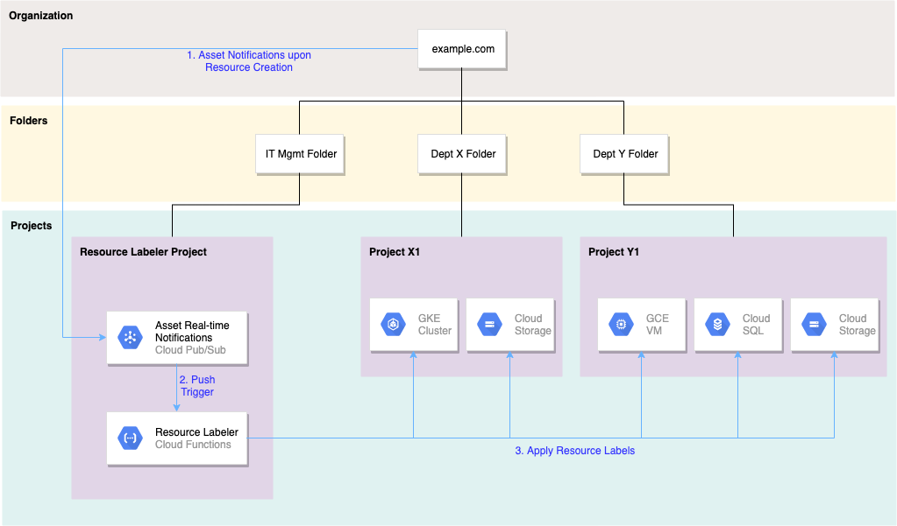

KaYun Lam | Customer Engineer | Google

<p style="background-color:#CAFACA;"><i>Contributed by Google employees.</i></p>

[Cloud Asset Inventory](https://cloud.google.com/asset-inventory) allows the set up of [real-time notification](https://cloud.google.com/asset-inventory/docs/monitoring-asset-changes) on asset config change. This is convenient when a set of common tasks need to be done upon resource creation or modification, which is a common scenario for governance of cloud resources in enterprises.  

In this tutorial, automatic-labeling of GCE VMs, GKE, Cloud SQL and GCS buckets will be done upon creation across any projects in the selected folder or organization. You will first set up Cloud Pub/Sub topic to get real-time updates on the creation of any of the above asset config changes (GCE VMs, GKE, Cloud SQL, GCS). You will then deploy a sample Cloud Function to perform the labeling of resources automatically using the resource names in near real-time. This particular example is useful if more fine-grained visibility is needed on the Google Cloud [billing reports](https://cloud.google.com/billing/docs/how-to/reports) or [Billing Export to BigQuery](https://cloud.google.com/billing/docs/how-to/export-data-bigquery), in which the data can be [filtered by labels](https://cloud.google.com/billing/docs/how-to/bq-examples#query-with-labels).



To complete this tutorial, IAM permissions on the organization or folder levels are required. Shell commands are used throughout the steps. Programming skills on Google Cloud Functions is required to customize the actions to be automatically performed in your situation (e.g. some actions other than automatic labeling).

## Resources to be automatically labeled

Here are the GCP resources to be automatically labeled in this tutorial.  

* GCE VM - Labels will be applied to newly created VMs.
* GKE cluster - Cluster labels will be applied to newly created GKE clusters. The labels will be propagated down to the individual resources as described on this [link](https://cloud.google.com/kubernetes-engine/docs/how-to/creating-managing-labels#about_labeling_clusters).
* GCS bucket - Labels will be applied to newly created buckets.
* Cloud SQL - Labels will be applied to newly created Cloud SQL instance.

All the labeling operations will be done while preserving the other labels that are already set (e.g. if they are already specified during creation).

If a label with the exact same key already exists (e.g. it's specified manually with the exact same key during creation), the code in this tutorial will override that existing label value.

## Costs

This tutorial uses these components of Google Cloud as the labeling mechanism. Here are the links to the pricing information of the components:

* [Cloud Asset Inventory](https://cloud.google.com/asset-inventory/pricing)
* [Cloud Pub/Sub](https://cloud.google.com/pubsub/pricing)
* [Cloud Functions](https://cloud.google.com/functions/pricing)

Here are the components supported by the sample auto-labeling function and their pricing information.

* [Cloud Engine](https://cloud.google.com/compute/vm-instance-pricing)
* [Kubernetes Engine](https://cloud.google.com/kubernetes-engine/pricing)
* [Cloud Storage](https://cloud.google.com/storage/pricing)
* [Cloud SQL](https://cloud.google.com/sql/pricing)

You can choose to launch the smallest instance (f1-micro for GCE VM) to minimize the cost for testing, and remove them afterwards after the testing. Use the [pricing calculator](https://cloud.google.com/products/calculator) to generate a cost estimate based on your projected usage, especially if you want to run your testing environment for an extended period of time.

## Before you begin

You must set up a Google Cloud project (with billing enabled) to host the resources in this tutorial. For shell commands, Google Cloud Shell is assumed to be the execution environment.

1. Use the Cloud Console to [create a new project](https://cloud.google.com/resource-manager/docs/creating-managing-projects#creating_a_project) to host the resources in this tutorial (Pub/Sub for the Asset Inventory Real-time Notifications, Cloud Functions). Choose a proper billing account to enable the billing for the project during the creation step. Note the project ID.

1. [Launch a Cloud Shell session](https://cloud.google.com/shell/docs/launching-cloud-shell#launching_from_the_console) from the Console.

## Steps

### Set up the ORGANIZATION_ID environment variable

You will need the Organization ID. If you do not have it handy, you can use the following command to determine it.

```bash
# Get the organization id based on the $GOOGLE_CLOUD_PROJECT 
ORGANIZATION_ID=$(gcloud projects get-ancestors ${GOOGLE_CLOUD_PROJECT} --format="csv[no-heading](id,type)" | grep ",organization$" | cut -d"," -f1 )

# You should be able to see ORGANIZATION_ID=numeric_value as the output.
echo ORGANIZATION_ID=${ORGANIZATION_ID}
```

### (Optional) Determine the folder under which we want to monitor the asset changes

This tutorial works on either the folder or organization level.

* "Organization level" means those resources created in any projects under the **organization** will be acted upon (automatically labeled in this tutorial).
* "Folder level" means those resources created in any projects under the **folder** will be acted upon (automatically labeled in this tutorial).

Ignore this subsection if you are going to monitor asset changes across the organization.

```bash
# Set your folder id to the folder you want to monitor
FOLDER_ID=<numeric folder id value>

# For demo only - You can use this to create a new folder 
# (the folder under which the project resources are to be monitored)
#gcloud organizations add-iam-policy-binding ${ORGANIZATION_ID} --member="user:$(gcloud config get-value account)" --role="roles/resourcemanager.folderCreator"
#FOLDER_ID=$( gcloud resource-manager folders create --display-name="auto-label-folder" --organization=${ORGANIZATION_ID} --format="value('name')" | cut -d"/" -f2 )

echo FOLDER_ID=${FOLDER_ID}
```

### Set the variables for the project hosting the Asset Pub/Sub and the Cloud Function

```bash
# Set your project id to the project you want to use (the project that hosts the Pub/Sub and the Clouf Function)
PROJECT_ID=<The alphanumeric project id>

# Run this if you have already selected the project you want to use, and want to use the setting from the Cloud Shell's gcloud environment
#PROJECT_ID=$(gcloud config get-value project)

# For demo only - Create a new project under the above folder
#RANDOM_STRING=$(cat /dev/urandom | tr -dc 'a-z0-9' | fold -w 10 | head -n 1)
#PROJECT_ID=$(gcloud projects create "resource-labeler-${RANDOM_STRING}" --folder=${FOLDER_ID} --format="value('projectId')" )
# For demo only - Create a new project under the organization
#PROJECT_ID=$(gcloud projects create "resource-labeler-${RANDOM_STRING}" --organization=${ORGANIZATION_ID} --format="value('projectId')" )

# Confirm this PROJECT_ID (alphanumeric) is set correctly
echo PROJECT_ID=${PROJECT_ID}

# Retrieve the numeric project number for the project id
PROJECT_NUMBER=$(gcloud projects describe ${PROJECT_ID} --format="value(project_number)")
echo PROJECT_NUMBER=${PROJECT_NUMBER}
```

### Create the Service Account for the Cloud Function

```bash
# Create a service account to be used by the Cloud Function (which sets the GCE VM labels)
# Currently, "The service account being deployed must have been created in the same project as the function it is attached to."
# <https://cloud.google.com/functions/docs/securing/function-identity#per-function_identity>
SERVICE_ACCOUNT_PROJECT_ID=${PROJECT_ID}

GCF_SERVICE_ACCOUNT_NAME="resource-labeler-sa"
gcloud iam service-accounts create "${GCF_SERVICE_ACCOUNT_NAME}" --project ${SERVICE_ACCOUNT_PROJECT_ID}
GCF_SERVICE_ACCOUNT="${GCF_SERVICE_ACCOUNT_NAME}@${SERVICE_ACCOUNT_PROJECT_ID}.iam.gserviceaccount.com"
echo GCF_SERVICE_ACCOUNT="${GCF_SERVICE_ACCOUNT}"
```

### Create the IAM role to be used by the Service Account for the Cloud Function

```bash
# Assign yourself the permission to create organization roles (if you do not already have it)
#gcloud organizations add-iam-policy-binding ${ORGANIZATION_ID} --member="user:$(gcloud config get-value account)" --role="roles/iam.organizationRoleAdmin"

# Create the custom role on the organization level
PERMISSIONS="compute.instances.get,compute.instances.setLabels,container.clusters.get,container.clusters.update,storage.buckets.get,storage.buckets.update,cloudsql.instances.get,cloudsql.instances.update"
gcloud iam roles create ResourceLabelerRole --organization=${ORGANIZATION_ID} --title "Resource Labeler Role" --permissions "${PERMISSIONS}" --stage GA

# Updating the role (e.g. with more permissions) will follow a similar syntax
# gcloud iam roles update ResourceLabelerRole --organization=${ORGANIZATION_ID} --title "Resource Labeler Role" --permissions "${PERMISSIONS}" --stage GA

```

### Add the IAM policy bindings needed on the service account and the folder/organization

```bash
# Retrieve your own username from the environment
MEMBER="user:$(gcloud config get-value account)"

# Set it manually if a separation of duty is required (i.e. someone else will be setting up the Pub/Sub and the cloud function
# MEMBER="user:username@domain.com"
echo ${MEMBER}

# 1. Service Account IAM bindings
# The MEMBER needs the permission to use the service account in order to deploy the Cloud Function
gcloud iam service-accounts add-iam-policy-binding "${GCF_SERVICE_ACCOUNT}" --member="${MEMBER}" --role="roles/iam.serviceAccountUser" --project "${SERVICE_ACCOUNT_PROJECT_ID}"

# 2. Org-level IAM bindings (i.e. monitoring the asset changes org-wide)
# Needed for the MEMBER to create the asset feed
gcloud organizations add-iam-policy-binding ${ORGANIZATION_ID} --member="${MEMBER}" --role="roles/cloudasset.owner"
gcloud organizations add-iam-policy-binding ${ORGANIZATION_ID} --member="serviceAccount:${GCF_SERVICE_ACCOUNT}" --role="organizations/${ORGANIZATION_ID}/roles/ResourceLabelerRole"

# (Alternative) 2. Folder-level IAM bindings (on the folder under which the assets (e.g. GCE VMs) are to be monitored)

# Needed for the MEMBER to create the asset feed
#gcloud resource-manager folders add-iam-policy-binding ${FOLDER_ID} --member="${MEMBER}" --role="roles/cloudasset.owner"
# Grant the role to the service account on the folder level
# i.e. this service account can set labels on any GCE VM instances underneath
#gcloud resource-manager folders add-iam-policy-binding ${FOLDER_ID} --member="serviceAccount:${GCF_SERVICE_ACCOUNT}" --role="organizations/${ORGANIZATION_ID}/roles/ResourceLabelerRole"

```

### Enable the APIs in the project issuing the Asset APIs, hosting the Pub/Sub and the Cloud Function

Run this command to enable the required Google Cloud APIs.

```bash
# These are the required APIs for the labeling pipeline itself
gcloud services enable cloudasset.googleapis.com pubsub.googleapis.com cloudfunctions.googleapis.com cloudbuild.googleapis.com --project ${PROJECT_ID}

# The following APIs are enabled on the same project for simplicity of the function code on the labeling actions
gcloud services enable compute.googleapis.com container.googleapis.com storage.googleapis.com sqladmin.googleapis.com --project ${PROJECT_ID}
```

### Add the IAM policy bindings needed on the project having the Pub/Sub and the Cloud Function

Run these commands to allow the execution of the subsequent steps (Pub/Sub, Cloud Function, etc) by the MEMBER (yourself or another designated personnel).

```bash
# Project-level IAM bindings

# Needed for creating the pubsub topic and managing the IAM permission on the pubsub topic
gcloud projects add-iam-policy-binding ${PROJECT_ID} --member="${MEMBER}" --role="roles/pubsub.admin"
# Needed for creating the asset feed
gcloud projects add-iam-policy-binding ${PROJECT_ID} --member="${MEMBER}" --role="roles/serviceusage.serviceUsageConsumer"
# Needed for creating the Cloud Function
gcloud projects add-iam-policy-binding ${PROJECT_ID} --member="${MEMBER}" --role="roles/cloudfunctions.developer"
# Needed for deploying the Cloud Function package
gcloud projects add-iam-policy-binding ${PROJECT_ID} --member="${MEMBER}" --role="roles/storage.objectCreator"

```

### Create the Pub/Sub topic

If the subsequent steps are to be done by a different person due to separation of duties, make sure the variables are set properly.

```bash
# Set your project id to the project you want to use (the project that hosts the Pub/Sub and the Clouf Function)
#PROJECT_ID=
echo PROJECT_ID=${PROJECT_ID}
PROJECT_NUMBER=$(gcloud projects describe ${PROJECT_ID} --format="value(project_number)")
echo PROJECT_NUMBER=${PROJECT_NUMBER}

ORGANIZATION_ID=$(gcloud projects get-ancestors ${GOOGLE_CLOUD_PROJECT} --format="csv[no-heading](id,type)" | grep ",organization$" | cut -d"," -f1 )
echo ORGANIZATION_ID=${ORGANIZATION_ID}
```

Run these commands to create the Pub/Sub topic.

```bash
TOPIC_NAME="asset-changes"
gcloud pubsub topics create "${TOPIC_NAME}" --project ${PROJECT_ID}

```

### Allow Asset Inventory Built-in Service Account to publish to the Pub/Sub topic

```bash
gcloud beta services identity create --service=cloudasset.googleapis.com --project=${PROJECT_ID}

gcloud pubsub topics add-iam-policy-binding "${TOPIC_NAME}" --member "serviceAccount:service-${PROJECT_NUMBER}@gcp-sa-cloudasset.iam.gserviceaccount.com" --role roles/pubsub.publisher --project ${PROJECT_ID}
```

### Create an Asset Feed for the organization or the folder

Specify the asset types. The supported ones can be found on this [page](https://cloud.google.com/asset-inventory/docs/supported-asset-types). These are the 4 types supported by the sample Cloud Function in this tutorial.

```bash
ASSET_TYPES="compute.googleapis.com/Instance,container.googleapis.com/Cluster,sqladmin.googleapis.com/Instance,storage.googleapis.com/Bucket"
```

Create the feed.

```bash
# Create a feed for the entire organization
gcloud asset feeds create "feed-resources-${ORGANIZATION_ID}" --organization="${ORGANIZATION_ID}" --content-type=resource --asset-types="${ASSET_TYPES}" --pubsub-topic="projects/${PROJECT_ID}/topics/${TOPIC_NAME}" --billing-project ${PROJECT_ID}

# Alternately, create a feed for the folder
#echo FOLDER_ID=${FOLDER_ID}
#gcloud asset feeds create "feed-resources-${FOLDER_ID}" --folder="${FOLDER_ID}" --content-type=resource --asset-types="${ASSET_TYPES}" --pubsub-topic="projects/${PROJECT_ID}/topics/${TOPIC_NAME}" --billing-project ${PROJECT_ID}

# Confirm the feed creation
gcloud asset feeds list --organization ${ORGANIZATION_ID} --format="flattened(feeds[].name)" --billing-project ${PROJECT_ID}
# Or if you have been doing it on the folder level:
#gcloud asset feeds list --folder ${FOLDER_ID} --format="flattened(feeds[].name)" --billing-project ${PROJECT_ID}

```

### Deploy the Cloud Function which processes the Asset Inventory Real-time Notifications

The [GitHub repository for this tutorial](https://github.com/GoogleCloudPlatform/community/tree/master/tutorials/cloud-asset-inventory-auto-label-resources/cloud-function-auto-resource-labeler/) includes the complete working source code of the Cloud Function for the tutorial, which you can use as a reference as you customize it for your use case.

Clone the repository and change into the directory containing the Cloud Functions code.

```bash
git clone https://github.com/GoogleCloudPlatform/community/tree/master/tutorials/cloud-asset-inventory-auto-label-resources/cloud-function-auto-resource-labeler/
cd GoogleCloudPlatform-community/tutorials/cloud-asset-inventory-auto-label-resources/cloud-function-auto-resource-labeler
```

Deploy the function.

```bash
# Confirm you still have the right variables for the deployment
# This will be used as the service account for the function
echo PROJECT_ID=${PROJECT_ID}
echo GCF_SERVICE_ACCOUNT="${GCF_SERVICE_ACCOUNT}"
echo TOPIC_NAME=${TOPIC_NAME}

# Deploy the function
gcloud functions deploy auto_resource_labeler --runtime python38 --trigger-topic "${TOPIC_NAME}" --service-account="${GCF_SERVICE_ACCOUNT}" --project ${PROJECT_ID} --retry
```

### Test the labeling triggered by Asset Inventory Real-time Notifications

Now you can test the creation of the supported resources under your organization (or folder) to observe the labeling in action.

* GCE VMs are labeled when transitioning into PROVISIONING state.
* GKE clusters are labeled when transitioning into RUNNING state.
* GCS buckets are labled when coming from priorAssetState=DOES_NOT_EXIST.
* Cloud SQL instances are labeled when transitioning into RUNNABLE state. It may take a few minutes for the labels to be effective.

## Considerations

Notifications are only sent upon changes on the resource or policy metadata of the resource. Any existing resources (e.g. existing VMs) that are already deployed will not be acted upon by this solution.  A separate exercise needs to be performed to have the same actions on those existing resources.

## Known Issues

* GKE Autopilot Clusters will generate Compute Instance notifications that cannot be processed by the Cloud Function. This results in 404 errors when trying to retrieve the existing labels.  The current sample code handles by exiting gracefully when encountering any 404 errors.

## Cleaning up

Perform these clean-up steps if you plan to revert changes made throughout the tutorial.

```bash
# Confirm the feed ID
gcloud asset feeds list --organization ${ORGANIZATION_ID} --format="flattened(feeds[].name)" 
# Or if you have been doing it on the folder level:
#gcloud asset feeds list --folder ${FOLDER_ID} --format="flattened(feeds[].name)"

# The FEED_ID is the portion of the feed name after ".*/feeds/${FEED_ID}".
# Set the right feed to the variables.  Please be aware of any existing feeds in your organization that you may not want to interfere with
FEED_ID=feed-resources-
# echo FEED_ID="${FEED_ID}"

# Delete the feed
gcloud asset feeds delete ${FEED_ID} --organization ${FOLDER_ID}
# Or if you have been doing it on the folder level:
#gcloud asset feeds delete ${FEED_ID} --folder ${FOLDER_ID}
```

To avoid incurring charges to your Google Cloud account for the resources used in this tutorial, you can delete the project hosting Pub/Sub and the Cloud Function. Deleting a project has the following consequences:

* If you used an existing project, you will also delete any other work that you have done in the project.
* You cannot reuse the project ID of a deleted project. If you created a custom project ID that you plan to use in the future, delete the resources inside the project instead.

To delete a project, do the following:

1. In the Cloud Console, go to the [Projects page](https://console.cloud.google.com/iam-admin/projects).
1. In the project list, select the project you want to delete and click **Delete**.
1. In the dialog, type the project ID, and then click **Shut down** to delete the project.

Finally, you should create any other resources (e.g. GCE VMs) that you may have created for testing the labeling.

## What's next

* Refer to this page about [Monitoring asset changes](https://cloud.google.com/asset-inventory/docs/monitoring-asset-changes) for more information.
