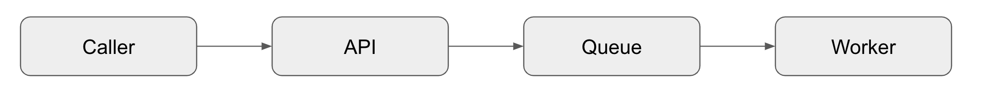
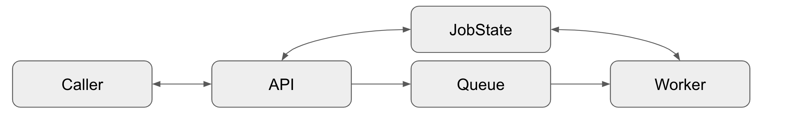
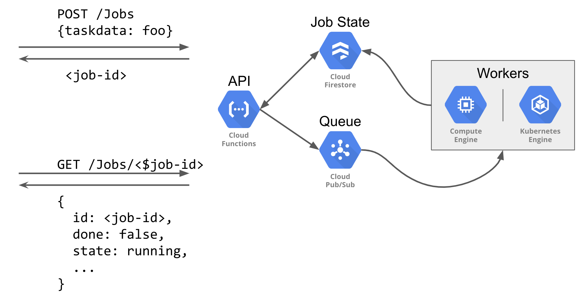

Preston Holmes | Solution Architect | Google

<!-- diagram sources: https://docs.google.com/presentation/d/1s01eqo3YUKiskJwSESW-T17IeUQf3DLCT_lvuAV7CwM/edit#slide=id.g4fb0d7b3af_0_0 -->

## Introduction

This tutorial demonstrates how to use [Google Cloud Functions](https://cloud.google.com/functions/) to extend the synchronous web-hook style request/response to longer running jobs, with a focus on trackable and stateful long running operations.

When a caller makes a request of a service, it is asking it perform some work. There are three integration patterns that can be applied, depending on the use-case:

### Synchronous Request/Response

The caller will wait until the work is done, expecting a result. This pattern can be directly and simply handled by [Cloud Functions](https://cloud.google.com/functions/) with an [HTTP trigger](https://cloud.google.com/functions/docs/calling/http).

### Asynchronous Work Queue

The caller does not need to wait for the work to be done, and does not need to followup on the completion status.

There are a couple ways this can be solved on Google Cloud Platform in a serverless way. You can use Cloud Pub/Sub patterns for [long running tasks](https://cloud.google.com/solutions/using-cloud-pub-sub-long-running-tasks) or you can use a dedicated service with [Cloud Tasks](https://cloud.google.com/tasks/).

### Asynchronous Stateful Jobs

The caller does not want to wait for the work to be done, but would like to be able to inquire as to the completion of the request.

This pattern is common enough that Google has defined a standard of a [long-running-operation API contract](https://github.com/googleapis/googleapis/tree/master/google/longrunning) used in multiple APIs.

This is a high level pattern. What about a job state is tracked and how work is performed will vary by use-case. This tutorial dives deeper into this pattern

## Serverless Stateful Jobs

This tutorial uses several managed services to implement the asyn c stateful jobs pattern including [Cloud Pub/Sub](https://cloud.google.com/pubsub/) and [Cloud Firestore](https://cloud.google.com/firestore/).

You can implement this pattern with alternative components. You can use Cloud SQL for job state storage or or Cloud Tasks for the work queue. This tutorial uses the support of [Go](https://golang.org/) in Cloud Functions, but any supported language can be used to fulfill the pattern.

### Job resource definition

A simple custom job definition is defined as follows:

	type JobState int
	
	const (
		Created JobState = iota
		Running
		Completed
		Failed
	)
	
	type Job struct {
		ID         string    `json:"id"`
		CreateTime time.Time `json:"created-time"`
		DoneTime   time.Time `json:"done-time" firestore:"DoneTime,omitempty"`
		Done       bool
		Result     string
		State      JobState
		Task       map[string]interface{} `json:"-"`
		// can add a requester, source IP etc if needed
	}

When a job request is received, it is given an ID and the details of the work are included in a task field. This task is sent into the work queue as Cloud Pub/Sub payload, with the Job ID as an [Cloud Pub/Sub attribute](https://cloud.google.com/pubsub/docs/publisher#custom-attributes). When a worker picks up the task, it moves the job from `Created` to `Running`. When the task is complete, it moves from `Running` to `Completed` (success) or `Failed` and writes any result back into the Cloud Firestore document.

## Set Up

1.  Create a project in the [Google Cloud Platform Console][console].
1.  [Enable billing for your project.](https://cloud.google.com/billing/docs/how-to/modify-project)
1. Enable Cloud Functions with: `gcloud services enable cloudfunctions.googleapis.com`
1.  Use [Cloud Shell][shell] or Install the [Google Cloud SDK][sdk].

[console]: https://console.cloud.google.com/
[shell]: https://cloud.google.com/shell/
[sdk]: https://cloud.google.com/sdk/

Commands in this tutorial assume you are running from the tutorial folder:

	git clone https://github.com/GoogleCloudPlatform/community.git
	cd community/tutorials/cloud-functions-async

### Create Cloud Pub/Sub resources

	gcloud pubsub topics create jobs
	gcloud pubsub subscriptions create worker-tasks --topic jobs

### Initiate Cloud Firestore database

Cloud Firestore is used to store the state of jobs. Follow the [server quickstart](https://cloud.google.com/firestore/docs/quickstart-servers) docs to create a Cloud Firestore database.

### Deploy Function

`gcloud functions deploy Jobs --runtime go111 --trigger-http`

## Create Jobs and check their state

Once the function is deployed, we can use both POST and GET methods to interact with long running jobs.

### Copy the URL

Get the URL of the deployed function into an environment variable:

	export URL=$(gcloud functions describe Jobs --format='value(httpsTrigger.url)')

### Create a Job

Call the function-based API to create a Job with a simple task. Our task has one field, `worktime`, which determines how many seconds the task takes to complete.

	JOBID=$(curl -s --header "Content-Type: application/json"   --request POST   --data '{"worktime":40}'   $URL | jq -r '.id')

When the job is created, the function returns the ID of the job, which is put into an environment variable for reference later.

### Check on Job status
This command polls the state of the job every 2 seconds with the [watch command](https://linux.die.net/man/1/watch).

	watch -t "curl -s $URL/$JOBID | python -m json.tool"

### Perform the work

Start a worker in another tab in either your local terminal or in Cloud Shell, and then run a basic worker that will complete after waiting the `worktime` value in the original.

	cd worker
	go run main.go

## Cleanup and Next steps

Optionally, delete the deployed function and Cloud Pub/Sub resources:

	gcloud functions delete Jobs
	gcloud pubsub subscriptions delete worker-tasks
	gcloud pubsub topics delete jobs

In production, you would want to add authorization to the API function, for example with [Firebase Auth tokens](https://github.com/firebase/functions-samples/tree/master/authorized-https-endpoint).