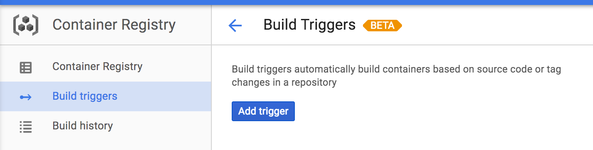
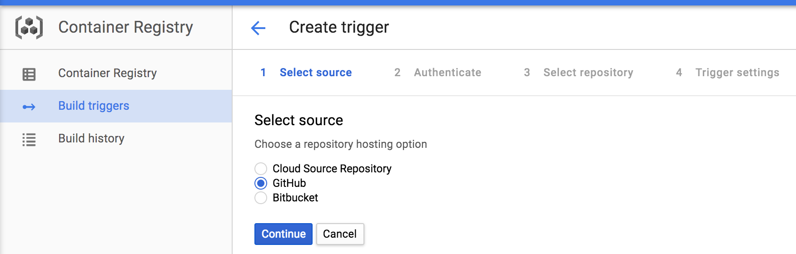
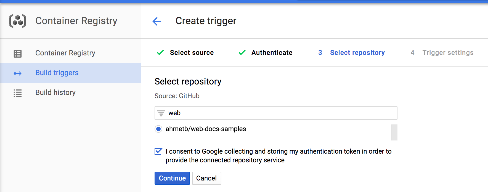
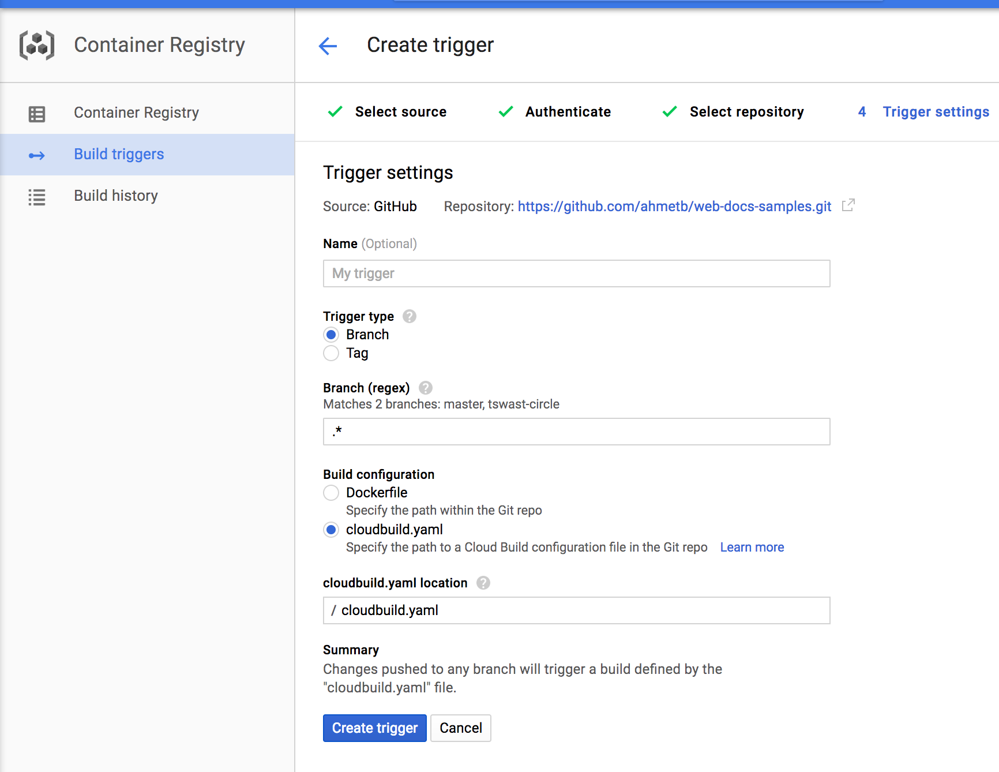
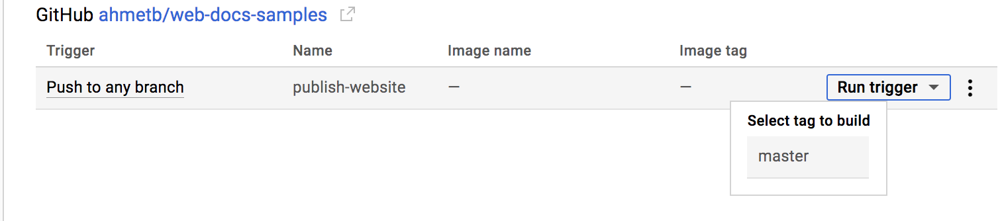
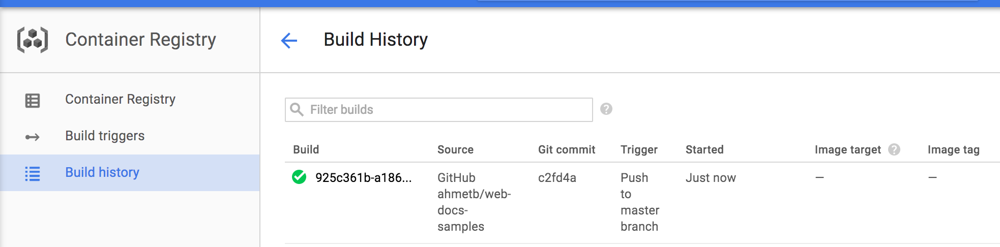
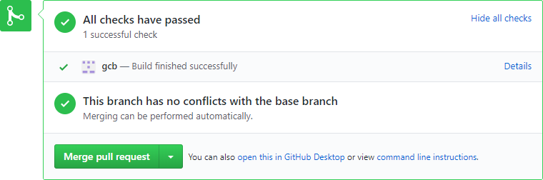

Clemens Buchacher | Xavo Software AG

This tutorial demonstrates how to use [Google Cloud Container Builder][gcb] as
a continuous integration service for Github Repositories. You will implement a
[Google Cloud Function][gcf] which listens to build events and updates the
build status in Github using the [Statuses API][statuses]. The function is
implemented in [Node.js][node].

[gcb]: https://cloud.google.com/container-builder/docs/
[gcf]: https://cloud.google.com/functions/docs/
[statuses]: https://developer.github.com/v3/repos/statuses/
[node]: https://nodejs.org/en/

## Prerequisites

1.  Create a project in the [Google Cloud Platform Console][console].
1.  [Enable billing][billing] for your project.
1.  Install the [Google Cloud SDK][sdk].

[console]: https://console.cloud.google.com/
[billing]: https://support.google.com/cloud/answer/6293499#enable-billing
[sdk]: https://cloud.google.com/sdk/

## Set up automated builds

You will use [Google Cloud Container Builder][gcb] and the [Build Triggers][bt]
feature to upload your website automatically every time you push a new git
commit to the source repository.

> Note: If you do not have a repository on GitHub, you can fork [this sample
> repository][sample-repo] for the purposes of this tutorial.

Head over to the Container Registry &rarr; [Build Triggers][triggers]
section on Google Cloud Platform Console and click “Add trigger”:



Then select GitHub as the source of your repository. In the next screen you may
be asked to authorize access to your GitHub account and repositories. This is
needed for Google Cloud Source Repositories to mirror and create commit hooks on
your GitHub repositories.



Then, pick your repository from the list. If you forked the sample repository
above, pick it here:



In the next screen

- choose Build Configuration "cloudbuild.yaml"
- choose Trigger Type ”Branch”
- Set the file location to `cloudbuild.yaml`



Now, create a `cloudbuild.yaml` file with the following contents in your
repository. Note that you can add files to your repository on GitHub’s website, or
by cloning the repository on your development machine:

```yaml
steps:
  - name: gcr.io/cloud-builders/git
    args: ["show", "README.md"]
```

This YAML file declares a build step with the `git show` command. It will print
the contents of README.md to the build logs.

After saving the file, commit and push the changes:

    $ git add cloudbuild.yaml
    $ git commit -m 'Add build configuration'
    $ git push

[bt]: https://cloud.google.com/container-builder/docs/running-builds/automate-builds
[sample-repo]: https://github.com/GoogleCloudPlatform/web-docs-samples
[triggers]: https://console.cloud.google.com/gcr/triggers

### Trigger the first build

Once you push the `cloudbuild.yaml` file to your repository and create the Build
Trigger, you can kick off the first build manually. Head over to the Google
Cloud Platform Console [Build Triggers][triggers] section, click “Run
Trigger” and choose the the branch (i.e. master) to build.



Now click the “Build history” on the left and watch the build job execute and
succeed:



Remember that after now, every commit pushed to any branch of your GitHub
repository will trigger a new build. If you need to change which git branches
or tags you use for publishing, you can update the Build Trigger configuration.

## Preparing the Cloud Function

1.  Run the following commands in a new empty directory.
1.  Create a `package.json` file by running the following command:

        $ npm init

1.  Run the following command to install the dependencies that the function
    uses to make REST calls to the Github API:

        $ npm install --save --save-exact @octokit/rest@15.2.6

### Writing the Function Code

Create a file named `index.js` with the following contents:

[embedmd]:# (index.js)
```js
'use strict';

const octokit = require('@octokit/rest')();
const GITHUB_ACCESS_TOKEN = '[TOKEN]';

/**
 * Background Cloud Function to be triggered by cloud-builds Pub/Sub topic.
 *
 * @param {object} event The Cloud Functions event.
 */
exports.gcb_github = (event) => {
  const build = eventToBuild(event.data.data);
  return postBuildStatus(build);
};

// eventToBuild transforms pubsub event message to a build object.
const eventToBuild = (data) => {
  return JSON.parse(new Buffer(data, 'base64').toString());
}

function postBuildStatus(build) {
  octokit.authenticate({
    type: 'token',
    token: GITHUB_ACCESS_TOKEN
  });

  let repo = getRepo(build);
  if (repo === null || repo.site !== 'github') {
    return Promise.resolve();
  }
  let [ state, description ] = buildToGithubStatus(build);
  return octokit.repos.createStatus({
    owner: repo.user,
    repo: repo.name,
    sha: build.sourceProvenance.resolvedRepoSource.commitSha,
    state: state,
    description: description,
    context: 'gcb',
    target_url: build.logUrl
  });
}

function getRepo(build) {
  let repoNameRe = /^([^-]*)-([^-]*)-(.*)$/;
  let repoName = build.source.repoSource.repoName;
  let match = repoNameRe.exec(repoName);
  if (!match) {
    console.error(`Cannot parse repoName: ${repoName}`);
    return null;
  }
  return {
    site: match[1],
    user: match[2],
    name: match[3]
  };
}

function buildToGithubStatus(build) {
  let map = {
    QUEUED: ['pending', 'Build is queued'],
    WORKING: ['pending', 'Build is being executed'],
    FAILURE: ['error', 'Build failed'],
    INTERNAL_ERROR: ['failure', 'Internal builder error'],
    CANCELLED: ['failure', 'Build cancelled by user'],
    TIMEOUT: ['failure', 'Build timed out'],
    SUCCESS: ['success', 'Build finished successfully']
  }
  return map[build.status];
}
```

The container builder publishes messages in the `cloud-builds`
[Pub/Sub][pubsub] topic. Each message triggers our cloud function with the
message contents passed as input data. The message contains the [build][build]
response. Here is an example of a build response, reduced to the most relevant
fields:

```json
{
  "id": "3e3c9152-6ba9-b562-e9c6-a49651c076ce",
  "projectId": "my-google-cloud-project-1234",
  "status": "WORKING",
  "source": {
      "repoSource": {
          "projectId": "my-google-cloud-project-1234",
          "repoName": "github-myowner-myreponame",
          "branchName": "master"
      }
  },
  "sourceProvenance": {
    "resolvedRepoSource": {
      "commitSha": "29d39613fa9958598228f7f162b3f03ab4189ece"
    }
  },
  "logUrl": "https://console.cloud.google.com/gcr/builds/3e3c9152-6ba9-b562-e9c6-a49651c076ce?project=1234567890"
};
```

The function then determines the Github repository owner and name, maps the
build status (`WORKING`, `FAILURE`, `SUCCESS`) to a commit state (`pending`,
`error`, `success`), and POST's to the Statuses API.

[pubsub]: https://cloud.google.com/pubsub/docs/
[build]: https://cloud.google.com/container-builder/docs/api/reference/rest/v1/projects.builds

### Generating a Github Personal Access Token

1. Read about [Creating a personal access token for the command line][token].
1. Select `repo:status` from the scopes.
1. Substitute the generated token for `[TOKEN]` in `index.js`.

> Note: To create statuses you must have write access to the target repository.
> POST's to the Statuses API will return a `NOT FOUND` error otherwise.

[token]: https://help.github.com/articles/creating-a-personal-access-token-for-the-command-line/

## Deploying the Cloud Function

1.  Read about [deploying Cloud Functions][deploying].
1.  Run the following command to deploy the function:

        $ gcloud beta functions deploy gcb_github --stage-bucket [YOUR_STAGE_BUCKET] --trigger-topic cloud-builds

    Replace `[YOUR_STAGE_BUCKET]` with your Cloud Functions staging bucket,
    e.g. gs://[PROJECT_ID]_cloudbuild.

[deploying]: https://cloud.google.com/functions/docs/deploying/filesystem

## Testing the integration

Trigger another build manually. The commit status is shown as a check mark or X mark in
the commit log in Github. More details of the build status are shown in Pull Requests.



You can check the [logs][logs] for errors.

[logs]: https://console.cloud.google.com/logs/viewer

## Credits

Section [Set up automated builds](#set-up-automated-builds) is derived from
@ahmetb's [Automated Static Website Publishing with Cloud Container
Builder](../automated-publishing-container-builder/index.md) tutorial.
