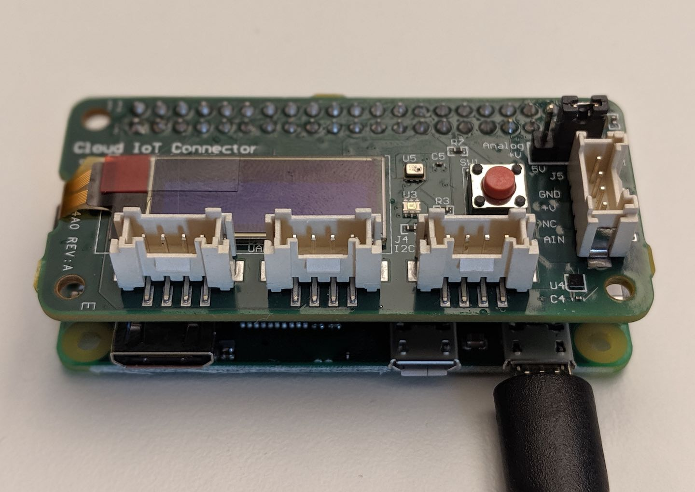

This tutorial shows you how to monitor an environment over a period of time and conduct an ad-hoc analysis on the collected data. You will
* Setup up the [Coral Environmental Sensor Board](https://coral.withgoogle.com/products/environmental) with a [Raspberry Pi](https://www.raspberrypi.org/products/).
* Connect the setup to Google Cloud Platform (GCP).
* Collect sensor data from Coral Environmental Sensor Board and process the data on GCP.
The architecture is shown in the following diagram:


In this tutorial the sensor data is generated by the Coral Environmental Sensor Board and streamed to [Cloud IoT Core](https://cloud.google.com/iot-core/) over the [MQTT](http://mqtt.org/) protocol. The sensor data is automatically published on [Cloud Pub/Sub](https://cloud.google.com/pubsub/) by Cloud IoT Core. Data published on Cloud Pub/Sub automatically triggers a [Cloud Functions](https://cloud.google.com/functions/) function that processes the data and stores them in [BigQuery](https://cloud.google.com/bigquery/). To analyze and visualize the data, they are loaded to [Google Spreadsheets](https://docs.google.com/spreadsheets) using the [Google Spreadsheets - BigQuery connector](https://cloud.google.com/blog/products/g-suite/connecting-bigquery-and-google-sheets-to-help-with-hefty-data-analysis) feature. To control the Coral Environmental Sensor Board command messages are sent from the spreadsheet using the [IoT Core Commands API](https://cloud.google.com/iot/docs/how-tos/commands).

## Objectives
* Provision the Coral Environmental Sensor Board.
* Set up Cloud Functions for sensor data processing.
* Set up BigQuery for data storage.
* Set up Google Spreadsheets to integrate with BigQuery and IoT Core.

## Prerequisite
* [Coral Environmental Sensor Board](https://coral.withgoogle.com/products/environmental), which can be purchased from [Mouser](https://www.mouser.com/ProductDetail/Coral/G650-04023-01?qs=sGAEpiMZZMve4%2FbfQkoj%252BLRlYTc0g%252BeK1GNpvUlp1KI%3D).
* [Raspberry Pi](https://www.raspberrypi.org/products/) with the [Raspbian](https://www.raspberrypi.org/downloads/) operating system installed. The Raspberry Pi should also be connected to the internet
* A [GCP account](https://console.cloud.google.com/freetrial).
* A user account linked to [G Suite Business or Enterprise or Education](https://gsuite.google.com/) for accessing the [Google Spreadsheets - BigQuery connector feature](https://cloud.google.com/blog/products/g-suite/connecting-bigquery-and-google-sheets-to-help-with-hefty-data-analysis).

## Costs
This tutorial uses billable components of GCP, including the following:
* [Cloud IoT Core](https://cloud.google.com/iot/pricing)
* [Cloud Pub/Sub](https://cloud.google.com/pubsub/pricing)
* [Cloud Functions](https://cloud.google.com/functions/pricing)
* [BigQuery](https://cloud.google.com/bigquery/pricing)

This tutorial should not generate any usage that would not be covered by the [free tier](https://cloud.google.com/free/), but you can use the [Pricing Calculator](https://cloud.google.com/products/calculator/#id=ceceb3a3-56ec-411d-9a10-91317bc7255b) to generate a cost estimate based on your projected production usage.

## Before you begin
1. [Select or create a GCP project](https://console.cloud.google.com/projectselector2/home/dashboard)
1. Make sure that [billing is enabled](https://cloud.google.com/billing/docs/how-to/modify-project) for your GCP project.
1. [Enable the Cloud IoT, Cloud Functions, Cloud Pub/Sub and Cloud BigQuery APIs](https://console.cloud.google.com/flows/enableapi?apiid=cloudiot.googleapis.com,pubsub.googleapis.com,cloudfunctions.googleapis.com,bigquery-json.googleapis.com).

When you finish this tutorial, you can avoid continued billing by deleting the resources you created. For more information, see [Cleaning up](#Cleaning-up).

## Provisioning the Coral Environmental Sensor Board
Attach the Sensor Board to the 40-pin header of your Raspberry Pi and power on your Raspberry Pi by plugging the power cable to it.


### Install the Coral Environmental Sensor Board library and driver
In this section, you install the Coral Environmental Sensor Board library and driver on the Raspberry Pi.

1. Follow the instructions of the [Install the Python library](https://coral.withgoogle.com/docs/enviro-board/get-started/#install-the-python-library) section on the Coral Environmental Sensor Board official page.
**Note:** Last step you do is rebooting your Raspberry Pi board.

### Checking out the tutorial source code on your board
Here you use the `wget` command to download the minimal necessary source code on Raspberry Pi. In Raspberry Pi shell run:
```bash
mkdir -p "$HOME"/enviro-board
cd "$HOME"/enviro-board
wget https://raw.githubusercontent.com/kingman/community/master/tutorials/cloud-iot-enviro-board-workshop/enviro-device/cloud_config.ini
wget https://raw.githubusercontent.com/kingman/community/master/tutorials/cloud-iot-enviro-board-workshop/enviro-device/core.py
wget https://raw.githubusercontent.com/kingman/community/master/tutorials/cloud-iot-enviro-board-workshop/enviro-device/enviro_demo.py
```
### Getting the public key of the secure element of your sensor board
The command outputs the public key of [cryptoprocessor](https://coral.withgoogle.com/docs/enviro-board/datasheet/#secure-cryptoprocessor) on the Coral Environmental Sensor Board. Copy the public key and save it so that you can access it at a later stage when creating device identity in Cloud IoT Core. In Raspberry Pi shell run:
```bash
cd /usr/lib/python3/dist-packages/coral/cloudiot

python3 ecc608_pubkey.py
```

## Check out the tutorial source code on Cloud Shell
1. In the GCP Console, [open Cloud Shell](http://console.cloud.google.com/?cloudshell=true)
1. Clone the source code repository, in Cloud Shell run:
```bash
cd $HOME
git clone https://github.com/kingman/community.git
```

## Creating the public key file of the sensor board
The cryptoprocessor exposes an Elliptic Curve public that was extracted in a previous step. In this step you save the public key in Cloud Shell in [PEM](https://en.wikipedia.org/wiki/Privacy-Enhanced_Mail) format. The key inside of the key file is wrapped by `-----BEGIN PUBLIC KEY-----` and `-----END PUBLIC KEY-----`.
1. Create the key file in Cloud Shell and name it: `device_pub_key.pem`
```bash
touch $HOME/community/tutorials/cloud-iot-enviro-board-workshop/device_pub_key.pem
```
1. Add the start wrapper to the key file
```bash
echo '-----BEGIN PUBLIC KEY-----' >> $HOME/community/tutorials/cloud-iot-enviro-board-workshop/device_pub_key.pem
```
1. Add the public key to the key file
```bash
echo 'replace with public key string' >> $HOME/community/tutorials/cloud-iot-enviro-board-workshop/device_pub_key.pem
```
1. Add the end wrapper to the key file
```bash
echo '-----END PUBLIC KEY-----' >> $HOME/community/tutorials/cloud-iot-enviro-board-workshop/device_pub_key.pem
```

## Provisioning device identity on GCP
For a device to communicate with IoT Core, the device identity needs to be created in IoT Core.

1. Configuring environment variables
To make it easier to run commands when you create cloud resources you set environment variables to hold the names and properties of the resources. In Cloud Shell run:
```bash
export EVENT_TOPIC=enviro-event
export REGISTRY_ID=enviro-registry
export REGION=europe-west1
export DEVICE_ID=enviro-board
export DATASET=enviro_dataset
export TABLE=sensor_data
```
1. Creating the Pub/Sub topic
```bash
gcloud pubsub topics create $EVENT_TOPIC
```
1. Creating the IoT Core registry
```bash
gcloud iot registries create $REGISTRY_ID \
  --region $REGION \
  --event-notification-config=topic=$EVENT_TOPIC
```
1. Creating the device identity in IoT Core
Here you create the sensor board identity in the newly created IoT Core registry with Sensor Board public key. In Cloud Shell run:
```bash
cd $HOME/community/tutorials/cloud-iot-enviro-board-workshop/
gcloud iot devices create $DEVICE_ID \
  --region=$REGION \
  --registry=$REGISTRY_ID \
  --public-key=path=device_pub_key.pem,type=es256
```

## Verifying the data ingestion setup
You now have all the building blocks set up and integrated to ingest data from the Coral Sensor Board to GCP. In this section you verify the end-to-end integration between the Sensor board and Cloud Pub/Sub.
### Creating the event topic subscription
Messages sent from device to Cloud IoT Core are automatically published on Cloud Pub/Sub. Here you create a subscription to Cloud Pub/Pub topic and later use the subscription to get the messages. In Cloud Shell run:
```bash
gcloud pubsub subscriptions create verify-event \
--topic=$EVENT_TOPIC
```
### Configuring the Raspberry Pi
In this section, you configure the Raspberry Pi to send sensor data to IoT Core.
1. In Raspberry Pi shell set the your GCP project id as environment variable
```bash
export PROJECT_ID=your-gcp-project-id
```
1. In Raspberry Pi shell set the your GCP project id in the device application configuration file.
```bash
sed -i -e 's/<replace with project id>/'"${PROJECT_ID}"'/g' $HOME/enviro-board/cloud_config.ini
```

### Downloading the CA-certificate
Download the Google root CA certificate to establish the chain of trust to communicate with Google Cloud IoT using TLS transport.
In Raspberry Pi shell run:
```bash
cd $HOME/enviro-board/
wget https://pki.goog/roots.pem
```

### Running the streaming script
You start the demo script to read the sensors measurement values of the Coral Environment Board and publishes the data to Cloud Pub/Sub via Cloud IoT Core.
1. To start the demo script run following commands In Raspberry Pi shell run:
```bash
cd $HOME/enviro-board/
python3 enviro_demo.py --upload_delay 10
```
1. Let the script run for 20 second before stop it by press `Control+C`

### Verifying sensor data in Pub/Sub
The sensor values sent from the Raspberry Pi will be published to Cloud Pub/Pub. In this step you pull the messages from the Pub/Sub subscription created in the earlier step and verify that the values are delivered to Cloud Pub/Sub.
1. Pull message from Pub/Sub subscription. In Cloud Shell run:
```bash
gcloud pubsub subscriptions pull verify-event --auto-ack
```
1. Verify you get the messages from the Sensor Board

## Setting up the Cloud Function for process sensor data

### Deploying Cloud Function
In this section, you deploy the Cloud Functions that gets triggered by the sensor data messages published to Cloud Pub/Sub. The function parses the message and adds the values to BigQuery.
1. To deploy the function, in Cloud Shell run:
```bash
cd $HOME/community/tutorials/cloud-iot-enviro-board-workshop/functions
gcloud functions deploy enviro \
 --set-env-vars=DATASET=${DATASET},TABLE=${TABLE} \
 --region ${REGION} \
 --trigger-topic ${EVENT_TOPIC} \
 --runtime nodejs8 \
 --memory 128mb
```

## Setting up data storage
In this section you create the dataset and table in BigQuery, to store the sensor data. In Cloud Shell run:
```bash
bq mk $DATASET

bq mk ${DATASET}.${TABLE} $HOME/community/tutorials/cloud-iot-enviro-board-workshop/bq/schema.json
```

## Starting the sensor data stream
In this section you restart the demo-script on the Raspberry Pi to generate sensor data that triggers the Cloud Function to store the data in BigQuery. You can control the interval of which the sensor data is being sent to Cloud by setting the upload_delay parameter.
1. In Raspberry Pi shell run:
```bash
cd $HOME/enviro-board/
python3 enviro_demo.py --upload_delay 15
```

## Viewing sensor data in BigQuery
Open the [BigQuery console](http://console.cloud.google.com/bigquery), paste the following query into the Query editor and select Run. Replace the placeholder `<PROJECT_ID>` with your project id.

```sql
SELECT * FROM `<PROJECT_ID>.enviro_dataset.sensor_data`
ORDER BY time DESC
LIMIT 20
```
Verify a table with sensor data is returned. Discontinue the sensor data streaming from the Raspberry Pi shell by press `Control+C`

## Perform data analytics and device control
In this section you start from the sample spreadsheet and configure it to retrieve data from your cloud project and send commands to your device.

### Setting up Google Spreadsheets
1. Open the [sample spreadsheet](https://docs.google.com/spreadsheets/d/1LI07utVbiuonjZfn2ORWmC0kC5_OYc7CYw3vZF1aEuo).
1. Click **File** > **Make a copy…** to make a copy of it.
1. Input a name for the copy and click **OK** to save.

#### Configure OAuth2
Here you create an OAuth client and configure your spreadsheet to use the client.
1. In your spreadsheet click **IoT** > **OAuth Configuration**, to open the OAuth configuration menu.
1. Make a copy of the Authorized redirect URI shown in the configuration menu.
1. Go to the [API Credentials page](https://console.cloud.google.com/apis/credentials)
1. Click **Create credentials** > **OAuth client ID**
1. Choose Web application
1. Give the credential an identifiable name
1. Paste the Authorized redirect URI you retrieved in the earlier step into the **Authorized redirect URIs** input field
1. Click **Create**
1. Make a copy of the **client ID** and the **client secret** that are shown after the client is created.
1. Go back to your spreadsheet and paste the **client ID** and the **client secret** values into their corresponding input field in the **OAuth Configuration** menu
1. Click **Save** and wait for the **config saved!** response before **Close** the menu.

#### Configure IoT Core
Here you configure your spreadsheet with your GCP project specific value. The spreadsheet needs these values to retrieve device data from Cloud IoT Core.
1. Click **IoT** > **IoT Core Configuration**
1. Fill in values of your GCP **project**, IoT Core **region** and **registry**
1. Click **Save** and wait for the **config saved!** response before **Close** the menu.

### Load devices
In the section you go through the authorization steps that enable the spreadsheet to retrieve information from GCP and use the spreadsheet to fetch your device id from Cloud IoT Core.
1. Click **IoT** > **Load Devices** and first time the sidebar opens.
1. Click **Authorize** link in the sidebar and follow through the authorization follow to allow the script to access the IoT Core API on your behalf.
1. When the OAuth2 flow is successful a new tab is opened with message: **Success! You can close this tab.**
1. Close the tab.
1. Click **IoT** > **Load Devices** once again and verify your device name gets populated under the devices column
1. Click on the check box next to the device name cell to select it.

### Setup BigQuery connector
Here you configure your spreadsheet BigQuery connector to load data from your sensor_data table in BigQuery
1. Click **Data** > **Data Connectors** > **BigQuery**
1. Choose you GCP project from the dropdown list and click **Write query**
1. Paste following query into the editor and replace the place holder ``<PROJECT_ID>`` with your project id.
```sql
SELECT * FROM `<PROJECT_ID>.enviro_dataset.sensor_data`
WHERE time > TIMESTAMP(CURRENT_DATE())
AND device_id = @DEVICE_ID
ORDER BY time
```
1. Add a new parameter. Click **Parameters** > **Add**. Fill in `DEVICE_ID` for **Name** and `Sheet1!C2` for **Cell reference**. Click **Add**
1. Click **Insert result**

### Send command to your board
In this section you use your spreadsheet to send abitrary string message to your Raspberry Pi and the message is displayed on the OLED display of the Coral Environmental Sensor Board.
1. In cell under the **Command** cell write a simple text message.
1. Send command by click **IoT** > **Send command to device**.
1. Verify you get an `Device is not connected` error message when the demo script is turned off on your Raspberry Pi.
1. Restart the demo script from your Raspberry Pi shell by running: `python3 enviro_demo.py`
1. Click **IoT** > **Send command to device** to resend the message.
1. Verify the message gets displayed on the OLED display.

### Analytics in Google Sheets
Here is a list of things that you can do to further experiment with the data and device command functions from within your spreadsheet.
- Create time series graph over the sensor data.
- Derive moving time average value from raw sensor data.
- Create recurring job that [auto loads](https://gsuiteupdates.googleblog.com/2019/02/refresh-bigquery-data-sheets.html) the data from BigQuery.
- Create function that monitors the sensor values and automatically sends commands when configure threshold values are breached.

## Cleaning up
To avoid incurring charges to your Google Cloud Platform account for the resources used in this tutorial:
### Delete the project
The easiest way to eliminate billing is to delete the project you created for the tutorial.
To delete the project:
1. In the Cloud Platform Console, go to the Projects page. [GO TO THE PROJECTS PAGE](https://console.cloud.google.com/iam-admin/projects)
1. In the project list, select the project you want to delete and click **Delete**.
1. In the dialog, type the project ID, and then click **Shut down** to delete the project.

## Next steps
- Learn more about [Google Cloud IoT](https://cloud.google.com/solutions/iot/)
- Learn more about [Microcontrollers and real-time analytics](https://cloud.google.com/community/tutorials/ardu-pi-serial-part-1)
- Learn more about [Streaming into BigQuery](https://cloud.google.com/solutions/streaming-data-from-cloud-storage-into-bigquery-using-cloud-functions)
- Learn more about [Asynchronous patterns for Cloud Functions](https://cloud.google.com/community/tutorials/cloud-functions-async)
