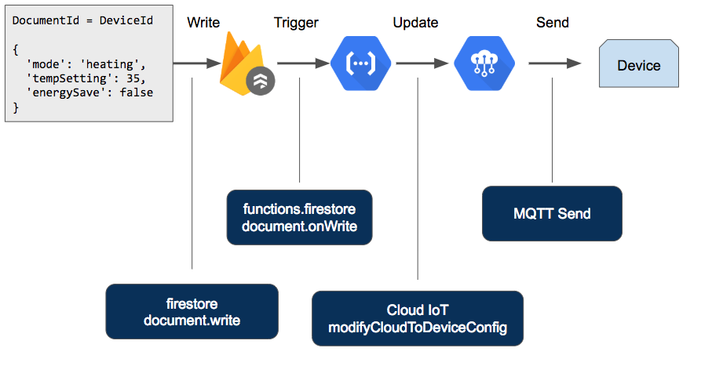
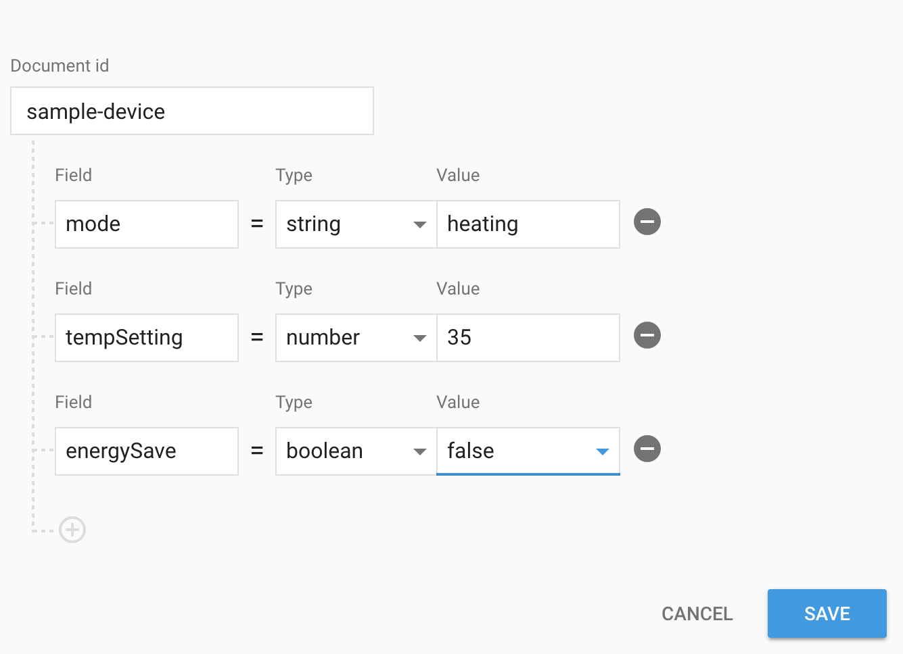
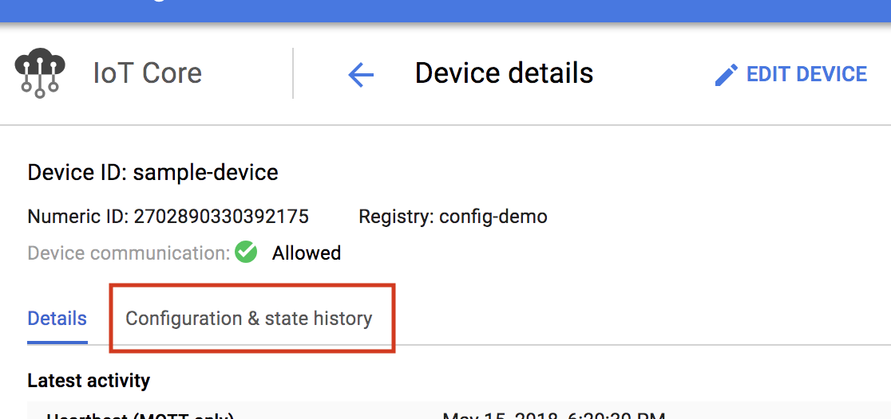
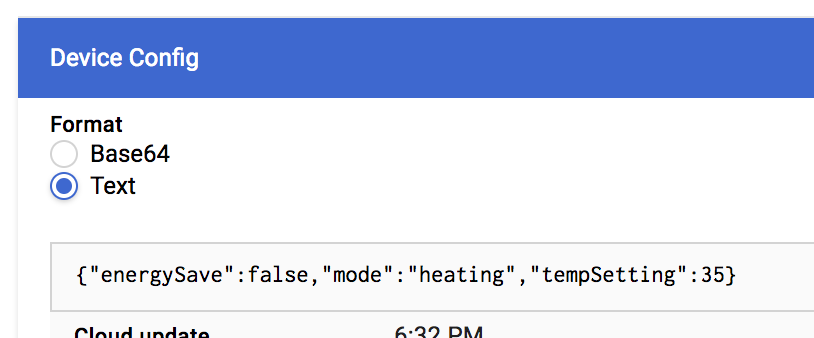
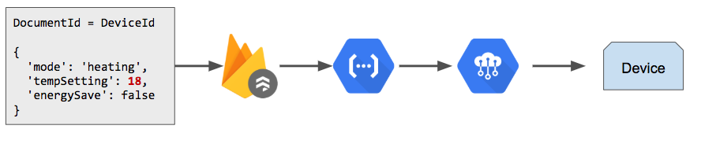

Preston Holmes | Solution Architect | Google

This tutorial demonstrates how to configure Cloud Functions for Firebase to relay document changes in [Cloud Firestore](https://firebase.google.com/docs/firestore/) as configuration updates for [Cloud IoT Core](https://cloud.google.com/iot) Devices.

Cloud IoT Core provides a way to send configuration to devices over MQTT or HTTP. The structure of this payload is unspecified and delivered as raw bytes. This means that if you have different parts of your IoT system wanting to write parts of the configuration, each has to parse, patch, then re-write the configuration value in IoT Core.

If you want to payload delivered to a device as a binary format, such as [CBOR](http://cbor.io/), that means each of these participating components of your system also need to deserialize and re-serialize the structured data.

By using Cloud Firestore to serve as a layer in between the systems that want to update a device's configuration, and IoT Core, you can take advantage of Firestore's structured [data types](https://firebase.google.com/docs/firestore/manage-data/data-types) and partial document updates.

## Objectives

- Manage structured device configuration in a managed cloud database
- Automate partial updates to fields within device configuration
- Convert human friendly configuration to binary form before sending to device automatically
- Use queries to find all devices in a specific configuration state

[//]: # (Google private graphics originals: https://docs.google.com/presentation/d/1xpjaxbgwhUlKLEs-793otoA7xa950OkAJQZzOlRW100/edit#slide=id.p)

**Figure 1.** *Architecture diagram for tutorial components*



## Before you begin

This tutorial assumes you already have a Cloud Platform account set up and have completed the IoT Core [quickstart documentation](https://cloud.google.com/iot/docs/quickstart).

You need to associate Firebase to your cloud project. Visit the [Firebase Console](https://console.firebase.google.com/?authuser=0) and choose to add a project. You can then choose to add Firebase to an existing Cloud Project.

## Costs

This tutorial uses billable components of GCP, including:

- Cloud IoT Core
- Cloud Firestore
- Cloud Functions for Firebase

This tutorial should not generate any usage that would not be covered by the [free tier](https://cloud.google.com/free/), but you can use the [Pricing Calculator](https://cloud.google.com/products/calculator/) to generate a cost estimate based on your projected production usage.

## Set up the environment

If you do not already have a development environment set up with [gcloud](https://cloud.google.com/sdk/downloads) and [Firebase](https://firebase.google.com/docs/cli/) tools, it is recommended that you use [Cloud Shell](https://cloud.google.com/shell/docs/) for any command line instructions.

Set the name of the Cloud IoT Core settings you are using as environment variables:

```sh
export REGISTRY_ID=config-demo
export CLOUD_REGION=us-central1 # or change to an alternate region;
export GCLOUD_PROJECT=$(gcloud config list project --format "value(core.project)")
```

## Create a Cloud IoT Core registry for this tutorial

Create a PubSub topic we will use for device logs:

```sh
gcloud pubsub topics create device-events
```

Create the IoT Core registry:

```sh
gcloud iot registries create $REGISTRY_ID --region=$CLOUD_REGION --event-notification-config=subfolder="",topic=device-events
```

## Deploy the relay function

You will use a Firestore document trigger to run a function every time a qualifying document is updated.

The function will only run when documents in the `device-configs` collection are updated.

The document key will be used as the corresponding device key.

The main part of the function handles a PubSub message from IoT Core, extracts the log payload and device information, and then writes a structured log entry to Stackdriver Logging:

[embedmd]:# (functions/src/index.ts /import/ $)
```ts
import * as admin from "firebase-admin";
import * as functions from 'firebase-functions';
import { runInDebugContext } from 'vm';
import { DeviceManager } from './devices';

// create a device manager instance with a registry id, optionally pass a region
const dm = new DeviceManager('config-demo');

// start cloud function
exports.configUpdate = functions.firestore
  // assumes a document whose ID is the same as the deviceid
  .document('device-configs/{deviceId}')
  .onWrite((change: functions.Change<admin.firestore.DocumentSnapshot>, context?: functions.EventContext) => {
    if (context) {
      console.log(context.params.deviceId);
      // get the new config data
      const configData = change.after.data();
      return dm.updateConfig(context.params.deviceId, configData);
    } else {
      throw(Error("no context from trigger"));
    }

  })
```

To deploy the cloud function, you use the Firebase CLI tool:

```sh
cd functions
npm install
firebase use $GCLOUD_PROJECT
firebase deploy --only functions
```

## Create our device

create a dummy sample device:

```sh
cd ../sample-device

gcloud iot devices create sample-device --region $CLOUD_REGION --registry $REGISTRY_ID --public-key path=./ec_public.pem,type=ES256
```

Note: do not use this device for any real workloads, as the keypair is included in this sample and should not be considered secret.


### Establish a device configuration in Firestore

Open the [Firebase Console](https://console.firebase.google.com/).

1. Choose the project you previously associated Firebase with. On the left hand side list of services, choose `Database` and choose to use Firestore.
1. Choose `+ ADD COLLECTION` and name the collection `device-configs`.
1. You will be prompted to add your first document, use `sample-device` for the Document Id.
1. For the field, type, and value use the following:



Note that the different fields in the config can have different data types.  Save this document.

Now open the [Cloud IoT Core console](https://console.cloud.google.com/iot/locations/us-central1/registries/config-demo/devices/sample-device), choose the device and look at the `Configuration & state history` pane:



If the Function ran succesfully - you should be able to select, and see the initial configuration saved with the device.



## Modify the config

Lets start up the sample device now in your shell

```sh
# still in the sample-device subfolder

npm install

node build/index.js
```

You should see output that looks like:

```sh
Device Started
Current Config: 
{ energySave: false, mode: 'heating', tempSetting: 35 }
```

Now lets update the config document in the Firestore console to change the tempSetting value to `18`

When this document edit is saved, it triggers a function, which will push the new config down to the device:



You should see this new config arrive at the sample device in a second or two.

```sh
Current Config: 
{ energySave: false, mode: 'heating', tempSetting: 18 }
```

To do this programatically with IoT Core APIs alone, you have to read the current config from the IoT Core device manager, update the value, then write the new config to IoT Core.  IoT Core does provide a incrementing version number you can send with these writes to check that another process has also not attempted to concurrently update the config.

This solution assumes that the path using Firestore and functions are not sharing the config update job with other processes, but are acting as a flexible intermediate.


## Perform Queries with Firestore

You can use the [query capabilities](https://firebase.google.com/docs/firestore/query-data/queries) of Firestore to find devices with specific configurations:

```js
var configs = db.collection('device-configs');
var hotDevices = configs.where('tempSetting', '>', 40);
```

The above snippet is for nodejs, but see the [Firestore quickstart](https://firebase.google.com/docs/firestore/quickstart) for how to set up and query from a number of different runtimes.


## Binary data with CBOR

const bb == base64 enoded binary
var db = new Buffer(bb, 'base64');
db syould be what comes over wire
v = cbor.decodeFirstSync(db)

## Cleaning up

Kill the sample device:

```sh
killall node
```
Because the test device uses a non-secret key, you should delete it:

```sh
gcloud iot devices delete log-tester --registry $REGISTRY_ID --region $CLOUD_REGION
```

All of the resource in this tutorial cost nothing at rest, or scale to zero.  You can delete Cloud Functions, Device Registry, and PubSub topics from the console.

