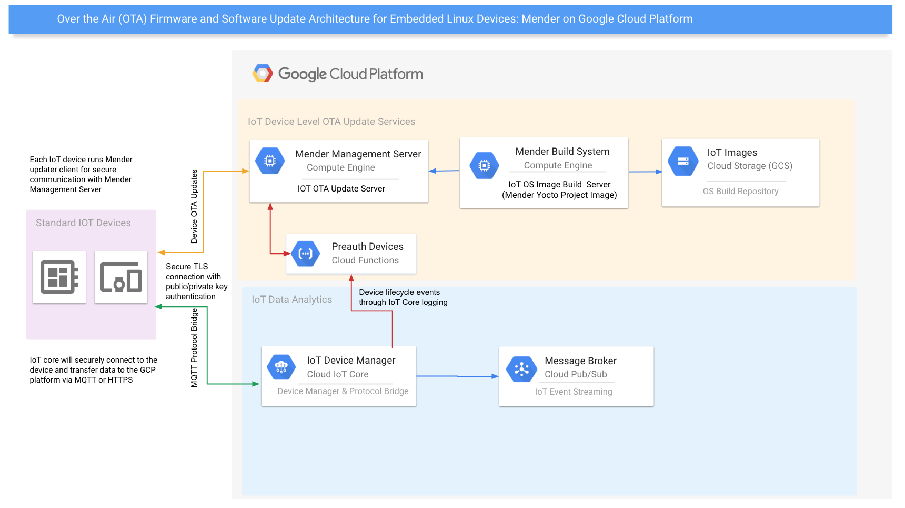
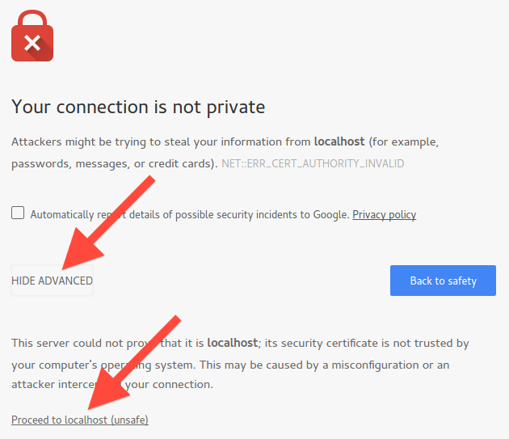
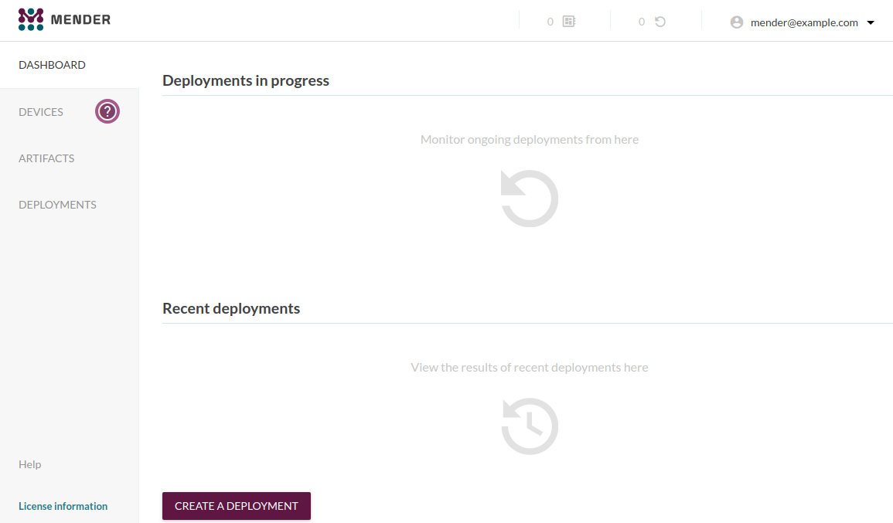
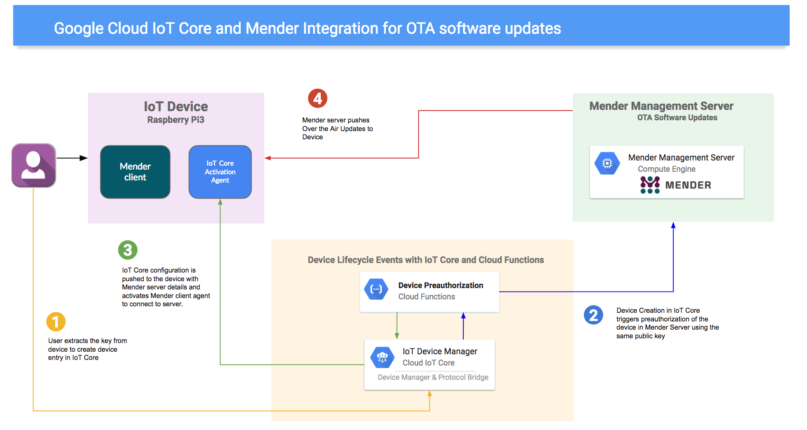
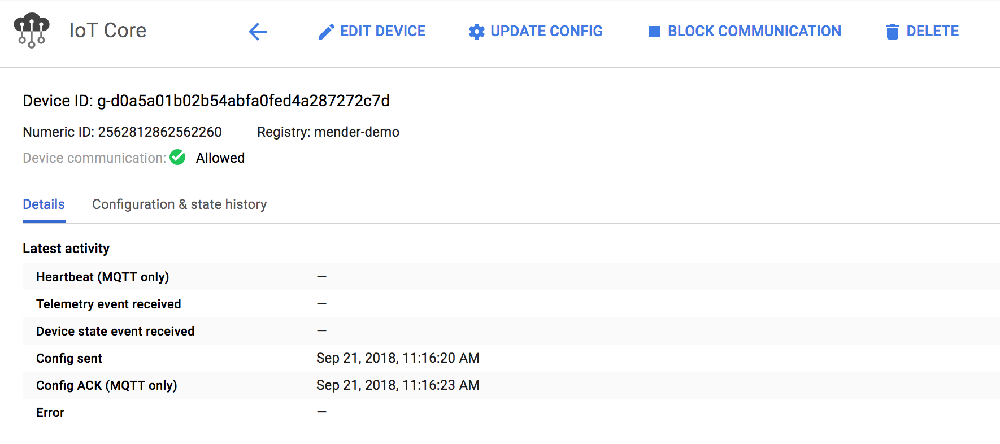
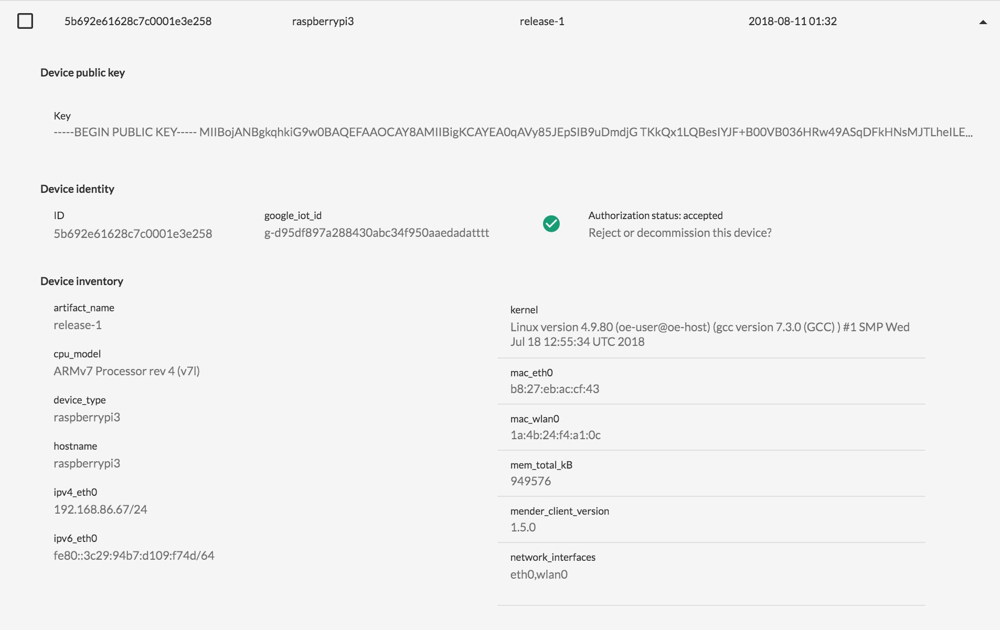
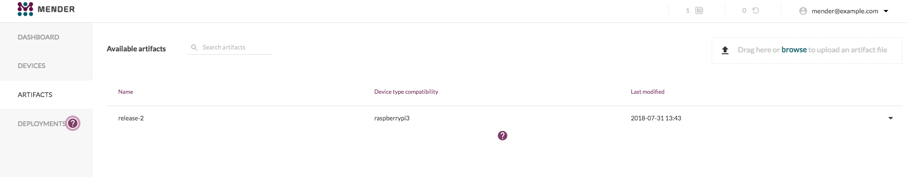
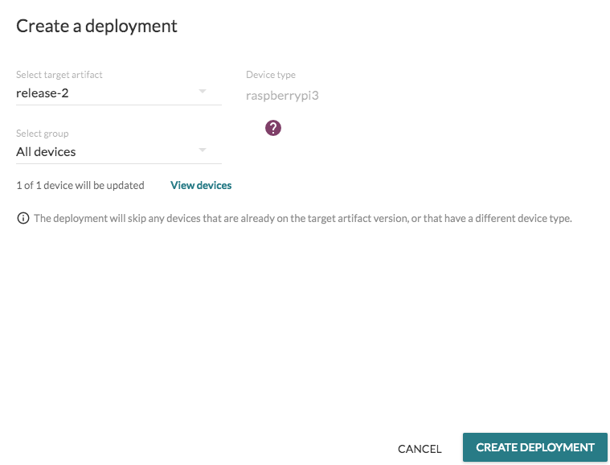
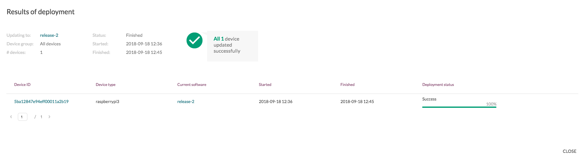
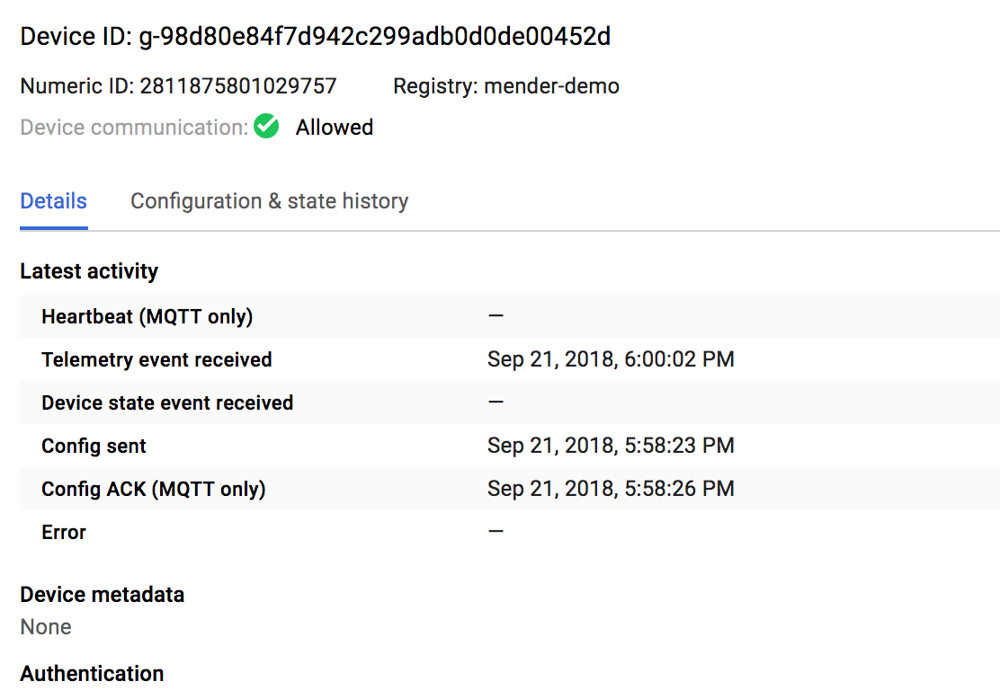

KC Rakam | Customer Engineer Specialist | Google Cloud<br>
Preston Holmes | Solution Architect | Google Cloud<br>
Drew Moseley | Solution Architect | Mender<br>
Eystein Stenberg | Product Manager | Mender<br>

This tutorial demonstrates how to successfully deploy over-the-air (OTA) software update solution for embedded Linux devices using Mender on Google Cloud Platform.

## Objectives

 - Deploy a Mender management server on GCE
 - Integrate device identity and lifecycle between IoT Core and Mender
 - Configure a live sample device with base image
 - Push over-the-air update to device with IoT Core application

## Before you begin

This tutorial assumes you already have a Cloud Platform account set up and have completed the [getting started guide](https://cloud.google.com/iot/docs/how-tos/getting-started) including enabling the Cloud IoT Core API. You need to associate Firebase to your cloud project. To add Firebase to your cloud project please visit the [Firebase Console](https://console.firebase.google.com) choose "Add project" and select your cloud project and click on “Add Firebase”.

 - For most commands, it is recommended you use [Google Cloud Shell](https://cloud.google.com/shell/docs/quickstart). If you want to use only your local command line, you will need the [Google Cloud SDK ](https://cloud.google.com/sdk/downloads) and [Firebase tools](https://firebase.google.com/docs/cli/).
 - You will need to ensure the required environment variables are set in each shell environment (Please use the below variables for every new session)
 - To work with the part of the tutorial that images a real device, you will need to have a Raspberry Pi 3 device, SD Card, and the ability to plug it into ethernet on your LAN (wifi configurations are not supported in this tutorial).
    
## Costs

This tutorial uses billable components of GCP, including:

* Cloud IoT Core
* Cloud PubSub
* Google Compute Engine
* Google Cloud Storage
* Cloud Functions for Firebase
* Stackdriver Logging

Use the [Pricing Calculator](https://cloud.google.com/products/calculator/) to generate
a cost estimate based on your projected production usage.

## Background

[Mender](https://mender.io/) is an open source remote update manager for embedded Linux devices. The aim of the project is to help secure connected devices by providing a robust and easy software update process.

Some of the key features of Mender include

* OTA update server and client
* Full system image update
* Symmetric A/B image update client
* Bootloader support: U-Boot and GRUB
* Volume formats: MBR and UEFI partitions
* Update commit and roll-back
* Build system: Yocto Project (meta-mender)
* Remote features: deployment server, build artifact management, device management console

More information on Mender can be found [here](https://mender.io/what-is-mender).

### Mender Components

* **Mender management server** - Mender Management Server, which is the central point for deploying updates to a population of devices. Among other things, it monitors the current software version that is installed on each device and schedules the rollout of new releases.

* **Mender build system** - Software build system generates a new version of software for a device. The software build system is a standard component, such as the Yocto Project. It creates build artifacts in the format required by the target device. There will be different build artifacts for each type of device being managed.

* **Mender Client -** Each device runs a copy of the Mender update client, which polls the Management Server from time to time to report its status and to discover if there is a software update waiting. If there is, the update client downloads and installs it.

### Mender on GCP - High Level Architecture Diagram:

The following architecture diagram provides a high level overview of the various components on GCP to enable OTA updates with Mender and Google Cloud IOT Core



## Setting up Mender Server on GCE

### Mender Management Server Deployment Options

There are several options for successfully setting up Mender services with Google Cloud Platform (GCP), this tutorial will use a minimally configured Mender Management Production Server to test the end to end workflow:

* [Mender Management Demo Server](https://docs.mender.io/getting-started/create-a-test-environment) - For quickly testing the Mender server, Mender provides a  pre-built demo version that does not take into account production-grade issues like security and scalability

* [Mender Management Production Server](https://docs.mender.io/administration/production-installation) - Mender Server for production environments, and includes security and reliability aspects of Mender production installations.

* [Hosted Mender Service](https://mender.io/signup)  - Hosted Mender is a secure management service so you don't have to spend time maintaining security, certificates, uptime, upgrades and compatibility of the Mender server. Simply point your Mender clients to the Hosted Mender service.

### Preparing the project and shell environment

Mender Management server requirements from Mender are outlined [here](https://docs.mender.io/getting-started/requirements) and we will be using the base instructions as documented for setting up a production environment and deploy on Google Cloud Platform, however this is minimally configured and not suited for actual production use. 

Setup the [Google Cloud Shell](https://cloud.google.com/shell/docs/quickstart) environment (you will use several different shell environments)

Note: If you are *not* using Cloud Shell you will need to run these first in your local environment:

```
gcloud auth login

gcloud config set project MY-PROJECT # replace with the name of your project
```

Enable some of the APIs we will be using, the compute API takes a minute or two to enable:
```
gcloud services enable compute.googleapis.com cloudiot.googleapis.com pubsub.googleapis.com
```

Open Firewall ports so that we can reach the Mender server once installed
```
gcloud compute firewall-rules create mender-ota-443 --allow tcp:443
gcloud compute firewall-rules create mender-ota-9000 --allow tcp:9000
```

Set Environment Variables we will use in later commands:
```
export FULL_PROJECT=$(gcloud config list project --format "value(core.project)")
export PROJECT="$(echo $FULL_PROJECT | cut -f2 -d ':')"
export CLOUD_REGION='us-central1'
```

Create two Cloud Storage buckets you will use for images and updates:

```
gsutil mb -l $CLOUD_REGION gs://$PROJECT-mender-server
gsutil mb -l $CLOUD_REGION gs://$PROJECT-mender-builds
```

### Installing Mender Management Server

* Step 1: Create a Google Cloud Compute Engine and run a [startup script](https://cloud.google.com/compute/docs/startupscript) to install various dependencies including Docker, as well as installing and starting the [Mender Server](https://docs.mender.io/administration/production-installation).

```
gcloud beta compute --project $PROJECT instances create "mender-ota-demo" --zone "us-central1-c" --machine-type "n1-standard-2" --subnet "default" --maintenance-policy "MIGRATE" --scopes "https://www.googleapis.com/auth/cloud-platform" --metadata=startup-script-url=https://raw.githubusercontent.com/GoogleCloudPlatform/community/master/tutorials/cloud-iot-mender-ota/server/mender_server_install.sh --min-cpu-platform "Automatic" --tags "https-server" --image "ubuntu-1604-xenial-v20180814" --image-project "ubuntu-os-cloud" --boot-disk-size "10" --boot-disk-type "pd-standard" --boot-disk-device-name "mender-ota-demo"
```


Note: The startup script will take roughly 3-5 minutes to completely install all the prerequisites including Docker CE, Docker compose and Mender Server.

* Step 2 : Navigate to the Mender UI by clicking on the external IP address of "mender-ota-demo" which can be found from the [GCP console → Compute Engine](https://console.cloud.google.com/compute). In most browsers you will get a certificate warning and you will need to click “advanced” and “proceed” or similar. In an actual production environment, you would provision this server with a trusted certificate.



* Once you are the Mender UI login using credentials created by the startup script which will take you to the Mender Dashboard. 

    * Username - [mender@example.com](mailto:mender@example.com)

    * Password - mender_gcp_ota



Congrats you just finished creating the Mender Server on Google Cloud Platform. 

_Hosted Mender Service_

The above steps are for self-managed Open Source Mender Management Server on GCP, Mender also provides fully managed [Hosted Mender service](https://mender.io/signup) .   

The next section describes how to use a Yocto Project image for a raspberry Pi3 device.

## Imaging device with pre-built Mender Yocto Images

This section outlines the steps  involved in configuring and working directly with provided pre-built images.

If you would like to learn how to build your own images on GCE with Yocto, see these [extra instructions](https://github.com/GoogleCloudPlatform/community/tree/master/tutorials/cloud-iot-mender-ota/image).

Using the existing Cloud Shell environment clone the source repository for this tutorial.

```
git clone https://github.com/GoogleCloudPlatform/community.git
```

You now will update the prebuilt image with some configuration specific for your project.

```
bash community/tutorials/cloud-iot-mender-ota/image/update-image.sh
```

This will take a couple minutes to pull the default image, update with configuration for your project, and then upload it back to one of the buckets you created earlier.

To flash this image, we need to switch back to your local machine.

You can use gsutil on your machine as suggested by the update script's output, or download this updated image from the console from the [storage browser](https://console.cloud.google.com/storage/browser); it will be in the {project}-mender-builds folder.

### Provisioning a new device (Writing the image to Raspberry Pi3 device)

Note: You may also want to use the [Etcher](https://etcher.io/) GUI tool instead of the dd command line tool outlined below.

Next you will:

    * Insert the SD card into the SD card slot of your local PC where you have the "updated-demo-image-raspberrypi3.img" image downloaded.
    * Unmount the drive (instructions below for Mac)

```
df  -h  (Use this command to determine where the drive is mounted)
```
```
# on OS X: 
diskutil unmountDisk /dev/disk3 (assuming /dev/disk 3 is SD card)
```
```
# on Linux:
umount <mount-path>
```
  	 
Command to write the image to SD card and please adjust the local path to your .img file location. Depending on the image size it may take roughly 20 minutes so please be patient until the image is completely written to the SD card. 
```
sudo dd if=/Users/<local PC path where you have your image downloaded>/updated-demo-image-raspberrypi3.img of=/dev/disk2 bs=1m && sudo sync 
``` 

Next you will configure the device to connect to Mender Management Server and Google IOT core with the same private/public key pair.

## Mender Client Integration - GCP IoT Core and Mender Management Server

This section outlines the steps to connect the Mender Client (running on a Raspberry Pi3 device) to Google Cloud IoT Core as well as Mender Server with the same public/private key authentication and additionally will deploy an OTA update to the device remotely as depicted in the below diagram. 

. 

Key components you will use in this section are:

* Google Cloud IoT Core 
* Google Cloud Functions/Firebase Functions
* Google Cloud/Stackdriver Logging
* Mender Server on Google Cloud
* Raspberry Pi3 (Device/Client)

Using the Cloud Shell environment, create a Cloud IoT Core registry and Cloud Pub/Sub topic for this tutorial that will be used for the device to authenticate and send telemetry data.

```
export REGISTRY_ID=mender-demo
gcloud pubsub topics create iot-telemetry
gcloud pubsub topics create registration-events
gcloud iot registries create $REGISTRY_ID --region=$CLOUD_REGION --event-notification-config=subfolder="",topic=iot-telemetry
```


### Integrate IoT Core Device Lifecycle events and Mender Preauthorization

Using the Cloud Shell environment you will configure Cloud IoT Core audit logs to route to a Cloud PubSub topic.

Create a log export for IoT Core device creation events to PubSub:
```
gcloud beta logging sinks create device-lifecyle \
pubsub.googleapis.com/projects/$PROJECT/topics/registration-events \
--log-filter='resource.type="cloudiot_device" protoPayload.methodName="google.cloud.iot.v1.DeviceManager.CreateDevice"' 
```

Give the log exporter system-account permission to publish to your topic:
```
gcloud beta pubsub topics add-iam-policy-binding registration-events \
--member $(gcloud beta logging sinks describe device-lifecyle --format='value(writerIdentity)') \
--role roles/pubsub.publisher
```

**Deploy Firebase Functions to call Mender Preauthorization API** 

This will link device creation in Cloud IoT Core to Device pre-authorization in Mender.

Note: be sure you associated Firebase with your cloud project as noted in "Before you begin"

Deploy Firebase Functions to subscribe to Pub/Sub topic "registration-events" which you created in the last step to [preauthorize](https://docs.mender.io/server-integration/preauthorizing-devices) IoT Core Devices with the Mender Server every time a new device is created in IoT Core

Using the repo you cloned into your cloud shell earlier, switch to the functions directory:

```
cd ~/community/tutorials/cloud-iot-mender-ota/auth-function/functions
firebase login --no-localhost
firebase use --add $PROJECT
```

Let's set the environment variables for the functions. Replace the IP address for mender.url with the external IP address of your mender server.

Note: you may be prompted to verify your compute instance zone, the default may be incorrect, so answer 'n'.

```
export GCP_IOT_MENDER_DEMO_HOST_IP_ADDRESS=$(gcloud compute instances describe mender-ota-demo --project $PROJECT --format="value(networkInterfaces.accessConfigs[0].natIP)")
firebase functions:config:set mender.url=https://$GCP_IOT_MENDER_DEMO_HOST_IP_ADDRESS
firebase functions:config:set mender.username=mender@example.com
firebase functions:config:set mender.pw=mender_gcp_ota
```

```
npm install
```

```
firebase deploy --only functions
```

## Create the device in IoT Core

Let's bring up the Raspberry Pi device and extract the public key so you can create device in IoT Core Registry and the same private/public key pair will be used to authorize the device in Mender Server as well. 

On your local PC open terminal or console to perform the following commands. This needs to be a shell which has access to the Raspberry Pi on your local network, so can not be Cloud Shell. Find and add the IP address of your Raspberry Pi device below. To locate the IP address of your Raspberry Pi device you can invoke "nmap" command for host discovery as shown below by replacing the subnet range with one that matches your own local network.

```
sudo nmap -sn 192.168.1.0/24
```

```
export DEVICE_IP=<your raspberry pi ip address>
```

We use a random ID generated by the OS on first boot as our device ID in IoT Core, this can be adapted to any potential HW based identifier such as a board serial number, MAC address, or crypto key id:

```
export DEVICE_ID=$(ssh root@$DEVICE_IP /usr/share/mender/identity/mender-device-identity| head -n 1 | cut -d '=' -f 2)
```


Note: You will be prompted several times for the root password which is "**mender_gcp_ota**"

Extract the public key from the device.

```
scp root@$DEVICE_IP:/var/lib/mender/rsa_public.pem ./rsa_public.pem
```


Now create an IoT Core Device with the public key (rsa_public.pem) which you extracted in the last step (Please make sure you are in the same directory where you have extracted the "rsa_public.pem" file). Run the following command from the same local console or terminal where you have ssh access to the device. You may need to set your project in gcloud first.

```
gcloud config set project <your project>
export REGISTRY_ID=mender-demo
export CLOUD_REGION=us-central1 # or change to an alternate region;
export PROJECT=$(gcloud config list project --format "value(core.project)")
```

```
gcloud iot devices create $DEVICE_ID --region=$CLOUD_REGION --project $PROJECT --registry=$REGISTRY_ID --public-key path=rsa_public.pem,type=RSA_PEM
```

Note: If you do not have gcloud installed locally - you can create this device in the [Cloud Console](https://console.cloud.google.com/iot/).

Once the device is created in IoT Core, the Firebase function deployed earlier will make REST API call to the Mender Server to preauthorize the device with the same public key credentials used to create the device in IoT Core. Once the preauthorization and device activation steps are complete the function will push a config update to Cloud IoT Core which will configure the mender client on the device with the specific IP address of the mender server.

This may take a couple minutes as the client on the device has backed off from constantly trying to reconnect to IoT Core. You can monitor the IoT Core console "Configuration & state history" pane to see when the config has been pushed and acknoledged by the device.

### Verify the device "Heartbeat" in Mender Server and Cloud IoT Core

You can confirm the same from the Google Cloud Console as below under device details.



Now open the Mender Management Server and make sure you are able to see the device authorized and able to communicate. 

Login to the Mender Server which you created part of the earlier steps - "Mender Management Server on Google Cloud" and click on “Devices” to make sure you can see the Raspberry Pi3 device as shown below.



This confirms the device has successfully connected to IoT core and Mender Server with the same private/public key.

## Push an OTA software update

As part of the last step let's perform Over-the-Air (OTA) update by deploying a mender artifact from Mender Server to client. Mender artifact includes a software update of [MQTT for Google Cloud IoT Core example](https://github.com/GoogleCloudPlatform/python-docs-samples/blob/master/iot/api-client/mqtt_example/cloudiot_mqtt_example.py) which will be deployed and executed on device boot.

Create a subscription that we can use to verify this sample gets deployed:

```
gcloud beta pubsub subscriptions create test-reader --topic iot-telemetry
```

First lets download the mender artifact "gcp-mender-demo-image-raspberrypi3.mender" part of the Build step from the GCS bucket (or download the sample from [here](https://storage.googleapis.com/mender-gcp-ota-images/gcp-mender-demo-image-raspberrypi3.mender) and lets upload to the Mender Server under artifacts as shown below. 



Next you need to create a deployment and select the device which you want to deploy the artifact. From Mender Server click "Create Deployment" and select the target artifact as “release-2” and  group "all devices" and click create deployment. Since you only have one device currently which is “Raspberry Pi3”. For various classes and types of devices that Mender supports you can create groups and apply the target artifacts accordingly (Eg: Raspberry Pi3, Beaglebone etc)



While the deployment completes, you can verify that the current image is not sending data:

```
gcloud beta pubsub subscriptions pull test-reader --limit 100 --auto-ack
```

Deployment completion may take some time as the update agent checks in periodically and writes the updated partition. Progress can be monitored from the Mender Server Dashboard by clicking on in progress deployments.



Once the deployment is finished you should be able to see the deployment successful from the Mender Dashboard and the new release of the software update should be deployed on the device which can be confirmed by logging into the device and running "mender -show-artifact" should output “release-2”. Additionally you can confirm the telemetry events are being sent by the software update by repeating the pull command:

```
gcloud beta pubsub subscriptions pull test-reader --limit 100 --auto-ack
```




This completes the tutorial where you have successfully deployed Mender OTA solution on Google Cloud Platform including building Mender Yocto custom embedded OS image for Raspberry Pi device and integrated with Google Cloud IoT Core solution. 

## Cleanup:

Since this tutorial uses multiple GCP components please ensure to delete the cloud resources once you are done with the tutorial, ideally you have done this tutorial in a ephemeral project created just for this tutorial, which allows you to clean up resources simply by deleting the project.

## Next steps

If you would like to see how to further update the images by modifying the device software and doing an additional deployment, see the [extra instructions on building your own images](https://github.com/GoogleCloudPlatform/community/tree/master/tutorials/cloud-iot-mender-ota/image)
