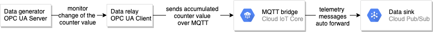

# opcua-demo
This repository contains sample code that demonstrates how to use [Node OPC UA](https://node-opcua.github.io/) to relay sensor data from [OPC-UA](https://opcfoundation.org/about/opc-technologies/opc-ua/) server to [Google Cloud IoT Core](https://cloud.google.com/iot-core/).
The sample server code starts an opc-ua server that generates random integer number at regular interval. The server properties is configured in: `node-opcua/sample-server/server_config.json`, which let you change meta data exposed by the sensor object as well as the max, min and update frequency of the random value.  

  

The sample client code starts an OPC-UA client that monitors changes of the sensor value and sends the accumulated data to GCP via Cloud IoT Core. 

## Create a GCP project
This tutorial assumes that you already have a [GCP account](https://console.cloud.google.com/freetrial) set up.

1. Go to the [GCP Console](https://console.cloud.google.com).
1. Click the project selector in the upper-left corner and select **New Project**.
1. Give the project a name and click **Create**.
1. Click the project selector again and select your new project.
1. Open the menu **APIs & Services > Library**.
1. Search for and activate the following APIs, or ensure that they are already active:
    - Cloud Pub/Sub API
    - Cloud IoT API
##  Check out the tutorial source code on Cloud Shell
This tutorial is run entirely from [Cloud Shell](https://cloud.google.com/shell/docs/features).
1. In the GCP Console, [open Cloud Shell](http://console.cloud.google.com/?cloudshell=true)
1. Clone the source code repository:
```bash
cd ~

git clone https://github.com/kingman/community.git
```

## Cloud IoT setup
### Set environment variables in Cloud Shell
Run in Cloud Shell:
```bash
export PROJECT_ID=$(gcloud config list --format 'value(core.project)')

export EVENT_TOPIC=opc-telemetry

export REGISTRY_ID=opc-devices

export REGION=us-central1

export DEVICE_ID=opc-device
```
### Create Pub/Sub topic
```bash
gcloud pubsub topics create $EVENT_TOPIC
```
### Create IoT Core registry
```bash
gcloud iot registries create $REGISTRY_ID \
--region $REGION \
--event-notification-config=topic=$EVENT_TOPIC
```
### Generate key pair for OPC-UA client
In Cloud Shell run:
```bash
cd ~/community/tutorials/cloud-iot-opcua-demo/node-opcua/sample-client

openssl req -x509 -newkey rsa:2048 -keyout rsa_private.pem -nodes -out rsa_cert.pem -subj "/CN=unused"
```
### Provision device identity on GCP
Device identity is needed for the OPC-UA client identify itself to Cloud IoT Core. 
```bash
gcloud iot devices create $DEVICE_ID \
--region=$REGION \
--registry=$REGISTRY_ID \
--public-key=path=rsa_cert.pem,type=rs256
```
### Create event topic subscription
In Cloud Shell run:
```bash
gcloud pubsub subscriptions create read-opcua-data \
--topic=$EVENT_TOPIC
```

## Configure the sample client
Set your GCP project id in the client config file. In Cloud Shell run:
```bash
sed -i -e 's/<replace with project id>/'"${PROJECT_ID}"'/g' ~/community/tutorials/cloud-iot-opcua-demo/node-opcua/sample-client/client_config.json
```
## Start the sample server
In Cloud Shell run:
```bash
cd ~/community/tutorials/cloud-iot-opcua-demo/node-opcua/sample-server

npm install

npm start
```

## Start the sample client
Start another Cloud Shell session in the same project by click at **+** button
In Cloud Shell run:
```bash
cd ~/community/tutorials/cloud-iot-opcua-demo/node-opcua/sample-client

npm install

npm start
```

## Verify sensor data in Pub/Sub
Pull message from Pub/Sub subscription. Start another Cloud Shell session in the same project by click at **+** button. In Cloud Shell run:
```bash
gcloud pubsub subscriptions pull read-opcua-data --auto-ack
```

## Shut down the sample server
In the Cloud Shell session, where the sample server is running: press `CTRL`+`c`.
## Cleaning up
To avoid incurring charges to your Google Cloud Platform account for the resources used in this tutorial:
### Delete the project
The easiest way to eliminate billing is to delete the project you created for the tutorial.
To delete the project:
1. In the Cloud Platform Console, go to the Projects page. [GO TO THE PROJECTS PAGE](https://console.cloud.google.com/iam-admin/projects)
1. In the project list, select the project you want to delete and click **Delete**.
1. In the dialog, type the project ID, and then click **Shut down** to delete the project.