# Real time Data Processing With Cloud IoT Core

## Overview
This tutorial demonstrates how to push updates from Message Queueing Telemetry Transport (MQTT) devices to Google Cloud Platform (GCP) and process them in real time.

It is important to detect warning signs quickly from manufacturing lines to prevent failures, which eventually can result in opportunity loss. To this end, the manufacturing industry has been investing in monitoring machinery and equipment in factories. These monitoring devices and alerting help improve production efficiency and business continuity.

This tutorial includes sample code to show two kinds of data processing approaches that use GCP products:
1. A function deployed in Cloud Functions transforms data and logs it to Stackdriver Logging.
2. A streaming application deployed in Cloud Dataflow transforms data and inserts it into BigQuery.

In both cases, sample temperature data is collected that is generated from simulated devices, is transformed into other data formats, and is passed to another GCP product for further data processing and analysis. Cloud Functions is suitable for simple Extract/Transform/Load (ETL) processing, while Cloud Dataflow can handle more sophisticated data pipelines that involve multiple transformations, joins, windowing, and so on.

Cloud IoT Core can not only receive data from MQTT clients, but also can send configuration data to clients. It can be used to control behavior of devices or the surrounding environment.

## Data structure
The sample MQTT client simulates devices and generates sample data with the following attributes:
- DeviceId: A unique identifier for individual devices.
- Timestamp: A timestamp for when a temperature is measured.
- Temperature: The measured temperature from the device.
- Coordinates: The longitude and latitude of the device.

## Architecture
The sample MQTT client simulates a device and sends sample data to Cloud IoT Core, which transforms and redirects requests to a Cloud Pub/Sub topic. After data is stored in Cloud Pub/Sub, it is retrieved by two subscribers: a function in Cloud Functions and a streaming job running in Cloud Dataflow.

This tutorial shows how data is transformed and processed in Cloud Functions and Cloud Dataflow.  
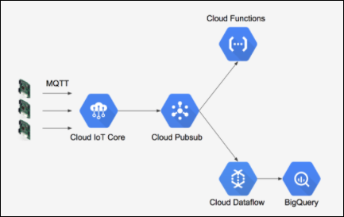

## Objectives
This tutorial demonstrates how to:
- Deploy a function to Cloud Functions that transforms temperature data into JSON format and logs it to Stackdriver Logging.
- Deploy a streaming application to Cloud Dataflow that transforms temperature data into BigQuery row format and inserts it into BigQuery.
- Run an MQTT client that generates simulated temperature and coordinates, and submits the data to Cloud IoT Core.

## Cost
This tutorial uses billable components of GCP, including:
- BigQuery
- Cloud Dataflow
- Cloud Functions
- Cloud IoT Core
- Cloud Storage
- Compute Engine
You can use the [Pricing Calculator](https://cloud.google.com/products/calculator/) to generate a cost estimate that is based on your projected usage.

## Before you begin
### Install software and download sample code
Make sure you have the following software installed:
- [Git](https://help.github.com/articles/set-up-git/)
- [Java SE 8](http://www.oracle.com/technetwork/java/javase/downloads/index.html)
- [Apache Maven 3.3.x or later](https://maven.apache.org/install.html)

Clone the following repository:
```bash
% git clone https://github.com/GoogleCloudPlatform/community.git
```

This repository contains the following directory structure:  
&nbsp;&nbsp;&nbsp;`/bin`: script files  
&nbsp;&nbsp;&nbsp;`/function`: JavaScript file  
&nbsp;&nbsp;&nbsp;`/streaming`: Java streaming application

### Configure a GCP project and enable APIs
1. Create or select a GCP project.
2. Enable billing for your project.
3. Enable the following APIs:  
   a. Cloud IoT Core  
   b. Cloud Functions  
   c. Cloud Dataflow

### Create a Cloud Storage bucket
1. Open the [Cloud Storage console](https://console.developers.google.com/storage).
2. Create a Cloud Storage bucket.
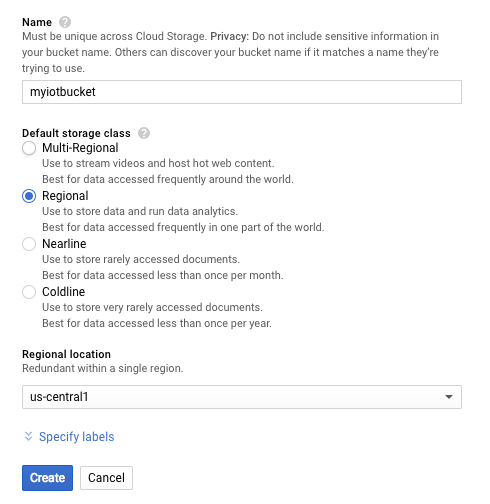  
The bucket name must be unique across Cloud Storage, so use a name unique to you.
3. Click **Create folder**, enter a temporary folder name and then click **Create**.
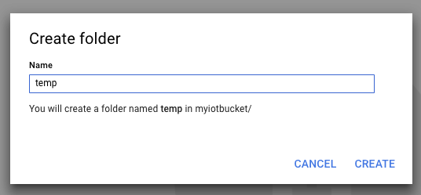

### Set environment variables
To make it easier to run commands, you can set environment variables so that you don't have to supply options for some values that you’ll use repeatedly. You will create the corresponding resources in later steps.
1. Open [Google Cloud Shell](https://cloud.google.com/shell/docs/quickstart)
2. Set the following  environment variables:
```bash
% export PROJECT=[PROJECT_ID]
% export BUCKET=[BUCKET_NAME]
% export REGISTRY=[CLOUD_IOT_CORE_REGISTRY_ID]
% export TOPIC=[CLOUD_PUBSUB_TOPIC_NAME]
```

## Configure Cloud IoT Core
In this section, you create a topic in Cloud Pub/Sub and configure Cloud IoT Core to receive data from MQTT clients.
1. Open the [Cloud Pub/Sub console](https://console.developers.google.com/cloudpubsub)
2. In the left navigation menu click the **Topics** menu.
3. Click **Create a topic**. In the **Name** box, enter the topic name that you assigned earlier to the environment variable, and then click **Create**.
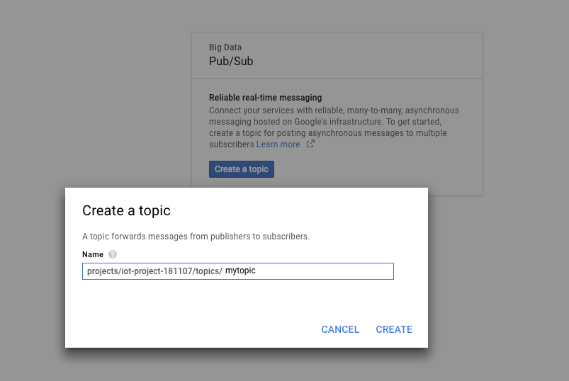
4. Open the [Cloud IoT Core console](https://console.developers.google.com/iot).
5. Click **Create device registry**.
6. In the **Registry ID** box, type **myregistry**. Select a Cloud region close to you, and select the Pub/Sub topic that you just created.
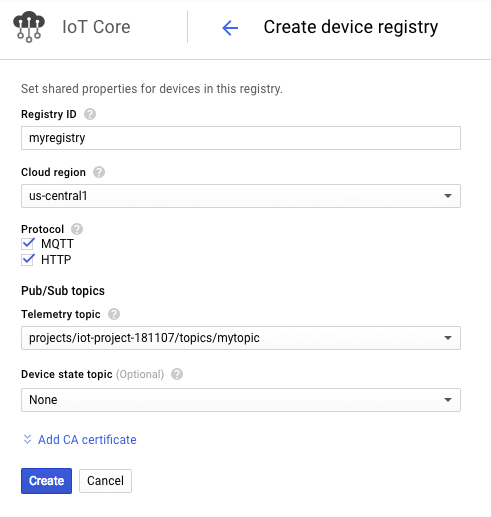
7. When you're done, click **Create**.
8. In the **Grant permission to service account** dialog box, click **Continue**.
9. In Cloud Shell, register devices in the device registry:
```bash
% bin/register.sh
```
<aside class="warning">
Warning: This tutorial includes a public/private key pair for testing purposes. Do not use this pair in a production environment.
</aside>

## Deploy a Cloud Function
In this section, you set up a function that logs data that is sent to Cloud IoT Core and retrieved through Cloud Pub/Sub.
1. In Cloud Shell, deploy a function to Cloud Functions:
```bash
% cd function
% gcloud beta functions deploy iot --stage-bucket $BUCKET --trigger-topic $TOPIC
```
You see results similar to the following:
```bash
/ [1 files][  292.0 B/  292.0 B]
Operation completed over 1 objects/292.0 B.
Deploying function (may take a while - up to 2 minutes)...done.
availableMemoryMb: 256
entryPoint: iot
eventTrigger:
...
```
2. Open the [Cloud Functions console](https://console.developers.google.com/functions).
3. Confirm that you created a function.
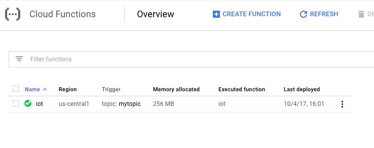

## Deploy a streaming application to Cloud Dataflow
In this section, you deploy a Java-based streaming application that transforms data that is retrieved from Cloud Pub/Sub and loads it into a BigQuery table.
1. In Cloud Shell, build and submit a streaming job:
```bash
% cd bin
% ./job.sh
```
The results look similar to the following:
```bash
[INFO] Scanning for projects...
[INFO]                                                                         
[INFO] ------------------------------------------------------------------------
[INFO] Building cloud-iot-rtdp 0.0.1-SNAPSHOT
[INFO] ------------------------------------------------------------------------
[INFO]
[INFO] --- maven-resources-plugin:2.6:resources (default-resources) @ cloud-iot-rtdp ---
…
```
2. Open the [Cloud Dataflow console](https://console.developer.google.com/dataflow).
3. Confirm that a streaming job is running.
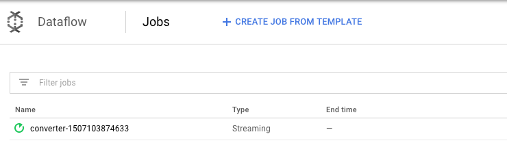

## Generate simulated temperature and coordinates data
Now you can run an MQTT client that generates simulated data on temperature and coordinates and then submits it to Cloud IoT Core.
1. In Cloud Shell, run an MQTT client to generate simulated data:
```bash
% cd bin
% ./run.sh
```
You see results similar to the following:
```bash
[INFO] Scanning for projects...
[INFO]                                                                         
[INFO] ------------------------------------------------------------------------
[INFO] Building cloud-iot-rtdp 0.0.1-SNAPSHOT
[INFO] ------------------------------------------------------------------------
[INFO]
[INFO] --- maven-resources-plugin:2.6:resources (default-resources) @ cloud-iot-rtdp ---
...
```
2. Open the [Cloud Functions console](https://console.developers.google.com/functions).
3. To confirm that a function is processing data, click the More options icon on the right side of your function, and then click **View logs**:
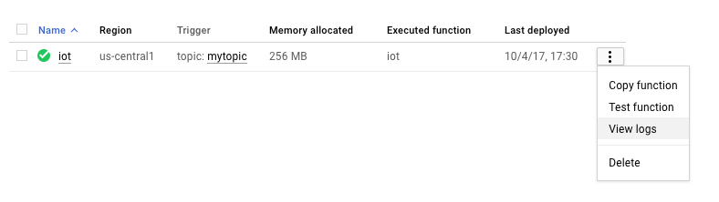
You see results similar to the following:
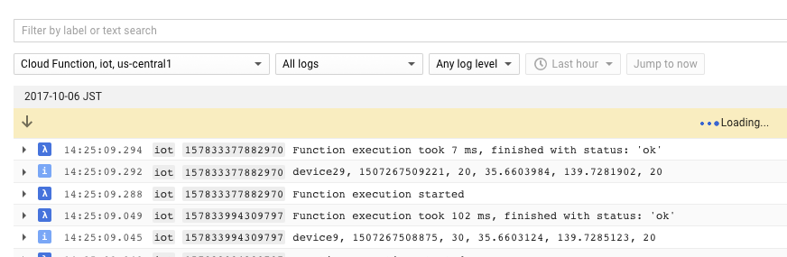
4. Open the [Cloud Dataflow console](https://console.developers.google.com/dataflow).
5. To confirm that a streaming Cloud Dataflow job is processing data, click the job ID.
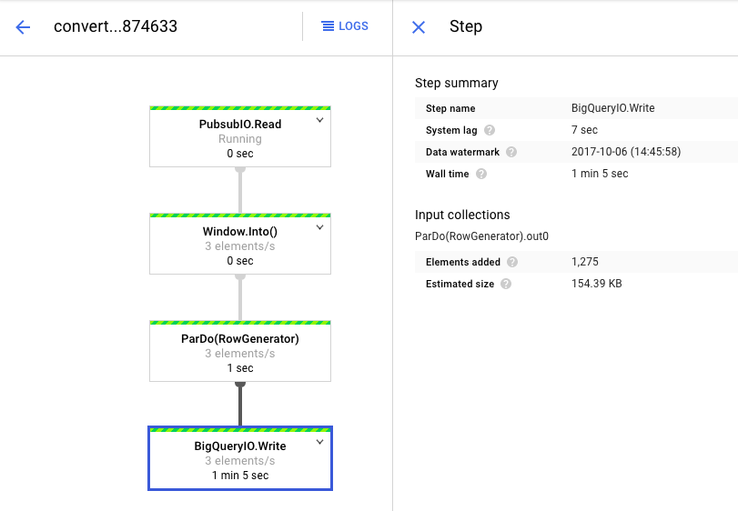
6. Open the [BigQuery](https://bigquery.cloud.google.com/).
7. Click **COMPOSE QUERY** button to open the query editor.
8. To confirm the temperature data is stored in a BigQuery table, run the following query in the editor:
```sql
SELECT count(*) from [[PROJECT_ID]:iotds.temp_sensor]
```
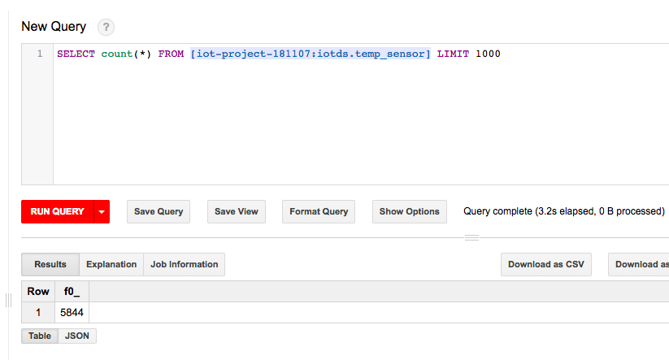
If everything is working, you a single row in the results that displays a count of all the records that have been processed.

## Next steps
This tutorial demonstrates how to process data that is generated from IoT devices. You can learn more about IoT, data processing, and visualization from the following links:
- [Overview of IoT Solutions](https://cloud.google.com/solutions/iot/)
- [BigQuery for Data Warehouse Practitioners](https://cloud.google.com/solutions/bigquery-data-warehouse)
- [Visualizing BigQuery Data Using Google Data Studio](https://cloud.google.com/bigquery/docs/visualize-data-studio)
- [Visualizing BigQuery Data Using Google Cloud Datalab](https://cloud.google.com/bigquery/docs/visualize-datalab)

## License
 Copyright 2017 Google Inc. All Rights Reserved.

 Licensed under the Apache License, Version 2.0 (the "License"); you may not use this file except in compliance with the License. You may obtain a copy of the License at
      http://www.apache.org/licenses/LICENSE-2.0
Unless required by applicable law or agreed to in writing, software distributed under the License is distributed on an "AS-IS" BASIS, WITHOUT WARRANTIES OR CONDITIONS OF ANY KIND, either express or implied.  See the License for the specific language governing permissions and limitations under the License.

This is not an official Google product.
