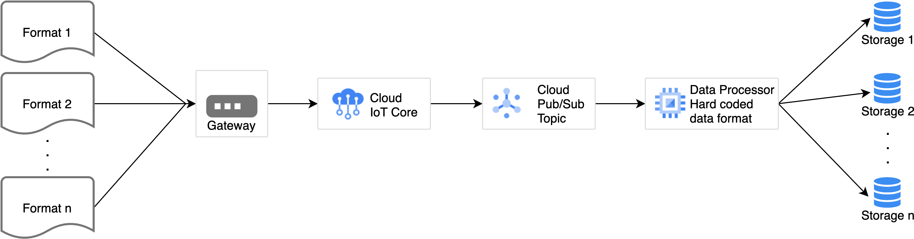
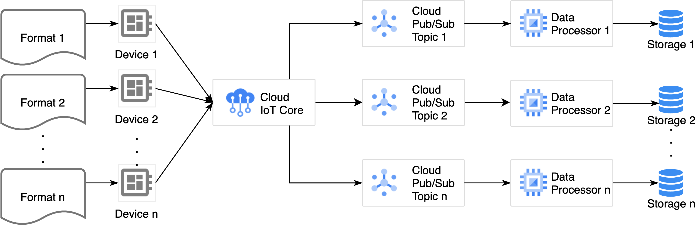
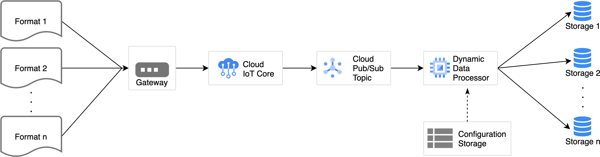
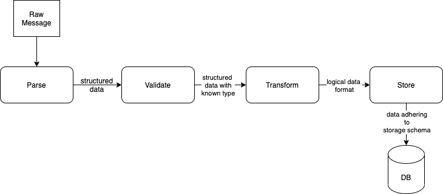
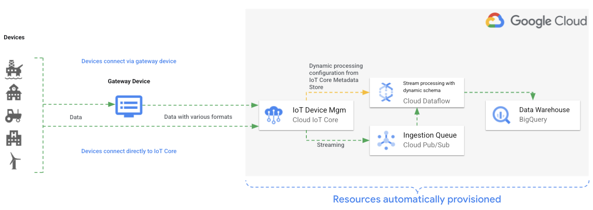
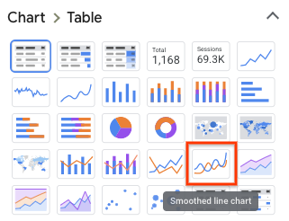
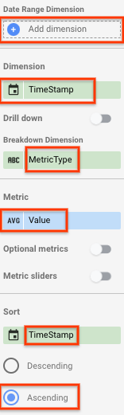
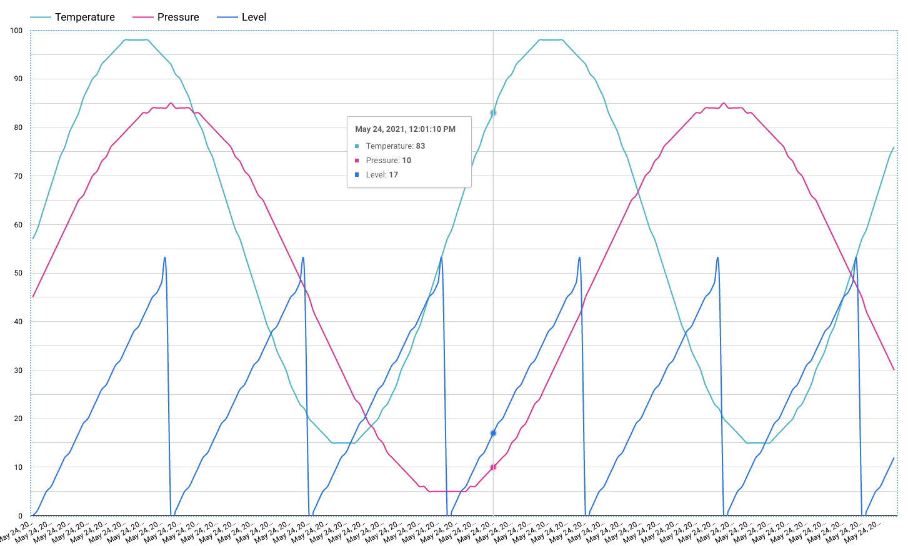

Charlie Wang | Cloud Solutions Architect | Google

<i>Contributed by Google employees.</i>

This article describes the data processing of event messages generated by IoT devices streaming through Google Cloud IoT Core. The data processing becomes complex when the format of the event messages are not homogeneous or changes over time.

The heterogeneous message format is often a result of the IoT uses multiple types of IoT devices and sensors. Also when an IoT gateway is used to relay messages from multiple devices to the cloud the message format would vary within a single data stream.

## Challenges of processing data stream with multiple data formats
Parsing the various data formats in the data stream puts some challenges on the data processors that receive and process the data. In this article the term processor refers to the data processing source code that runs in a cluster and processes a data stream from IoT devices. There are several ways to approach the challenge of handling data streams with heterogeneous data format.

1. Hard code the different data formats into the data processor

This is a viable path if the number of different data formats is small, where the data processing logic can be kept simple, and the data format seldom changes. In the opposite situation this approach becomes quickly unmanageable with the scenarios of
    * Complexity in the data processing logic
    * Frequently updated and deployed processor

1. One data processor per data format

If the data stream can be divided into multiple streams with each stream containing messages with the same data format, simple data processors can be deployed per data stream. This approach comes with the advantage that the logic of each data processor can be kept simple and addition of data format would not affect the existing processors. The downside is the need to handle multiple processors. The approach is also not applicable when a data stream cannot easily splitted into multiple streams, which often is the case with an IoT gateway based data ingestion.

1. Dynamic data processor with configurable data formats

The dynamic data processor approach addresses the shortcomings of the two previously stated approaches. In this approach a single processor can handle an arbitrary number of data formats based solely on data format configuration. Only configurations are updated when data formats are updated or new formats are added. This approach is also more re-usable, where a single processor can be re-use across multiple solutions by only adapting the configuration.

For the rest of this article we will describe the dynamic data processor approach in more detail and go through different components that constitute the whole approach.

## Dynamic data processor
The common tasks of an IoT event data processor are:
* **Parse**  
  Loading and converting the generic binary payload in the data message into a semantically understandable data structure.

* **Validate**  
  Validating data message format against a set of rules and schemas to determine the type of message which in term decides how the message will be transformed and stored.

* **Transform**  
  Mapping of the parsed data message into pre defined data formats that are suited for downstream consumption and storage. Here also often involve augmenting the data with additional metadata. In the case of tabular data this often means field level filtering and mapping.

  Scope for transform is per data message based. Transformation that deals with aggregation and analysis of multiple messages and streams is out of scope for the dynamic data processor described in this article.

* **Store**  
  Saving the transformed data in a data storage system and/or a downstream message queue of others to consume.

For the dynamic data processor information about parsing, validating, transforming and storing the data need to be provided through configuration. 

### Parse
The processor consumes a data stream where the messages vary in the data format, the processor needs to validate each message against a set of validators in order to determine the message format. Once the message format is determined the processor needs to use the corresponding parser to convert the message into an understandable data structure. For the parsing to happen dynamically the **data validators** and the **data parsers** need to be provided as configuration.

### Transform
The processor needs information on how to transform the parsed data message into downstream data formats. In order for the transformation to happen dynamically, **mapping information** needs to be provided for each input data format.

### Store
The processor needs to know where to send the data once it has been processed and in order for this to happen dynamically, detailed information on **data destinations** needs to be provided as configuration for each data format. For example database name and table name in the case of storing the data in a database.

## Implementation

The source code of a reference implementation of the dynamic processor resides in this [Github repository](https://github.com/GoogleCloudPlatform/cloud-iot-stream-processing-dynamic-schema). The implementation builds a dynamic processor using [Cloud Dataflow](https://cloud.google.com/dataflow).

The following diagram illustrates the architecture of the data processor this implementation creates.

This processor consumes the [IoT Core event messages](https://cloud.google.com/iot/docs/how-tos/mqtt-bridge#publishing_telemetry_events) from [Pub/Sub](https://cloud.google.com/pubsub) and stores the processed data in [BigQuery](https://cloud.google.com/bigquery). The processor reads data processing configuration from the [device metadata](https://cloud.google.com/iot/docs/concepts/devices#device_metadata) of Cloud IoT Core.

This processor takes arbitrary input data in JSON format and transforms it based on a schema mapper and finally stores the data in a specified table in BigQuery.

### Parse
This processor uses [JSON Schema](https://json-schema.org/) to validate and match the data format of the event message against a set of JSON schemas of valid data format. For each incoming message format the processor supports, a data type is explicitly configured on the IoT Core device as device metadata.  
When a message validates positively against a schema the corresponding data type identifier is attached to the parsed message, which explicitly identifies the message data type. 
 
Following JSON object illustrates the format of schema validation configuration used by the processor, which is an JSON array of JSON schema objects adhering to the [JSON Schema specification](https://json-schema.org/specification.html) together with its data type identifier.

    [
     {
       "dataType": "data-type-id1",
       "schema": schema-object1
     },
     {
       "dataType": "data-type-id2",
       "schema": schema-object2
     },
    ...
    ]

### Transform
To transform the input JSON data to BigQuery rows, this processor uses schema field mapping configuration and [BigQuery JSON schema](https://cloud.google.com/bigquery/docs/schemas#specifying_a_json_schema_file) to select, convert and assign the field values of the output BigQuery row object.  
To understand how the transform step work let's go through the the following illustrated example:

A message published from an edge device, such as a chemical tank sensor, to a IoT Core telemetry topic:

    {
      "id":"aba8dddd-36d9-4a68-b6d8-936f8afa2f73",
      "device":"Chemical Tank",
      "created":1621421835633,
      "origin":1621421835630430436,
      "readings":[
        {
          "id":"a360de09-ee6b-40a6-9e40-9862cd81656a",
          "origin":1621421835629500308,
          "device":"Chemical Tank",
          "name":"Pressure",
          "value":"30",
          "valueType":"Int16"
        },
        {
          "id":"d1782630-8b52-479a-bcf6-696a1f99fc3d",
          "origin":1621421835638528445,
          "device":"Chemical Tank",
          "name":"Temperature",
          "value":"80",
          "valueType":"Int16"
        }
      ]
    }

The dynamic stream processor reads the following schema map configuration from device metadata store of IoT Core.

    {
      "cloudIoT.attr.deviceNumId": "DeviceNumId",
      "cloudIoT.attr.deviceId": "DeviceId",
      "cloudIoT.attr.deviceRegistryId": "RegistryId",
      "readings[]": {
        "device": "Device",
        "name": "MetricType",
        "origin": "TimeStamp",
        "value": "Value",
        "valueType": "ValueType"
      }
    }
The field mapping configuration is a regular JSON object with the key field containing the field identifier of the input JSON data and value field containing the corresponding field identifier for the BigQuery schema. Following notations have specific functions for the mapping:
* Dot(`.`) notation is used to specify nested object fields in the input data
* Brackets(`[]`) notation is used at end of JSON field identifier to mark the field as array
* Key prefix (`cloudIoT.attr.`) is used to specify extraction of the additional attribute values that Cloud IoT Core [adds to each PubSub message](https://cloud.google.com/iot/docs/how-tos/mqtt-bridge#publishing_telemetry_events)

For a key field that is marked as array, where the key field ends with brackets as the `readings[]` field in the example, the corresponding value field has to be a valid mapping configuration JSON object of its own adhering to the above defined rules. This sub-configuration mapping JSON object specifies how each of the objects inside of the array should be mapped. The processor will flat out the array, create a BigQuery row for each array object.

The dynamic stream processor reads the following BigQuery table schema from device metadata store of IoT Core.

    [
      { "name": "DeviceNumId", "type": "STRING" },
      { "name": "DeviceId", "type": "STRING" },
      { "name": "RegistryId", "type": "STRING" },
      { "name": "TimeStamp", "type": "TIMESTAMP" },
      { "name": "MetricType", "type": "STRING" },
      { "name": "Device", "type": "STRING" },
      { "name": "Value", "type": "FLOAT" },
      { "name": "ValueType", "type": "STRING" }
    ]
The supported BigQuery data types are:
* [STRING](https://cloud.google.com/bigquery/docs/reference/standard-sql/data-types#string_type)
* [INT64](https://cloud.google.com/bigquery/docs/reference/standard-sql/data-types#integer_type)
* [FLOAT](https://cloud.google.com/bigquery/docs/reference/standard-sql/data-types#floating_point_types)
* [TIMESTAMP](https://cloud.google.com/bigquery/docs/reference/standard-sql/data-types#timestamp_type)

Then dynamic stream processor transforme the incoming message to the following BigQuery rows, using the schema map configuration and the BigQuery table schema:

|DeviceNumId|DeviceId|RegistryId|TimeStamp|MetricType|Device|Value|ValueType|
|:---|:---|:---|:---|:---|:---|:---|:---|
|3068444987948740|device-one|device-registry|2021-05-19 10:57:15.629 UTC|Pressure|Chemical Tank|30.0|Int16|
|3068444987948740|device-one|device-registry|2021-05-19 10:57:15.638 UTC|Temperature|Chemical Tank|80.0|Int16|

***Note** that the values for the fields: **DeviceNumId**, **DeviceId** and **RegistryId** are taken from the [PubSub message attribute map](https://cloud.google.com/iot/docs/how-tos/mqtt-bridge#publishing_telemetry_events) which is not part of message input data itself.*

To transform the input JSON data to BigQuery rows, this processor uses schema field mapping configuration and [BigQuery JSON schema](https://cloud.google.com/bigquery/docs/schemas#specifying_a_json_schema_file) to select, convert and assign the field values of the output BigQuery row object. 

### Store
This processor stores the transformed data to BigQuery and for this it needs to get information about the destination **dataset** and **table** for each data messages format from configuration stored as metadata for the IoT Core device. Following metadata excerpts illustrate the dataset and table configurations.

    "destination-dataset-[data-type-id]": "[dataset name]"
    "destination-table-[data-type-id]": "[table name]"

To make sure that no message is lost the processor stores messages that did not validate positively against all the configured schemes into an unknown message table in BigQuery.

    "destination-dataset-unknown-message": "[dataset name]"
    "destination-table-unknown-message": "[table name]"

## Processor Provisioning
This processor together with all related cloud resources are automatically provisioned using [Terraform](https://www.terraform.io/intro/index.html). Here we go through steps to provision all resources.

### Cost
Following billable component are created and used:
* [Dataflow](https://cloud.google.com/dataflow/pricing)
* [BigQuery](https://cloud.google.com/bigquery/pricing)
* [Pub/Sub](https://cloud.google.com/pubsub/pricing)
* [IoT Core](https://cloud.google.com/iot/pricing)

To generate a cost estimate based on your projected usage, use the [pricing calculator](https://cloud.google.com/products/calculator).

### Before you begin
For provisioning of the processor you need a Google Cloud [project](https://cloud.google.com/resource-manager/docs/cloud-platform-resource-hierarchy#projects). You can create a new one, or select a project you already created:
1. [Select or create a Google Cloud project](https://console.cloud.google.com/projectselector2/home/dashboard).  

1. [Enable billing](https://support.google.com/cloud/answer/6293499#enable-billing) for your project.

When you finish testing the processor, you can avoid continued billing by deleting the resources you created. See [Cleaning up](#cleaning-up) for more detail.

### Preparing your environment
In the provision steps you run all commands in Cloud Shell.

1. In the Cloud Console, [activate Cloud Shell](https://console.cloud.google.com/?cloudshell=true).  
At the bottom of the Cloud Console, a [Cloud Shell](https://cloud.google.com/shell/docs/features) session starts and displays a command-line prompt. Cloud Shell is a shell environment with the Cloud SDK already installed, including the [`gcloud`](https://cloud.google.com/sdk/gcloud) command-line tool, and with values already set for your current project. It can take a few seconds for the session to initialize.
1. Clone the source code repository:
    
        cd "$HOME"
        git clone https://github.com/GoogleCloudPlatform/cloud-iot-stream-processing-dynamic-schema.git

1. Generate [application default credentials](https://cloud.google.com/sdk/gcloud/reference/auth/application-default):

        gcloud auth application-default login --quiet

    The output is similar to the following:
        
        Go to the following link in your browser:
        https://accounts.google.com/o/oauth2/auth?code_challenge=...
        Enter verification code:
1. In a browser window, open the URL that is displayed in the output from generating the application default credentials (the preceding step).
1. Select **Allow** to continue.
1. Copy the code on the screen and enter it into Cloud Shell.
The output is similar to the following:

        /tmp/tmp.xxxxxxxxxx/application_default_credentials.json
    Note the path to the `application_default_credentials.json` file. You use this path to set an environment variable in the next section.
### Setting environment variables
Before you can provision the necessary infrastructure, you need to initialize and export the following environment variables:
1. Create an environment variable that stores the Cloud project ID that contains the resources for the processor:

        export GOOGLE_CLOUD_PROJECT=$(gcloud config get-value core/project)
1. Create an environment variable that stores path to the default Google Cloud application default credentials, which is the value you noted in the preceding section:

        export GOOGLE_APPLICATION_CREDENTIALS=PATH
    Replace the following:
    * **PATH**: path to the `application_default_credentials.json` file
1. Run the automatic prepare script that:
   
    * sets up a Terraform state configuration in Google Cloud Storage
    * sets the Terraform variables
    * build the apache beam pipeline artifact used by the dataflow using Maven

          . scripts/auto-prepare.sh
### Creating the resources
The Terraform template file `terraform/main.tf` defines the resources that are created for the processor. By running Terraform with that descriptor, you create the following Google Cloud resources:

* A [IoT Core registry](https://cloud.google.com/iot/docs/concepts/devices#device_registries) containing a single device. The configuration for data processing is stored with this device as [metadata](https://cloud.google.com/iot/docs/concepts/devices#device_metadata).
* A Pub/Sub [topic](https://cloud.google.com/pubsub/docs/overview#data_model) where IoT Core passes all the event messages to.
* A [Dataflow](https://cloud.google.com/dataflow) job with the dynamic schema processor.
* An empty [BigQuery dataset](https://cloud.google.com/bigquery/docs/datasets-intro) where the processor stores the output data.

In Cloud Shell, do the following:
1. To initialize the working directory containing Terraform configuration files, run the [terraform init](https://www.terraform.io/docs/cli/commands/init.html) command:

        cd terraform/
        terraform init
1. Run the [terraform apply](https://www.terraform.io/docs/commands/apply.html) command to create the resources in your Cloud project:

        terraform apply
1. To continue with running the command, enter `yes`.
### Ingest data
To test the processor, generate IoT event messages using a simulation script. The script establishes a MQTT connection with IoT Core and sends simulated device telemetry messages to IoT Core.

Run the device simulation script:

    cd ../device-simulator/
    . run.sh

Leave the script running to continually stream messages to IoT Core. When the script execution finishes the output is similar to the following:

    Sent 150 messages to IoT Core.

### Explore data
#### View the processed data in BigQuery
1. Open the [BigQuery console](http://console.cloud.google.com/bigquery).
1. Paste the following query into the **Query editor**:

        SELECT * FROM `YOUR_GCP_PROJECT_ID.iot_event.message` ORDER BY TimeStamp DESC LIMIT 1000
1. Click **Run**.
1. View the processed data in the returned table of the query.

#### Visualized and explore data in DataStudio
1. Click **EXPLORE DATA** and choose **Explore with Data Studio** from the list.
1. From the **Chart > Table** menu choose the **Smoothed line chart** option.

    

1. Set following configuration for the chart:
    * clear **Date Range Dimension**
    * set **Dimension** to **TimeStamp**
    * set **Breakdown Dimension**  to  **MetricType**
    * set **Metric** to AVG Value
    * set **Sort** to **TimeStamp** and **Ascending**

    

1. Verify the metric value cycles are visualized in the chart, similar to the following screenshot:
    

### Add new data format
Adding configurations for additional data formats enables the processor to handle data with different input and output formats and storage locations.  
As example you add configurations for a new input data type, holding information returned by a person detection application running on an IoT device. Following is an example of the input data.

    {
      "person_detection":[
          {
            "ts":1622030331175900,
            "label":"person",
            "score":84,
            "detection_x1":45,
            "detection_x2":682,
            "detection_y1":85,
            "detection_y2":516
          }
      ]
    }
The data contains the coordinates for the bounding box for the person detected by the application from its image feed. The data also contains the event timestamp together with detection confidence score returned by the application.

To add the configurations for this person detection data format.
1. Generate an additional terraform variable file containing the configuration details.

        . scripts/generate_tfvars_with_additional_data_format.sh
1. Run terraform apply command to update the configurations store in IoT Core device metadata.

        cd terraform/
        terraform apply -var-file new_data_format.tfvars
1. To continue with running the command, enter `yes`.

Run the device simulation script to generate person detection messages.

    cd ../device-simulator/
    . run.sh person_detection_msg
Leave the script running to continually stream messages to IoT Core. When the script execution finishes the output is similar to the following:

    Sent 50 messages to IoT Core.

View the processed person detection results in BigQuery.
1. Paste the following query into the **Query editor**:

        SELECT * FROM `YOUR_GCP_PROJECT_ID.iot_event.person_detection` ORDER BY TimeStamp DESC LIMIT 100
1. Click **Run**. The result is similar to the following:

|DeviceNumId|DeviceId|RegistryId|TimeStamp|Label|Score|X1|Y1|X2|Y2|
|:---|:---|:---|:---|:---|:---|:---|:---|:---|:---|
|2846685197676431|device-one|device-registry|2021-05-26 13:26:23.404 UTC|person|93|54|94|691|525|
|2846685197676431|device-one|device-registry|2021-05-26 13:26:22.404 UTC|person|92|53|93|690|524|
|2846685197676431|device-one|device-registry|2021-05-26 13:26:21.402 UTC|person|91|52|92|689|523|
|2846685197676431|device-one|device-registry|2021-05-26 13:26:20.401 UTC|person|90|51|91|688|522|

## Cleaning up
The easiest way to eliminate billing is to delete the Cloud project you created for the tutorial. Alternatively, you can delete the individual resources.
### Delete the project
1. **Caution**: Deleting a project has the following effects:

    * **Everything in the project is deleted.** If you used an existing project for this tutorial, when you delete it, you also delete any other work you've done in the project.
    * **Custom project IDs are lost.** When you created this project, you might have created a custom project ID that you want to use in the future. To preserve the URLs that use the project ID, such as an appspot.com URL, delete selected resources inside the project instead of deleting the whole project.
1. [Go to the **Manage resources page**](https://console.cloud.google.com/iam-admin/projects).
1. In the project list, select the project that you want to delete, and then click **Delete**.
1. In the dialog, type the project ID, and then click **Shut down** to delete the project.
### Delete the individual resources
If you want to keep the project that you used in this tutorial, run the clean up script to delete the resources that you created in this tutorial. The script leaves the `pubsub.googleapis.com`, `dataflow.googleapis.com` and `cloudiot.googleapis.com` enabled to avoid affecting any existing resources that are dependent on these service api:s being enabled.

    . scripts/clean-up.sh

    

