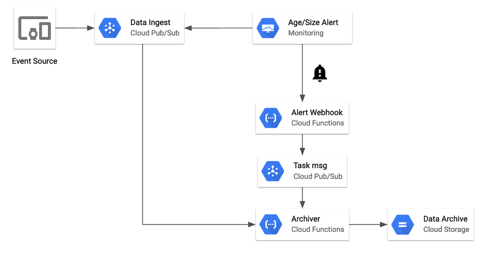

Preston Holmes | Solution Architect | Google Cloud

Cloud Pub/Sub is often used for large data flows and is capable of handling large throughput. But it is also often used for lower-volume event streams that are still of high value, or are more irregular in their arrival rates.

[Cloud Dataflow Templates](https://cloud.google.com/dataflow/docs/guides/templates/provided-templates#cloudpubsubtogcstext) allow you to easily deploy a Cloud Dataflow job to move events from Cloud Pub/Sub to Cloud Storage. This will run a streaming Dataflow job continuously and may be expensive to run when the event volume is low, or if you have multiple medium volume topics to archive.

Cloud Pub/Sub will retain messages for 7 days in a subscription resource before they are deleted. This means that lower volume topics can be periodically archived as batches into Cloud Storage objects without running a continuous streaming job. Cloud Function PubSub triggers can not be used for this directly - as they are invoked for each Cloud Pub/Sub message individually and you generally want to archive in batches.

This solution uses the built-in metrics for subscription resources in Cloud Pub/Sub subscriptions to trigger an archiving task based on a combination of backlog size and age.

## Objectives

* Create a Stackdriver notification webhook.
* Create a Stackdriver Alerting policy with Cloud Pub/Sub conditions.
* Create a pair of Cloud Functions that respond to the Stackdriver alert
* Verify that data gets archived from Cloud Pub/Sub to Cloud Storage

## Architecture

There are several components to the architecture.

* A data ingest Cloud Pub/Sub topic - this is where events of interest are received.
* A Stackdriver Alert which consists of:
	* Alerting Policy watching metrics related to a subscription associated with the data ingest topic
	* A webhook notification channel which points to a Cloud Function
* A Cloud Pub/Sub topic which durably records the alert incident relaying it to the Archiver function
* The archiver function, which uses streaming pull with Cloud Pub/Sub and streaming write to Cloud Storage to efficiently batch and move event data from Cloud Pub/Sub to Cloud Storage.

## Before you begin

1. Create a Google Cloud Project for this tutorial to allow for easier cleanup
2. Create a [Stackdriver workspace](https://cloud.google.com/monitoring/workspaces/guide) 
3. enable cloud functions

## Setting up the automation

### instructions

	gcloud components install alpha

### instructions

	export FULL_PROJECT=$(gcloud config list project --format "value(core.project)")
	export PROJECT_ID="$(echo $FULL_PROJECT | cut -f2 -d ':')"

### instructions

	gsutil mb gs://$PROJECT_ID-data-archive

### instructions

	gcloud pubsub topics create demo-data
	gcloud pubsub topics create drain-tasks
	gcloud pubsub subscriptions create bulk-drainer --topic demo-data

### instructions

    cd drainer-func
    gcloud functions deploy Archiver \
        --runtime go111 \
        --trigger-topic drain-tasks \
        --update-env-vars BUCKET_NAME=$PROJECT_ID-data-archive,SUBSCRIPTION_NAME=bulk-drainer,AUTH_TOKEN=abcd

### instructions

	gcloud functions deploy StackDriverRelay --runtime go111 --trigger-http

### instructions

	gcloud alpha functions add-iam-policy-binding StackDriverRelay --member "allUsers" --role "roles/cloudfunctions.invoker"

### instructions

	export URL=$(gcloud functions describe StackDriverRelay --format='value(httpsTrigger.url)')

	gcloud alpha monitoring channels create --channel-content-from-file channel.json --channel-labels url=$URL?token=abcd
	export CHANNEL=$(gcloud alpha monitoring channels list --filter='displayName="Archiver"' --format='value("name")')
	
You can see notification channels in the workspace settings area of the Stackdriver console.

### instructions

	gcloud alpha monitoring policies create --policy-from-file=policy.json

	export POLICY=$(gcloud alpha monitoring policies list --filter='displayName="archive-pubsub"' --format='value("name")')

	gcloud alpha monitoring policies update $POLICY --add-notification-channels=$CHANNEL

## Testing the solution

### instructions

	cd ../loader
	go run main.go

Let it run for a while (let it just for a bit then wait to trigger the age policy condition, longer to trigger the size condition).

Go to the stackdriver policy overview

Metrics are not instantaneous, it takes some time for them to show in the alert policy charts. Also note that for the condition to fire, it has to be true for 1 minute (this is a configurable part of policy).

Check the function logs

check the archive bucket

## Cleaning up and next steps

* add scheduled backup?
* add conversion and compression (eg avro)
* Add nightly load of all files into BQ
