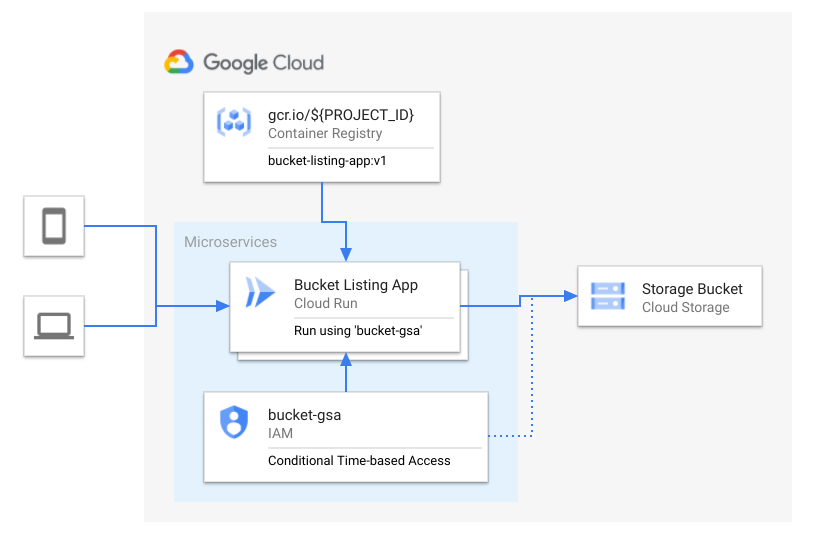

This tutorial takes a deeper look at running a managed Google Cloud Run application with a Google Service Account using Conditional IAM Roles.

## Overview

Applications that use Google Cloud services such as Google PubSub, Cloud Storage and CloudSQL require authentication. Authentication and Authorization are provided using Cloud Identity Access Management (IAM) via a combination of Roles and Accounts. Google Service Accounts are often used to provide an authentication and authorization mechanism for Google Cloud resources. More information can be found in the [official documentation](https://cloud.google.com/docs/authentication).

Authentication is often tied to a series of conditional parameters such as time-of-day or day-of-the-week to enhance security measures preventing applications from access resources outside of compliance or governance rules. Within Google Cloud, this concept is implemented as IAM [Conditional Role Bindings](https://cloud.google.com/iam/docs/managing-conditional-role-bindings). Managed Cloud Run has an advanced option allowing a Google Service Account to act as the "user" authenticating with other Google Cloud resources such as Cloud Storage.

This tutorial will demonstrate how to setup Service Accounts with conditional IAM role bindings on Cloud Run using a Cloud Storage bucket.



## Objectives

1.  Create a simple application that lists contents of a [Google Cloud Storage][gcs] bucket.
1.  Create a [Google Service Account (GSA)][gsa] to manage the application's Google Service interaction
1.  Bind the Google Service Account with a [Conditional IAM Role][conditional-iam] `storage.objectViewer`

## Before you begin

The following details are intended for helping to setup up the development environment and understanding the costs associated with the tutorial.

* Costs
    * The Cloud Run portion of this tutorial fits into the [Always Free](https://cloud.google.com/free) tier of Google Cloud if implemented using the selected regions & suggested application and the application usage is exclusively used for the tutorial. See [Cloud Run pricing criteria](https://cloud.google.com/run/pricing) for more information around Cloud Run pricing. [Review the pre-filled pricing calculator](https://cloud.google.com/products/calculator/#id=638ffec4-1903-47c2-8616-1cc37a83a1f5).
    * Cloud Storage bucket costs are up to you, but can easily be constrained into the [Always Free](https://cloud.google.com/free) tier (below 5GB of regional storage). Storing small text files is a simple method to eliminate Cloud Storage costs and still show a sufficient amount of files in a Cloud Storage bucket.
* Google Cloud Tools
    * This tutorial requires a [Google Project](https://cloud.google.com/resource-manager/docs/creating-managing-projects) and an associated billing account. While the costs are within the [Always Free](https://cloud.google.com/free) tier, a billing account is required.
* Executing commands on either Local Machine or Cloud Shell
    * [Cloud Shell](https://cloud.google.com/shell) (preferred)
        * No extra installation required
    * On a local machine
        * Requires a BASH or ZSH shell
        * Installation and authentication of [Google Cloud SDK](https://cloud.google.com/sdk/install) `gcloud` is required
            * Once the binary is installed, run `gcloud init` and follow the prompts to authenticate `gcloud`
        * Install `gsutil` using `gcloud` by running: `gcloud components install gsutil`
* Tutorial gcloud user must have the following permissions
    * roles/editor or roles/owner
    * roles/iam.serviceAccountAdmin - Enables the user to create & manage the lifecycle of Google Service Accounts
    * roles/storage.admin - Enables the user to create & manage lifecycle of Cloud Storage Buckets
    * roles/cloudbuild.builds.editor - Enables the user to create & manage lifecycle of Cloud Build instances
* Enabled API & Services
    ```bash
        gcloud services enable \
            cloudbuild.googleapis.com \
            storage-component.googleapis.com \
            containerregistry.googleapis.com
    ```

## A closer look

### Overview of the workflow

1. Create a protected Cloud Storage bucket
1. Create an application container to access Cloud Storage bucket
1. Create a Google Service Account (GSA)
1. Create managed Cloud Run instance using the GSA
1. Setup conditional IAM permissions

## Workflow Variables

The following variables will be used in some or all of the below workflow steps. All variables are required unless noted.

* `PROJECT_ID` - Google project ID where the managed Cloud Run instance is to be deployed to
    * If authenticated, run: `gcloud config list account --format "value(core.account)"`

### 1. Creating Cloud Storage Bucket

```bash
# Generate random lower-case alphanumeric suffix
export SUFFIX=$(head -3 /dev/urandom | tr -cd '[:alnum:]' | cut -c -5 | awk '{print tolower($0)}')
# BUCKET variable
export BUCKET="gs://cloud-run-tutorial-bucket-${SUFFIX}"
# Create bucket
gsutil mb gs://cloud-run-tutorial-bucket-${SUFFIX}
# Add text documents to bucket
for i in {1..5}; do echo "task $i" > item-$i.txt; done
gsutil cp *.txt gs://cloud-run-tutorial-bucket-${SUFFIX}
# Verify contents
gsutil ls gs://cloud-run-tutorial-bucket-${SUFFIX}
```
#### Sample Output
```text
$ gsutil ls gs://cloud-run-tutorial-bucket-${SUFFIX}
gs://cloud-run-tutorial-bucket-*****/item-1.txt
gs://cloud-run-tutorial-bucket-*****/item-2.txt
gs://cloud-run-tutorial-bucket-*****/item-3.txt
gs://cloud-run-tutorial-bucket-*****/item-4.txt
gs://cloud-run-tutorial-bucket-*****/item-5.txt
```

### 2. Create Application Container

A simple Golang app used to list-display the contents of a GCS bucket can be built and pushed to the project's private [Google Container Registry](https://cloud.google.com/container-registry). The recommended application to deploy is [Cloud Run Bucket App](https://gitlab.com/mike-ensor/cloud-run-bucket-app/). More details on how to modify and deploy the app can be found within the README file.  This tutorial will deploy an opinionated and summarized version of this app.

#### Create & Deploy Container
```bash
# Clone Repository
git clone git@gitlab.com:mike-ensor/cloud-run-bucket-app.git

# Build & Push image
gcloud builds submit --substitutions=_PROJECT_ID=${PROJECT_ID}
```

#### Sample Output
```text
...
...
PUSH
Pushing gcr.io/XXXXX/cloud-run-bucket-app
The push refers to repository [gcr.io/XXXXX/cloud-run-bucket-app]
5f9ef59aace9: Preparing
236f427c513a: Preparing
79d541cda6cb: Preparing
79d541cda6cb: Layer already exists
236f427c513a: Layer already exists
5f9ef59aace9: Pushed
latest: digest: sha256:0b7f0c0333454d3b34512df171b5ab45cbba6436e4ee07197f2e79575affa166 size: 949
DONE
-------------------------------------------------------------------------------------------------------

ID                                    CREATE_TIME                DURATION  SOURCE                                                                                    IMAGES                                            STATUS
b2b46222-561d-42c4-ac51-dac844c10b30  2020-09-06T19:48:02+00:00  1M16S     gs://XXXXXXX_cloudbuild/source/2594421119.346188-4631b45f042bc32ca6ffd2771d172077.tgz  gcr.io/XXXXX/cloud-run-bucket-app (+1 more)  SUCCESS
```

### 3. Create Google Service Account (GSA)

Creating a [Google Service Account](https://cloud.google.com/iam/docs/service-accounts) (also known as GSA) for an applicaiton allows granular and specific access to Google managed resources thus reducing the security threat.

```bash

```

### 4. Create managed Cloud Run service w/ GSA


### 5. Setup Conditional IAM Role Bindings

gcloud projects get-iam-policy ${PROJECT_ID} --format=json


## Clean up

### Removing the Cloud Run service

### Removing the GCS bucket


[gsa]: https://cloud.google.com/iam/docs/service-accounts
[gcs]: https://cloud.google.com/storage
[conditional-iam]: https://cloud.google.com/iam/docs/managing-conditional-role-bindings

