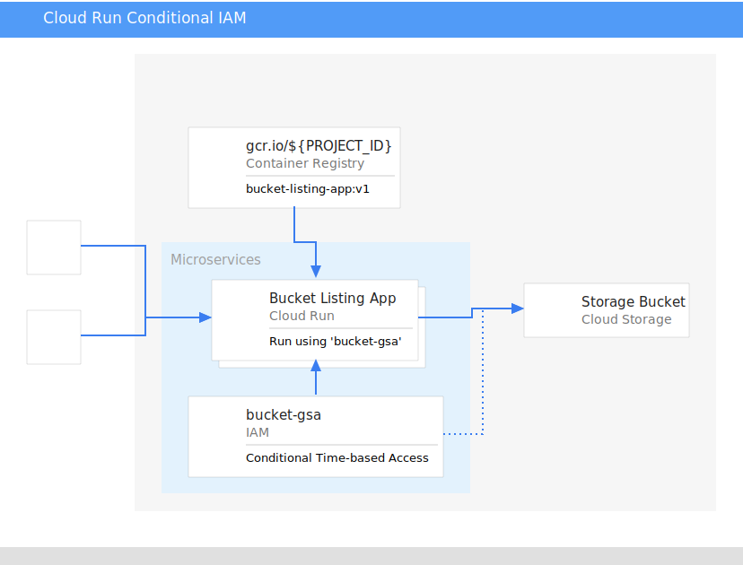

This tutorial takes a deeper look at running a managed Google Cloud Run application with a Google Service Account using Conditional IAM Roles.

## Overview

Applications that use Google Cloud services such as Google PubSub, Cloud Storage and CloudSQL require authentication. Authentication and Authorization are provided using Cloud Identity Access Management (IAM) via a combination of Roles and Accounts. Google Service Accounts are often used to provide an authentication and authorization mechanism for Google Cloud resources. More information can be found in the [official documentation](https://cloud.google.com/docs/authentication).

Authentication is often tied to a series of conditional parameters such as time-of-day or day-of-the-week to enhance security measures preventing applications from access resources outside of compliance or governance rules. Within Google Cloud, this concept is implemented as IAM [Conditional Role Bindings](https://cloud.google.com/iam/docs/managing-conditional-role-bindings). Managed Cloud Run has an advanced option allowing a Google Service Account to act as the "user" authenticating with other Google Cloud resources such as Cloud Storage.

This tutorial will demonstrate how to setup Service Accounts with conditional IAM role bindings on Cloud Run using a Cloud Storage bucket.

[]

## Objectives

1.  Create a simple application that lists contents of a [Google Cloud Storage][gcs] bucket.
1.  Create a [Google Service Account (GSA)][gsa] to manage the application's Google Service interaction
1.  Bind the Google Service Account with a [Conditional IAM Role][conditional-iam] `storage.objectViewer`

## Before you begin

The following details are intended for helping to setup up the development environment and understanding the costs associated with the tutorial.

* Costs
    * The Cloud Run portion of this tutorial fits into the [Always Free](https://cloud.google.com/free) tier of Google Cloud if implemented using the selected regions & suggested application and the application usage is exclusively used for the tutorial. See [Cloud Run pricing criteria](https://cloud.google.com/run/pricing) for more information around Cloud Run pricing. [Review the pre-filled pricing calculator](https://cloud.google.com/products/calculator/#id=638ffec4-1903-47c2-8616-1cc37a83a1f5).
    * Cloud Storage bucket costs are up to you, but can easily be constrained into the [Always Free](https://cloud.google.com/free) tier (below 5GB of regional storage). Storing small text files is a simple method to eliminate Cloud Storage costs and still show a sufficient amount of files in a Cloud Storage bucket.
* Google Cloud Tools
    * This tutorial requires a [Google Project](https://cloud.google.com/resource-manager/docs/creating-managing-projects) and an associated billing account. While the costs are within the [Always Free](https://cloud.google.com/free) tier, a billing account is required.
* Executing commands on either Local Machine or Cloud Shell
    * [Cloud Shell](https://cloud.google.com/shell) (preferred)
        * No extra installation required
    * On a local machine
        * Requires a BASH or ZSH shell
        * Installation and authentication of [Google Cloud SDK](https://cloud.google.com/sdk/install) `gcloud` is required
            * Once the binary is installed, run `gcloud init` and follow the prompts to authenticate `gcloud`
        * Install `gsutil` using `gcloud` by running: `gcloud components install gsutil`


## A closer look

### Overview of the workflow

1. Create a protected Cloud Storage bucket
1. Create an application container to access Cloud Storage bucket
1. Create a Google Service Account (GSA)
1. Create managed Cloud Run instance using the GSA
1. Setup conditional IAM permissions

## 1. Creating Cloud Storage Bucket

```bash
# Generate random lower-case alphanumeric suffix
SUFFIX=$(head -3 /dev/urandom | tr -cd '[:alnum:]' | cut -c -5 | awk '{print tolower($0)}')
# Create bucket
gsutil mb gs://cloud-run-tutorial-bucket-${SUFFIX}
# Add text documents to bucket
echo "item 1" > item-1.txt
gsutil cp *.txt gs://cloud-run-tutorial-bucket-${SUFFIX}
# Verify contents
gsutil ls gs://cloud-run-tutorial-bucket-${SUFFIX}
```
### Sample Output
```
~: gsutil ls gs://cloud-run-tutorial-bucket-${SUFFIX}

gs://cloud-run-tutorial-bucket-xxxxx/google-cloud-run.png
```

## 2. Create Application Container


## 3. Create Google Service Account (GSA)


## 4. Create managed Cloud Run service w/ GSA


## 5. Setup Conditional IAM Role Bindings


...

[gsa]: https://cloud.google.com/iam/docs/service-accounts
[gcs]: https://cloud.google.com/storage
[conditional-iam]: https://cloud.google.com/iam/docs/managing-conditional-role-bindings

