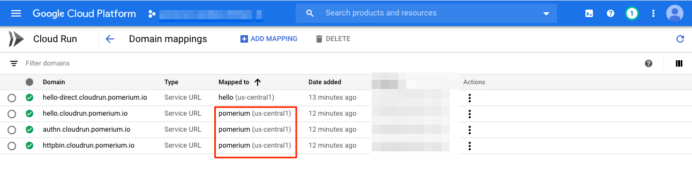
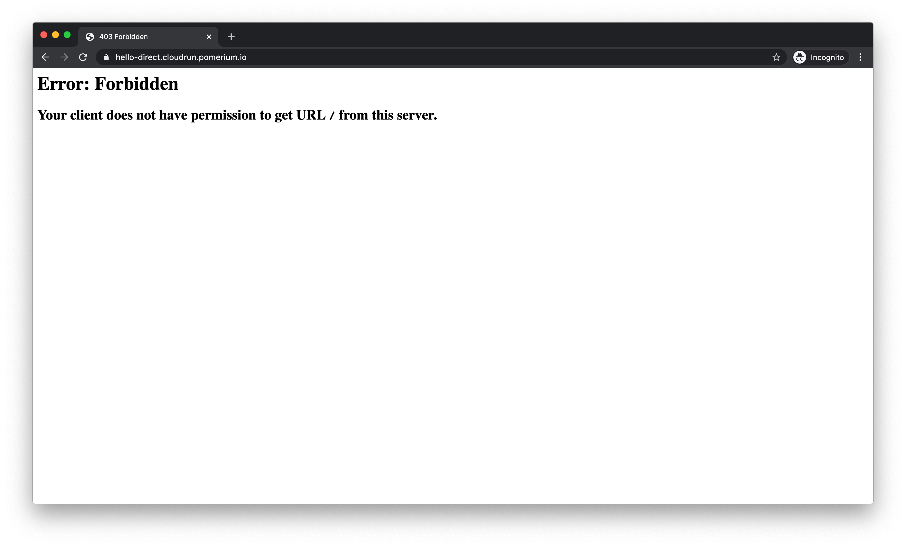
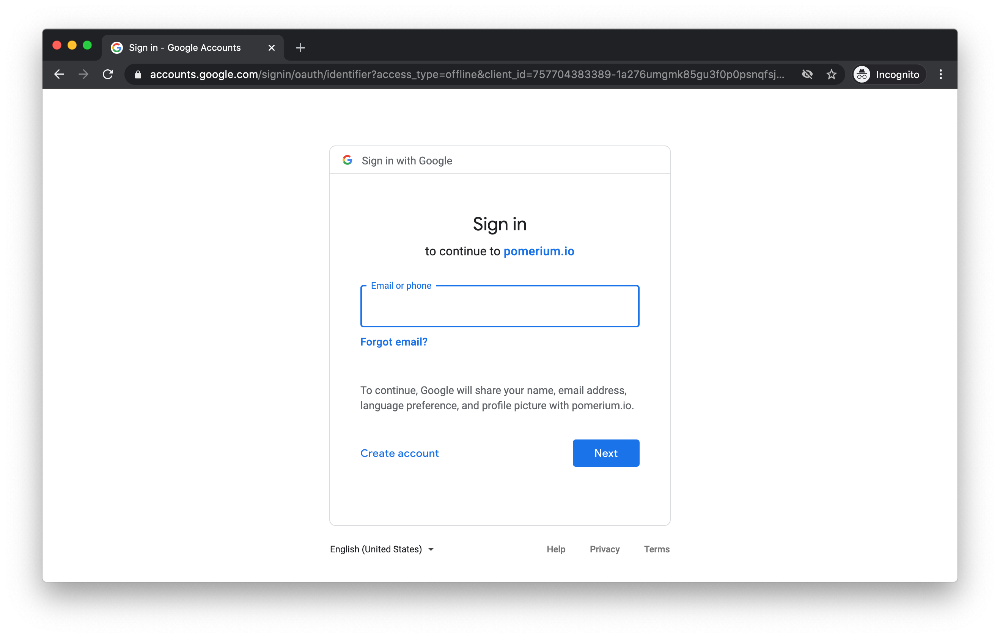
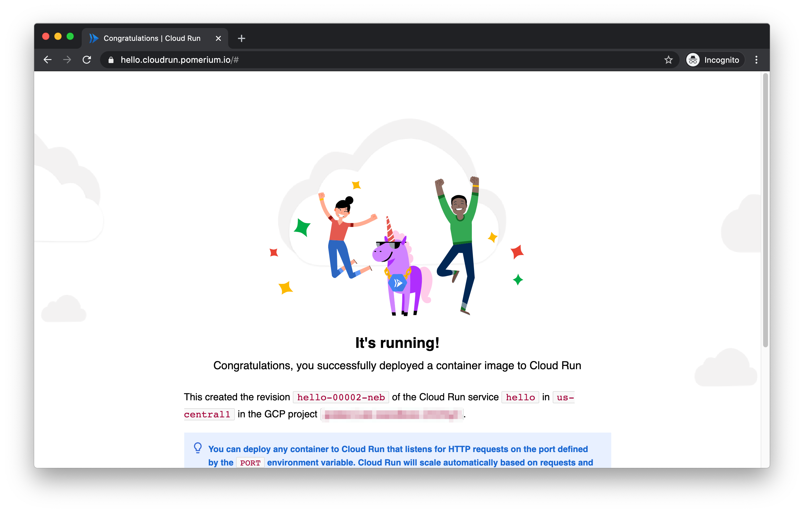
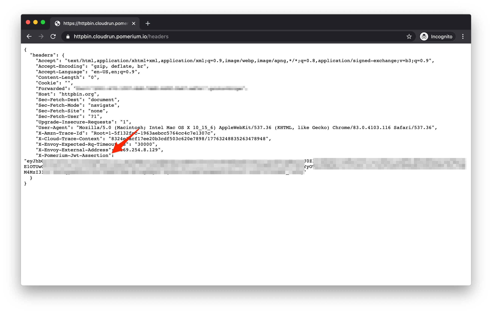

# Cloud Run with Pomerium for context-aware access

This guide covers how to deploy Pomerium to Cloud Run to provide identity-aware access to protect other endpoints. 

[Pomerium](https://www.pomerium.com) is an open source identity-aware proxy that enables secure access to internal applications. Pomerium provides a standardized interface to add access control to applications regardless of whether the application itself has authorization or authentication baked-in. Pomerium gateways  requests and can be used in situations where you'd typically reach for a VPN.

## How it works

Services on [Cloud Run](https://cloud.google.com/run) and other Google Cloud serverless products can be restricted to only permit access with a properly signed [bearer token](https://cloud.google.com/run/docs/authenticating/service-to-service). This allows requests from other services running in GCP or elsewhere to be securely authorized despite the endpoints being public.

These bearer tokens are not easily set in a browser session and must be refreshed on a regular basis, preventing them from being useful for end user authorization. Pomerium, however, can generate compatible tokens on behalf of end users and proxy the request to these services.

- Add an IAM policy delegating `roles/run.invoker` permissions to a service account
- Run Pomerium with access to a key for the corresponding service account
- Publish DNS records for each protected application pointing to Pomerium
- Configure Pomerium with appropriate policy and `enable_google_cloud_serverless_authentication`

The protected application delegates trust to a GCP service account which Pomerium runs as, and Pomerium performs user based authorization on a per route basis. This turns Pomerium into a bridge between a user-centric and service-centric authorization models.

## Before you begin

This guide assumes you have Editor access to a Google Cloud project which can be used for isolated testing, and a DNS zone which you are also able to control. DNS does not need to be inside Google Cloud for the example to work.

## Set Up

To deploy Pomerium to Cloud Run, a special [image](https://console.cloud.google.com/gcr/images/pomerium-io/GLOBAL/pomerium) is available at `gcr.io/pomerium-io/pomerium-[version]-cloudrun`. It allows sourcing configuration from GCP Secrets Manager, and sets some defaults for Cloud Run to keep configuration minimal. We will be leveraging it in this example to store identity provider credentials. Pomerium's [authorization policy](https://www.pomerium.com/reference/#policy) contains no secrets so we can place it directly in an [ENV var](https://www.pomerium.io/reference/#configuration-settings).

[Dockerfile](https://github.com/pomerium/pomerium/blob/master/.github/Dockerfile-cloudrun) Based on [vals-entrypoint](https://github.com/pomerium/vals-entrypoint)

The image expects a config file at `/pomerium/config.yaml`. Set `VALS_FILES=[secretref]:/pomerium/config.yaml` and any other [Pomerium Environment Variables](https://www.pomerium.io/reference/#configuration-settings) directly or with secret refs such as `ref+gcpsecrets://PROJECT/SECRET(#/key])`.

## Config

Set up Pomerium's [config.yaml](https://www.pomerium.com/reference/#shared-settings) to contain your identity provider credentials and secrets (config.yaml):

```yaml
# config.yaml
authenticate_service_url: https://authn.cloudrun.pomerium.com
shared_secret: XXXXXX
cookie_secret: XXXXXX
idp_provider: "google"
idp_client_id: XXXXXX
idp_client_secret: "XXXXXX"
```

Substitute `cloudrun.pomerium.com` for your own subdomain and your e-mail domain if appropriate (policy.template.yaml):

```yaml
# policy.template.yaml
# see https://www.pomerium.com/reference/#policy
- from: https://hello.cloudrun.pomerium.com
  to: ${HELLO_URL}
  allowed_domains:
    - gmail.com
  enable_google_cloud_serverless_authentication: true
- from: https://httpbin.cloudrun.pomerium.com
  to: https://httpbin.org
  pass_identity_headers: true
  allowed_domains:
    - gmail.com
```

## DNS

Substitute `cloudrun.pomerium.com` for your own subdomain (zonefile.txt):

```txt
; zonefile.txt
*.cloudrun.pomerium.com. 18000 IN CNAME ghs.googlehosted.com.
```

Or set an equivalent CNAME in your DNS provider.

# Deploy

Ensure you have set a default project:

```shell
glcoud config set default-project MYTESTPROJECT
```

```yaml
#!/bin/bash

# Install gcloud beta
gcloud components install beta

# Capture current project number
PROJECT=$(gcloud projects describe $(gcloud config get-value project) --format='get(projectNumber)')

# Point a wildcard domain of *.cloudrun.pomerium.com to the cloudrun front end
gcloud dns record-sets import --zone pomerium-io zonefile --zone-file-format

# Deploy our protected application and associate a DNS name
gcloud run deploy hello --image=gcr.io/cloudrun/hello --region us-central1 --platform managed --no-allow-unauthenticated
gcloud run services add-iam-policy-binding hello --platform managed --region us-central1 \
    --member=serviceAccount:${PROJECT}-compute@developer.gserviceaccount.com \
    --role=roles/run.invoker
gcloud beta run domain-mappings --platform managed --region us-central1 create --service=hello --domain hello-direct.cloudrun.pomerium.com

# Rewrite policy file with unique 'hello' service URL
HELLO_URL=$(gcloud run services describe hello --platform managed --region us-central1 --format 'value(status.address.url)') envsubst <policy.template.yaml >policy.yaml

# Install our base configuration in a GCP secret
gcloud secrets create --data-file config.yaml pomerium-config --replication-policy automatic

# Grant the default compute account access to the secret
gcloud secrets add-iam-policy-binding pomerium-config \
    --member=serviceAccount:${PROJECT}-compute@developer.gserviceaccount.com \
    --role=roles/secretmanager.secretAccessor

# Deploy pomerium with policy and configuration references
gcloud run deploy pomerium --region us-central1 --platform managed --allow-unauthenticated --max-instances 1 \
    --image=gcr.io/pomerium-io/pomerium:v0.10.0-rc2-cloudrun \
    --set-env-vars VALS_FILES="/pomerium/config.yaml:ref+gcpsecrets://${PROJECT}/pomerium-config",POLICY=$(base64 policy.yaml)

# Set domain mappings for the protected routes and authenticate
gcloud beta run domain-mappings --platform managed --region us-central1 create --service=pomerium --domain hello.cloudrun.pomerium.com
gcloud beta run domain-mappings --platform managed --region us-central1 create --service=pomerium --domain authn.cloudrun.pomerium.com
gcloud beta run domain-mappings --platform managed --region us-central1 create --service=pomerium --domain httpbin.cloudrun.pomerium.com
```

## Results

### Overview

We should see two applications deployed. The `hello` app is our protected app, and pomerium is...Pomerium!


Notice that Pomerium allows unauthenticated access, but `hello` does not.

Here are the domain mappings set up:



### Direct Access

Let's verify we cannot access the main application directly by visiting <https://hello-direct.cloudrun.pomerium.com>



You should see a 403 error because you do not have the proper credentials.

### Authenticated Access

Now let's access via <https://hello.cloudrun.pomerium.com>

We should get an auth flow through your IdP:



And a hello page:



### Non-GCP Applications

If your target application is not running on GCP, you can also perform your own header validation.

Browse to [https://httpbin.cloudrun.pomerium.com](https://httpbin.cloudrun.pomerium.com/headers)

You should see your identity header set:



See [getting user's identity](../docs/topics/getting-users-identity.md) for more details on using this header.
