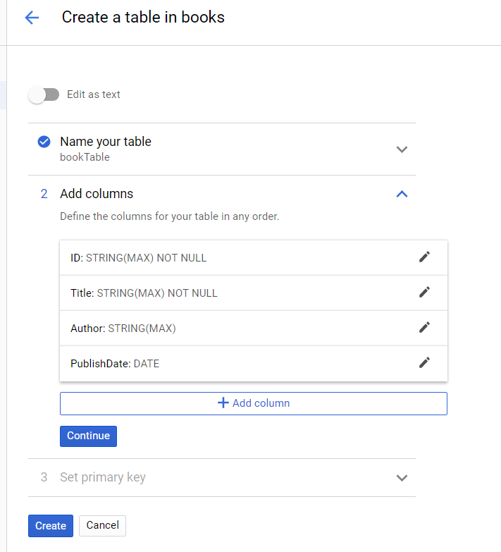
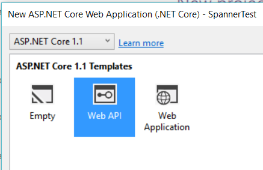
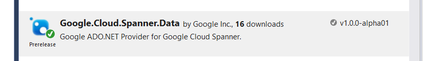
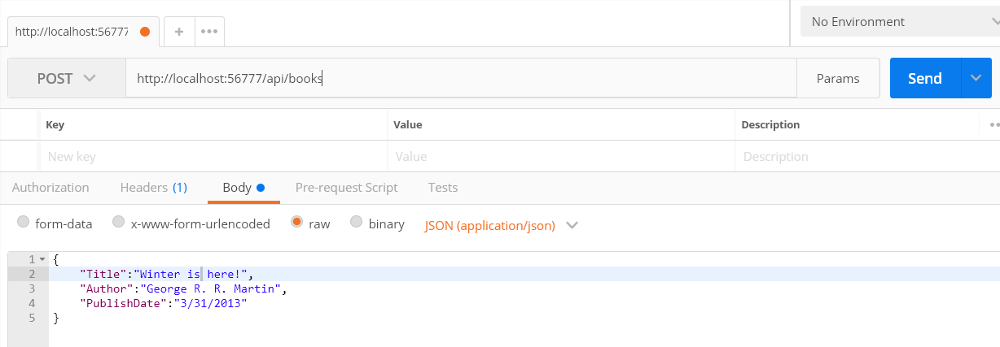
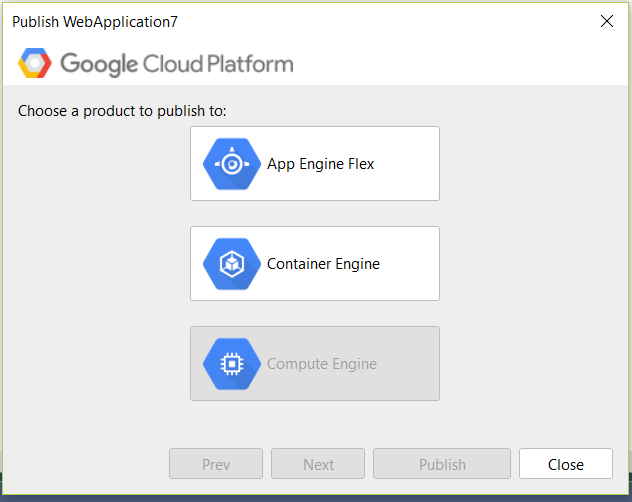

# Using Cloud Spanner in ASP.NET

This tutorial describes how to use the [C# Google Cloud Spanner ADO.NET library](https://cloud.google.com/spanner/docs/getting-started/csharp/) to build a simple REST API for books and use the API to store and query books.

[Cloud Spanner](https://cloud.google.com/spanner/) is a hosted SQL database, and the Cloud Spanner ADO.NET provider lets you take advantage of Cloud Spanner in your C# applications. The Cloud Spanner ADO.NET library is fully asynchronous to the network level and is the recommended way to integrate Cloud Spanner APIs into your .NET applications.

What you’ll use in this tutorial:

* [Visual Studio 2017](https://www.visualstudio.com/vs/community/).  You can download the community edition for free from Microsoft.

* [Cloud Spanner nuget package](https://github.com/GoogleCloudPlatform/google-cloud-dotnet).  You’ll add this to your project.

### **Cost**

Cloud Spanner charges based on the number of nodes, storage and bandwidth used. See [Cloud Spanner detailed pricing](https://cloud.google.com/spanner/pricing) for more information.


### **Before you begin**

1. Set up the following on your development machine:
   1. Set up the [Cloud SDK](https://cloud.google.com/sdk/).
   2. Set up authentication and authorization for the Cloud SDK. This tutorial uses the [Google Default Application Credentials](https://developers.google.com/identity/protocols/application-default-credentials#howtheywork) when calling Google APIs to access your data.
   3. [Install Microsoft Visual Studio 2017](https://www.visualstudio.com/vs/community/). The community edition is free.

2. Go to the [Spanner page in the Cloud Platform Console](https://console.cloud.google.com/spanner/instances?project=) and create or select a project to use for this tutorial.


### **Creating a Cloud Spanner database**

1. Go to the [**Spanner** page](https://console.cloud.google.com/spanner?_ga=2.268581878.-605122468.1507749322) in the Cloud Platform Console.
2. Create a new Cloud Spanner instance named **myspanner**.
3. Create a new database named **books**.
4. Add a table named **bookTable**.
5. Define the schema for **bookTable** as shown and set the primary key to **ID**.



## **Creating an ASP.NET Core Web API application**

This REST API provides basic create, read, update, and delete (CRUD) operations on books in the **bookTable** database.

1. To create the application:
   1. From the menu, click **File > New Project > C# > Web > ASP.NET Core Web Application (.NET Core)**. 
   2. Choose **Web API**.

 

   3. For the project name, enter **SpannerTest**.
2. Using the Manage Nuget Packages dialog, add a reference to the Cloud Spanner nuget.

 

3. To create a Model class for a book:
   1. Add a new folder named **Models** in the project.
   2. In the **Models** folder, add a class named **Book** with the following content:
    ```
    namespace SpannerTest.Models
    {
        public class Book
        {
            public string Id { get; set; }
            public string Author { get; set; }
            public string Title { get; set; }
            public DateTime PublishDate { get; set; }
        }
    }
    ```

4. To create a Controller class to handle the HTTP requests:
    1. In the Controllers folder, add a new Web API Controller class item named **BooksController**.
    2. Delete the contents of the controller.
    3. To insert records, add the following code to **BooksController** and replace *myProject*:
    ```
    namespace SpannerTest.Controllers
    {
        [Route("api/[controller]/")]
        public class BooksController : Controller
        {
            [HttpPost]
            public async Task<IActionResult> Create([FromBody] Book item)
            {
                // Insert a new item.
                using (var connection =
                    new SpannerConnection(
                        $"Data Source=projects/{_myProject}/instances/myspanner/databases/books"))
                {
                    await connection.OpenAsync();
     
                    item.Id = Guid.NewGuid().ToString("N");
                    var cmd = connection.CreateInsertCommand(
                        "bookTable", new SpannerParameterCollection
                        {
                            {"ID", SpannerDbType.String, item.Id},
                            {"Title", SpannerDbType.String, item.Title},
                            {"Author", SpannerDbType.String, item.Author},
                            {"PublishDate", SpannerDbType.Date, item.PublishDate}
                        });
     
                    await cmd.ExecuteNonQueryAsync();
                }
     
                return Ok();
            }
        }
    }
    ```

    4. To list all or a single book, add the following methods to your controller:
    ```
    . . .
    [HttpGet]
    public async Task<IActionResult> GetAll()
    {
        var result = new List<Book>();
     
        using (var connection = new SpannerConnection(
            $"Data Source=projects/{_myProject}/instances/myspanner/databases/books"))
        {
            var selectCmd = connection.CreateSelectCommand("SELECT * FROM bookTable");
            using (var reader = await selectCmd.ExecuteReaderAsync())
            {
                while (await reader.ReadAsync())
                {
                    result.Add(new Book
                    {
                        Id = reader.GetFieldValue<string>("ID"),
                        Title = reader.GetFieldValue<string>("Title"),
                        Author = reader.GetFieldValue<string>("Author"),
                        PublishDate = reader.GetFieldValue<DateTime>("PublishDate")
                    });
                }
            }
        }
     
        return Ok(result);
    }
     
    [HttpGet]
    [Route("{id}", Name="GetBookById")]
    public async Task<IActionResult> Get(string id)
    {
        using (var connection = new SpannerConnection(
            $"Data Source=projects/{_myProject}/instances/myspanner/databases/books"))
        {
            var selectCommand =connection.CreateSelectCommand($"SELECT * FROM bookTable WHERE ID='{id}'");
            using (var reader = await selectCommand.ExecuteReaderAsync())
            {
                while (await reader.ReadAsync())
                {
                    return Ok(new Book
                    {
                        Id = reader.GetFieldValue<string>("ID"),
                        Title = reader.GetFieldValue<string>("Title"),
                        Author = reader.GetFieldValue<string>("Author"),
                        PublishDate = reader.GetFieldValue<DateTime>("PublishDate")
                    });
                }
            }
        }
     
        return NotFound();
    }
    . . .
    ```

## **Adding books and testing the application**

To run the application, use a utility to send REST requests to test the API. This example shows [Postman](https://chrome.google.com/webstore/detail/postman/fhbjgbiflinjbdggehcddcbncdddomop), a Chrome extension, but you can use curl or another utility.

1. To add a book to the database, perform an `HTTP POST` with the port that your local server is running on. For example, replace port *56777* in `http://localhost:56777`.
2. To test the application, perform an HTTP GET.
   * To return all books, enter: `http://localhost:PORT_NUMBER/api/books`
   * To return a single book, enter: `http://localhost:PORT_NUMBER/api/books/ID`



### **[Optional] Deploy to Google App Engine Flex**

For automatic scaling and management, you can deploy your Web API project to the App Engine flexible environment.

1. Download and install [Google Cloud Tools for Visual Studio](https://cloud.google.com/tools/visual-studio/docs/quickstart#install_cloud_tools_for_visual_studio).
2. In the main menu, select **Tools** > **Google Cloud** > **Publish to Google Cloud**.
3. In the Publish dialog box, choose **App Engine Flex**.

 

4. Click **Publish**. After publishing completes, the application is live at `[https://YOUR_PROJECT_ID.appspot.com](https://YOUR_PROJECT_ID.appspot.com)`.

### **Cleaning Up**

Once you are done, you should delete your database to avoid unnecessary charges.
1. Navigate to the [Spanner page](https://console.cloud.google.com/spanner?_ga=2.268581878.-605122468.1507749322).
2. Select the instance you created.
3. Choose **Delete Instance**.

### **What's next**

This basic tutorial does not have everything in a typical ASP.NET application.
For enterprise-grade software you'll need to consider transactions, transient faults, and exponential backoff. The Cloud Spanner library for ADO.NET supports handling these issues, and you can read more about this in [Getting Started with Cloud Spanner in C#](https://cloud.google.com/spanner/docs/getting-started/csharp/).

The C# Google Cloud Spanner ADO.NET library is in Beta.  If you find a bug please log it on our [issue tracker](https://github.com/GoogleCloudPlatform/google-cloud-dotnet/issues).

