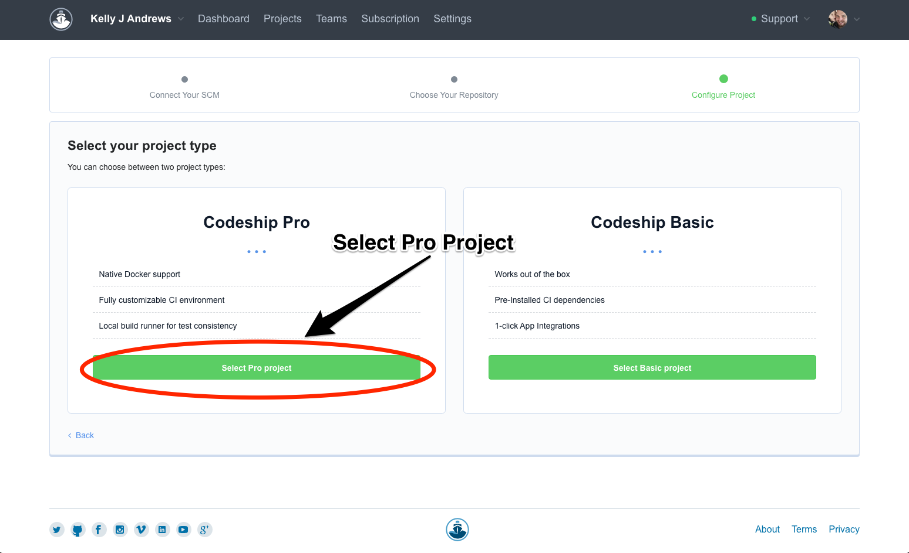

# Continuous Deployment Pipeline to Google Container Engine using Codeship

This is a walkthrough of steps necessary to create a Continuous Deployment pipeline to Google Container Engine using Codeship. In this tutorial you will learn how to deploy a containerized application when new code is merged into the master branch and all integration tests have passed.

Continuous Deployment is the practice of automating the delivery of software to production after passing a series of tests. Although not for everyone, it should be the goal of any software development and devops team not restricted by regulatory constraints.


## Before you begin

Take the following steps to enable the Google Container Engine API:
1. Visit the [Container Engine](https://console.cloud.google.com/projectselector/kubernetes) page in the Google Cloud Platform Console.
1. Create or select a project.
1. Wait for the API and related services to be enabled. This can take several minutes
1. Enable billing for your project.

<a href="https://support.google.com/cloud/answer/6293499#enable-billing" target="blank" track-type="commonIncludes" track-name="supportLink" track-metadata-end-goal="enableBilling" class="button button-primary">Enable billing</a>

Make sure you have the following:
1. [Docker CE Version 17.03.01](https://www.docker.com/community-edition)
1. [Codeship Account](https://app.codeship.com/registrations/new)
1. [Codeship Jet CLI](https://documentation.codeship.com/pro/builds-and-configuration/cli/)
1. [`hello-express` source code](https://github.com/kellyjandrews/hello-express)
1. [GitHub](https://github.com/), [Bitbucket](https://bitbucket.org/), [GitLab](https://about.gitlab.com/) account


## Setting up the continuous deployment pipeline

1. Create service account
2. Setup environment variables
3. Run initial deployment
4. Create Codeship project
5. Encrypt environment variables
6. Commit code to run Codeship build
7. Deploy an update to your application

### Step 1: Create service account

The interactions with the Google Cloud API from Codeship require a service account with permissions to the Storage and Container services.

Follow these steps to create a service account:
1. Visit the [Service accounts](https://console.cloud.google.com/projectselector/iam-admin/serviceaccounts) page in the Google Cloud Platform Console.
1. Select your project.
1. Click `Create Service Account`
1. Enter a name
1. Click `Select a Role` and choose the following permissions:
  * Project -> Service Account Actor
  * Container -> Container Engine Admin
  * Storage -> Storage Admin
1. Select `Furnish a new private key` and leave the option on `JSON`.
1. Click Create, and then close the dialog once it is created.

After the service account is created, a `JSON` file with your credentials automatically downloads to your computer. This file will be used in the next step.

### Step 2: Setup environment variables

In the `hello-express` source code is the file `example.env`.  Rename this file to `.env`.

Inside the file, you will replace the `...` with your Google Cloud Platform project details as follows:
1. `DEFAULT_ZONE`: Select a default [compute zone](https://cloud.google.com/compute/docs/regions-zones/regions-zones#available) like `us-central1-b`
1. `APP_NAME`: Give your application a name, in this case use `hello-express`
1. `CONTAINER_CLUSTER`: Give your container cluster a name, in this case use `hello-express-cluster`
1. `GOOGLE_PROJECT_ID`: The `Project ID` is found in the [Google Cloud Engine dashboard](https://console.cloud.google.com/home/dashboard)
1. `GOOGLE_AUTH_EMAIL`: Use the `Service Account ID` for the [service account](https://console.cloud.google.com/iam-admin/serviceaccounts) created in the last step.
1. `GOOGLE_AUTH_JSON`: Add the credentials downloaded in the previous step here. You must replace the newlines with spaces by running `tr '\n' ' ' < your_file_name`.

Save the `.env` file once these items are finished.

### Step 3: Run initial deployment

You need to push an image and create your clusters in GKE initially before you can set up a fully automated pipeline in Codeship. In the `hello-express` source code is a `bin` folder with `bash` scripts perform these tasks using the Codeship Jet CLI.

1. Make sure the scripts in the `bin` folder are executable. In a terminal window, navigate to the project folder and run the following command:

```bash
chmod +x ./bin/**
```

2. Update the `image` line in the `codeship-service.yml` file with your Google Cloud Platform project ID.

```yaml
app:
  build:
    dockerfile: Dockerfile
    image: gcr.io/YOUR_PROJECT_IDE/hello-express #update this line using your Google Cloud Platform project ID
...
```

3. Update the `image_name` line in the `codeship_steps.yml` file with your Google Cloud Platform project ID.

```yaml
- name: build-image
  service: app
  command: echo "Build completed"
- name: push-image-with-sha
  service: app
  type: push
  image_name: "gcr.io/YOUR_PROJECT_ID/hello-express" #update this line using your Google Cloud Platform project ID
  image_tag: "{{printf \"%.8s\" .CommitID}}"
  registry: https://gcr.io
  dockercfg_service: codeship_gcr_dockercfg
- name: tag-as-master
  service: app
  type: push
  tag: master
  image_name: "gcr.io/YOUR_PROJECT_ID/hello-express" #update this line using your Google Cloud Platform project ID
  image_tag: "master"
  registry: https://gcr.io
  dockercfg_service: codeship_gcr_dockercfg
- name: gke-initial-deployment
  service: codeship_gce_service
  tag: master
  command: bin/deploy --create
...
```

This pipeline will build the Docker image, and then push to Google Container Registry with a tag using the first 8 characters of the commit SHA for every commit to the repository. The third and fourth step will run only if the branch is tagged as master.

You will run this pipeline locally using the [Codeship Jet CLI](https://documentation.codeship.com/pro/builds-and-configuration/cli/). There will be no commit SHA from git, but you will pass in a string using a flag.

```bash
jet steps --ci-commit-id 1234ABCD --tag master
```

This command will run the steps to build your container cluster for the initial setup. It will take a few minutes to complete. Once completed, navigate to the [Discovery](https://console.cloud.google.com/kubernetes/discovery) page in the Google Cloud Platform Console to verify the status is `ok`. Click the endpoint to open the application in the browser. You should see `Hello Express!`.

### Step 4: Create a Codeship project

Now that you have set up the container cluster and deployed the application, you can create the Codeship project. This project will connect to your source control management service. Codeship integrates with the following services:

* [Github](https://codeship.com/github)
* [Gitlab](https://codeship.com/gitlab)
* [Bitbucket](https://codeship.com/bitbucket)

Use the following steps to create a Codeship project:
1. Create a new repository
1. Copy the clone url
1. Visit the [Projects](https://app.codeship.com/projects) page in the Codeship dashboard
1. Click `New Project`
1. Select the service where you created the repository
1. Paste the clone url in the `Repository Clone URL` field and click `Connect`
1. Click the `Select Pro Project` button



### Step 5: Encrypt environment variables

You will now encrypt the `.env` file using the Codeship AES key provided in the project.

Follow these steps to create an encrypted environment file:

1. Navigate to the new project's `General` page
1. Scroll down to find the `AES Key` header
1. Click `Download Key`
1. Move the downloaded file to the `hello-express` source code root folder
1. Rename this file to `codeship.aes`

Once you have `codeship.aes` in the `hello-express` source code root folder, you can run the encrypt command:

```bash
jet encrypt .env encrypted.env
```

After the `.env` file has been encrypted, you need to update the `codeship-services.yml` file to use the encrypted file:

```yaml
app:
  build:
    dockerfile: Dockerfile
    image: gcr.io/<<YOUR PROJECT NAME>>/hello-express
codeship_gcr_dockercfg:
  image: codeship/gcr-dockercfg-generator
  encrypted_env_file: encrypted.env
  add_docker: true
codeship_gce_service:
  image: codeship/google-cloud-deployment
  encrypted_env_file: encrypted.env
  add_docker: true
  working_dir: /deploy
  volumes:
    - ./:/deploy
```

### Step 6: Commit code to run Codeship build

Codeship will trigger a new build when you push a commit to the remote repository. Before you commit the changes, ensure the following files are located in `.gitignore`:

```
codeship.aes
.env
<<your service account json file>>
```

These three files should not be included in your remote repository, as they contain sensitive data. Be sure they are excluded from any commits.

You also need to update your `codeship-steps.yml` file to use the `gke-update-services` step.

```yaml
...
#- name: gke-initial-deployment
#  service: codeship_gce_service
#  tag: master
#  command: bin/deploy --create
 - name: gke-update-services
   service: codeship_gce_service
   tag: master
   command: bin/deploy
# - name: gke-remove-services
#   service: codeship_gce_service
#   command: bin/deploy --remove
```

Once you have saved these changes, stage all of these files for a commit. Commit the changes to the master branch, and push to your remote repository. After the push is complete, return to the Codeship project dashboard and watch for a green build.

### Step 7: Deploy an update to your application (optional)

You can now modify the code in the `server.js` file to say something different. Change `'Hello Express!'` to something like `'Hello World!'`. Once you have changed the application, commit the change and push to your remote repository.  

After the Codeship process has completes, navigate again to the application endpoint to verify your changes have taken effect.


## Cleaning up
After completing the tutorial, follow these steps to remove the resources in Google Cloud to prevent any charges:

1. Modify the `codeship-steps.yml` file to use the `gke-remove-services` step. You can comment out everything but this step.

```yaml
- name: gke-remove-services
  service: codeship_gce_service
  command: bin/deploy --remove
```

1. Use the Codeship Jet CLI to run this step. This may take a few minutes to complete.

```bash
jet steps
```

1. Visit the [Container Engine](https://console.cloud.google.com/kubernetes) page to verify the cluster was deleted.
1. Visit the [Discovery](https://console.cloud.google.com/kubernetes/discovery) page to verify the load balancer was deleted.
