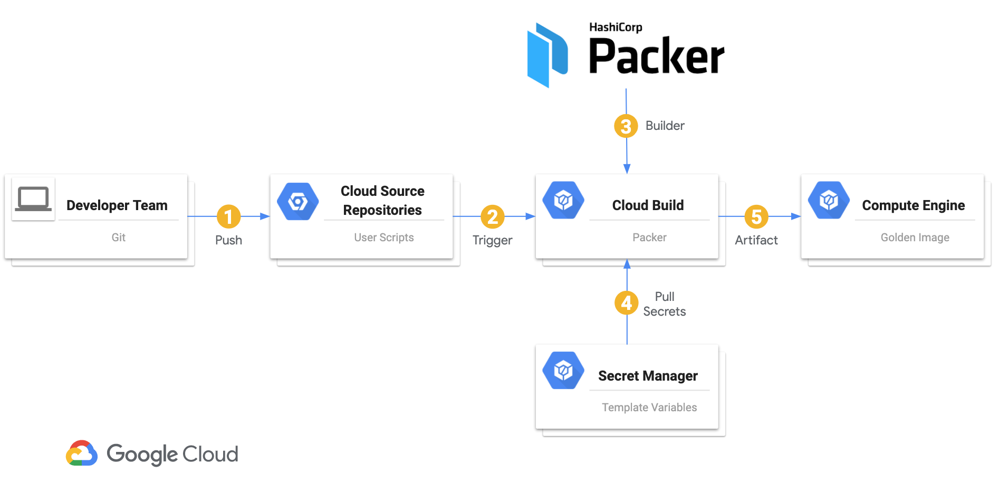
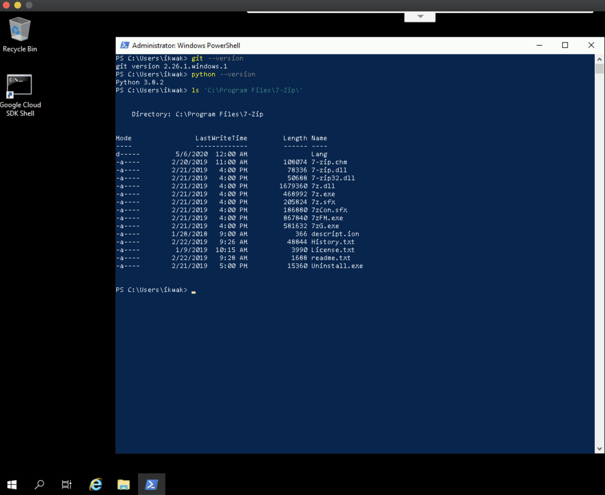

This tutorial will show you how to create an image factory using Cloud Build and
[Packer by HashiCorp](https://packer.io). The image factory will automatically
create new images from a Cloud Source Repository every time a new tag is pushed
to that repository as depicted in the diagram below.

In this tutorial, there are instructions for creating packer image for both Linux and Windows. Follow the respective steps, depending which type of image you want to build.

*This tutorial has been updated by ikwak@ in 2020-05 to include building Windows images using Packer*


# Building a Windows Image (Updated)


# Overview
- For Building a Linux Image, this tutorial uses packer to create a new image from a CentOS 7 VM with nginx
- For Building a Windows Image, this tutorial uses packer to create a new image from a Windows Server 2019 VM with python 3, git and 7zip using chocolatey for package manager

# Prerequisites

- A Google Cloud account
- One of the following:
    - At least project editor access to an existing project
    - Organization permissions to create a new project in an existing organization

# Task 1a: (Optional) Create a project with a billing account attached

This task will help you setup a new Google Cloud project in which to run your Packer
build factory. You can also use an existing project and skip to the next
step.

## Building a Linux Image

<details>
<summary>Click to reveal commands</summary>

```sh
PROJECT=[NEW PROJECT NAME]
ORG=[YOUR ORGANIZATION NAME]
BILLING_ACCOUNT=[YOUR_BILLING_ACCOUNT_NAME]
ZONE=[COMPUTE ZONE YOU WANT TO USE]
ACCOUNT=[GOOGLE ACCOUNT YOU WANT TO USE] or $(gcloud config get-value account)

gcloud projects create "$PROJECT" --organization=$(gcloud organizations list --format="value(name)" --filter="(displayName='$ORG')")
gcloud beta billing projects link $PROJECT --billing-account=$(gcloud alpha billing accounts list --format='value(name)' --filter="(displayName='$BILLING_ACCOUNT')")
gcloud config configurations create --activate $PROJECT
gcloud config set project $PROJECT
gcloud config set compute/zone $ZONE
gcloud config set account $ACCOUNT
```

</details>

## Building a Windows Image

<details>
<summary>Click to reveal commands</summary>

```powershell
$env:PROJECT="NEW PROJECT NAME"
$env:ORG="YOUR ORGANIZATION NAME"
$env:BILLING_ACCOUNT="YOUR_BILLING_ACCOUNT_NAME"
$env:ZONE="COMPUTE ZONE YOU WANT TO USE"
$env:ACCOUNT="GOOGLE ACCOUNT YOU WANT TO USE" or $(gcloud config get-value account)

gcloud projects create "$env:PROJECT" --organization=$(gcloud organizations list --format="value(name)" --filter="(displayName='$env:ORG')")
gcloud beta billing projects link $env:PROJECT --billing-account=$(gcloud alpha billing accounts list --format='value(name)' --filter="(displayName='$env:BILLING_ACCOUNT')")
gcloud config configurations create --activate $env:PROJECT
gcloud config set project $env:PROJECT
gcloud config set compute/zone $env:ZONE
gcloud config set account $env:ACCOUNT
```

</details>

# Task 1b: Set the project variable

Skip this step if you created a new project in the previous section.

Ensure that you're working with the project that you want to use with `gcloud`.
For more information on configurations see [configurations](https://cloud.google.com/sdk/gcloud/reference/config/configurations/).
Fill in `[CONFIGURATION NAME]` with the name of the configuration you want to use.

## Building a Linux Image

<details>
<summary>Click to reveal commands</summary>

```sh
gcloud config configurations activate [CONFIGURATION NAME] #The configuration for the project you want to use
PROJECT=$(gcloud config get-value project)
```

</details>

## Building a Windows Image

<details>
<summary>Click to reveal commands</summary>

```powershell
gcloud config configurations activate [CONFIGURATION NAME] #The configuration for the project you want to use
$env:PROJECT=$(gcloud config get-value project)
```

</details>

# Task 2: Copy the files for this tutorial to a new working directory and git repository

In this step, you'll be downloading the files to your local environment and initialize git the working directory to use in later steps.

## Building a Linux Image

1. Create a new working directory:

<details>
<summary>Click to reveal commands</summary>

```sh
mkdir helloworld-image-factory
cd helloworld-image-factory
```

</details>

2. Download the tutorial scripts:

<details>
<summary>Click to reveal commands</summary>

```sh
curl -L https://github.com/GoogleCloudPlatform/community/raw/master/tutorials/create-cloud-build-image-factory-using-packer/cloudbuild.yaml >cloudbuild.yaml

curl -L https://github.com/GoogleCloudPlatform/community/raw/master/tutorials/create-cloud-build-image-factory-using-packer/install-website.sh >install-website.sh 
```

</details>

3.  Initialize a git repository in the working directory:

<details>
<summary>Click to reveal commands</summary>

```sh
git init
```

</details>

## Building a Windows Image
1.  Create new working directories using Powershell:

<details>
<summary>Click to reveal commands</summary>

```powershell
New-Item -Name windows-image-factory -ItemType Directory

Set-Location -Path ./windows-image-factory

New-Item -Name scripts -ItemType Directory
```

</details>

2.  Download the tutorial scripts to your local environment. To understand what's happening within the script files, scroll down to this [section](#windows-packer-scripts).

<details>
<summary>Click to reveal commands</summary>

```powershell
# Downloading the Cloud Build config file
Invoke-WebRequest -Uri "https://github.com/GoogleCloudPlatform/community/raw/master/tutorials/create-cloud-build-image-factory-using-packer/windows/cloudbuild.yaml" -OutFile "cloudbuild.yaml"

# Downloading the packer config file
Invoke-WebRequest -Uri "https://github.com/GoogleCloudPlatform/community/raw/master/tutorials/create-cloud-build-image-factory-using-packer/windows/packer.json" -OutFile "packer.json"

# Downloading the powershell scripts for packer windows tutorial 
Invoke-WebRequest -Uri "https://github.com/GoogleCloudPlatform/community/raw/master/tutorials/create-cloud-build-image-factory-using-packer/windows/scripts/bootstrap-packer.ps1" -OutFile "./scripts/bootstrap-packer.ps1"

Invoke-WebRequest -Uri "https://github.com/GoogleCloudPlatform/community/raw/master/tutorials/create-cloud-build-image-factory-using-packer/windows/scripts/cleanup-packer.ps1" -OutFile "./scripts/cleanup-packer.ps1"

Invoke-WebRequest -Uri "https://github.com/GoogleCloudPlatform/community/raw/master/tutorials/create-cloud-build-image-factory-using-packer/windows/scripts/disable-uac.ps1" -OutFile "./scripts/disable-uac.ps1"

Invoke-WebRequest -Uri "https://github.com/GoogleCloudPlatform/community/raw/master/tutorials/create-cloud-build-image-factory-using-packer/windows/scripts/install-chocolatey.ps1" -OutFile "./scripts/install-chocolatey.ps1"

Invoke-WebRequest -Uri "https://github.com/GoogleCloudPlatform/community/raw/master/tutorials/create-cloud-build-image-factory-using-packer/windows/scripts/run-chocolatey.ps1" -OutFile "./scripts/run-chocolatey.ps1"
```

</details>

3.  Initialize a git repository in the working directory:

<details>
<summary>Click to reveal commands</summary>

```sh
git init
```

</details>

# Task 3: Enable the required services
Enable the Google Cloud APIs necessary for the tutorial

## Building a Linux Image

<details>
<summary>Click to reveal commands</summary>

```sh
gcloud services enable sourcerepo.googleapis.com
gcloud services enable cloudapis.googleapis.com
gcloud services enable compute.googleapis.com
gcloud services enable servicemanagement.googleapis.com
gcloud services enable storage-api.googleapis.com
gcloud services enable cloudbuild.googleapis.com
```
</details>

## Building a Windows Image

<details>
<summary>Click to reveal commands</summary>

```sh
gcloud services enable sourcerepo.googleapis.com
gcloud services enable cloudapis.googleapis.com
gcloud services enable compute.googleapis.com
gcloud services enable servicemanagement.googleapis.com
gcloud services enable storage-api.googleapis.com
gcloud services enable cloudbuild.googleapis.com
gcloud services enable secretmanager.googleapis.com
```
</details>

# Task 3a: Managing secrets for params using the Google Secrets Manager (Windows Image Only)
In this section, we will be using the [Google Secrets Manager](https://cloud.google.com/secret-manager) to store our input values for packer in a secure and modular way. Although it's easier to simply hard code parameters into the packer template file (eg. network tags, source GCE image), using a central source of truth like a secrets manager increases manageability and reuseability amongst teams.

Create your secrets using the following commands. Optionally, you can customize the values using the [documentation](https://cloud.google.com/secret-manager/docs/creating-and-accessing-secrets)

<details>
<summary>Click to reveal commands</summary>

```sh
echo -n "windows-2019" | gcloud secrets create image_factory-image_family --replication-policy="automatic" --data-file=-

echo -n "golden-windows" | gcloud secrets create image_factory-image_name --replication-policy="automatic" --data-file=-

echo -n "n1-standard-1" | gcloud secrets create image_factory-machine_type --replication-policy="automatic" --data-file=-

echo -n "australia-southeast1" | gcloud secrets create image_factory-region --replication-policy="automatic" --data-file=-

echo -n "australia-southeast1-b" | gcloud secrets create image_factory-zone --replication-policy="automatic" --data-file=-

echo -n "default" | gcloud secrets create image_factory-network --replication-policy="automatic" --data-file=-

echo -n "packer-win" | gcloud secrets create image_factory-tags --replication-policy="automatic" --data-file=-
```

</details>

# Task 3b: Create a new VPC firewall to allow winrm for packer (Windows Image Only)
Before you can provision using the winrm communicator, you need to allow traffic through google's firewall on the winrm port (tcp:5986). This creates a new firewall called `packer-win` that is stored in Secrets Manager (Task 3a) and used by Cloud Build in the cloudbuild.yaml config file. 

<details>
<summary>Click to reveal commands</summary>

```sh
gcloud compute firewall-rules create packer-win --allow tcp:5986
```

</details>

# Task 4: Give the Cloud Build user IAM Role permissions

Find the Cloud Build service account and add the editor role to it (in practice, use least privilege roles). For Windows Image, we will also grant the `secretmanager.secretAccessor` role for [Secret Manager](https://cloud.google.com/secret-manager/docs/access-control).

## Building a Linux Image

<details>
<summary>Click to reveal commands</summary>

```sh
CLOUD_BUILD_ACCOUNT=$(gcloud projects get-iam-policy $PROJECT --filter="(bindings.role:roles/cloudbuild.builds.builder)"  --flatten="bindings[].members" --format="value(bindings.members[])")

gcloud projects add-iam-policy-binding $PROJECT \
--member $CLOUD_BUILD_ACCOUNT \
--role roles/editor
```
</details>

## Building a Windows Image

<details>
<summary>Click to reveal commands</summary>

```powershell
$env:CLOUD_BUILD_ACCOUNT=$(gcloud projects get-iam-policy $env:PROJECT --filter="(bindings.role:roles/cloudbuild.builds.builder)"  --flatten="bindings[].members" --format="value(bindings.members[])")

gcloud projects add-iam-policy-binding $env:PROJECT `
--member $env:CLOUD_BUILD_ACCOUNT `
--role roles/editor

gcloud projects add-iam-policy-binding $env:PROJECT `
--member $env:CLOUD_BUILD_ACCOUNT `
--role roles/secretsmanager.secretAccessor
```
</details>

# Task 5: Create the Cloud Source Repository for your image creator
This is where we will be committing our cloudbuild config file, packer template and bootstrap scripts to a repo in Google Cloud to kick off the packer build.

## Building a Linux Image

<details>
<summary>Click to reveal commands</summary>

```sh
gcloud source repos create helloworld-image-factory
```

</details>

## Building a Windows Image

<details>
<summary>Click to reveal commands</summary>

```sh
gcloud source repos create windows-image-factory
```

</details>

# Task 6: Create the build trigger for the image creator source repository
By configuring a build trigger to the source repo we created in the previous step, we can define a webhook to kickoff Cloud Build to pull down our committed files and start the build process automatically.

## Building a Linux Image

<details>
<summary>Click to reveal commands</summary>

You can create a trigger on the [build triggers page](https://console.cloud.google.com/cloud-build/triggers)
of the Cloud Console by following these steps:

1.  Click **Create Trigger**.
1.  In the **Name** field, enter `Hello world image factory`.
1.  Under **Event**, select **Push to a tag**.
1.  Under **Source**, select `helloworld-image-factory` as your
    **Repository** and the tag to match as your **Tag**.
1.  Under **Build Configuration**, select **Cloud Build configuration file (yaml or json)**.
1.  In the **Cloud Build configuration file location**, enter `cloudbuild.yaml`.
1.  Under **Substitution variables**, click **+ Add variable**.
1.  In the **Variable** field enter `_IMAGE_FAMILY` and in **Value** enter `centos-7`.
1.  In the **Variable** field enter `_IMAGE_ZONE` and in **Value** enter `$ZONE`.
1.  Click **Create** to save your build trigger.

To see a list of image families:

    gcloud compute images list | awk '{print $3}'  | awk '!a[$0]++'

</details>

## Building a Windows Image

<details>
<summary>Click to reveal commands</summary>

You can create a trigger on the [build triggers page](https://console.cloud.google.com/cloud-build/triggers)
of the Cloud Console by following these steps:

1.  Click **Create Trigger**.
1.  In the **Name** field, enter `Windows image factory`.
1.  Under **Event**, select **Push new tag**.
1.  Under **Source**, select `windows-image-factory` as your
    **Repository** and the tag to match or .* (any tag) as your **Tag**.
1.  Under **Build Configuration**, select **Cloud Build configuration file (yaml or json)**.
1.  In the **Cloud Build configuration file location**, enter `cloudbuild.yaml`.
1.  Click **Create** to save your build trigger.

</details>

# Task 7: Add the packer Cloud Build image to your project

Get the builder from the community repository and submit it to your project. This will allow Cloud Build to use a docker container that contains the packer binaries.

## Building a Linux Image

<details>
<summary>Click to reveal commands</summary>

```sh
project_dir=$(pwd)
cd /tmp
git clone https://github.com/GoogleCloudPlatform/cloud-builders-community.git
cd cloud-builders-community/packer
gcloud builds submit --config cloudbuild.yaml
rm -rf /tmp/cloud-builders-community
cd $project_dir
```

</details>

## Building a Windows Image

<details>
<summary>Click to reveal commands</summary>

```powershell
$env:PROJECT_DIR=$(Get-Location)
New-Item -Path "C:\" -Name "temp" -ItemType Directory
Set-Location -Path "C:\temp"

git clone https://github.com/GoogleCloudPlatform/cloud-builders-community.git
Set-Location -Path "./cloud-builders-community/packer"
gcloud builds submit --config cloudbuild.yaml

Remove-Item -Path "C:\temp\cloud-builders-community" -Recurse -Force
Set-Location -Path $env:PROJECT_DIR
```

</details>

# Task 8: Add your repository as a remote repository and push
This will configure the local git to use the cloud source repo we created previously.

## Building a Linux Image

<details>
<summary>Click to reveal commands</summary>

1. (Only if not running in Cloud Shell) Set up your Google credentials for git:

```sh
gcloud init && git config --global credential.https://source.developers.google.com.helper gcloud.sh
```

2. Add the `google` repository as a remote:


```sh
git remote add google https://source.developers.google.com/p/$PROJECT/r/helloworld-image-factory
```

</details>

## Building a Windows Image

<details>
<summary>Click to reveal commands</summary>

1. (Only if not running in Cloud Shell) Set up your Google credentials for git:

```powershell
git config --global "credential.https://source.developers.google.com.helper" gcloud.cmd
```

2. Add the `google` repository as a remote:

```powershell
git remote add google "https://source.developers.google.com/p/$env:PROJECT/r/windows-image-factory"
```

</details>

# Task 9: Push the repository and tags to google
In this task, we add and commit the local files to staging and push it to our cloud source repo to trigger a build. 

<details>
<summary>Click to reveal commands</summary>

1. Add your files to the repository:
 
    ```sh
    git add .
    git commit -m "first image" 
    ```

1. Tag the repository with a version number:

    ```sh
    git tag v0.1
    ```

1. Push the branch and the tags to your `google` repository:

    ```sh
    git push google master --tags
    ```

</details>

# Task 10: View build progress
You can view the stdout from both the staging VM and packer to check on the build progress. Once the packer build completes successfully, it outputs the newly created image:

```sh
Step #1: Build 'googlecompute' finished.
Step #1: 
Step #1: ==> Builds finished. The artifacts of successful builds are:
Step #1: --> googlecompute: A disk image was created: golden-windows-2020-05-05-554-54
```

1. Open the [**Cloud Build** page](https://console.cloud.google.com/cloud-build) in the Cloud Console
    to show the build progress.
1. Find the build that is in progress and click the link to view its progress.

# Task 11: Create a compute instance for the image in your gcp project
Now that packer has created a new GCE image, we can test it by launching a new instance.

## Building a Linux Image

<details>
<summary>Click to reveal commands</summary>

1. Create a new firewall rule to allow port 80 to test our new instance

    ```sh
    gcloud compute firewall-rules create http --allow=tcp:80 \
    --target-tags=http-server --source-ranges=0.0.0.0/0
    ```

2. Create an instance using the newly created Linux image

    ```sh
    gcloud compute instances create helloworld-from-factory \
    --image https://www.googleapis.com/compute/v1/projects/$PROJECT/global/images/helloworld-v01 \
    --tags=http-server --zone=$ZONE
    ```

</details>

## Building a Windows Image

<details>
<summary>Click to reveal commands</summary>

1. Open the [**Compute Engine** page](https://console.cloud.google.com/compute) in the Cloud Console and 
navigate to **Images** to see the Packer generated instance image.

2. Select the image and click on **CREATE INSTANCE**. Complete the launch wizard to launch the instance, whilst ensuring that the **Boot disk** is set to use our custom Image.

</details>

# Task 12: Verifying the results of our efforts 
Now that we've successfully used packer to generate a new golden image and create a new instance, follow the instructions to verify that our deployment has worked correctly.

## Building a Linux Image

<details>
<summary>Click to reveal commands</summary>

1. Wait a minute or two and open the browser to the IP address of the instance to see the special message.

1. Retrieve the instace IP address:

    ```sh
    gcloud compute instances list --filter="name:helloworld*" --format="value(networkInterfaces[0].accessConfigs[0].natIP)"
    ```

1. Go to the IP address in the browser and make sure that you see the "Hello from the image factory!" message.

</details>

## Building a Windows Image

<details>
<summary>Click to reveal commands</summary>

1. Wait a few minutes until the Windows VM has completed the boot up process.

1. Using the [Chrome RDP plugin](https://cloud.google.com/compute/docs/instances/›connecting-to-instance#chrome-remote-desktop) or your preferred [Remote Desktop client](https://cloud.google.com/compute/docs/instances/connecting-to-instance#windows), RDP into your Windows instance.

1. If you need to generate a Windows password, follow [these instructions](https://cloud.google.com/compute/docs/instances/windows/creating-passwords-for-windows-instances#generating_a_password).

1. Once you've connected to the instance, verify that **git**, **python** and **7zip** has been installed successfully (matching versions we defined in `packages.config` XML manifest).



</details>

# Task 13: Cleaning up
If you don't want to keep the resources after this tutorial, you can delete them by following these instructions.

## Building a Linux Image

<details>
<summary>Click to reveal commands</summary>

1.  Delete the firewall rule, the instance, and the image:

    ```sh
    gcloud compute firewall-rules delete --quiet http
    gcloud compute instances delete --quiet helloworld-from-factory
    gcloud compute images delete --quiet helloworld-v01
    ```

2.  Delete the packer Cloud Build image:

    ```sh
    gcloud container images delete --quiet gcr.io/$PROJECT/packer  --force-delete-tags
    ```

3.  Delete the source repository:

    ```sh
    gcloud source repos delete --quiet helloworld-image-factory
    ```

    Only do this if you don't want to perform the tutorial in this project again. The repository name won't be usable
    again for up to seven days.

</details>

## Building a Windows Image

<details>
<summary>Click to reveal commands</summary>

1.  Delete the firewall rule, the instance, and the image.

2.  Delete the packer Cloud Build image:

    ```sh
    cloud container images delete --quiet gcr.io/$PROJECT/packer  --force-delete-tags
    ```

3.  Delete the source repository:

    ```sh
    gcloud source repos delete --quiet windows-image-factory
    ```

    Only do this if you don't want to perform the tutorial in this project again. The repository name won't be usable
    again for up to seven days.

</details>

<br />
<br />

# Windows-packer-scripts

#### cloudbuild.yaml
```
# Perform a Packer build based on the `packer.json` configuration. This Packer
# build creates a GCE image.
#
# See README.md for invocation instructions.
steps:
- name: 'gcr.io/$PROJECT_ID/packer'
  args:
  - build
  - -debug
  - -var
  - project_id=$PROJECT_ID
  - packer.json
tags: ['windows-golden-image']
timeout: '3600s'
```
This file contains the [build configuration](https://cloud.google.com/cloud-build/docs/build-config) for the Cloud Build service, which uses packer to build a new image using instructions within the packer.json file.
<br />
<br />

#### packer.json
```
{
	"variables": {
		"project_id": "_PROJECT_ID",
		"source_image_family": "_IMAGE_FAMILY",
		"image_name": "_IMAGE_NAME",
		"machine_type": "_MACHINE_TYPE",
		"region": "_REGION",
		"zone": "_ZONE",
		"network_id": "_NETWORK",
		"network-tags": "_TAGS"
	},
	"builders": [{
		"type": "googlecompute",
		"project_id": "{{  user `project_id`  }}",
		"machine_type": "{{  user `machine_type`  }}",
		"source_image_family": "{{  user `source_image_family`  }}",
		"region": "{{  user `region`  }}",
		"zone": "{{  user `zone`  }}",
		"network": "{{  user `network_id`  }}", 
		"image_description": "{{  user `source_image_family`  }}-{{  isotime \"2006-01-02-14-04\"  }}",
		"image_name": "{{  user `image_name`  }}-{{  isotime \"2006-01-02-14-04\"  }}",
		"disk_size": 100,
		"disk_type": "pd-ssd",
		"on_host_maintenance": "TERMINATE",
		"tags": "{{  user `network-tags`  }}",
		"communicator": "winrm",
		"winrm_insecure": true,
		"winrm_use_ssl": true,
		"winrm_username": "packer_user",
		"metadata": {
			"windows-startup-script-cmd": "winrm quickconfig -quiet & net user /add packer_user & net localgroup administrators packer_user /add & winrm set winrm/config/service/auth @{Basic=\"true\"}",
			"windows-shutdown-script-ps1": "C:/cleanup-packer.ps1"
		}
	}],
	"provisioners": [{
			"type": "file",
			"source": "./scripts/packages.config",
			"destination": "C:/packages.config"
		},
		{
			"type": "file",
			"source": "./scripts/cleanup-packer.ps1",
			"destination": "C:/cleanup-packer.ps1"
		},
		{
			"type": "powershell",
			"scripts": [
				"./scripts/disable-uac.ps1",
				"./scripts/install-chocolatey.ps1",
				"./scripts/run-chocolatey.ps1"
			]
		},
		{
			"type": "powershell",
			"inline": [
				"GCESysprep -NoShutdown"
			]
		}
	]
}
```
This file contains the [googlecompute builder template](https://www.packer.io/docs/builders/googlecompute/) for creating a new image for use with Google Compute Engine.

Because of the way Packer uses winrm as the communicator to connect and configurate windows, this template achieves the following.
- `"variables"` contains placeholder values such as _PROJECT_ID that are dynamically changed by Cloud Build sourced from both inbuilt variables (project) and custom user variables (secrets manager). Of note, by using `"source_image_family"`, packer will automatically retrieve the latest version available for the Machine Image
- Configures winrm to use HTTPS for connecting Packer and the staging Windows VM (creates a temporary, local self-signed certificate)
- Using [GCE metadata](https://cloud.google.com/compute/docs/startupscript#providing_a_startup_script_for_windows_instances) `"windows-startup-script-cmd"`, temporarily create a new local account **packer_user** on the Windows VM and add it to local administrator group to provide permissions for winrm and install the desired packages
- Within the `"provisioners"` section, create a local copy of *packages.config* and *cleanup-packer.ps1* files into the staging Windows VM, to be used by [chocolatey](https://chocolatey.org/) and the `"windows-shutdown-script-ps1"` GCE metadata to clean up once finished
- Still within the `"provisioners"` section, run the powershell scripts for bootstrapping our Windows environment using chocolatey (see below for more details)
- [Optional] Instead of chocolatey, you can replace the chocolatey powershell scripts with your own custom bootstrap script, or pull/push configuration management tools such as Ansible, Puppet, Chef or Powershell DSC. 
- Finally, we call `GCESysprep -NoShutdown` as a way to seal the image with using the optional -NoShutDown parameter to prevent the Windows environment from shutting down and create a false positive, unhealthy signal back to Packer (lifecycle needs to be managed by Packer to complete the image workflow)

<br />
<br />

#### scripts/bootstrap-packer.ps1

```powershell
# https://docs.microsoft.com/en-us/windows/win32/winrm/winrm-powershell-commandlets

Write-Output "+++ Running Bootstrap Script for setting up packer +++"

Set-ExecutionPolicy Unrestricted -Scope LocalMachine -Force -ErrorAction Ignore

# Don't set this before Set-ExecutionPolicy as it throws an error
$ErrorActionPreference = "stop"

# Remove HTTP listener and creating a new self-signed cert for packer winrm connection
Remove-Item -Path WSMan:\Localhost\listener\listener* -Recurse

# Creating new selfsigned cert for HTTPS connection
$certName = "packer"
$Cert = New-SelfSignedCertificate -CertstoreLocation Cert:\LocalMachine\My -DnsName $certName -FriendlyName $certName
New-Item -Path WSMan:\LocalHost\Listener -Transport HTTPS -Address * -CertificateThumbPrint $Cert.Thumbprint -Force

# WinRM stuff
Write-Output "+++ Setting up WinRM+++ "

#cmd.exe /c winrm quickconfig -q
$firewallRuleName = "WinRM"
cmd.exe /c winrm set "winrm/config" '@{MaxTimeoutms="1800000"}'
cmd.exe /c winrm set "winrm/config/winrs" '@{MaxMemoryPerShellMB="1024"}'
cmd.exe /c winrm set "winrm/config/service" '@{AllowUnencrypted="true"}'
cmd.exe /c winrm set "winrm/config/client" '@{AllowUnencrypted="true"}'
cmd.exe /c winrm set "winrm/config/service/auth" '@{Basic="true"}'
cmd.exe /c winrm set "winrm/config/client/auth" '@{Basic="true"}'
cmd.exe /c winrm set "winrm/config/service/auth" '@{CredSSP="true"}'
cmd.exe /c winrm set "winrm/config/listener?Address=*+Transport=HTTPS" "@{Port=`"5986`";Hostname=`"packer`";CertificateThumbprint=`"$($Cert.Thumbprint)`"}"
cmd.exe /c netsh advfirewall firewall set rule group="remote administration" new enable=yes
cmd.exe /c netsh advfirewall firewall add rule name=$firewallRuleName dir=in protocol=tcp localport=5986 action=allow
Stop-Service -Name winrm
Set-Service -Name winrm -StartupType Auto
Start-Service -Name winrm
```
This file configures Packer to use a HTTPS connection for WinRM to secure communication between the staging VM and Packer host. The config made during this script such as a local certificate, listener and firewall are deleted during the `cleanup-packer.ps1`.

<br />
<br />

#### scripts/cleanup-packer.ps1
```powershell
function Remove-Chocolatey{
    <#
        .SYNOPSIS
            This function removes chocolatey binaries and local configs such as env var.
            Also removes local copy of packages.config file that was used to bootstrap machine    
    #>
Write-Output "+++ Deleting Chocolatey package config file +++"
Remove-Item -Path C:\packages.config

if (!$env:ChocolateyInstall) {
    Write-Warning "The ChocolateyInstall environment variable was not found. `n Chocolatey is not detected as installed. Nothing to do"
    return
    }
if (!(Test-Path "$env:ChocolateyInstall")) {
Write-Warning "Chocolatey installation not detected at '$env:ChocolateyInstall'. `n Nothing to do."
return
}

$userPath = [Microsoft.Win32.Registry]::CurrentUser.OpenSubKey('Environment').GetValue('PATH', '', [Microsoft.Win32.RegistryValueOptions]::DoNotExpandEnvironmentNames).ToString()
$machinePath = [Microsoft.Win32.Registry]::LocalMachine.OpenSubKey('SYSTEM\CurrentControlSet\Control\Session Manager\Environment\').GetValue('PATH', '', [Microsoft.Win32.RegistryValueOptions]::DoNotExpandEnvironmentNames).ToString()
    
@"
    User PATH:
    $userPath
    
    Machine PATH:
    $machinePath
    
"@ | Out-File "C:\PATH_backups_ChocolateyUninstall.txt" -Encoding UTF8 -Force
    
    if ($userPath -like "*$env:ChocolateyInstall*") {
    Write-Output "Chocolatey Install location found in User Path. Removing..."
    # WARNING: This could cause issues after reboot where nothing is
    # found if something goes wrong. In that case, look at the backed up
    # files for PATH.
    [System.Text.RegularExpressions.Regex]::Replace($userPath, [System.Text.RegularExpressions.Regex]::Escape("$env:ChocolateyInstall\bin") + '(?>;)?', '', [System.Text.RegularExpressions.RegexOptions]::IgnoreCase) | %{[System.Environment]::SetEnvironmentVariable('PATH', $_.Replace(";;",";"), 'User')}
    }
    
    if ($machinePath -like "*$env:ChocolateyInstall*") {
    Write-Output "Chocolatey Install location found in Machine Path. Removing..."
    # WARNING: This could cause issues after reboot where nothing is
    # found if something goes wrong. In that case, look at the backed up
    # files for PATH.
    [System.Text.RegularExpressions.Regex]::Replace($machinePath, [System.Text.RegularExpressions.Regex]::Escape("$env:ChocolateyInstall\bin") + '(?>;)?', '', [System.Text.RegularExpressions.RegexOptions]::IgnoreCase) | %{[System.Environment]::SetEnvironmentVariable('PATH', $_.Replace(";;",";"), 'Machine')}
    }
    
    # Adapt for any services running in subfolders of ChocolateyInstall
    $agentService = Get-Service -Name chocolatey-agent -ErrorAction SilentlyContinue
    if ($agentService -and $agentService.Status -eq 'Running') { $agentService.Stop() }
    # TODO: add other services here
    
    # delete the contents (remove -WhatIf to actually remove)
    Remove-Item -Recurse -Force "$env:ChocolateyInstall" -WhatIf
    
    [System.Environment]::SetEnvironmentVariable("ChocolateyInstall", $null, 'User')
    [System.Environment]::SetEnvironmentVariable("ChocolateyInstall", $null, 'Machine')
    [System.Environment]::SetEnvironmentVariable("ChocolateyLastPathUpdate", $null, 'User')
    [System.Environment]::SetEnvironmentVariable("ChocolateyLastPathUpdate", $null, 'Machine')
}

function Remove-PackerUser{
    <#
        .SYNOPSIS
            This removes the local packer_user account used for packer winRM connection
    #>
    param(
        [String] $userAccount # default, packer_user
    )
    Write-Output "+++ Removing local user account for packer +++"
    Remove-LocalUser -Name $userAccount
}

function Remove-WinRMConfig {
    <#
        .SYNOPSIS
            This undos the winrm config set up for packer. Removes local cert, listener, firewall rules and disables windows service from starting
    #>

    Write-Output "+++ Removing Packer WinRM and required configs +++"
    # Remove HTTP listener and deleting the self-signed cert for packer winrm connection
    Remove-Item -Path WSMan:\Localhost\listener\listener* -Recurse
    # Deleting selfsigned cert used for HTTPS connection
    $certName = "packer"
    Get-ChildItem -Path Cert:\LocalMachine\My | Where-Object {  $_.FriendlyName -like $certName  } | Remove-Item
    # Closing WinRM HTTPS firewall
    $firewallRuleName = "WinRM"
    Remove-NetFirewallRule -DisplayName $firewallRuleName
    Write-Output "+++ Disabling WinRM +++"
    Disable-PSRemoting
    # Disabling local winrm service from auto starting 
    Stop-Service -Name winrm
    Set-Service -Name winrm -StartupType Manual
}

# Kick off clean up script

Remove-Chocolatey
Remove-PackerUser -userAccount "packer_user"
Remove-WinRMConfig
# Finally, delete the cleanup script itself
Remove-Item -Path $MyInvocation.MyCommand.Source -Force

```
This file is invoked as a shutdown script to remove the Chocolatey powershell binaries, the local user account for packer, undo WinRM configurations and then the shutdown script itself. 

<br />
<br />

#### scripts/disable-uac.ps1
```powershell
Write-Output "+++ Disabling UAC… +++"

New-ItemProperty -Path HKLM:Software\Microsoft\Windows\CurrentVersion\Policies\System -Name EnableLUA -PropertyType DWord -Value 0 -Force
New-ItemProperty -Path HKLM:Software\Microsoft\Windows\CurrentVersion\Policies\System -Name ConsentPromptBehaviorAdmin -PropertyType DWord -Value 0 -Force
```
This file disables the User Account Control (UAC) to allow silent installations of packages for Chocolatey.

<br />
<br />

#### scripts/install-chocolatey.ps1
```powershell
# ./scripts/chocolatey.ps1
# Install Chocolatey
Write-Output "+++ Installing Chocolatey… +++"
iex ((New-Object System.Net.WebClient).DownloadString('https://chocolatey.org/install.ps1'))
```
This file installs the latest version of Chocolatey, a package management binary for powershell.

<br />
<br />

#### scripts/packages.config
```xml
<?xml version="1.0" encoding="utf-8"?>
<packages>
    <package id="python" version="3.8.2" />
    <package id="git" version="2.26.1" />
    <package id="7zip" version="19.0" />
</packages>
```
This file contains a list of packages in an xml manifest for Chocolatey to install. This is where you can define [any supported packages](https://chocolatey.org/packages) to install, as well as versioning, options and switches. [See here](https://chocolatey.org/docs/commandsinstall#packagesconfig) for more details. 
<br />
<br />

#### scripts/run-chocolatey.ps1
```powershell
Write-Output "+++ Running Chocolatey… +++"

# clean exit or reboot pending: https://chocolatey.org/docs/commandsinstall#exit-codes
$validExitCodes = 0, 3010

# Globally Auto confirm every action
$commandAutoConfirm = 'choco feature enable -n allowGlobalConfirmation'
$commandInstall = 'choco install C:\packages.config -y --no-progress'

try
{
    Invoke-Expression -Command $commandAutoConfirm
    Invoke-Expression -Command $commandInstall
    
    if ($LASTEXITCODE -notin $validExitCodes)
    {
        throw "Error encountered during package installation with status: $($LASTEXITCODE)"
    }
    else
    {
        Write-Output ""
        Write-Output "Chocolatey packages has been installed successfully!"
    }
}
catch
{
    throw "Error encountered during chocolatey operation: $($Error[0].Exception)"
}
```
This file is invokes chocolatey to install the packages defined in our xml manifest including error handling. As some Windows software requires a reboot to complete the installation, this script allows it (exit code 3010) as Packer will shutdown and sysprep the image as the final step.

<br />
<br />