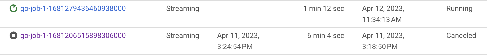

Ujjwal Sharma

<p style="background-color:#CAFACA;"><i>Contributed by Google employees.</i></p>

Apache Beam is a powerful tool that can be used to build complex data pipelines. It provides SDKs for Java, Python, and Golang, making it easy to get started.

The reason GCP is so compatible with Beam is because of ease of connection. Beam connects seamlessly with Pub/Sub, BigQuery, BigTable, and Dataflow which helps to link these resources using a few lines of code. In this tutorial, we will explore how to build a pipeline to connect Pub/Sub and BigQuery where data needs enrichment/correction using Beam Golang SDK.

## Understand the Use-Cases for Apache Beam and Dataflow

As mentioned earlier, Beam has enormous use cases in the real world. This involves Machine Learning pipelines (including MLOps), Data analytics, Data filtering/enrichment and stream data processing. The dataflow runner for apache beam helps to further enhance the advantages by providing automatic resource management, fault tolerance and flexible deployments.

To understand how to code a real-world pipeline, let’s build an example pipeline. Suppose you want to analyze sensor data coming from IoT devices in the form `{device_num}:{cluster_num}-{value}`. The data from these devices can be huge and should be stored ideally in BigTable. However, you want to analyze the data for only 2 clusters ie. `cluster1` and `cluster2`. For `cluster1`, the values are in per minute and these need to be converted to per second before analysis. Finally, to analyze the sensor data, the analytics team needs comma separated value in batches of 10 seconds and timestamps.

Lets understand how to build this pipeline using Beam Golang SDK. As here Data Correction (convert to per second) and Data Enrichment (timestamp addition) are needed for analysis, Dataflow will be the ideal choice. The data coming from sensors can be ingested into Pub/Sub and Dataflow can be used to send data to BigQuery.


## Use the Beam Golang SDK to build an IoT Pipeline
Apache Beam’s Golang SDK has connectors for both Bigquery and Pub/Sub which you can use with dataflow runner. The first step of getting started is enabling the required APIs, Pub/Sub topic and subscription, BigQuery Dataset and Table and Service Account to be used by Dataflow.

Start by enabling the Dataflow, Pub/Sub and BigQuery APIs. Next, create the Pub/Sub Topic and Subscription and create a service account with Dataflow Admin, Dataflow Worker, Pub/Sub Admin and BigQuery Admin roles.

```bash
$ gcloud pubsub topics create pubsub-test
$ gcloud pubsub subscriptions create SUBSCRIPTION pubsub-test-sub --topic=pubsub-test --topic-project=$PROJECT_ID) 
$ gcloud iam service-accounts create $SA_NAME \
--display-name "Service Account Name" \
--project $PROJECT_ID \
--roles roles/dataflow.admin,roles/dataflow.worker,roles/pubsub.admin,roles/bigquery.admin
```

Finally, create the BigQuery Table `test_table` in the dataset `test_dataset` with the following schema :-


Lets start coding. Create a new directory and initialize a Golang module.

``` bash
$ mkdir iot-dataflow-pipeline && cd iot-dataflow-pipeline
$ go mod init
$ touch main.go
```

Lets setup the beam pipeline’s code context in our local. First initialize the beam SDK and then declare a new pipeline. Beam has the concept of scope which is used to keep track of the DAG and is used by ParDo to link the steps. Finally, beamx pipeline is run by providing the pipeline. beamx provides the flexibility to run on different platforms ie. local and dataflow.

``` go
func PubsubToBigQuery(projectId, pubsub_topic, pubsub_subscription, bq_table_string string) {
flag.Parse()
beam.Init()
ctx := context.Background()
p := beam.NewPipeline()
s := p.Root()

// Run the beam pipeline
if err := beamx.Run(ctx, p); err != nil {
  log.Exitf(ctx, "Failed to execute job: %v", err)
 }
}
```

Beam provides a module called pubsubio which can read and write messages to Pub/Sub. For reading from Pub/Sub, a subscription is needed. The result returned by `pubsubio` is PCollection which can modified further.

``` go
// Pub/Sub messages read by Beam.
pubsub_messages := pubsubio.Read(s, projectId, pubsub_topic, &pubsubio.ReadOptions{
  Subscription: pubsub_subscription,
 })
```

The first requirement is to analyze the results from `cluster1` and `cluster2`. For this data filtering is needed and hence you need to divide the data into 2 different PCollections. This can be done using ParDo2 which returns 2 PCollection and data can be selectively appended. ParDo takes the pipeline scope, a DoFn (which are the modification you want) and PCollection. Additionally, you can provide data from an alternate source using SideInput.

``` go
// Data Filtering by sending data to different pardo based on data values.
 messages_cluster1, messages_cluster2 := beam.ParDo2(s, func(b []byte, pCollection1, pCollection2 func(string)) {
  msg := string(b)
  if strings.Contains(msg, "cluster1") {
   pCollection1(msg)
  } else if strings.Contains(msg, "cluster2") {
   pCollection2(msg)
  }
 }, pubsub_messages)
```

Now, the data for `cluster1` and `cluster2` are separated. Data correction is needed for `cluster1` by multiplying all the values by 60 so that results are per second. After correcting this, we need to group the incoming records using the device number. For this, beam provides a transform called CoGroupByKey which needs the PCollection of the type Key Value pair. In Golang, this can be done by returning 2 values from the DoFn like (string, string) as done below. This will be used below.

``` go
// Data Correction
 cluster1_kv_pair := beam.ParDo(s, func(corrected_string string) (string, string) {
  z := strings.Split(corrected_string, ":")
  // edge case
  if len(z) == 1 {
   return "device1", z[0]
  }
  zz := strings.Split(corrected_string, "-")[1]

  value, err := strconv.Atoi(zz)
  if err != nil {

  }
  value = value * 60
  return z[0], strings.Split(corrected_string, "-")[1] + "-" + fmt.Sprintf("%v", value)
 }, messages_cluster1)
 // we need another transfer for cluster2 to process using coGroupByKey
 cluster2_kv_pair := beam.ParDo(s, func(corrected_string string) (string, string) {
  z := strings.Split(corrected_string, ":")
  // edge case
  if len(z) == 1 {
   return "device2", z[0]
  }
  return z[0], z[1]
 }, messages_cluster2)
```

Now, to process all records in a 10 second window, WindowInto method of beam SDK can be used. Note that if you don’t use windowing here, the CoGroupByKey will keep on grouping and not give any output till you drain your pipeline.

``` go
// Windowing of 10 seconds added.
 windowed_cluster1 := beam.WindowInto(s, window.NewFixedWindows(time.Second*10), cluster1_kv_pair)
 windowed_cluster2 := beam.WindowInto(s, window.NewFixedWindows(time.Second*10), cluster2_kv_pair)

 // Group by using keys and values
 pCollection_GBK := beam.CoGroupByKey(s, windowed_cluster1, windowed_cluster2)
```

After Grouping multiple PCollection into one, you need to aggregate the data. When passing the CoGroupByKey PCollection, it can be processed using function by passing pointers.

``` go
// Run the aggregation based on keys for the windowed input
key_aggregation := beam.ParDo(s, func(key string, value1, value2 func(*string) bool) string {
  var s_z string
  var v1_list, v2_list string
  for value1(&s_z) {
   v1_list = v1_list + " , " + strings.Split(s_z, "-")[1]
  }
  for value2(&s_z) {
   v2_list = v2_list + " , " + strings.Split(s_z, "-")[1]
  }
  return key + " :::: " + v1_list + v2_list

 }, pCollection_GBK) 
```

Here, two lists are being appended ie. the corrected PCollection and the PCollection for `cluster2`. Finally, the result is written to BigQuery table. We will need to define the BigQuery table schema in form of a struct before the main function.

``` go
type (
 BQRow struct {
  Device string
  Values string
  Time   string
 }
)
```

This is used when appending to BigQuery. The data is being enriched by adding time in form of a string.

``` go
// Create the BQ Row PCollection by processing the output
 create_BQRow := beam.ParDo(s, func(ss string) BQRow {
  z := strings.Split(ss, "::::")
  return BQRow{
   Device: z[0],
   Values: z[1],
   Time:   time.Now().String(),
  }
 }, key_aggregation)

 // print the output
 debug.Print(s, key_aggregation)

 // write to bigquery
 bigqueryio.Write(s, projectId, bq_table_string, create_BQRow)
```

## Analyze the Streaming Pipeline
As pubsubio is used, the dataflow runner has to be used. Run the following command to start the pipeline.

``` bash
$ go run main.go --project=$PROJECT_ID \
--runner=dataflow --region=$REGION \
--staging_location=$BUCKET_AND_FOLDER \
--service_account_email=$SERVICE_ACCOUNT_EMAIL
```

This command calls the Dataflow API and sends the required build information to run the Golang Job using service account. The Beam state is stored in the staging location. Go to the Dataflow jobs page. You should see the pipeline of type streaming.



On your console you should see the following.


The dataflow pipeline should look something like this :-


Along with this, you should be able to see the logs link on the shell. Open the link to see the dataflow job logs. The debug.Print step above also logs here. Go to your Pub/Sub topic and click on Messages. Lets publish 2 messages like `device1:cluster1–3` and 3 messages for `device2:cluster2–40` .

Wait for a few minutes and analyze the pipeline logs. Once you see the debug output, go to your BigQuery table and run the query.

You should see the output with values and timestamp in BigQuery.

Congratulations! Your Dataflow pipeline is working. You need to be cautious about the costs incurred in this guide. Make sure that you cancel(immediate stop)/drain(process the messages in the queue and then stop) the dataflow pipeline and delete the Pub/Sub topic and subscription as well as the dataflow table after you are done playing around.

## Cleaning up

To avoid incurring charges to your Google Cloud account for the resources used in this tutorial, you can delete the project:

1.  In the Cloud Console, go to the [**Manage resources** page](https://console.cloud.google.com/iam-admin/projects).
2.  In the project list, select the project that you want to delete and then click **Delete**.    
3.  In the dialog, type the project ID and then click **Shut down** to delete the project.
