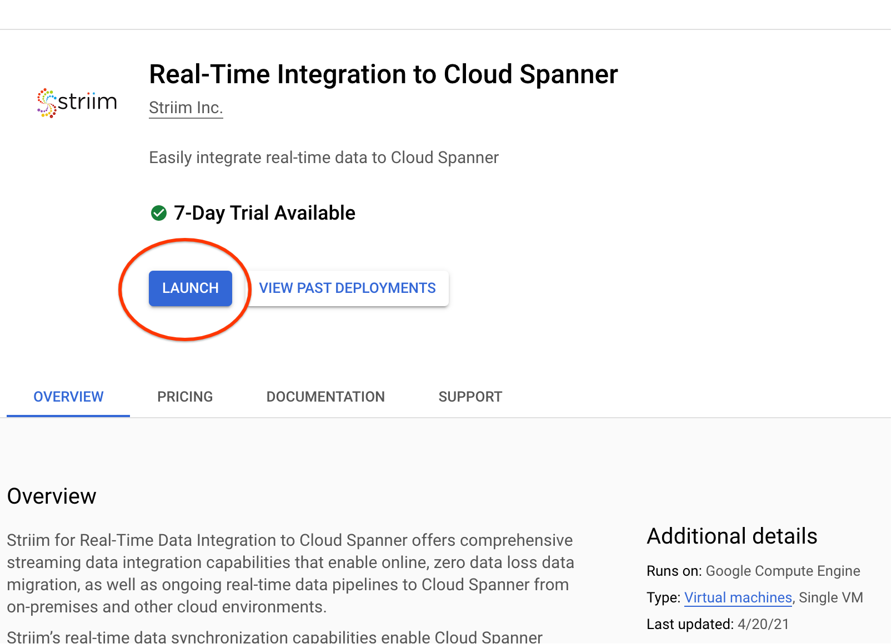
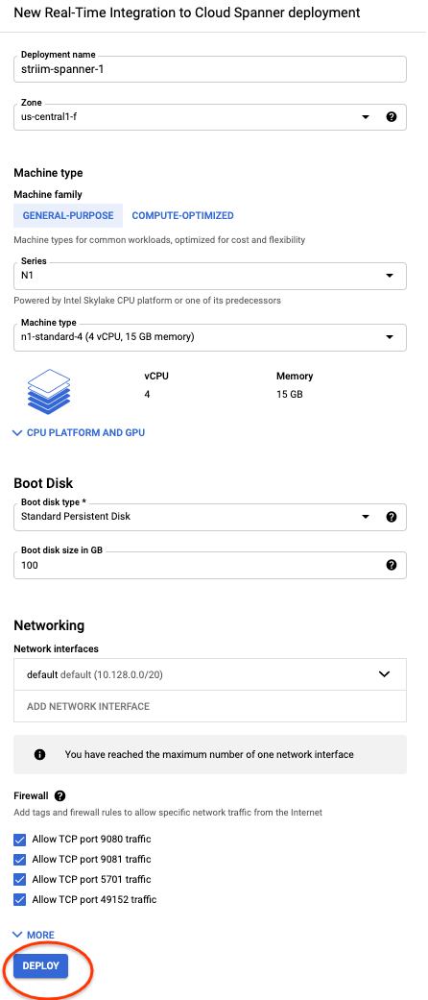
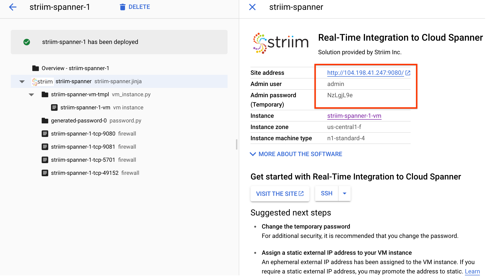
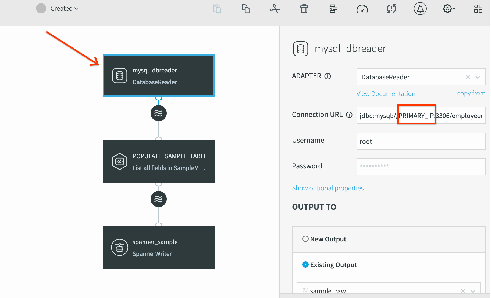
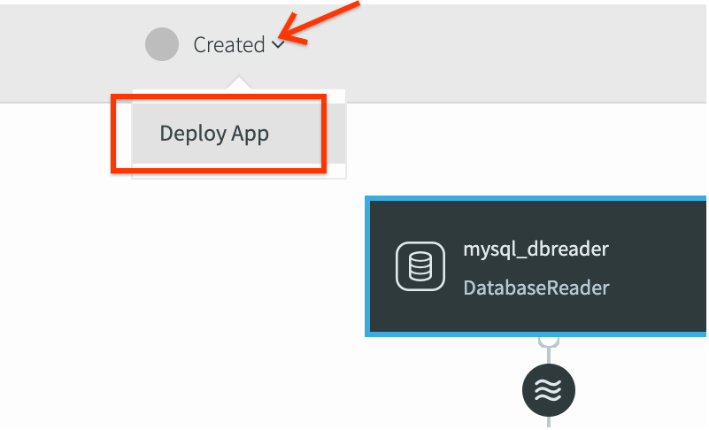
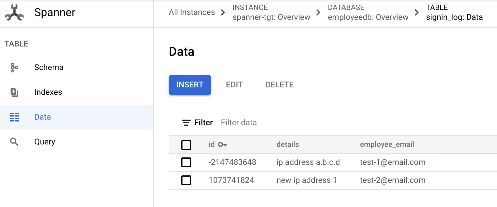
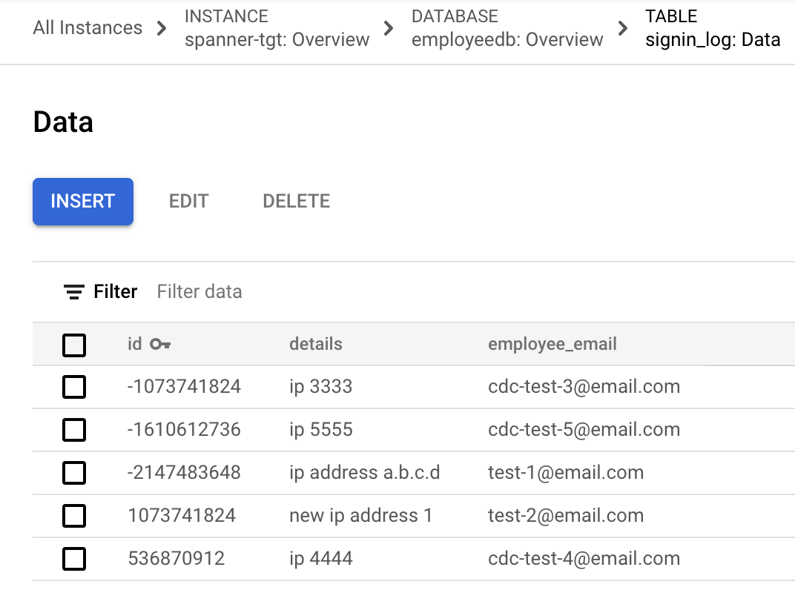

Shashank Agarwal | Database Migrations Engineer | Google

<i>Contributed by Google employees.</i>

In this tutorial you will learn about migrating databases consisting of auto incrementing primary keys. The primary key uniquely identifies each row in a table. If you insert records with a monotonically increasing integer as the key, you'll always insert at the end of your key space. This is undesirable because Cloud Spanner divides data among servers by key ranges, which means your inserts will be directed at a single server, creating a hotspot. This applies even when an existing database needs to be migrated. Unless mitigated, this can lead to slow data ingestion from MySQL to Cloud Spanner due to **hotspots**.   

This tutorial will implement [bit-reverse](https://cloud.google.com/spanner/docs/schema-design#bit_reverse_primary_key) technique to reliably convert incrementing keys such that it can prevent hotspot in Cloud Spanner. Core idea is to write a deterministic mathematical function f(x) which results in a non-incrementing value and is unique. Reversing the bits maintains unique values across the primary keys. You need to store only the reversed value, because you can recalculate the original value in your application code, if needed.   

In addition, we also got to solve for generating keys post migration. Cloud Spanner does not have auto generated keys (at time of writing this article), therefore post migration applications will need to generate primary keys. In this tutorial, we will assume that the applications will use [UUID](https://cloud.google.com/spanner/docs/schema-design#uuid_primary_key) for generating keys post migration on Cloud Spanner.  

We will use [Striim](https://www.striim.com/) for performing the zero downtime data migration from MySQL to Cloud Spanner.  

## Objectives

*   Create and setup CloudSQL MySQL instance with Auto Incrementing primary key.
*   Create and setup Cloud Spanner instance.
*   Deploy and configure Striim for performing data migration.
*   Plugin custom functions into Striim for real time data transformation(s).
*   Create initial load Striim pipeline.
*   Create  a continuous replication (CDC) Striim pipeline.

## Costs

This tutorial uses billable components of Google Cloud, including the following:

*   Compute Engine for Striim
*   Cloud SQL MySQL instance
*   Cloud Spanner
*   Striim License, which includes a trial period through the [Cloud Marketplace](https://console.cloud.google.com/marketplace/details/striim/striim)

Use the [pricing calculator](https://cloud.google.com/products/calculator) to generate a cost estimate based on your projected usage.   

## Before you begin

For this tutorial, you need a Google Cloud [project](https://cloud.google.com/resource-manager/docs/cloud-platform-resource-hierarchy#projects). You can create a
new one, or you can select a project that you already created.

1.  [Select or create a Google Cloud project.](https://console.cloud.google.com/projectselector2/home/dashboard)
2.  [Enable billing for your project.](https://support.google.com/cloud/answer/6293499#enable-billing)
3.  [Enable API](https://console.cloud.google.com/flows/enableapi?apiid=compute.googleapis.com,spanner.googleapis.com) for Compute Engine and Spanner.

When you finish this tutorial, you can avoid continued billing by deleting the resources that you created. For details, see the "Cleaning up" 
section at the end of this tutorial.

## Setup Source Database (Cloud SQL for MySQL)
1. Create Cloud SQL Instance, in a cloud shell.

        gcloud sql instances create mysql-57  \
            --database-version=MYSQL_5_7 \
            --tier=db-n1-standard-1  \
            --region=us-central1 \
            --root-password=password123

2. Enable binary logging (for CDC).

        gcloud sql instances patch mysql-57 --backup-start-time 00:00
        gcloud sql instances patch mysql-57 --enable-bin-log    

3. Connect to Cloud SQL for MySQL instance. Type in password *password123* when prompted.

        gcloud sql connect mysql-57 --user=root

4. Create database and tables.

        CREATE DATABASE employeedb;
        use employeedb;
        CREATE TABLE `signin_log` (
          `id` int not null AUTO_INCREMENT,
          `employee_email` varchar(200) DEFAULT NULL,
          `details` varchar(500) DEFAULT NULL,
          PRIMARY KEY (`id`)
        );
    
5. Insert sample data rows.

        INSERT INTO signin_log (employee_email, details) values ('test-1@email.com', 'ip address a.b.c.d');
        INSERT INTO signin_log (employee_email, details) values ('test-2@email.com', 'new ip address 1');

## Setup Target Database (Cloud Spanner)
1. Create a Cloud Spanner instance

        gcloud spanner instances create spanner-tgt \
            --config=regional-us-central1 \
            --nodes=1 \
            --description=spanner-tgt

2. Create database and empty table.

        gcloud spanner databases create employeedb \
        --instance=spanner-tgt \
        --ddl='CREATE TABLE signin_log (id STRING(36), employee_email STRING(200), details STRING(500)) PRIMARY KEY (id)'
        
**NOTE** The employee_id column has been changed to STRING in the above example. As mentioned previously, this is done so that application can generate UUID keys post migration.

## Setup Middleware (Striim)

### Deploy Striim

1. Deploy a Striim instance from  GCP Marketplace. Visit [this link](https://console.cloud.google.com/marketplace/product/striim/striim-spanner) to deploy a Striim instance.

2. Click "Launch". On the next screen keep the default configuration and click "Deploy".

3. Once deployed you will get a link to Striim instance along with Admin user and password.  
   *NOTE: You can also access this information from the [Deployment Manager](https://console.cloud.google.com/dm/deployments) if needed*

### Configure Striim

1. To allow Striim to communicate with Cloud SQL for MySQL, [add the Striim server's IP address](https://cloud.google.com/sql/docs/mysql/connect-external-app)
 to the Cloud SQL for MySQL instance's authorized networks. 
 
        STRIIMVM_ZONE=us-central1-f
        gcloud sql instances patch mysql-57 \
            --authorized-networks=$(gcloud compute instances describe striim-spanner-1-vm \
            --format='get(networkInterfaces[0].accessConfigs[0].natIP)' \
            --zone=$STRIIMVM_ZONE)

Update STRIIMVM_ZONE with the right value.

2. Deploy mysql driver as described [here](https://cloud.google.com/architecture/partners/continuous-data-replication-cloud-spanner-striim#setting_up_mysql_connector_j)

    SSH into Striim VM
    
        gcloud compute ssh striim-spanner-1-vm

    Execute below comannds to download and deploy mysql driver inside striim.
    
        wget https://dev.mysql.com/get/Downloads/Connector-J/mysql-connector-java-5.1.49.tar.gz
        tar -xvzf mysql-connector-java-5.1.49.tar.gz
        sudo cp ~/mysql-connector-java-5.1.49/mysql-connector-java-5.1.49.jar /opt/striim/lib
        sudo chmod +x /opt/striim/lib/mysql-connector-java-5.1.49.jar
        sudo chown striim /opt/striim/lib/mysql-connector-java-5.1.49.jar
        sudo systemctl stop striim-node
        sudo systemctl stop striim-dbms
        sudo systemctl start striim-dbms
        sudo systemctl start striim-node

3. Create a service account key for Striim to authenticate with Cloud Spanner. Execute the following commands in Cloud Shell. 

        export PROJECT=$(gcloud info --format='value(config.project)')        
        export PROJECT_NUMBER=$(gcloud projects list \
            --filter="projectId=$PROJECT" --format="value(projectNumber)")
            
        export compute_sa=$PROJECT_NUMBER-compute@developer.gserviceaccount.com
        gcloud iam service-accounts keys create ~/striim-spanner-key.json --iam-account $compute_sa

   A key called striim-spanner-key.json should be created on your Cloud Shell home path.

4. Move the service account key to the _/opt/striim_ directory on Striim instance. And grant _striim_ user owner permissions.

        gcloud compute scp ~/striim-spanner-key.json striim-spanner-1-vm:~
        gcloud compute ssh striim-spanner-1-vm \
            -- 'sudo cp ~/striim-spanner-key.json /opt/striim && \
            sudo chown striim /opt/striim/striim-spanner-key.json'

## Migrate data using Striim
Data migration is a two step process : 

1. Initial Load
2. Continuous Replication (CDC)

Both step use custom functions written in Java for data manipulations i.e. bit reverse and string conversion.

### Plugin BitReverse Function into Striim
You will write code, compile, package and deploy java code for bit reversal onto Striim instance. This custom function is to be moved to _/opt/striim/lib_ directory on Striim instance.

1. SSH into VM

        gcloud compute ssh striim-spanner-1-vm

2. Write java code

        cat > CustomFunctions.java << EOF
        public abstract class CustomFunctions {
                
        //used by STRIIM to convert MySQL's int ids to bit reversed strings
        public static String bitReverseInt(Integer id) {
                return String.valueOf(Integer.reverse(id));
                }
        }
        EOF

3. Compile and package it.

        javac CustomFunctions.java
        jar -cf CustomFunctions.jar CustomFunctions.class CustomFunctions.java

4. Move jar onto Striim instance's _/opt/striim/lib/_ directory.

        sudo cp CustomFunctions.jar /opt/striim/lib/
        sudo chown striim /opt/striim/lib/CustomFunctions.jar
        sudo chmod +x /opt/striim/lib/CustomFunctions.jar

5. Restart Striim application for Striim to pickup this jar. 

        sudo systemctl stop striim-node
        sudo systemctl stop striim-dbms
        sudo systemctl start striim-dbms
        sudo systemctl start striim-node

### Create initial load pipeline
Initial load job is meant to bulk load existing data. It loads all data existing at job start time and once finished, will quiesce (pause).
Any changes (updates, deletes, inserts, append) to data after job start time will not be replicated by this job.

1. Save the following code as `mysql_to_spanner_initial_load.tql` file on your local computer. You will import it into Striim application.

        drop APPLICATION mysql_to_spanner_initial_load CASCADE;
        
        IMPORT STATIC CustomFunctions.*;
        
        CREATE APPLICATION mysql_to_spanner_initial_load;
        
        CREATE FLOW sample1;
        
        CREATE OR REPLACE SOURCE mysql_dbreader USING Global.DatabaseReader (
          Username: 'root',
          DatabaseProviderType: 'Default',
          FetchSize: 10,
          adapterName: 'DatabaseReader',
          QuiesceOnILCompletion: true,
          Password_encrypted: 'false',
          ConnectionURL: 'jdbc:mysql://PRIMARY_IP:3306/employeedb',
          Tables: 'employeedb.signin_log',
          Password: 'password123',
          ReturnDateTimeAs: 'String')
        OUTPUT TO sample_raw;
        
        CREATE STREAM SampleModifiedData OF Global.WAEvent;
        
        CREATE CQ POPULATE_SAMPLE_TABLE
        INSERT INTO SampleModifiedData
        SELECT * from sample_raw
        MODIFY(data[0] = bitReverseInt(data[0]));
        
        CREATE TARGET spanner_sample USING Global.SpannerWriter (
          InstanceID: 'spanner-tgt',
          ServiceAccountKey: '/opt/striim/striim-spanner-key.json',
          BatchPolicy: 'EventCount: 100, Interval: 10s',
          ParallelThreads: '',
          Tables: 'employeedb.signin_log,employeedb.signin_log' )
        INPUT FROM SampleModifiedData;
        
        END FLOW sample1;
        
        END APPLICATION mysql_to_spanner_initial_load;

2. Login to Striim web UI. If needed, visit [deployment manager page](https://console.cloud.google.com/dm/deployments) to access Striim URL and credentials. 
3. Click on Apps > + Add App (on top right).
4. Click import existing app and choose the mysql_to_spanner_initial_load.tql created in step 1. And click import.
5. In the workflow, replace _Primary_IP_ with Cloud SQL for MySQL’s IP address. Click on mysql_dbreader adaptor and replace the Primary_IP in the Connection URL field (screenshot below). And click save.

6. Deploy the application. 
Created > Deploy App > Deploy

7. Start the application 
Deploy > Start App. 
8. You should see rows being replicated through Striim and inserted to Cloud Spanner.
9. On Cloud Spanner UI verify that rows have been written with bit reversed id values.

### Create continuous replication (CDC) pipeline
Once initial load is complete, you can deploy a CDC pipeline to continuously replicate any new changes into Cloud Spanner after the initial load job was started .  
This keeps Cloud SQL for MySQL and Spanner in sync while the CDC application is running. It reads data from Cloud SQL for MySQL's binary logs using Striim's MysqlReader adapter.  

In production you would use `StartTimestamp` property to specify binary log position (i.e. timestamp at which initial load was started) from which the CDC application should start replicating.  
You should also create a [Checkpoint table](https://www.striim.com/docs/en/spanner-writer.html) so that Striim can recover from a failure.
However these concepts are out of scope for this tutorial.

1. Similar to initial load application, import the following code for CDC pipeline and change Primary_IP with Cloud SQL for MySQL’s IP address. Then deploy and start the application.

        drop APPLICATION mysql_to_spanner_cdc CASCADE;
        
        IMPORT STATIC CustomFunctions.*;
        
        CREATE APPLICATION mysql_to_spanner_cdc;
        
        CREATE FLOW sample1_cdc;
        
        
        CREATE SOURCE mysql_cdc_source USING MysqlReader  (
        ConnectionURL: 'jdbc:mysql://PRIMARY_IP:3306/employeedb',
          Username: 'root',
          Compression: false,
          Password_encrypted: 'false',
          connectionRetryPolicy: 'retryInterval=30, maxRetries=3',
          FilterTransactionBoundaries: true,
          Tables: 'employeedb.signin_log',
          Password: 'password123',
          SendBeforeImage: true
          --change this timestamp
          --,StartTimestamp: '2021-MAR-19 13:00:00'
          )
        OUTPUT TO sample_raw_cdc;
        
        
        CREATE STREAM SampleModifiedDataCDC OF Global.WAEvent;
        
        CREATE CQ POPULATE_SAMPLE_TABLE_CDC
        INSERT INTO SampleModifiedDataCDC
        SELECT * FROM sample_raw_cdc
        MODIFY(data[0] = bitReverseInt(data[0]));
        
        
        CREATE TARGET spanner_sample_cdc USING Global.SpannerWriter (
          InstanceID: 'spanner-tgt',
          --CheckpointTable: 'CHKPOINT',
          BatchPolicy: 'EventCount: 100, Interval: 10s',
          ParallelThreads: '',
          ServiceAccountKey: '/opt/striim/striim-spanner-key.json',
          Tables: 'employeedb.signin_log,employeedb.signin_log' )
        INPUT FROM SampleModifiedDataCDC;
        
        END FLOW sample1_cdc;
        
        END APPLICATION mysql_to_spanner_cdc;

2. Connect to mysql and insert a few rows.

        insert into signin_log (employee_email, details) values ('cdc-test-3@email.com', 'ip 3333 ');
        insert into signin_log (employee_email, details) values ('cdc-test-4@email.com', 'ip 4444');
        insert into signin_log (employee_email, details) values ('cdc-test-5@email.com', 'ip 5555');

3. Verify data has been replicated into Cloud Spanner.

## Cleaning up

To avoid incurring charges to your Google Cloud account for the resources used in this tutorial, you can delete the project.

Deleting a project has the following consequences:

- If you used an existing project, you'll also delete any other work that you've done in the project.
- You can't reuse the project ID of a deleted project. If you created a custom project ID that you plan to use in the
  future, delete the resources inside the project instead. This ensures that URLs that use the project ID, such as
  an `appspot.com` URL, remain available.

To delete a project, do the following:

1.  In the Cloud Console, go to the [Projects page](https://console.cloud.google.com/iam-admin/projects).
1.  In the project list, select the project you want to delete and click **Delete**.
1.  In the dialog, type the project ID, and then click **Shut down** to delete the project.

## What's next
- [Choosing primary key in Cloud Spanner](https://cloud.google.com/spanner/docs/schema-and-data-model#choosing_a_primary_key)
- [Continuous data replication to Cloud Spanner using Striim](https://cloud.google.com/solutions/partners/continuous-data-replication-cloud-spanner-striim)
- Try out other Google Cloud features for yourself. Have a look at our [tutorials](https://cloud.google.com/docs/tutorials).
