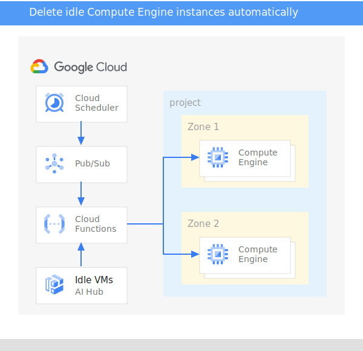

$ echo '{"project": "jani-gce-test", "label": "env=dev"}' | base64
eyJwcm9qZWN0IjogImphbmktZ2NlLXRlc3QiLCAibGFiZWwiOiAiZW52PWRldiJ9Cg==

---
title: Delete idle Compute Engine instances automatically
description: Use a simple and scalable serverless mechanism to automatically delete Compute Engine instances that are not in active use.
author: jpatokal
tags: garbage collection, Cloud Scheduler, Cloud Functions
date_published: TBD
---

Jani Patokallio | Google

<i>Contributed by Google employees.</i>

This tutorial offers a simple and scalable serverless mechanism to automatically delete
([*garbage-collect*](https://en.wikipedia.org/wiki/Garbage_collection_(computer_science))) Compute Engine virtual machine (VM) instances that are marked as idle.

Some cases in which this may be useful:

* Developers or testers create one-off VM instances for testing a feature, but they might not always remember to manually delete the instances.
* Workflows can require dynamically starting a large number of Compute Engine worker instances to perform a certain task. A best practice is to have instances 
  delete themselves after the task is complete, but ensuring that this always happens can be difficult if the task is distributed or some workers stop because
  of errors.

## How it works 

The following diagram shows a high-level overview of the solution:

The overall flow is the following:

1.  A Cloud Scheduler cron job is triggered regularly (for example, once a day). The Cloud Scheduler configuration specifies the label of the 
    pool of VMs to target and whether or not they should be deleted, using the following format: `'{"label":"env=test,delete=false"}'`
1.  When the cron job is triggered, Cloud Scheduler pushes a message with the label payload to a Pub/Sub topic.
1.  A Cloud Function is subscribed to the Pub/Sub topic. Each time the function is triggered, it does the following: 
    1.  The Idle VM Recommender is queried for a list of idle Compute Engine instances.
    1.  The list is filtered for instances that have the target label.
    1.  Iterates through the instances and does the following: 
        1.  If the Cloud Scheduler configuration included the label `delete=true`, the target is immediately deleted and the recommendation status is set to `SUCCEEDED`.
        1.  Otherwise, the label `delete=true` is applied to the instance and the recommendation status is set to `CLAIMED`.

Note: By default, this solution only tags potential idle instances instead of deleting them.  The list of tagged instances can be obtained by checking recommendation status or searching for instances with the label.

## Costs

This tutorial uses the following Google Cloud components: 

*   Compute Engine
*   Cloud Scheduler
*   Pub/Sub
*   Cloud Functions
*   Recommender API

Use the [pricing calculator](https://cloud.google.com/products/calculator/) to generate a cost estimate based on this projected usage. 

Cloud Scheduler is free for up to 3 jobs per month.

New Google Cloud users may be eligible for a [free trial](http://cloud.google.com/free-trial).

## Before you begin

Note: The following steps create a new project and new VMs, so idle VM recommendations may not be generated until 14 days of system metrics are available.  For immediate results, you can deploy this in an existing project with idle instances instead.

1.  If you don’t already have one, create a [Google Account](https://accounts.google.com/SignUp).

1.  Create a Google Cloud project: In the [Cloud Console](https://console.cloud.google.com/project), select **Create Project**.
1.  [Enable billing for the project](https://support.google.com/cloud/answer/6293499#enable-billing).
1.  Open [Cloud Shell](https://cloud.google.com/shell/docs/using-cloud-shell).
1.  Create an App Engine app, which is required by Cloud Scheduler:

        gcloud app create --region=us-central
    
1.  Enable the APIs used by this tutorial:

            gcloud services enable appengine.googleapis.com cloudbuild.googleapis.com \
              cloudfunctions.googleapis.com cloudscheduler.googleapis.com compute.googleapis.com \
              pubsub.googleapis.com recommender.googleapis.com
    
## Set up the automated cleanup code

Run the commands in this section in Cloud Shell.

1.  Clone the GitHub repository:

        git clone https://github.com/GoogleCloudPlatform/community

1.  Change directories to the `delete-idle-instances` directory:

        cd community/tutorials/delete-idle-instances
	
    The exact path depends on where you placed the directory when you cloned the sample files from GitHub.

1.  Create the Pub/Sub topic that you will push messages to:

        gcloud pubsub topics create idle-instances

    You can verify that the Pub/Sub topic has been created with the following command:
    
        gcloud pubsub topics list
	
    Topics also appear on the [Pub/Sub **Topics** page](https://console.cloud.google.com/cloudpubsub/topic/list) in the Cloud Console.

1.  Deploy the Cloud Function that will monitor the Pub/Sub topic and clean up instances:

        gcloud functions deploy mark-idle-instances --trigger-topic=idle-instances --runtime=nodejs12 --entry-point=cleanIdleInstances

1.  Configure Cloud Scheduler to push a message containing the target label every day to the Pub/Sub topic `idle-instances`:

        gcloud scheduler jobs create pubsub mark-idle-instances-job --schedule="0 0 * * *" \
          --topic=idle-instances --message-body='{"label":"env=test"}'

    The schedule is specified in [unix-cron format](https://cloud.google.com/scheduler/docs/configuring/cron-job-schedules).
    `0 0 * * *` means that the jobs runs at 0:00 (midnight) every day of the month, every month, and every day of the week.  More simply put, the job runs once per day.

    You can verify that the job has been created with the following command:

        gcloud scheduler jobs list

    Jobs also appear on the [**Cloud Scheduler** page](https://console.cloud.google.com/cloudscheduler) in the Cloud Console. On that page, you can view
    execution logs for each job by clicking **View** in the **Logs** column.

## Test the automated tagging

1.  Create a test instance labeled `env=test`:

        gcloud compute instances create idle-test --zone=us-central1-a --machine-type=f1-micro \
          --labels=env=test

1.  Create a second test instance labeled `env=test` with deletion enabled:

        gcloud compute instances create deletion-test --zone=us-central1-a --machine-type=f1-micro \
          --labels=env=test,delete=true

1.  Check that the new instances have started successfully.

        gcloud compute instances list --format='table(name,status,labels.list())'

1.  Wait 14 days and run the same command again:

        gcloud compute instances list --format='table(name,status,labels.list())'

    The `idle-test` instance should be shown as `RUNNING` with the label `delete=true` now applied.
    The `deletion-test` instance should have been automatically deleted.  (It may still be listed
    with `STATUS` of `TERMINATED`.)

1.  Delete marked instance by passing a list of them to the `delete` command:

        gcloud compute instances delete |\
        $(gcloud compute instances list --filter='labels.delete=true' --format='value(name)')

You can also see the Cloud Function execution results, including the name of the deleted instance, by viewing the Cloud Function logs from the
[**Cloud Functions** page](https://pantheon.corp.google.com/functions/list) in the Cloud Console.

## Shut down resources used in the tutorial

Now that you have tested the automated cleanup of VM instances, you can either
[delete the entire project](https://cloud.google.com/resource-manager/docs/creating-managing-projects#shutting_down_projects) or delete the individual resources
that you created to prevent further billing for them on your account.

- You can delete the Cloud Scheduler job on the [**Cloud Scheduler** page](https://console.cloud.google.com/cloudscheduler) in the Cloud Console.

- You can delete the Cloud Pub/Sub topic and associated subscriptions on the [**Pub/Sub** page](https://console.cloud.google.com/cloudpubsub/topic/list) of the 
  Cloud Console.
