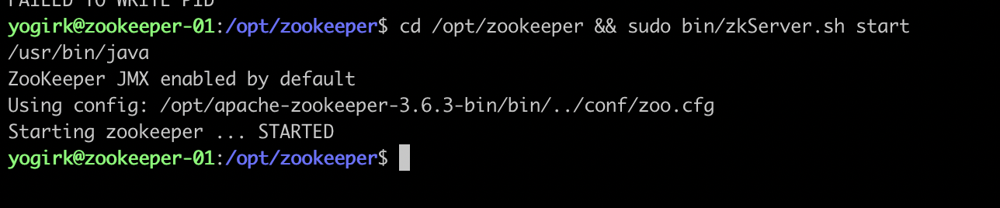
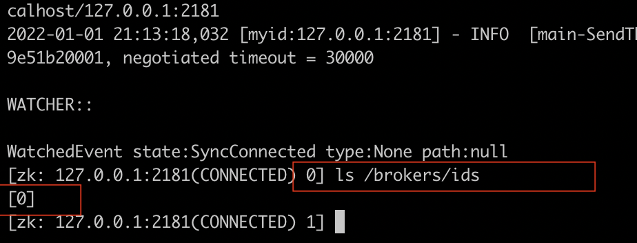
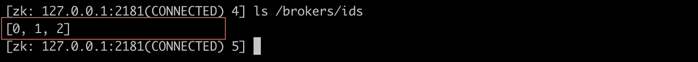

RK Kuppala | CTO & Co-Founder @ [Cloudside](https://thecloudside.com/)  

<p style="background-color:#D9EFFC;"><i>Contributed by the Google Cloud community. Not official Google documentation.</i></p>

In this tutorial you deploy a highly available Kafka (3.0.0) cluster along with a Zookeeper ensemble on Google Compute Engine VMs.  This tutorial uses the `gcloud` command line tool to provision VMs and to remotely execute commands.  

In this tutorial, Kafka 3.0.0 is deployed along with the Zookeeper ensemble. The future versions of Kafka will internally manage metadata quorum using [KRaft](https://cwiki.apache.org/confluence/display/KAFKA/KIP-500%3A+Replace+ZooKeeper+with+a+Self-Managed+Metadata+Quorum) (Kafka Raft metadata mode). Please verify whether KRaft is [production ready](https://github.com/apache/kafka/blob/trunk/config/kraft/README.md) during your production deployments. For the sake of this tutorial, you configure a Zookeeper ensemble along with Kafka brokers.

## Objectives

- Create a VPC, subnet and necessary firewall rules
- Configure 3 node Zookeeper ensemble on GCE 
- Configure 3 Kafka brokers 
- Verify cluster status 

## Costs 

This tutorial requires the following services on GCP.
- Google Compute Engine
  - 3 * Zookeeper VMs, `e2-small`
  - 3 * Kafka Broker VMs, `e2-small`
- VPC
- Identity Aware Proxy 

Assuming this setup runs for 24 hours in Mumbai region, the [estimated cost](https://cloud.google.com/products/calculator/#id=5369094f-6d39-4379-9022-b2935dce10b4) will be approximately USD 17.30. Use the [pricing calculator](https://cloud.google.com/products/calculator) to generate a cost estimate based on your projected usage.

## Before you begin

For this tutorial, you need a Google Cloud [project](https://cloud.google.com/resource-manager/docs/cloud-platform-resource-hierarchy#projects). You can create a new project, or you can select a project that you already created.

- [Select or create a Google Cloud project](https://console.cloud.google.com/projectselector2/home/dashboard?_ga=2.237169728.1701834555.1640801885-1641854432.1626090096&_gac=1.117072500.1637926803.CjwKCAiAqIKNBhAIEiwAu_ZLDtXVy3).
- [Enable billing for your project](https://support.google.com/cloud/answer/6293499#enable-billing).
- [Enable the Compute Engine API](https://console.cloud.google.com/flows/enableapi?apiid=compute.googleapis.com,iap.googleapis.com&_ga=2.72533203.1701834555.1640801885-1641854432.1626090096&_gac=1.91867624.1637926803.CjwKCAiAqIKNBhAIEiwAu_ZLDtXVy3).
- In the Cloud Console, activate [Cloud Shell](https://cloud.google.com/shell/docs/launching-cloud-shell#launching_from_the_console).

Cloud Shell provides an interactive shell that includes the gcloud command-line interface, which you use to run the commands in this tutorial.

When you finish this tutorial, you can avoid continued billing by deleting the resources that you created. For details, see the "Cleaning up" section at the end of this tutorial.

## What you deploy - Architecture 


You deploy a highly available Kafka cluster in Mumbai region on GCP. You configure a 3 node Zookeeper ensemble and 3 kafka brokers with VMs spread across 3 availability zones on Mumbai region. 

Node | Zone | IP
---------|----------|---------
zk-01 | asia-south1-a | 10.10.0.10
zk-02 | asia-south1-c | 10.10.0.11
zk-03 | asia-south1-b | 10.10.0.12
kafka-broker-01 | asia-south1-a | 10.10.0.20
kafka-broker-02 | asia-south1-b | 10.10.0.21
kafka-broker-03 | asia-south1-c | 10.10.0.22

## Setup VPC, subnet and firewall rules

1. Configure your project and region in `gcloud`

```
gcloud auth login 
gcloud config set project YOUR-PROJECT-NAME
gcloud config set compute/region asia-south1

```

2. Create a VPC named `kafka-cluster-vpc` and a subnet `db-sn` with the CIDR range `10.10.0.0/24`

```
gcloud compute networks create kafka-cluster-vpc --subnet-mode custom

gcloud compute networks subnets create db-sn \
  --network kafka-cluster-vpc \
  --range 10.10.0.0/24
```

3. Create a firewall rule to allow traffic from the network tag `kafka`. You create all VMs in this tutorial with a network tag `kafka`, which enables communication between these nodes. 

```
gcloud compute firewall-rules create kafka-cluster-vpc-allow-kafka-zookeeper \
--description="Allow traffic between Kafka brokers and Zookeeper nodes" \
--direction=INGRESS --priority=1000 --network=kafka-cluster-vpc --action=ALLOW \
--rules=all --source-tags=kafka \
--target-tags=kafka
```
4. Create a firewall rule to allow SSH via Identity Aware Proxy 

```
gcloud compute firewall-rules create allow-ssh-ingress-from-iap \
  --direction=INGRESS \
  --action=allow \
  --rules=tcp:22 \
  --source-ranges=35.235.240.0/20 \
  --network=kafka-cluster-vpc
```

## Configure Zookeeper Ensemble 

In this section, you create an initial zookeeper node VM, configure zookeeper and make a machine image out of this VM after configuring zookeeper. Using this machine image, you create 2 more nodes and form a cluster quorum. 

1. Create a VM named `zk-01`

```
gcloud compute instances create zk-01 \
    --async \
    --boot-disk-size 50GB \
    --can-ip-forward \
    --image-family ubuntu-2004-lts \
    --image-project ubuntu-os-cloud \
    --machine-type e2-small \
    --private-network-ip 10.10.0.10 \
    --scopes compute-rw,storage-ro,service-management,service-control,logging-write,monitoring \
    --subnet db-sn \
    --tags kafka \
    --labels=application=zookeeper \
    --zone=asia-south1-a
```
2. Verify if the VM is up and running

```
gcloud compute instances list --filter="tags.items=kafka"
```

3. SSH to this VM from cloudshell via IaP

```
gcloud beta compute ssh zk-01  --tunnel-through-iap --zone=asia-south1-a

```

4. Inside the `zk-01` VM, execute the following commands to Install and configure Zookeeper

```
sudo apt update && sudo apt install default-jdk -y
sudo useradd zkadmin -m && sudo usermod --shell /bin/bash zkadmin

# set a password work zkadmin user
sudo passwd zkadmin

# Add zkadmin user to sudoers
sudo usermod -aG sudo zkadmin

# switch to zkadmin user for the rest of the setup
su -l zkadmin

sudo mkdir -p /data/zookeeper
sudo chown -R zkadmin:zkadmin /data/zookeeper
cd /opt && sudo wget https://dlcdn.apache.org/zookeeper/zookeeper-3.6.3/apache-zookeeper-3.6.3-bin.tar.gz 
sudo tar -xvf apache-zookeeper-3.6.3-bin.tar.gz
sudo chown zkadmin:zkadmin -R  apache-zookeeper-3.6.3-bin
sudo ln -s apache-zookeeper-3.6.3-bin zookeeper
sudo chown -h zkadmin:zkadmin /opt/zookeeper
```

5. Create a configuration file for Zookeeper `vi /opt/zookeeper/conf/zoo.cfg`
6. Add the following configuration properties to the file

```
tickTime=2000
dataDir=/data/zookeeper
clientPort=2181
initLimit=10
syncLimit=5
```
7. Start Zookeeeper manually and verify if the installation has been successful `cd /opt/zookeeper && /opt/zookeeper/bin/zkServer.sh start`

8. Upon successful start of Zookeeeper, you see the status



9. Connect to Zookeeper using `zkCli.sh` and verify `bin/zkCli.sh -server 127.0.0.1:2181`. You see a response like below

```
WATCHER::

WatchedEvent state:SyncConnected type:None path:null
[zk: 127.0.0.1:2181(CONNECTED) 0]
```
10. Stop Zookeeper service `sudo bin/zkServer.sh stop`
11. Create a systemd unit file to manage Zookeeper as a service - `sudo vi /etc/systemd/system/zookeeper.service` , add the following configuration

```
[Unit]
Description=Zookeeper Daemon
Documentation=http://zookeeper.apache.org
Requires=network.target
After=network.target

[Service]
Type=forking
WorkingDirectory=/opt/zookeeper
User=zkadmin
Group=zkadmin
ExecStart=/opt/zookeeper/bin/zkServer.sh start /opt/zookeeper/conf/zoo.cfg
ExecStop=/opt/zookeeper/bin/zkServer.sh stop /opt/zookeeper/conf/zoo.cfg
ExecReload=/opt/zookeeper/bin/zkServer.sh restart /opt/zookeeper/conf/zoo.cfg
TimeoutSec=30
Restart=on-failure

[Install]
WantedBy=default.target
```
12. Create a machine image from this VM `zk-01`

```
gcloud beta compute machine-images \
create zookeeper-machine-image \
--source-instance zk-01 \
--source-instance-zone asia-south1-a
```
13. You can now use this image to create two more VMs - `zk-02` and `zk-03` in `ap-south1-b` and `ap-south1-c` zones respectively. Let's create these VMs

```
# Create Node 2 
  gcloud beta compute instances create zk-02 \
    --source-machine-image zookeeper-machine-image  \
    --zone asia-south1-b \
    --machine-type e2-small \
    --private-network-ip 10.10.0.11 \
    --subnet db-sn \
    --tags kafka \
    --labels=application=zookeeper 

# Create Node 3
  gcloud beta compute instances create zk-03 \
    --source-machine-image zookeeper-machine-image  \
    --zone asia-south1-c \
    --machine-type e2-small \
    --private-network-ip 10.10.0.12 \
    --subnet db-sn \
    --tags kafka \
    --labels=application=zookeeper
```
14. Once all the Zookeeper nodes are up and running, create a `myid` file in each of the zookeeper nodes. The `myid` file consists of a single line containing only the text of that machine's id. So myid of server 1 would contain the text "1" and nothing else. The id must be unique within the Zookeeper ensemble and should have a value between 1 and 255. 

```
gcloud beta compute ssh zk-01 \
    --tunnel-through-iap \
    --zone=asia-south1-a \
    --command 'echo "1" | sudo tee /data/zookeeper/myid  && sudo chown -R zkadmin:zkadmin /data/zookeeper'

gcloud beta compute ssh zk-02 \
    --tunnel-through-iap \
    --zone=asia-south1-b \
    --command  'echo "2" | sudo tee /data/zookeeper/myid && sudo chown -R zkadmin:zkadmin /data/zookeeper'

gcloud beta compute ssh zk-03 \
    --tunnel-through-iap \
    --zone=asia-south1-c \
    --command  'echo "3" | sudo tee /data/zookeeper/myid && sudo chown -R zkadmin:zkadmin /data/zookeeper'
```
15.  Let us now edit the zookeeper configuration file on all nodes to form the cluster quorum. You will add the hostname and ports of each node in the configuration file. You can find the FQDN of your zookeeper nodes by running the command `hostname -a`, usually it will be in the following format - `[SERVER-NAME].[ZONE].[PROJECT-NAME].internal`. Example: `zk-01.asia-south1-a.c.YOUR-PROJECT-NAME.internal`. If your zookeeper cluster is single zone deployment, you can simply resolve using the VM name. Since this tutorial deploys zookeeper nodes in multiple zones for availability reasons, lets use an FQDN. If you want to keep things simpler, you may add the static internal IP of each node instead of the domain name. 

16. SSH to each zookeeper node. On each node, change to `zkadmin` user - `su -l zkadmin` and open `/opt/zookeeper/conf/zoo.cfg`. The config file on all nodes should look like this

```
tickTime=2000
dataDir=/data/zookeeper
clientPort=2181
initLimit=10
syncLimit=5
server.1=zk-01.asia-south1-a.c.cloudside-academy.internal:2888:3888
server.2=zk-02.asia-south1-b.c.cloudside-academy.internal:2888:3888
server.3=zk-03.asia-south1-c.c.cloudside-academy.internal:2888:3888
4lw.commands.whitelist=*
```
`4lw.commands.whitelist=*` config option whitelists commands like stat, ruok, conf, isro, which are useful for Zookeeper status check and administration

### Start Zookeeepr Cluster

1. Enable Zookeeper service on all zookeeper nodes and start Zookeeper service

```
gcloud beta compute ssh zk-01 \
    --tunnel-through-iap \
    --zone=asia-south1-a \
    --command 'sudo systemctl enable zookeeper.service && sudo systemctl start zookeeper.service'

gcloud beta compute ssh zk-02 \
    --tunnel-through-iap \
    --zone=asia-south1-b \
    --command  'sudo systemctl enable zookeeper.service && sudo systemctl start zookeeper.service'

gcloud beta compute ssh zk-03 \
    --tunnel-through-iap \
    --zone=asia-south1-c \
    --command  'sudo systemctl enable zookeeper.service && sudo systemctl start zookeeper.service'
```

2. Check cluster status by running the command `echo stat | nc localhost 2181 | grep Mode` on each node. The output of this command will show whether the node is a Leader, or a Follower in the cluster. 

```
gcloud beta compute ssh zk-01 \
    --tunnel-through-iap \
    --zone=asia-south1-a \
    --command 'echo stat | nc localhost 2181 | grep Mode'

gcloud beta compute ssh zk-02 \
    --tunnel-through-iap \
    --zone=asia-south1-b \
    --command  'echo stat | nc localhost 2181 | grep Mode'

gcloud beta compute ssh zk-03 \
    --tunnel-through-iap \
    --zone=asia-south1-c \
    --command  'echo stat | nc localhost 2181 | grep Mode'
```

## Setting up Kafka 

The above section covers the configuration of Zookeeepr ensemble on GCE. In this section, you setup a Kafka broker VM, install and configure Kafka. Using the machine image of this Kafka broker VM, 2 more broker nodes are created in different availability zones. You might want to choose the right instance type in production environments and also attach an SSD disk for storage. For this tutorial, You use `e2-small` VMs. 

1. Reserve 3 private IPs for Kafka brokers

```
gcloud compute addresses create kafka-broker-01-ip \
    --region asia-south1 --subnet db-sn --addresses 10.10.0.20

gcloud compute addresses create kafka-broker-02-ip \
    --region asia-south1 --subnet db-sn --addresses 10.10.0.21

gcloud compute addresses create kafka-broker-03-ip \
    --region asia-south1 --subnet db-sn --addresses 10.10.0.22
```

2. Create an initial Kafka broker VM - `kafka-broker-01` in availability zone `asia-south1-a`

```
gcloud compute instances create kafka-broker-01 \
    --async \
    --boot-disk-size 50GB \
    --can-ip-forward \
    --image-family ubuntu-2004-lts \
    --image-project ubuntu-os-cloud \
    --machine-type e2-small \
    --private-network-ip 10.10.0.20 \
    --scopes compute-rw,storage-ro,service-management,service-control,logging-write,monitoring \
    --subnet db-sn \
    --tags kafka \
    --labels=application=kafka \
    --zone=asia-south1-a
```

3. SSH to the VM and start setting up Kafka 

```
gcloud beta compute ssh kafka-broker-01 \
    --tunnel-through-iap \
    --zone=asia-south1-a
```

4. Inside the VM `kakfka-broker-01`, execute the following commands to install and configure Kafka

```
## install jdk
sudo apt update && sudo apt install default-jdk -y
# Add a user
sudo useradd kafka -m && sudo usermod --shell /bin/bash kafka
# Set a password for kafka 
sudo passwd kafka
# Add kafka user to sudoers 
sudo usermod -aG sudo kafka
# make a dir
sudo mkdir -p /data/kafka && sudo mkdir -p /data/kafka/logs
# Download binaries 
sudo wget https://dlcdn.apache.org/kafka/3.0.0/kafka_2.13-3.0.0.tgz
sudo tar -xvzf kafka_2.13-3.0.0.tgz --strip 1
sudo chown -R kafka:kafka /data/kafka
```

5. Rename the existing kafka configuration file and create a new configuration. For this first kafka broker, we will assign `broker.id` as `0` and you can add more brokers and increment the id.  use the internal IP of the broker VM to configure `advertised.listeners`, and `listeners`. Finally, configure `zookeeper.connect` to include all zookeeper nodes (use either FQDNs or IP addresses)

```
sudo mv /data/kafka/config/server.properties /data/kafka/config/server.properties-OLD
vi /data/kafka/config/server.properties
```

6. Add the following sample configuration to the `server.properties` file 

```

# Broker id, start from 0 and increment for subsequent brokers
broker.id=0
# Change the internal IP based on the VM
listeners=PLAINTEXT://10.10.0.20:9092
advertised.listeners=PLAINTEXT://10.10.0.20:9092
socket.send.buffer.bytes=102400
socket.receive.buffer.bytes=102400
socket.request.max.bytes=2147483647
log.dirs=/data/kafka/logs/
num.partitions=5
log.retention.hours=6
log.segment.bytes=2147483647
log.retention.check.interval.ms=300000

############################# Zookeeper #############################
# Add FQDN or static internal IP addresses of your Zookeeeper nodes. 
zookeeper.connect=zk-01.asia-south1-a.c.YOUR-PROJECT-NAME.internal:2181,zk-02.asia-south1-b.c.YOUR-PROJECT-NAME.internal:2181,zk-03.asia-south1-c.c.YOUR-PROJECT-NAME.internal:2181
# Timeout in ms for connecting to zookeeper
zookeeper.connection.timeout.ms=6000
```

7. Create a Systemd file to manage Kafka as a service

```
[Unit]
Requires=network.target remote-fs.target
After=network.target remote-fs.target

[Service]
Type=simple
User=kafka
ExecStart=/bin/sh -c '/data/kafka/bin/kafka-server-start.sh /data/kafka/config/server.properties > /data/kafka/kafka.log 2>&1'
ExecStop=/home/kafka/kafka/bin/kafka-server-stop.sh
Restart=on-abnormal

[Install]
WantedBy=multi-user.target
```
8. Start Kafka service `systemctl start kafka`
9. Connect to one of the Zookeeper nodes and verify that the kafka broker with id 0 shows up.

```
gcloud beta compute ssh zk-01  --tunnel-through-iap --zone=asia-south1-a
cd /opt/zookeeper
bin/zkCli.sh -server 127.0.0.1:2181
```
10. After connecting, run

```bash
ls /brokers/ids
```


### Create a Kafka broker machine image

1. Create a machine image from `kafka-broker-01` VM

```
gcloud beta compute machine-images create \
  kafka-machine-image 
  --source-instance kafka-broker-01 \
  --source-instance-zone  asia-south1-a
```

2. Create `kafka-broker-02`, `kafka-broker-03` VMs in `asia-south1-b`, `asia-south1-c` zones respectively.

```
# Create broker 2 
  gcloud beta compute instances create kafka-broker-02 \
    --source-machine-image kafka-machine-image  \
    --zone asia-south1-b \
    --machine-type e2-small \
    --private-network-ip 10.10.0.21 \
    --subnet db-sn \
    --tags kafka \
    --labels=application=kafka 

# Create broker 3
  gcloud beta compute instances create kafka-broker-03 \
    --source-machine-image kafka-machine-image  \
    --zone asia-south1-c \
    --machine-type e2-small \
    --private-network-ip 10.10.0.22 \
    --subnet db-sn \
    --tags kafka \
    --labels=application=kafka
```

3. Once these VMs are online, SSH to each VM and change the following properties in configuration file - `vi /data/kafka/config/server.properties`

For `kafka-broker-02` VM

```bash
broker.id=1
listeners=PLAINTEXT://10.10.0.21:9092
advertised.listeners=PLAINTEXT://10.10.0.21:9092
```
For `kafka-broker-03` VM

```bash
broker.id=2
listeners=PLAINTEXT://10.10.0.22:9092
advertised.listeners=PLAINTEXT://10.10.0.22:9092
```

4. Since these VMs are launched from a machine image, you need to cleanup the data that previously belonged to Broker 0, Delete the data (log) directories before starting the service on these VMs. 

```
sudo rm -rf /data/kafka/logs/ && systemctl start kafka
```

5. verify the status of the cluster



## Cleanup 

Run the following commands to cleanup the resources created during this tutorial

```
# Delete VMs
gcloud compute instances delete zk-01 kafka-broker-01 --zone=asia-south1-a
gcloud compute instances delete zk-02 kafka-broker-02 --zone=asia-south1-b
gcloud compute instances delete zk-03 kafka-broker-03 --zone=asia-south1-c

# Delete Images
gcloud beta compute machine-images delete zookeeper-machine-image kafka-machine-image

# Delete FW rules 
gcloud compute firewall-rules delete kafka-cluster-vpc-allow-kafka-zookeeper

# Delete IP addresses
gcloud compute addresses delete kafka-broker-01-ip kafka-broker-02-ip kafka-broker-03-ip

# Delete subnet and VPC
gcloud compute networks subnets delete db-sn 
gcloud compute networks delete kafka-cluster-vpc
```


## What's next

- [Read best practices for running Kafka in a production environment](https://docs.confluent.io/platform/current/kafka/deployment.html)
- [Refer Zookeeper system administration guide](https://zookeeper.apache.org/doc/r3.4.8/zookeeperAdmin.html)

