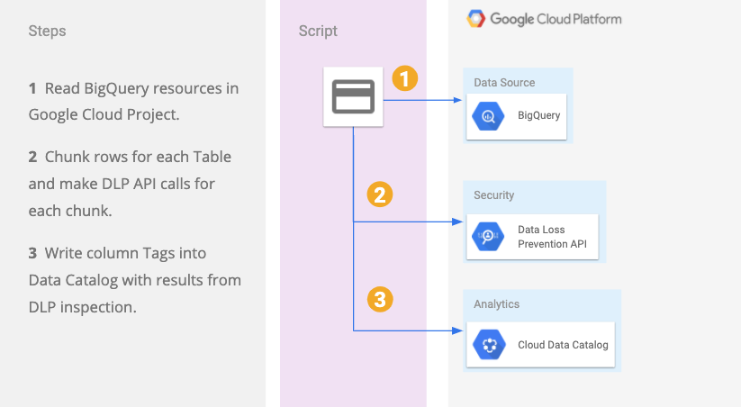
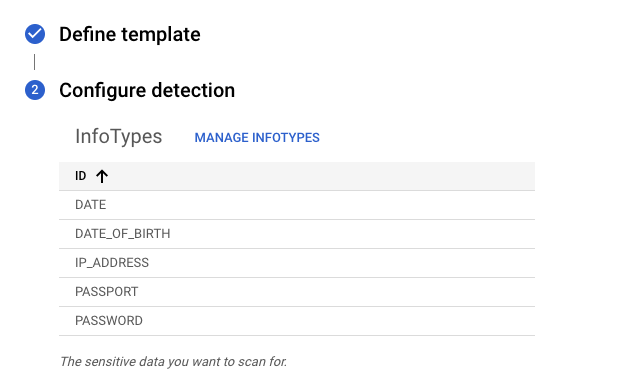
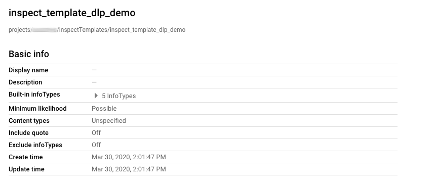
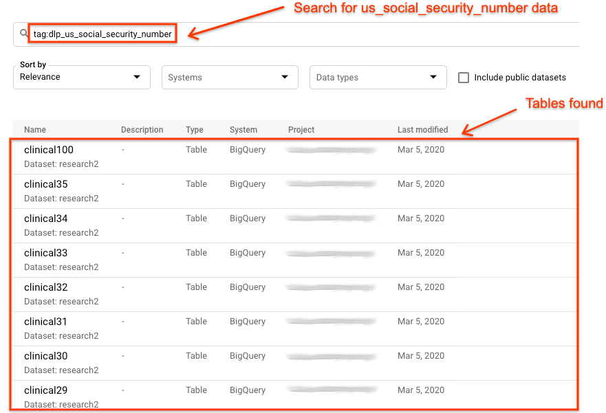
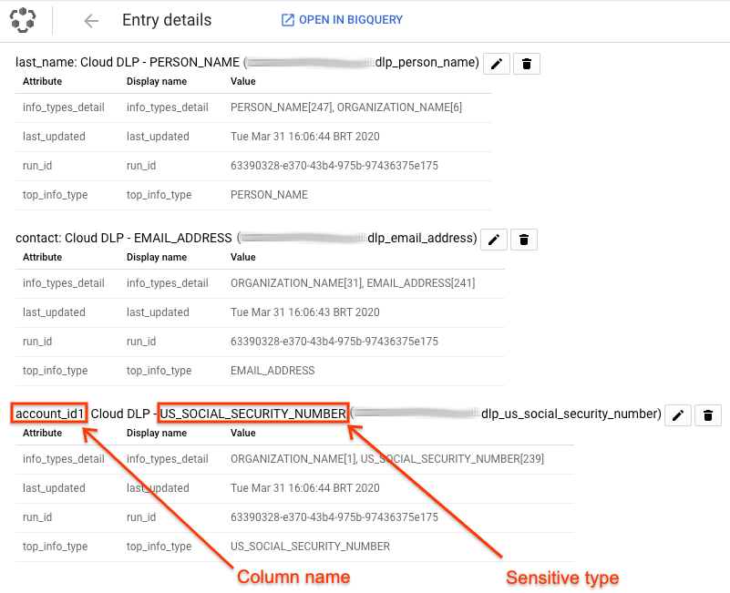

This tutorial contains code written in Java and describes how to inspect BigQuery data using Cloud Data Loss Prevention (DLP) API. Then Cloud Data Catalog API is used to create tags at column level with the sensitive elements found.

Cloud DLP can help customers discover, inspect, and classify sensitive elements in their data. The results of these inspections can be valuable as “tags” in Cloud Data Catalog. This guide will cover Cloud Data Catalog integration with Cloud DLP automating the “tagging” of assets in Cloud Data Catalog based on the results of Cloud DLP inspection. 

This solution includes instructions to create a DLP ```inspectTemplate``` to define what data elements to inspect for, the JDBC driver used to connect to BigQuery, and the number of worker threads used to paralelize the work. Such implementation connecting to the data source with JDBC allows for changing the Data Source to others like MySQL, SQLServer, PostgreSQL, etc, and reusing other steps. Users can also customize or adjust this script to change the Tag fields to better fit their use case. 

## Objectives

- Enable Cloud Data Loss Prevention, BigQuery, Cloud Data Catalog APIs
- Create a Cloud DLP inspectTemplate
- Create an automated process that uses Cloud DLP findings to label/tag BigQuery table columns
- Leverage these labels and tags in your code 
- Use Cloud Data Catalog to quickly understand where sensitive data exist in your BigQuery table columns

## Costs

This tutorial uses billable components of Google Cloud Platform, including the following:

- BigQuery
- Cloud Data Loss Prevention (DLP)
- Cloud Data Catalog

Use the [Pricing Calculator](https://cloud.google.com/products/calculator) to generate a cost estimate based on your projected usage.

## Reference architecture

The following diagram shows the architecture of the solution:




## Before you begin

1.  Select or create a GCP project.
    [Go to the Managed Resources page.](https://console.cloud.google.com/cloud-resource-manager)

1.  Make sure that billing is enabled for your project.
    [Learn how to enable billing.](https://cloud.google.com/billing/docs/how-to/modify-project)

1.  Enable Cloud Data Catalog, BigQuery, and Cloud Data Loss Prevention API.
    [Enable the APIs](https://console.cloud.google.com/flows/enableapi?apiid=datacatalog.googleapis.com,bigquery.googleapis.com,dlp.googleapis.com)

## Preparing the environment

1.  Create Big Query Tables with PII:

    You may use this open source script [BigQuery Fake PII Creator](https://github.com/mesmacosta/bq-fake-pii-table-creator) 

1.  Create the Inspect Template:

    Go to [DLP Create Inspect Template](https://console.cloud.google.com/security/dlp/create/template)

    Set up the InfoTypes, this is an example, you may choose any from the list available:
    

    Finish creating the Inspect Template:
    

## Install BQ JDBC Driver

Install latest Simba BigQuery driver.

Download latest version, unzip it, install it with maven and delete the temp lib files.
```
curl -o SimbaJDBCDriverforGoogleBigQuery.zip https://storage.googleapis.com/simba-bq-release/jdbc/SimbaJDBCDriverforGoogleBigQuery42_1.2.2.1004.zip && \
unzip -qu SimbaJDBCDriverforGoogleBigQuery.zip -d lib && \
mvn install:install-file  \
-Dfile=lib/GoogleBigQueryJDBC42.jar \
-DgroupId=com.simba \
-DartifactId=simba-jdbc \
-Dversion=1.0 \
-Dpackaging=jar \
-DgeneratePom=true && \
rm -rf lib
```
You may adapt the script to use different JDBC drivers, if you want to connect to other Databases.

## Configure Service Account Credentials

Create a Service Account with:
* BigQuery Admin
* Data Catalog Admin
* DLP Administrator
```
export GOOGLE_APPLICATION_CREDENTIALS="<path to your cred>.json"
```

Note: if running this on Google Compute Engine you can also use the VM's default service account but need to assign the right permissions listed above. 

## Running the Script

## Command line parameters

| parameter                  | desc                                                                                                                                                                                                                  | 
|----------------------------|-----------------------------------------------------------------------------------------------------------------------------------------------------------------------------------------------------------------------|
| dbType                     | database type "bigquery" is currently the only type supported                                                                                                                                                         |
| dbName                     | the name of the dataset name that you want to scan.  Note, this is optional for BigQuery and if you don't provide it or leave it blank, then it will scan all datasets in the project.                                |
| tableName                  | the name of the table name that you want to scan.  Note, this is optional for BigQuery and if you don't provide it or leave it blank, then it will scan all tables                                                    |         
| threadPoolSize             | number of worker threads. _Note: This code uses 1 thread per table regardless of this setting. If you are scanning multiple tables, increasing this number means more than one table can be processed in parallel._   |
| limitMax                   | max number of rows to scan per table                                                                                                                                                                                  |
| minThreshold               | minimum number of findings per infoType in a given column before it will tag. For example, if this is set at 10 and only 9 items were found, the column won't be tagged.                                              |
| inspectTemplate            | Cloud DLP inspection template that you want to use                                                                                                                                                                    |
| projectId                  | your Cloud project ID/name                                                                                                                                                                                            |

### Compile
```
mvn clean package -DskipTests
```
### Execute
```
java -cp target/dlp-datacatalog-tags-0.1-jar-with-dependencies.jar com.example.dlp.DlpDataCatalogTagsTutorial \
-dbType "bigquery" \
-limitMax 1000 \
-dbName research2 \
-projectId my-project \
-threadPoolSize 5 \
-inspectTemplate "projects/my-project/inspectTemplates/inspect_template_dlp_demo" \
-minThreshold 100
```

## Check Results

Once the script finishes, you are able to go to [Cloud Data Catalog UI](https://cloud.google.com/data-catalog) and search for the sensitive data:



And by clicking on each table, you can see which columns were marked as sensitive:



## Cleaning up

The easiest way to avoid incurring charges to your Google Cloud Platform account for the resources used in this tutorial is to delete the project you created.

To delete the project, follow the steps below:
1.  In the Cloud Platform Console, [go to the Projects page](https://console.cloud.google.com/iam-admin/projects).

1.  In the project list, select the project you want to delete and click **Delete project**.

    
    
1.  In the dialog, type the project ID, and then click **Shut down** to delete the project.

## What's next

- Learn about [Cloud Data Loss Prevention](https://cloud.google.com/dlp)
- Learn about [Cloud Data Catalog](https://cloud.google.com/data-catalog) 
- Try out other Google Cloud Platform features for yourself. Have a look at our [tutorials](https://cloud.google.com/docs/tutorials).
