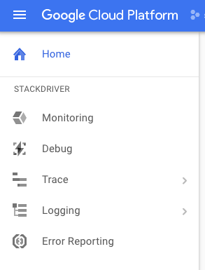
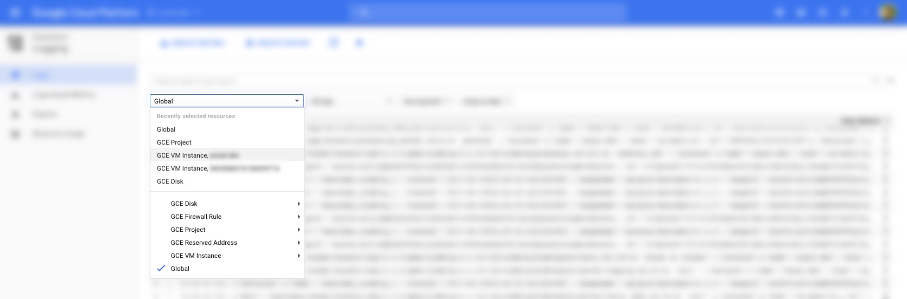
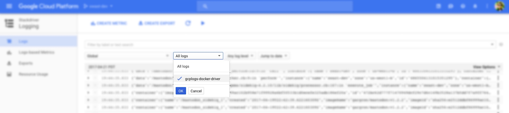
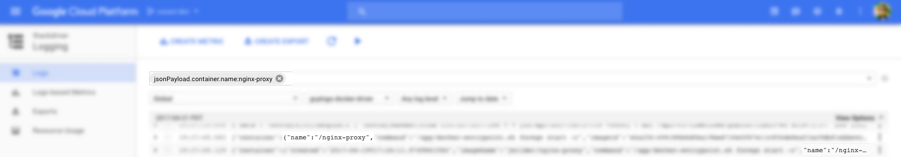

This tutorial will show you how to use the [Docker gcplogs logging
driver](https://docs.docker.com/engine/admin/logging/gcplogs/) to write your
Docker logs to [Stackdriver Logging](https://cloud.google.com/logging/).

## Objectives

- Run a Docker container with the gcplogs logging driver.
- View logs in the Google Cloud Platform console.

## Before you begin

1.  Create or select a Cloud Platform project from the [Google Cloud Platform
    console's projects page](https://console.cloud.google.com/project).
1.  [Enable
    billing](https://support.google.com/cloud/answer/6293499#enable-billing)
    for your project.

## Costs

This tutorial uses billable components of Cloud Platform including

- [Google Compute Engine](https://cloud.google.com/compute/pricing)
- [Stackdriver Logging](https://cloud.google.com/stackdriver/pricing)

Use the [Pricing Calculator](https://cloud.google.com/products/calculator/) to
estimate the costs for your usage.

## Setting up the virtual machine

Create a new Compute Engine instance using the [CoreOS](https://coreos.com/why)
stable image. CoreOS comes with [Docker](https://www.docker.com/what-docker)
pre-installed and supports automatic system updates.

1.  Open the [Google Cloud Platform console](https://console.cloud.google.com).
1.  [Create a new Compute Engine instance](https://console.cloud.google.com/compute/instancesAdd).
1.  Select the desired **Zone**, such as "us-central1-f".
1.  Select the desired **Machine type**, such as "micro" (f1-micro).
1.  Change the **Boot disk** to "CoreOS stable".
1.  Click the **Create** button to create the Compute Engine instance.

## Running a Docker container

1.  After the instance is created, click the **SSH** button to open a terminal
    connected to the machine.
1.  To use the [gcplogs logging driver for
    Docker](https://docs.docker.com/engine/admin/logging/gcplogs/), specify the
    `--log-driver=gcplogs` command-line argument to the `docker run` command.

    Run the following command to start an NGINX container which writes logs to
    Stackdriver Logging.

        docker run -d --name mysite --log-driver=gcplogs nginx

    You can specify additional options with the `--log-opt` command-line
    argument. This command tells Docker to also log the command that the container
    was started with.

        docker run -d \
            --name mysite \
            --log-driver=gcplogs \
            --log-opt gcp-log-cmd=true \
            nginx

## Using Docker Compose

When using Docker Compose, specify a logging driver for each service in the
`docker-compose.yml` configuration file. For example,

    version: '2'
    services:
      web:
        logging:
          driver: gcplogs
        ...
      database:
        logging:
          driver: gcplogs
        ...

## Viewing your logs

Now that you are writing logs to Stackdriver Logging, you can view them in the
[Google Cloud Platform console logging
viewer](https://console.cloud.google.com/logs/viewer).

Open the [Google Cloud Platform console logging
viewer](https://console.cloud.google.com/logs/viewer) via that link or by
opening **Logging** from the left menu.

Select the **Global** logs.

Select the `gcplogs-docker-driver` label to limit to just the logs from your
Docker containers.

Enter a search filter to narrow the logs further. For example, enter
`jsonPayload.container.name:nginx-proxy` to limit to logs just from containers
with the name `nginx-proxy`.

## Next steps

- [Install the Stackdriver Logging Agent to stream system logs to Stackdriver
  Logging](https://cloud.google.com/logging/docs/agent/installation).
- [Try out some other Docker-related community
  tutorials](https://cloud.google.com/community/tutorials/?q=Docker).

