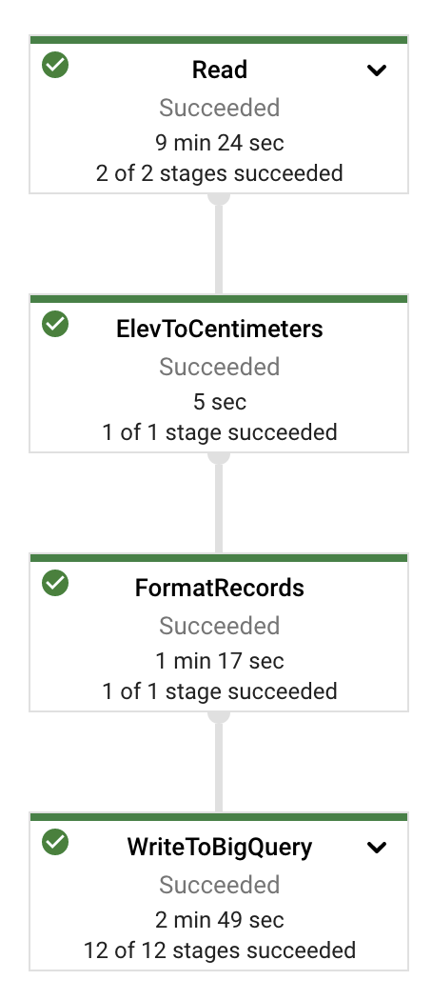
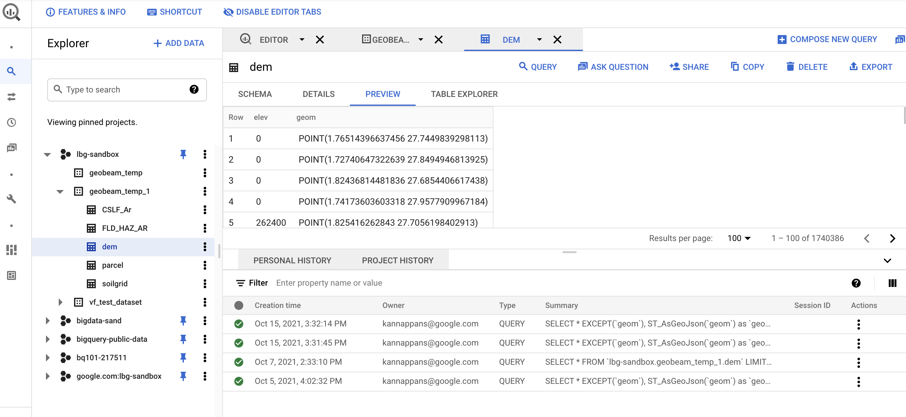
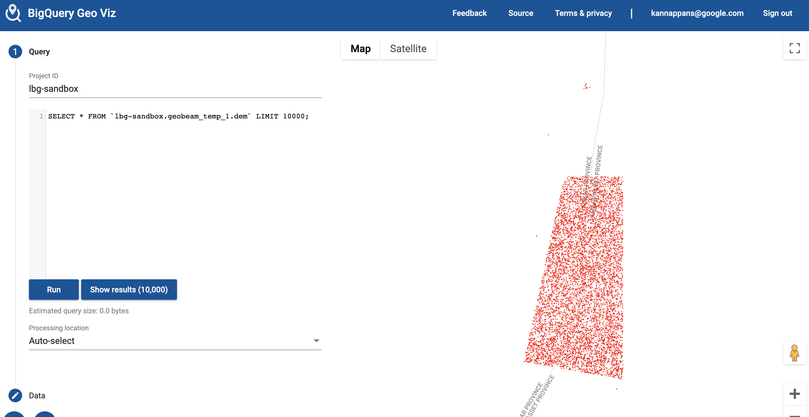

Author: Kannappan Sirchabesan | Cloud Data Engineer | Google  
Collaborator: Donna Schut | Solutions Manager | Google  
Collaborator: Travis Webb | Solutions Engineer | Google  

<p style="background-color:#CAFACA;"><i>Contributed by Google employees.</i></p>

Google Earth Engine is a geospatial processing platform powered by Google Cloud that combines a multi-petabyte catalog of satellite imagery and geospatial datasets with planetary-scale analysis capabilities. Earth Engine is used for analyzing forest and water coverage, analyzing land use change, assessing the health of agricultural fields, etc.

[geobeam](https://github.com/GoogleCloudPlatform/dataflow-geobeam) is a Python-based framework that provides a set of Apache Beam classes and utilities that make it easier to process and transform massive amounts of geospatial data using Google Cloud Dataflow. 

This solution uses geobeam to ingest raster TIFF images that have been generated in Earth Engine into BigQuery. 

## Objectives

* Import a Earth Engine TIFF image into a Cloud Storage bucket.
* Install the geobeam library.
* Run a geobeam job to ingest the TIFF file from the Cloud Storage bucket to BigQuery.
* Use BigQuery Geo Viz to verify that the TIFF image has been ingested correctly.

## Architecture


There are several components to this architecture:

* Google Earth Engine: This is where the TIFF image from Copernicus Sentinel-2 satellite imagery is generated. 
* Cloud Storage: The TIFF image from Earth Engine is stored in a Cloud Storage bucket.        
* Dataflow: The TIFF image in the Cloud Storage bucket is processed in Dataflow using geobeam.
* BigQuery: The processed image is stored in BigQuery as a set of rows that include the BigQuery geospatial point using the [GEOGRAPHY](https://cloud.google.com/bigquery/docs/reference/standard-sql/data-types#geography_type) data type.

## Before you begin

You can run all the commands for this solution in [Cloud Shell](https://cloud.google.com/shell), or you can install the 
[gcloud CLI](https://cloud.google.com/sdk/docs/install) and run the commands locally.

1.  Create a Google Cloud project for this tutorial to allow for easier cleanup.
2.  [Get access](https://signup.earthengine.google.com/) to the Earth Engine API.
3.  Enable the BigQuery API and the Cloud Storage API in the project.
4.  Ensure you have Python 3.8. This tutorial works best with Python 3.8.
5.  Install the geobeam library:
    ```
    pip install geobeam
    ```
6.  Install the Earth Engine library:
    ```
    pip install earthengine-api
    ```
7.  Enable the Earth Engine API:
    ```
    gcloud services enable earthengine.googleapis.com
    ```
8.  Ensure you have an existing Cloud IAM service account, or create a new one and assign appropriate permissions for the service account to write to BigQuery and Cloud Storage. 

### Set environment variables

Set the following environment variables and replace the values with values corresponding to your project.
```
export PROJECT_ID=ee-geobeam-sandbox
export IMAGES_BUCKET=tmp_images_bucket_1
export GEOBEAM_BUCKET=tmp_geobeam_bucket_1
export BQ_DATASET=tmp_bq_dataset_1
export BQ_DATASET_REGION=us-central1
export BQ_TABLE=tmp_bq_table_1
export BQ_SCHEMA='elev:INT64,geom:GEOGRAPHY'
export SERVICE_ACCOUNT_EMAIL=<serviceaccount email>
```

### Create Cloud Storage buckets

Create two buckets:
```
gcloud config set project ${PROJECT_ID}
gsutil mb gs://${IMAGES_BUCKET}
gsutil mb gs://${GEOBEAM_BUCKET}
```

### Create a BigQuery dataset

*   Create a BigQuery dataset where you want to ingest the TIFF file:
```
bq --location=${BQ_DATASET_REGION} mk \
--dataset ${PROJECT_ID}:${BQ_DATASET}
```
*   Create a table in the dataset with the schema that's described in the [dataflow-geobeam
](https://github.com/GoogleCloudPlatform/dataflow-geobeam/blob/main/geobeam/examples/dem_schema.json) repo:
```
bq mk \
--table \
${PROJECT_ID}:${BQ_DATASET}.${BQ_TABLE} \
elev:INT64,geom:GEOGRAPHY
```

### Download the Earth Engine image

Authenticate to Earth Engine:
```
earthengine authenticate
```

Run the following Python code to export the first image in the Copernicus Sentinel-2 Earth Engine image collection as a TIFF file to the Cloud Storage bucket. This process takes a couple of minutes.
```
import ee
import os

# Initialize the Earth Engine API
ee.Initialize()

# Retrieve the environment variable of GCS bucket for storing images
bucket_name = os.environ['IMAGES_BUCKET']

image = ee.ImageCollection("COPERNICUS/S2").first().select(['B4', 'B3', 'B2']);
task_config = {
    'description': 'copernicus-3',    
    'scale': 30,
    'bucket': bucket_name,
    'fileNamePrefix': 'copernicusExport'
}
task = ee.batch.Export.image.toCloudStorage(image, **task_config)
task.start()
print('Please wait for 5 minutes for the export to GCS to complete')
```

### Run the geobeam job

Get the credentials for running the geobeam job:

```
export GOOGLE_APPLICATION_CREDENTIALS="<Path of the keyfile JSON>"
```

Run the GeoBeam job to ingest the TIFF file from the Cloud Storage bucket into BigQuery. The job takes about 20 minutes. 

```
python -m geobeam.examples.geotiff_dem \
  --runner DataflowRunner \
  --worker_harness_container_image gcr.io/dataflow-geobeam/example \
  --experiment use_runner_v2 \
  --project ${PROJECT_ID} \
  --temp_location gs://${GEOBEAM_BUCKET}/ \
  —-service_account_email ${SERVICE_ACCOUNT_EMAIL} \
  --region ${BQ_DATASET_REGION} \
  --gcs_url gs://${IMAGES_BUCKET}/copernicusExport.tif \
  --dataset ${BQ_DATASET} \
  --table dem \
  --band_column elev \
  --max_num_workers 3 \
  --machine_type c2-standard-4 \
  --merge_blocks 80 \
  --centroid_only true
```

You can monitor the progress of the geobeam job in Dataflow in the Cloud Console. The job graph looks similar to the following image: 



### Verify the data in BigQuery

When the geobeam job finishes, the data has been ingested into BigQuery. You can verify this in the Cloud Console by looking at the preview of the BigQuery table. The output looks like the following, the `elev` column and the `geom` column containing the points of the image as `POINT` objecta with the corresponding latitude and longitude.



### Check BigQuery Geo Viz

Check BigQuery Geo Viz to make sure that the images are similar.



## Cleaning up

To avoid incurring charges to your Google Cloud account for the resources used in this document, you can delete the projects and the resources that you created:

```
gsutil rm -r gs://${GEOBEAM_BUCKET}
gsutil rm -r gs://${IMAGES_BUCKET}
gcloud projects delete ${PROJECT_ID}
```
