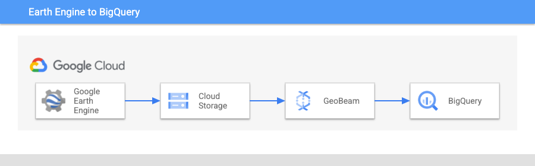
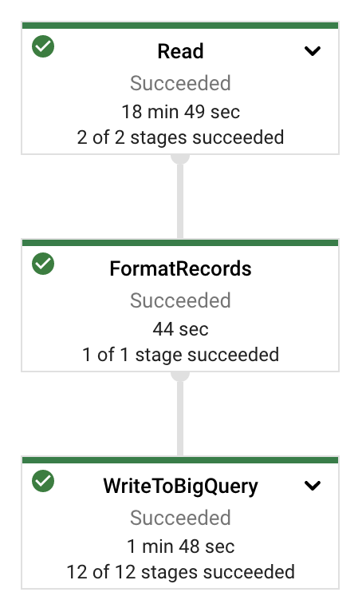
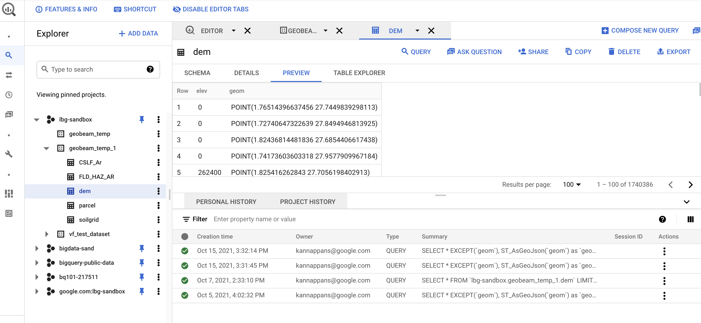
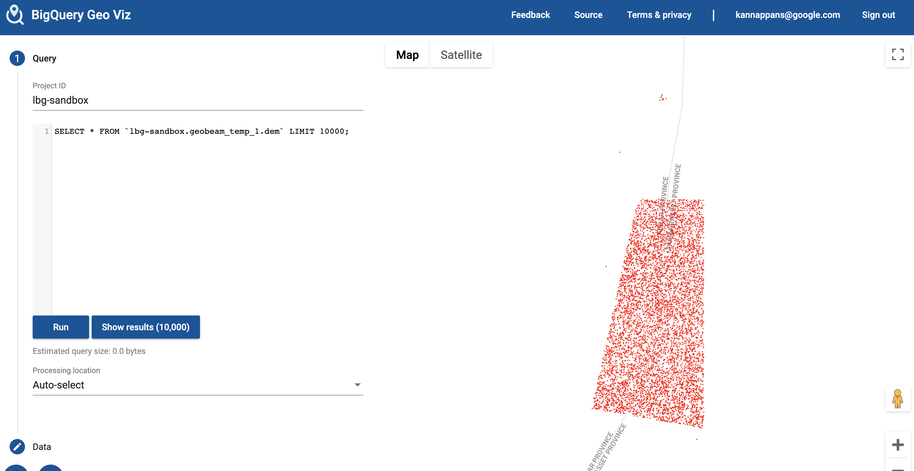

Author: Kannappan Sirchabesan | Cloud Data Engineer | Google  
Collaborator: Donna Schut | Solutions Manager | Google  
Collaborator: Travis Webb | Solutions Engineer | Google  

<p style="background-color:#CAFACA;"><i>Contributed by Google employees.</i></p>

Google Earth Engine is a geospatial processing platform powered by Google Cloud that combines a multi-petabyte catalog of satellite imagery and geospatial datasets with planetary-scale analysis capabilities. Earth Engine is used for analyzing forest and water coverage, land use change, assessing the health of agricultural fields, etc.

[GeoBeam](https://github.com/GoogleCloudPlatform/dataflow-geobeam) is a framework that provides a set of Apache Beam classes and utilities that make it easier to process and transform massive amounts of Geospatial data using Google Cloud Dataflow. 

This solution uses GeoBeam to ingest Raster TIFF images generated in Google Earth Engine into BigQuery. 

## Objectives

* Import a Google Earth Engine TIFF image to a GCS bucket.
* Install the python library GeoBeam.
* Run a GeoBeam job to ingest the TIFF file from GCS bucket to BigQuery.
* Use BigQuery GeoViz to verify that the TIFF image has been ingested correctly.

## Architecture



There are several components to this architecture:

* Google Earth Engine: This is where the TIFF image from Copernicus Sentinel-2 satellite imagery is generated. 
* Cloud Storage Bucket: The TIFF image from Google Earth Engine is stored in a Cloud Storage Bucket        
* Cloud Dataflow: The TIFF image in GCS bucket is processed in Dataflow using GeoBeam
* BigQuery: The processed image is stored in BigQuery as rows that include BigQuery Geospatial [POINT GEOGRAPHY](https://cloud.google.com/bigquery/docs/reference/standard-sql/data-types#geography_type) datatype

## Before you begin

1.  Create a Google Cloud project for this tutorial to allow for easier cleanup.
2.  Get access to Google Earth Engine API using the link: https://signup.earthengine.google.com/.
3.  Enable the BigQuery API and the Cloud Storage API in the project.
4.  Install the geobeam python library 
    ```
    pip install geobeam
    ```
5.  Install the Earth Engine Python library
    ```
    pip install earthengine-api
    ```
6.  Enable the Earth Engine API
    ```
    gcloud services enable earthengine.googleapis.com
    ```

### Set environment variables

Set the environment variables and REPLACE the values with values corresponding to your project.
```
export PROJECT_ID=ee-geobeam-sandbox
export IMAGES_BUCKET=tmp_images_bucket_1
export GEOBEAM_BUCKET=tmp_geobeam_bucket_1
export BQ_DATASET=tmp_bq_dataset_1
export BQ_DATASET_REGION=us-central1
export BQ_TABLE=tmp_bq_table_1
export SERVICE_ACCOUNT_EMAIL=<serviceaccount email>
```

### Create GCS buckets

```
gcloud config set project ${PROJECT_ID}
gsutil mb gs://${IMAGES_BUCKET}
gsutil mb gs://${GEOBEAM_BUCKET}
```

### Create BigQuery Dataset

*   Create a BigQuery dataset where you want to ingest the TIFF file from GCS.
```
bq --location=${BQ_DATASET_LOCATION} mk \
--dataset ${PROJECT_ID}:${BQ_DATASET}
```
*   Create a table in the dataset with the schema as mentioned [here](https://github.com/GoogleCloudPlatform/dataflow-geobeam/blob/main/geobeam/examples/dem_schema.json)
```
bq mk \
--table \
${PROJECT_ID}:${BQ_DATASET}.${BQ_TABLE} \
elev:INT64,geom:GEOGRAPHY
```

### Create Cloud IAM Service Account

*   Create a Cloud IAM Service Account 
*   Assign permissions to the service account to BigQuery and GCS

### Download Earth Engine Image

Export the first image in Copernicus Sentinel-2 Earth Engine ImageCollection as a TIFF file to the bucket created in GCS.  

Wait for a couple of minutes for the export to complete.  

```
earthengine authenticate
```

Execute the below python code
```
import ee
import os

# Initialize the Earth Engine API
ee.Initialize()

# Retrieve the environment variable of GCS bucket for storing images
bucket_name = os.environ['IMAGES_BUCKET']

image = ee.ImageCollection("COPERNICUS/S2").first().select(['B4', 'B3', 'B2']);
task_config = {
    'description': 'copernicus-3',    
    'scale': 30,
    'bucket': bucket_name,
    'fileNamePrefix': 'copernicusExport'
}
task = ee.batch.Export.image.toCloudStorage(image, **task_config)
task.start()
print('Please wait for 5 minutes for the export to GCS to complete')
```

### Run GeoBeam job

```
export GOOGLE_APPLICATION_CREDENTIALS="<Path of the keyfile JSON>"
```

Run the GeoBeam job to ingest the TIFF file from GCS bucket into BigQuery. The job takes roughly 20 minutes to complete. 

```
python -m geobeam.examples.geotiff_dem \
  --runner DataflowRunner \
  --worker_harness_container_image gcr.io/dataflow-geobeam/example-py37 \
  --experiment use_runner_v2 \
  --project ${PROJECT_ID} \
  --temp_location gs://${GEOBEAM_BUCKET}/ \
  —-service_account_email ${SERVICE_ACCOUNT_EMAIL} \
  --region ${BQ_DATASET_REGION} \
  --gcs_url gs://${IMAGES_BUCKET}/copernicusExport.tif \
  --dataset ${BQ_DATASET} \
  --table dem \
  --band_column elev \
  --max_num_workers 3 \
  --machine_type c2-standard-30 \
  --merge_blocks 80 \
  --centroid_only true
```

The progress of the GeoBeam job can be monitored in Dataflow. The job graph should look like the below. 


### Verify the data in BigQuery

Once the GeoBeam job completes, the data should get ingested into BigQuery. This can be verified in the cloud console by looking at the preview of the bigquery table. It should look like below with the elev column and the geom column containing the points of the image as POINT object with the corresponding latitude and longitude.



### Check BigQuery Viz

Check BigQuery Viz to see if the images match roughly



## Cleaning up

You can choose to delete the project and the GCS bucket if you don't need them
```
gsutil rm -r gs://${GEOBEAM_BUCKET}
gsutil rm -r gs://${IMAGES_BUCKET}
gcloud projects delete ${PROJECT_ID}
```
