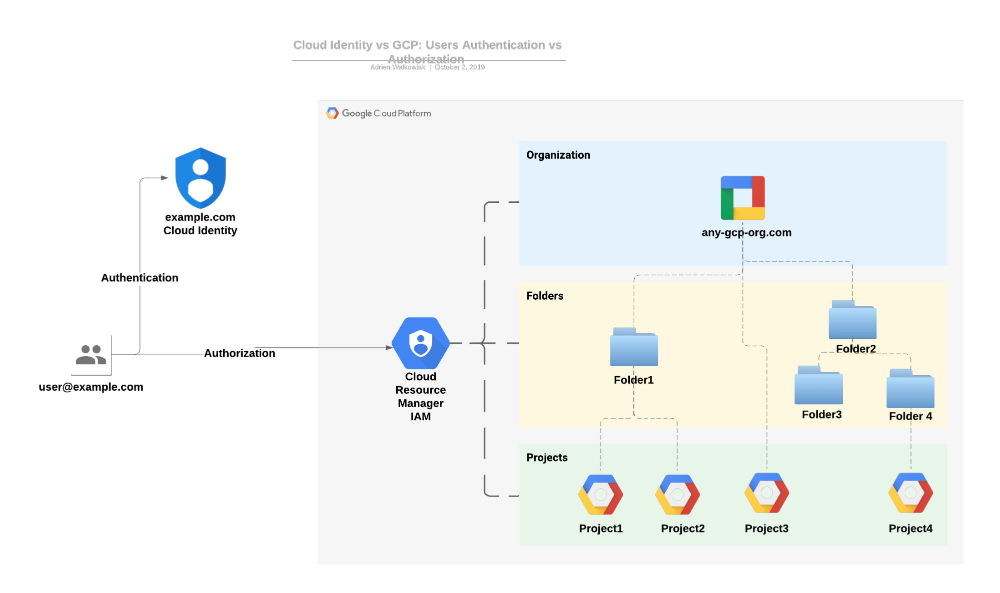
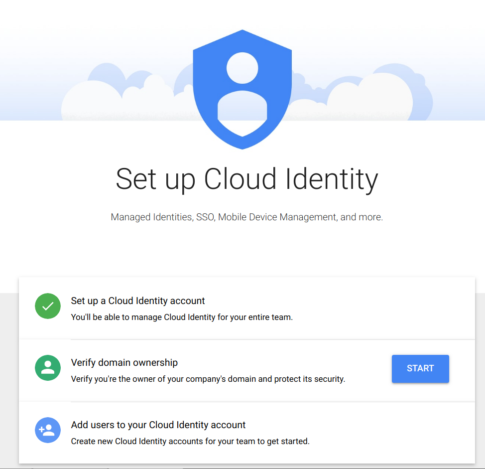
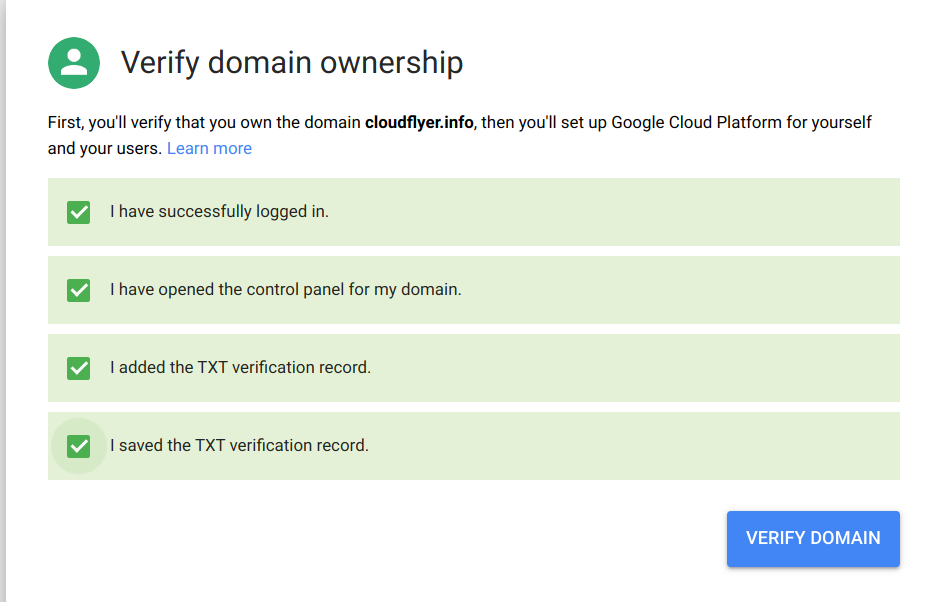
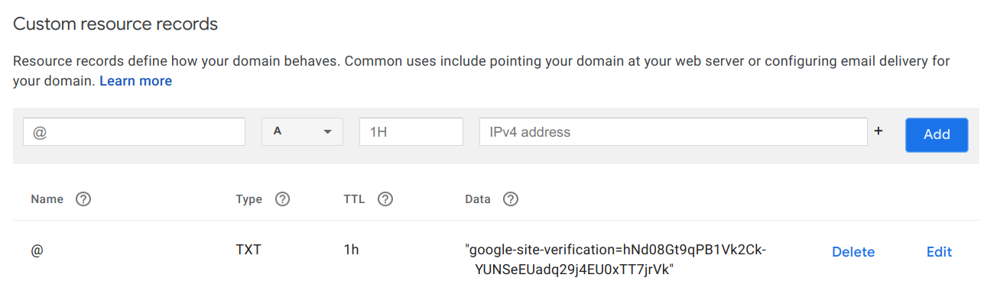
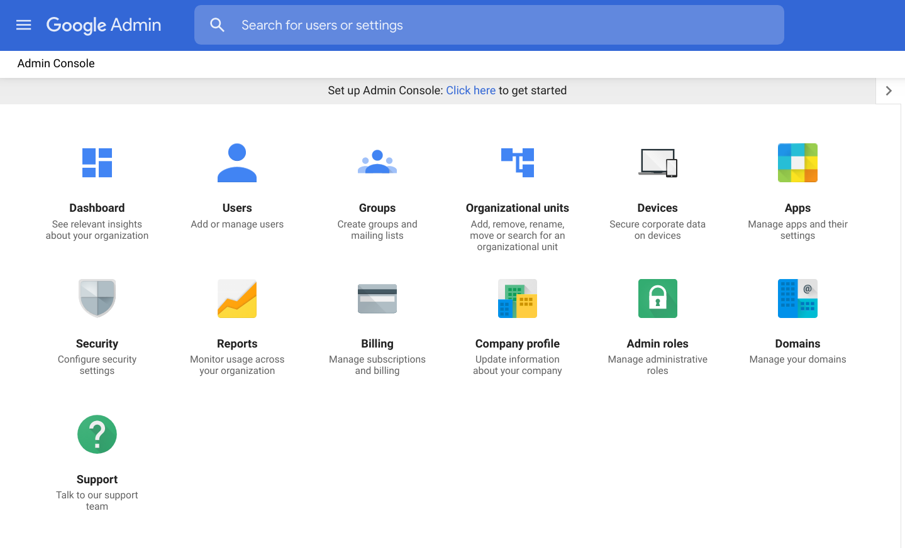
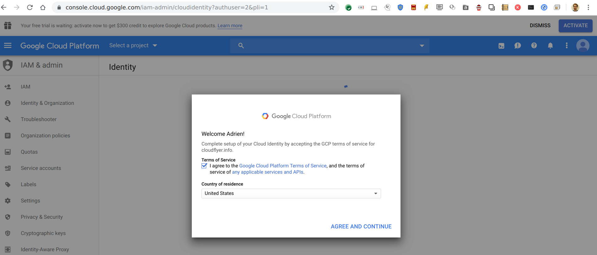
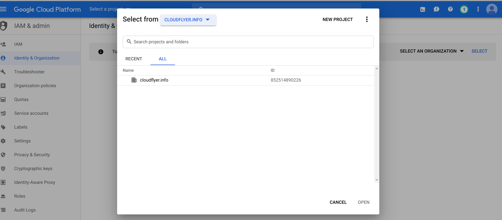
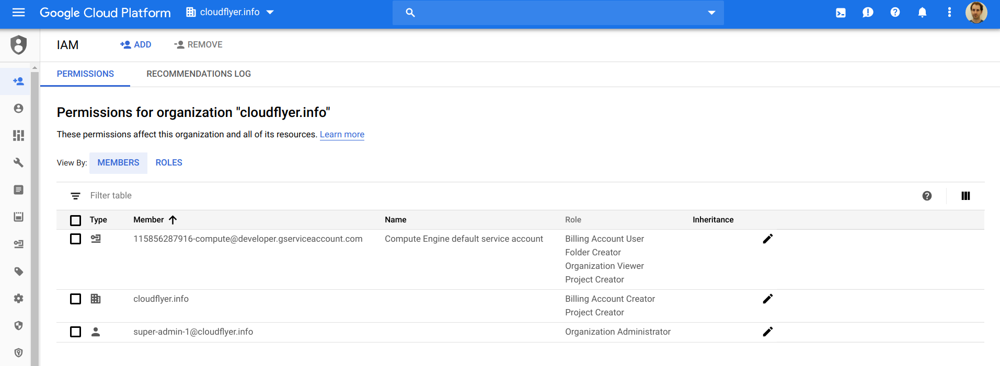
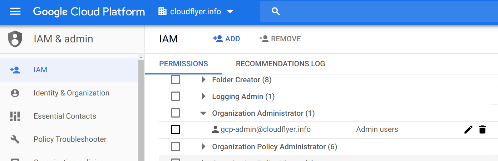

# Introduction

In order to trust your Google Cloud Platform (GCP) environment, it is essential that you trust how you provisioned it in the first place. Establishing that root of trust in your organization can seem challenging, but it should not be. In this post, we will discuss how you can tightly control the most privileged access to your identity management console which is an essential control you need to enforce in order to protect your GCP organization itself.

The main idea to start thinking about how to secure your cloud environment is that identities (e.g GCP users or groups) are separate from everything else in GCP. You can manage identities in the admin console (admin.google.com) and grant access to GCP resources (e.g projects, GCS buckets etc.) in the cloud console - as long as you have the right level of access in each console.

In order to trust that your cloud environment is secure, you need to secure access to both, and make sure you are aware when any privileged access is used to make changes.

This post will describe a process that will let you control the admin console most powerful users, called super admin users. In order to establish this root of trust of your identities in Google Cloud, you can use this proposed step by step guide detailing the process of establishing your [GCP organization](https://cloud.google.com/resource-manager/docs/cloud-platform-resource-hierarchy#organizations) in a secure, tamper-proof way where no one person can make fundamental changes to the organization without the knowledge and participation of other trusted persons.  This article will detail the necessary requirements to complete the process and specific orderly steps.

# Need to know

Before jumping into the specifics of establishing an identity root of trust for your cloud environment, it’s crucial to understand the different parties at play between your domain [Cloud Identity](https://www.google.com/url?q=https://cloud.google.com/identity&sa=D&ust=1581375124639000&usg=AFQjCNFwuT_K7ZDcd6Hm0R0S2OUXp3q2ww) account and your GCP organization.

**The key principle to remember is that the Admin Console is used to centrally manage identities in Google Cloud (i.e user identities and how they get authenticated) and that actual permissions are managed [in GCP, via IAM policies](https://cloud.google.com/resource-manager/docs/access-control-org#using_predefined_roles).**

_In this diagram, user@example.com authentication path is where Cloud Identity comes into play, while the access and authorization on GCP resources is governed by Cloud IAM policies._

You can provision users and groups in the [Admin Console](https://admin.google.com), which lets you manage settings and identities for Google Cloud products like GCP or G Suite. If your users only need access to GCP, you can give them [Cloud Identity licences](https://support.google.com/cloudidentity/answer/7384684?hl=en) which exist either in Free or Premium tiers. There is a 50 free users limit by default for each Cloud Identity account that can be raised if you contact Google Cloud support.

In order to manage your identities within the Admin Console, you can designate [Super Admin users](https://support.google.com/a/answer/2405986?hl=en) that will have full access to manage your Cloud Identity account. Super Admins are highly privileged and should be tightly controlled for safety. This is why it is important to follow a root of trust ceremony to prove to your organization that no single individual can use these sensitives credentials without approval.

Super admin users can configure everything in their respective Cloud Identity domain AND can grant the IAM Org administrator role to users in their respective GCP organization.** **The GCP Organization administrator role allows users to grant IAM permissions to any identity at any level in your GCP hierarchy.

**It is best practice to use this account to create your GCP organization and delegate all GCP administration to other identities (like a dedicated GCP admin group for instance).**

Please refer to the [Security best practices for administrator accounts](https://support.google.com/a/answer/9011373?hl=en) documentation in the admin console for more details on securing these super admin credentials.

The general pattern is to limit their usage and exposure to a minimum of trusted persons within your organization and tightly control when and how they can use these credentials to modify your current setup.

Here are the constraints to keep in mind when reading through this post:

* A GCP Organization can only be **created by a** **super admin user** under the **same domain name.**
* GCP users need to be logged in as users known to Google (for instance G Suite, Cloud Identity, or a regular Google Account user).
* You can add additional domains under the primary domain in your account. See [Limitations with multiple domains](https://support.google.com/a/answer/182081?hl=en) for more details on this option.
* **Users can only be created under one of the domain names tied to their account**
* Users **permissions are managed in GCP** directly, via Cloud IAM policies, not in the admin console.
* Only users with the Organization Administrator role can grant other users IAM permissions at all levels in GCP.

Target State

This section will guide you towards creating your GCP Organization for the first time while locking down your super admin users credentials to establish a root of trust in your cloud environment. The end goal after completing this guide is having a GCP organization node where your domain is controlled using [Cloud Identity](https://support.google.com/cloudidentity/answer/7319251?hl=en) in the [Admin Console](admin.google.com).

At the end of this process, you should have the following:

* An account for your primary domain name in the Admin Console
* Only privileged users called super admins have the possibility to manage your organization.
* Super admins have dedicated identities that require the use of a physical second factor authenticators (2FA) to log in. This means that they will not use their day-to-day user as a super admin user, for safety reasons (e.g they can use supadmin1@yourdomain.cloud for administrative tasks in the admin console and john.doe@yourdomain.cloud for normal GCP activities).
* Super admins physical token out of the reach of your designated super admin users. This ensures that in order to log in as a super admin user, your trusted users need to request access to the physical vault. This lets you trust that your identity setup is the way you expect it to be at any time since you can track who logged in to make changes, and insert your own process to determine why they logged in and what the changed too.
* Your GCP Organization node has been created.
* Super admin users delegated their GCP access to a special IAM admin group in GCP. This enforces separation of duty and makes it easier to manage GCP permissions without the need to log in as a super admin user.

It is recommended to establish a provisioning ceremony (similar to encryption key signing) for Super Admin accounts. The main reason is that these accounts have the ability to change any setting in your Admin Console which can impact both GCP and G Suite users (if any). A compromised or rogue super admin could potentially create other super admin accounts, and block or impersonate regular users to gain admin access to your GCP organization.

Super admin will use physical second factors keys (FIDO U2F Security Keys like Google’s [Titan Security Keys](https://cloud.google.com/titan-security-key/)) to log in. These keys - including spare keys - will be stored in one or two physical vaults. Each super admin activity is logged and retained in a long-term immutable storage. Super admin users should have no other purpose in GCP than designating the Organization Administrators.

Most organizations provision regular cloud users via automation, from their on-premise user directory. It is also a good practice to integrate these regular cloud users with your existing SSO solution by configuring it in the admin console security settings. **Super Admin users cannot authenticate via SSO**, as Google needs to be able to authenticate them even if the SSO setup is broken temporarily.

Note: this article describes how to create a new organization from scratch in GCP in a safe manner. For simplicity we will use the following values from now on:

* New Domain Name to create: cloudflyer.info
* Super admin email addresses:
  * super-admin-1@cloudflyer.info
  * super-admin-2@cloudflyer.info
  * super-admin-3@cloudflyer.info

# High-level overview of the process

Here is a high-level summary of the necessary steps to create a new GCP Organization:

* Admin console account setup
  * Acquire and gain administrative access to the domain name (either purchase or use an existing domain name or subdomain) that will become the GCP Organization.
  * Create super admin email addresses for this domain to receive key communication from Google on your Organization and reset access to the super admin users when necessary (see [reset administrator access](https://support.google.com/cloudidentity/answer/33561?hl=en&authuser=1)). They need to be separate dedicated accounts - not to be used for day-to-day activities (e.g example-admin@yourdomain.cloud).
  * Claim ownership of your domain by [setting up your own domain in Cloud Identity](https://gsuite.google.com/signup/gcpidentity/welcome) and create the first super admin account in Cloud Identity using a secure password.
* Secure Super Admin credentials
  * Tie the dedicated physical tokens and its spare to this super admin account (second factor or 2FA). Titan Security Keys are the [recommended](https://support.google.com/accounts/answer/6103523) way of implementing your second factor for Google accounts. As a general rule, any FIDO U2F capable key should work as a second factor.
  * Create the other two super admin accounts with separate passwords and second factor pairs.
  * (optional) Setup the recovery options (phone + email) if allowed by your internal policy. Assuming the super admin account was created under a trust ceremony, to protect that trust  you should disable password reset  for all super admin accounts. Follow [this process](https://support.google.com/a/answer/33561?hl=en) to reset super admin credentials when no recovery options are available.
* Setup your GCP Organization
  * Use a super admin user to log in GCP and create your GCP Organization node.
  * Delegate the Organization admin role in IAM to the desired identity (e.g a trusted admin group). Note: This role is also sensitive, on the GCP side. It should also not be used as a daily driver account.
* Finish your Admin Console account setup
  * (optional) [setup SSO in Cloud Identity](https://support.google.com/cloudidentity/answer/6349809?hl=en).
  * Export admin logs to a trusted SIEM system.
  * Secure all the super admin accounts following the key ceremony logout procedure by locking the key into one or more safe(s) and logging out all super admin sessions from the trusted workstation.

# Preparatory Steps

These are the prerequisites to initiate the process:

* **Domain name**: Ownership of a domain name with a trusted DNS provider
* **Domain admin**: The domain name administrator is available to create DNS TXT records for the selected domain
* **Define Root ceremonies for events like:**
  * **Initiate root of trust - create Cloud Identity for a domain**
  * **Super Admin users Creation**
  * **Super Admin users login/logout**
  * **Cloud Identity updates**
  * **Super Admin users account rotation or retirement**
* **Identify trusted privileged users for the bootstrapping process:**
  * Cloud Identity super admin: A designated trusted person to be initiated as the Cloud Identity super administrator. Note: it is important to remember that super admin users can update your GSuite configuration, if you have one.
  * GCP Organization Administrator: A designated trusted person or group to be initiated as the organization administrator role in GCP.
  * Trusted Witnesses: A list of trusted witnesses with the ability to randomly select one or more witnesses out of the list for a specific process like: titan key rotation, super admin life events (super admin creation,log in, super admin rotation / deletion etc.), safe opening etc.
* Set of 2FA keys ready: at least two new and unused dedicated [2FA Titan Security Keys](https://cloud.google.com/titan-security-key/) per super admin, ready to be associated to the super admin accounts when appropriate (see super admin ceremonies section). These are the **physical tokens recommended by Google** to secure G Suite or Cloud Identity user accounts. You can [order them online](https://store.google.com/product/titan_security_key) and have them delivered quickly (one day shipping possible in some locations)
* **Physical Vault**: One or more physical vault to store the hardware 2FA keys. Note: the designated super admin users should not have access to the vault(s) without permission, for safety reasons.
* **Password Vault**: a trusted password retention system or tool to store the super admin password.
* **Trusted workstation**: A trusted physical machine with internet connectivity capable of running a chrome browser and accepting a USB key. This workstation should be highly secured according to your own internal standards. Generally, this workstation is not used for day-to-day activity, and is locked down to only allow access to the Admin Console and GCP. You can also control which internal user can log in the machine in the first place for additional security.

# Setup Cloud Identity

In this step, you will create your first super admin user in Cloud Identity and claim ownership of your domain in the admin console. Once this is done, you will create the additional super admin users and (optionally) setup your SSO connection to allow future regular users to connect to your GCP organization in an integrated fashion.

**NOTE: All of this section should be conducted as a ceremony on its own as you will create all super admin accounts and setup your GCP organization for the first time.**

**At the end of this process, all keys should be clearly identified (with stickers and/or separate envelopes) and placed in one or more safe(s). Witnesses should be present during the entire event.**

We will need two things in order to setup your Cloud Identity account for this domain:

1. The ability to prove that you own the domain (hence the capacity to add DNS records publically to it)
2. A valid email address from this domain. This address will be used to create the initial super admin in Cloud Identity to manage this domain in Cloud Identity.

This implies that the domain name has been properly configured to handle emails (MX records pointing to valid mail servers and a new email address created especially for this super admin user).

The root of trust for your cloud organization starts here. You need to create three email accounts on this domain for the super admins that you designated in the first section.

Go to [Cloud Identity Free tier setup](https://gsuite.google.com/signup/gcpidentity/welcome) and fill out the form to get started. This is mainly gathering high-level information about your business and first super admin user. You will also need to agree to the [Cloud Identity agreement](https://admin.google.com/terms/cloud_identity/1/2/en/na_terms.html) to continue.

Once this is done, you can setup your Cloud Identity account for this domain. Sign-in as the super admin user you just created. At this point no 2FA is used yet, so you will be asked to provide a phone number for this super admin user (use the received security code by SMS to log in).

Agree to the [Google Terms of Service](https://accounts.google.com/TOS?hl=en) and the [Google Privacy Policy](https://www.google.com/policies/privacy/) to continue.

To verify ownership of your domain, click start and add the DNS record in your public DNS zone for this domain and wait until the verification happens (this may take several minutes):

Here is an example of this verification record in the cloudflyer.info DNS zone:

Once your domain is verified you can log in the [Cloud Identity admin console](http://admin.google.com):

You can now start the creation of the other super admin users for this role and [associate the right second factor](https://support.google.com/accounts/answer/185839?co=GENIE.Platform%3DDesktop&hl=en) to each account specifically.

Once you have setup all the super admin accounts correctly, you can finish the process to create your organization in GCP.

Verify that each super admin account access is working with their own password and 2FAs: log in and out with both keys (main and spare) for each account. Configure all the other security settings according to your own security requirements.

Log out all super admin and store the labelled second factor dongles in one or more safe.

How to Securely Bootstrap your GCP organization

(Optional) For the main GCP organization, follow [these steps to enable the SSO](https://cloud.google.com/solutions/federating-gcp-with-active-directory-configuring-single-sign-on) capability in Cloud Identity.

(Optional) Setup a directory sync with your existing user directory (LDAP or AD for instance) for the right users and groups to be provisioned automatically to your Cloud Identity account. This usually requires a “bot” privileged users to allow for the synchronization. Google recommends using [Google Cloud Directory Sync](https://support.google.com/a/topic/2679497?hl=en&ref_topic=4511280) for this. See [this other article](https://cloud.google.com/blog/products/identity-security/using-your-existing-identity-management-system-with-google-cloud-platform) to learn more about syncing identities for Google Cloud.

# Setup your GCP Organization

In this final step, we will  create your GCP Organization nod, define your Organization Admin groups and setup log exports and alerting on super admin events.

You have to be a super admin to execute this step. Follow your ceremony to log in as a super admin if not already logged in. Go to the [Google Cloud Console](https://console.cloud.google.com/). You should see a screen like this:

Once you agree to the terms and conditions, the GCP organization is created.

You can now verify that your super admin users has the [Organization Administrator](https://console.cloud.google.com/iam-admin/roles/details/roles%3Cresourcemanager.organizationAdmin) role in the IAM section:

Finally, you need to delegate the GCP administration to a group of trusted individuals, to avoid having to use the super admin users for day-to-day operations. You will need to provision identities for these users (like a dedicated group in Cloud Identity) prior to assigning them the GCP Organization Administrator role in the GCP console:

Before completing this root of trust ceremony, it is recommended that you [export your admin console logs](https://support.google.com/a/answer/4579579?hl=en) to your existing SIEM solution. This can be achieved natively with solutions like [Splunk](https://splunkbase.splunk.com/app/3791/#/details), or can be achieved via some automation like using the [CFT G Suite exporter](https://github.com/terraform-google-modules/terraform-google-gsuite-export) module in GCP. If no existing solution is satisfying, admin logs can be exported using custom code and the [G Suite SDK](https://developers.google.com/admin-sdk).

## Final Note on managing multiple GCP organizations

You can allow users from one domain to access other GCP organizations using Cloud IAM policies. You don’t need to provision separate identities for all the GCP organizations you own, unless you want to force your users to log in using different identities each time they access a GCP organization.

The only role that cannot be granted across organizations are the [primitive roles](https://cloud.google.com/iam/docs/understanding-roles#role_types) (Owner, Editor and Viewer) which are not recommended for a production use in the first place.

On the flip side, you can restrict which domains are allowed in your GCP Organization using the iam.allowedPolicyMemberDomains [Org policy constraint](https://cloud.google.com/resource-manager/docs/organization-policy/org-policy-constraints), once the organization is created.

# Conclusion

You should now be in a good shape to trust your initial setup on both Cloud Identity and GCP. What you accomplished by following a root of trust ceremony for your Cloud Identity account is ensuring that no single user in your organization can log in as a super admin on their own and change your setup in either Cloud Identity or GCP. The main safety mechanism to achieve this is to physically hold on the second factors to log in as a super admin in the first place.

At this point, your users should rarely need to log in as super admin users, except when they need to modify sensitive settings in the admin console for instance. Anytime you need someone to log in as a super admin, you should follow your super admin login ceremony so that you keep trusting your setup in both GCP and Cloud Identity.

Finally, it is recommended to [turn on alerts](https://support.google.com/a/answer/9288157?hl=en) on super admin events in the admin console to double check that no change happened outside of your controlled ceremonies.

# Useful links

* [Enterprise onboarding checklist](https://cloud.google.com/docs/enterprise/onboarding-checklist)
* [Security best practices for you administrator accounts](https://support.google.com/cloudidentity/answer/9011373?hl=en&authuser=1)
* [Sign-in to the admin console](https://support.google.com/cloudidentity/answer/182076?hl=en&authuser=1)
* [Set session length in Cloud Identity](https://support.google.com/cloudidentity/answer/7576830)
* [Enabling SSO in Cloud Identity](https://cloud.google.com/solutions/federating-gcp-with-active-directory-configuring-single-sign-on)
* [GCDS best practices](https://support.google.com/a/answer/7177267?hl=en)
