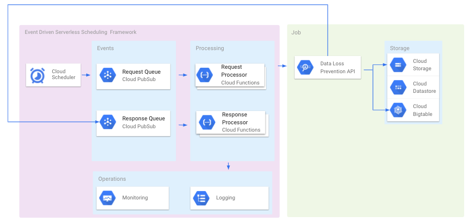

## Event Driven Serverless Scheduling Framework

This repository demonstrates a very simple yet very effective and scalable event driven serverless scheduling framework with Google Cloud services. Example included shows how to work with Google Cloud Data Loss Prevention API and it can easily replace with any type of job/api with SDK support.  

## Example Solution Architecture

## Setup Instructions
1. Create two Pub/Sub topics by following instructions on [Pub/Sub quickstart guide](https://cloud.google.com/scheduler/docs/quickstart) 
    - First topic would be used by Cloud Scheduler to kick off a scheduled job
    - Second topic would be used by Cloud DLP API to notify a scanning job is complete 

1. Create two Cloud Functions by following instructons on [Cloud Functions quickstart guide](https://cloud.google.com/functions/docs/quickstart-python)
    - Make the first Cloud Function subscribes to the first Pub/Sub topic so it will be triggered when Cloud Scheduler kicks off a scheduled job. Add both main.py and requirements.txt to the Cloud Function and make sure the **Entry Point** is pointing to **job_request** function.
    - Make the second Cloud Function subscribes to the second Pub/Sub topic so it will be triggered when Cloud DLP API finishes the scanning job. Add both main.py and requirements.txt to the Cloud Function and make sure the **Entry Point** is pointing to **job_complete** function.

1. Follow instructions on [Cloud Scheduler quickstart guide](https://cloud.google.com/scheduler/docs/quickstart) 
    - Use the first Pub/Sub topic created in step ealier
    - In the payload section, use the [payload.json](payload.json) file

