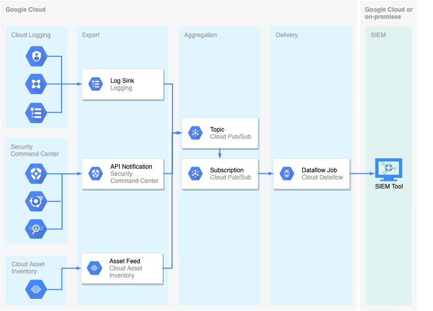

Roy Arsan | Solutions Architect | Google

<i>Contributed by Google employees.</i>

This tutorial is for security paractitioners who need to aggregate all security-relevant data (logs, alerts, and assets metadata) from their Google Cloud environment into their existing Security Information & Event Management (SIEM) tools in order to power their security operations. You will deploy a Cloud PubSub & Dataflow-based pipeline to aggregate and stream in near real-time logs from Cloud Logging, security findings from Security Command Center and assets changes from Cloud Asset Inventory all in a unified cloud-native export pipeline.

## Objectives

*   Create a Pub/Sub topic and subscription to aggregate data
*   Set up log sinks in Cloud Logging to export logs
*   Set up notifications feed in Security Command Center to export security findings
*   Set up asset feed in Cloud Asset Inventory to export assets changes
*   Deploy a Dataflow job to stream data from Pub/Sub to your SIEM tool (if applicable)

## Costs

This tutorial uses billable components of Google Cloud, including the following:

*   [Cloud Pub/Sub](https://cloud.google.com/pubsub)
*   [Cloud Dataflow](https://cloud.google.com/dataflow)
*   [Security Command Center](https://cloud.google.com/security-command-center)

Use the [pricing calculator](https://cloud.google.com/products/calculator) to generate a cost estimate based on your projected usage.

## Before you begin

This tutorial assumes that you already have your security analytics tool set up to on-board data from Google Cloud, which is commonly by either pulling data from Pub/Sub or by receiving data pushed by Dataflow. It is also assumed you have sufficient Organization-wide permissions which are required for several steps below like setting up org-wide log sink and org-wide feeds for security findings and asset changes.

1. In Google [Cloud Console](https://console.cloud.google.com/), in the project selector dropdown, select or create a Google Cloud project.
1. Install Google [Cloud SDK](https://cloud.google.com/sdk/docs/quickstart) on your workstation. Alternatively, you may activate and use [Cloud Shell](https://cloud.google.com/shell/docs/launching-cloud-shell#launching_from_the_console) directly from your Cloud Console for an interactive shell with pre-installed Google Cloud SDK.
1. In your environment, create these variables for your project and organization IDs:

        export PROJECT_ID=[MY_PROJECT_ID]
        export ORG_ID=[MY_ORGANIZATION_ID]
1. Set the project for your active session, if you haven't already:

        gcloud config set project $PROJECT_ID
1. Enable the following APIS, if you haven't already:

        gcloud services enable pubsub.googleapis.com
        gcloud services enable dataflow.googleapis.com
        gcloud services enable securitycenter.googleapis.com
        gcloud services enable cloudasset.googleapis.com

## Create a Pub/Sub topic and subscription for aggregation

1. Create a Pub/Sub topic where all data will be sent to:

        gcloud pubsub topics create export-topic

2. Create a Pub/Sub subscription where all data will be aggregated:

        gcloud pubsub subscriptions export-subscription \
           --topic=export-topic \
           --expiration-period="never"

## Set up org-wide log sink in Cloud Logging

1. Create an organization log sink to capture Cloud Audit logs from all GCP projects in your organization:

        gcloud logging sinks create org-audit-logs-all \
          pubsub.googleapis.com/projects/$PROJECT_ID/topics/export-topic \
          --organization=$ORG_ID \
          --include-children \
          --log-filter="logName:'log/cloudaudit.googleapis.com'

Note the `log-filter` option specifies that Cloud Audit logs to be routed to the Pub/Sub topic `export-topic`. You may want to edit the log filter or create additional log sinks to export additional logs such as VPC flow logs, LB request logs or VM logs like application logs and syslog.

This command returns the service account of the log sink writer, usually in the form `o#####-####@gcp-sa-logging.iam.gserviceaccount.com`

2. Save the service account of the log sink in an enviroment variable:

        export LOG_SINK_SA=[MY_SA]@gcp-sa-logging.iam.gserviceaccount.com

3. Give permissions to the log sink service account to publish to the Pub/Sub topic:

        gcloud pubsub topics add-iam-policy-binding export-topic \
          --member=serviceAccount:$LOG_SINK_SA \
          --role=roles/pubsub.publisher

## Set up notification feed in Security Command Center

1. Set the `gcloud` tool account that you are using:
        export GCLOUD_ACCOUNT=[EMAIL]

1. Set up temporary permissions for the `gcloud` tool account that you are using. This lets you create org-wide finding notifications feed in the subsequent step:

        gcloud pubsub topics add-iam-policy-binding \
          projects/$PROJECT_ID/topics/export-topic \
          --member="user:$GCLOUD_ACCOUNT" \
          --role="roles/pubsub.admin"

        gcloud organizations add-iam-policy-binding $ORG_ID \
          --member="user:$GCLOUD_ACCOUNT" \
          --role="roles/securitycenter.notificationConfigEditor"

1. Create the notification feed to publish in real-time active security findings from Security Command Center into the same destination Pub/Sub topic as above:

        gcloud scc notifications create scc-notifications-all-active \
            --organization="$ORG_ID" \
            --description="Notifications for active security findings" \
            --pubsub-topic=projects/$PROJECT_ID/topics/export-topic \
            --filter="state=\"ACTIVE\""

This command creates a service account for you, usually in the form `service-org-ORGANIZATION_ID@gcp-sa-scc-notification.iam.gserviceaccount.com`, and grants it the `securitycenter.notificationServiceAgent` role at the organization level and the topic level, which is required for notifications to function.

4. (Optional) Unless you plan to continue to modify this notification's filter (or create new notification feeds), you can now remove the temporary permissions you granted your `gcloud` tool account:

        gcloud pubsub topics remove-iam-policy-binding \
          projects/$PROJECT_ID/topics/export-topic \
          --member="user:$GCLOUD_ACCOUNT" \
          --role="roles/pubsub.admin"

        gcloud organizations remove-iam-policy-binding $ORG_ID \
          --member="user:$GCLOUD_ACCOUNT" \
          --role="roles/securitycenter.notificationConfigEditor"

## Set up asset changes feed in Cloud Asset Inventory

1. Set up temporary permissions for the `gcloud` tool account that you are using. This lets you create org-wide asset feed in the subsequent step:

        gcloud organizations add-iam-policy-binding $ORG_ID \
          --member="user:$GCLOUD_ACCOUNT" \
          --role="roles/cloudasset.owner"

1. Create Cloud Asset Inventory service account tied to your current project:

        gcloud beta services identity create --service=cloudasset.googleapis.com --project=$PROJECT_ID

This command returns the service account of the Cloud Asset service agent in your project, usually in the form `service-[PROJECT_NUMBER]@gcp-sa-cloudasset.iam.gserviceaccount.com`

3. Save the service account of the Cloud Asset service agent in an enviroment variable:

        export ASSET_SA=service-[PROJECT_NUMBER]@gcp-sa-cloudasset.iam.gserviceaccount.com

1. As you did with Cloud Logging log sink service account, you need to give Cloud Asset project service account necessary permissions to publish to Pub/Sub topic `export-topic`:

        gcloud pubsub topics add-iam-policy-binding \
          projects/$PROJECT_ID/topics/export-topic \
          --member=serviceAccount:$ASSET_SA \
          --role=roles/pubsub.publisher

1. Create asset feed to monitor any change in resource or policy metadata of the resource itself. In this example, as determined by `asset-types` parameter, changing any resources from GCE, or GCS buckets,  BigQuery tables and datasets, or IAM roles and service accounts across your entire organization, will trigger a notification. Note Cloud Inventory Asset supports about 120 asset types. For more information, refer to [supported resource types](https://cloud.google.com/asset-inventory/docs/supported-asset-types#supported_resource_types).

        gcloud asset feeds create org-assets-all-feed \
          --organization=$ORG_ID \
          --asset-types="compute.googleapis.com.*,storage.googleapis.com.*,bigquery.googleapis.com.*,iam.googleapis.com.*" \
          --content-type=resource \
          --pubsub-topic="projects/$PROJECT_ID/topics/export-topic"

1. (Optional) Unless you plan to continue to modify this asset feed (e.g. add asset types or specific asset names), you can now remove the temporary Cloud Asset Inventory permissions you granted your `gcloud` tool account:

        gcloud organizations remove-iam-policy-binding $ORG_ID \
          --member="user:$GCLOUD_ACCOUNT" \
          --role="roles/cloudasset.owner"

## Verify logs and events are published and aggregated in Pub/Sub

You should now have three different types of events being aggregated as messages (individual JSON payloads) in single Pub/Sub subscription `export-subscription`:

| Event or Log | Schema Reference |
| --- | ---|
| Cloud Audit Log | [LogEntry](https://cloud.google.com/logging/docs/reference/v2/rest/v2/LogEntry)
| SCC Security Finding | [NotificationMessage](https://cloud.google.com/security-command-center/docs/how-to-api-manage-notifications)
| CAI Asset Change | [TemporalAsset](https://cloud.google.com/asset-inventory/docs/reference/rpc/google.cloud.asset.v1#google.cloud.asset.v1.TemporalAsset)

To verify:

1. In Cloud Console, open [Pub/Sub Subscriptions](https://console.cloud.google.com/cloudpubsub/subscription)
2. Select `export-subscription` subscription
3. Click **View Messages** to open the messages viewer
4. Click **Pull**, making sure to leave **Enable ack messages** cleared
5. You can now inspect the different messages, be it an audit log, a security finding or an asset change event.

## Deploy a Dataflow job to stream data from Pub/Sub

Depending on your SIEM tool's support for Pub/Sub, it may retrieve messages directly from Pub/Sub subscription either as a [pull or push delivery](https://cloud.google.com/pubsub/docs/subscriber).

For a more flexible, managed and scalable approach with exactly-once processing of Pub/Sub message streams, you can use [Cloud Dataflow](https://cloud.google.com/dataflow) which is a fully-managed data streaming service with multiple supported sources and sinks including Pub/Sub, GCS, BigQuery and some third-party tools. There are purpose-built [Dataflow templates](https://cloud.google.com/dataflow/docs/guides/templates/provided-streaming) that handles the reliable delivery of data at scale including autoscaling, batching, retries, exponential backoff, and fallback to deadletter for any undeliverable messages.

For example, if using Splunk as SIEM tool, you can deploy a Dataflow job to pull from Pub/Sub and deliver to Splunk HTTP Event Collector (HEC) as follows:

1. Back to your shell environment, create special-purpose Pub/Sub topic and subscription to be used for holding any undeliverable messages:

        gcloud pubsub topics create export-topic-dl
        gcloud pubsub subscriptions create export-subscription-dl \
          --topic export-topic-dl \
          --expiration-period="never"

2. Set your Splunk HEC endpoint and token using the following variables:

        export SPLUNK_HEC_URL=[YOUR_SPLUNK_URL]
        export SPLUNK_HEC_TOKEN=[YOUR_SPLUNK_TOKEN]

3. Run Dataflow job. The following deploys in `us-central1` region and in project's `default` network:

        # Set Dataflow pipeline job name
        JOB_NAME=pubsub-to-splunk-`date +"%Y%m%d-%H%M%S"`
        # Run Dataflow pipeline job
        gcloud beta dataflow jobs run ${JOB_NAME} \
          --gcs-location=gs://dataflow-templates/latest/Cloud_PubSub_to_Splunk \
          --region=us-central1 \
          --network=default \
          --subnetwork=regions/default/subnetworks/default \
          --parameters \
        inputSubscription=projects/${PROJECT_ID}/subscriptions/export-subscription,\
        outputDeadletterTopic=projects/${PROJECT_ID}/topics/export-topic-dl,\
        url=${SPLUNK_HEC_URL},\
        token=${SPLUNK_HEC_TOKEN}

For a more comprehensive guide on deploying log export to Splunk, refer to [Deploying production-ready log exports to Splunk using Dataflow](https://cloud.google.com/architecture/deploying-production-ready-log-exports-to-splunk-using-dataflow)

## Cleaning up

To avoid incurring charges to your Google Cloud account for the resources used in this tutorial, you can delete the organization-level objects (e.g. log sink and feeds) in addition to the export project itself where Pub/Sub and Dataflow resources reside.

Deleting a project has the following consequences:

- If you used an existing project, you'll also delete any other work that you've done in the project.
- You can't reuse the project ID of a deleted project. If you created a custom project ID that you plan to use in the
  future, delete the resources inside the project instead. This ensures that URLs that use the project ID, such as
  an `appspot.com` URL, remain available.

To delete all organization-wide log sinks and feeds created, do the following in your shell environment:

        gcloud logging sinks delete org-audit-logs-all \
          --organization=$ORG_ID \
        gcloud scc notifications delete scc-notifications-all-active \
          --organization=$ORG_ID \
        gcloud asset feeds delete org-assets-all-feed \
          --organization=$ORG_ID

To delete a project, do the following:

1.  In the Cloud Console, go to the [Projects page](https://console.cloud.google.com/iam-admin/projects).
1.  In the project list, select the project you want to delete and click **Delete**.
1.  In the dialog, type the project ID, and then click **Shut down** to delete the project.

## What's next

- Learn more about [aggregated sinks in Cloud Logging](https://cloud.google.com/logging/docs/export/aggregated_sinks).
- Learn more about [filtering notifications in Security Command Center](https://cloud.google.com/security-command-center/docs/how-to-api-filter-notifications).
- Learn more a out [monitoring asset changes in Cloud Asset Inventory](https://cloud.google.com/asset-inventory/docs/monitoring-asset-changes).
- Try out other Google Cloud features for yourself. Have a look at our [tutorials](https://cloud.google.com/docs/tutorials).
