## Overview

Those responsible for keeping data safe in the cloud need to know about activities taking place in their workloads. Problems with VPN tunnels can cause unexpected outages, and a seemingly benign oversight like an overly-wide firewall rule can have significant impact to an organization's security posture. Getting the events flowing to a log analytics system is a first step toward minimizing the time it takes to discover and remediate a risky scenario.

Cloud Platform customers can use Stackdriver for near real-time logging of activity in the cloud, as well as logs from resources in AWS resources and data centers. While [Stackdriver Log Viewer](https://cloud.google.com/logging/docs/view/overview) provides the native ability to perform log searching and exporting, we can also send the logs to an existing logging solution to leverage existing investments.

This tutorial creates the configurations required to send Stackdriver logs to the Elastic Cloud Elasticsearch SaaS platform. Elastic Cloud is a SaaS offering, which saves time by not needing to build and manage the Elasticsearch infrastructure.

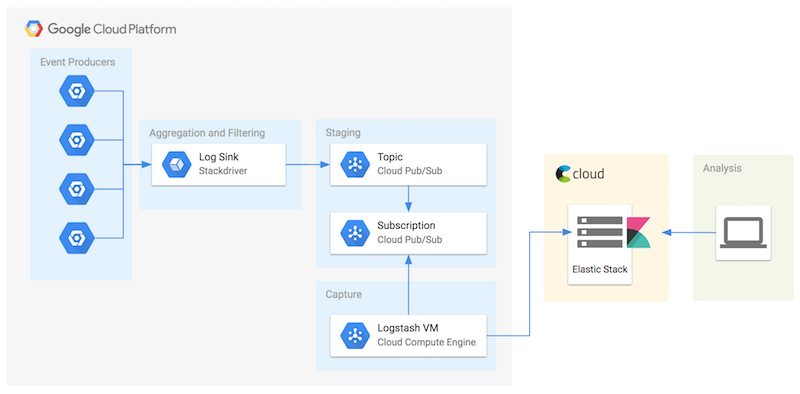

This tutorial may also be useful for those that elect to build their own Elasticsearch stack in public cloud instead of using the Elastic Cloud SaaS offering. Especially when considering SaaS solutions, it is especially important to involve compliance teams early to meet requirements from frameworks like HIPAA, PCI, SOC 2, and FedRAMP. Vendor risk management is an important part of a mature compliance practice.

## Costs

This tutorial uses billable components of Cloud Platform, including:

+   Google Compute Engine

New Cloud Platform users might be eligible for a [free trial](https://cloud.google.com/free-trial).

## Configure Cloud Platform resources
The high level steps in this section are:

1. Create a user-managed Service Account
1. Create a VM for Logstash
1. Create a Cloud Pub/Sub topic
1. Create a Stackdriver log sink and subscribe it to the Cloud Pub/Sub topic

## Using the _gcloud_ CLI
The example in this tutorial leverage the _gcloud_ command line interface. While the console is a popular way to get started in the cloud, customers are encouraged to get comfortable using the CLI over the web interface use because the steps performing can be tracked and versioned as code. Preparing CLI scripts makes setup activities more predictable, less error prone, and can becomes be reused and improved over time. Using code to configure infrastructure also simplifies testing and disaster recovery activities.

## Access Cloud Console
Log in or sign up for [Cloud Platform](https://cloud.google.com), then open [Cloud Console](https://console.cloud.google.com).

## Enable Cloud APIs
Cloud APIs must be enabled via the [Services and APIs page](https://console.cloud.google.com/apis/dashboard) in the console before they can be used with _gcloud_. To perform the steps in this tutorial, enable: 

* Compute Engine API
* Cloud Pub/Sub API
* Identity and Access Management (IAM) API
* Google Stackdriver API

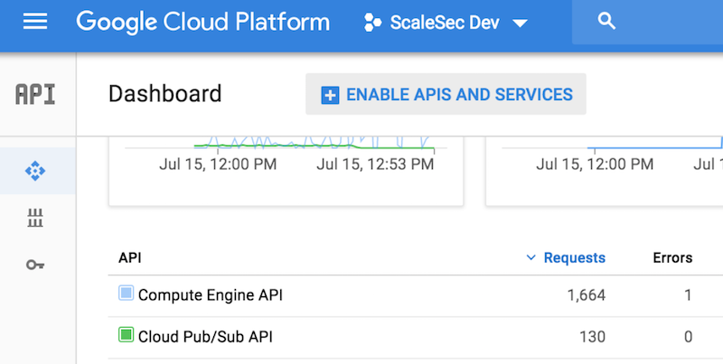

## Activate Google Cloud Shell
Cloud Console provides an interactive shell that includes the _gcloud_ CLI. At the top right corner of the page, click the icon to "Activate Google Cloud Shell".

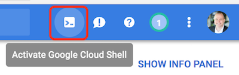

## Create a service account
Cloud Platform [best practices](https://cloud.google.com/vpc/docs/firewalls#service-accounts-vs-tags) suggest using a service account to configure security controls to a VM. A service account is useful for a VM to determine which other Cloud Platform resources can be access by the VM and its applications, and which firewall rules should be applied to the VM.

While credentials can be created to be used by a service account, this step is not necessary when the service account is attached to a VM running on Google Compute Engine. Google manages the keys, and applications can [retrieve the credentials securely](https://cloud.google.com/compute/docs/access/create-enable-service-accounts-for-instances#authenticating_applications_using_service_account_credentials) via the metadata service.

1. Create a service account to attach to the VM:

        gcloud iam service-accounts create logstash \
        --display-name="Logstash to Stackdriver"

    **Expected Response**

        Created service account [logstash].

1. Provide permissions to access Cloud Pub/Sub using the `pubsub.editor` [predefined IAM role](https://cloud.google.com/pubsub/docs/access-control#tbl_roles). _Editor_ permission are required for version 1.1.0 of Logstash Pub/Sub plugin. This appears to have been [addressed](https://github.com/logstash-plugins/logstash-input-google_pubsub/blob/master/lib/logstash/inputs/google_pubsub.rb#L211-L214) in version 1.2.0, which means _subscriber_ permissions could be used.

        gcloud projects add-iam-policy-binding scalesec-dev --member serviceAccount:logstash@scalesec-dev.iam.gserviceaccount.com --role roles/pubsub.editor

## Create a Cloud Pub/Sub topic and subscription
1. Create a Cloud Pub/Sub topic where Stackdriver will send events to be picked up by Logstash.

        gcloud pubsub topics create stackdriver-topic

    **Expected Response**

        Created topic [projects/scalesec-dev/topics/stackdriver-topic].

    Version 1.1.0 of the logstash plugin will automatically create a subscription.

## Create a Stackdriver log sink
1. Create a log sink to be used to export Stackdriver logs to the new Cloud Pub/Sub topic.

        gcloud logging sinks create logstash-sink pubsub.googleapis.com/projects/scalesec-dev/topics/stackdriver-topic \
        --log-filter='resource.type="project"'

    **Expected Response**  

        Created [https://logging.googleapis.com/v2/projects/scalesec-dev/sinks/logstash-sink].
        Please remember to grant `serviceAccount:p352005273005-058743@gcp-sa-logging.iam.gserviceaccount.com` Pub/Sub Publisher role to the topic.
        More information about sinks can be found at https://cloud.google.com/logging/docs/export/ 

    The filter specified above will produce events associated with changes to IAM, which is a typical area to be monitored closely. Stackdriver supports monitoring activities for vpn_gateway and other resource types. See the [documentation](https://cloud.google.com/logging/docs/view/overview) for more filter ideas.

    The service account used by Stackdriver needs permissions to publish events to the Cloud Pub/Sub topic. The _gcloud_ CLI doesn't currently support permissions management for Cloud Pub/Sub, but they can be managed via the [Cloud Pub/Sub page](https://console.cloud.google.com/cloudpubsub/topicList) in Cloud Console. 

1. Confirm that the service account has access to the topic as shown below.

    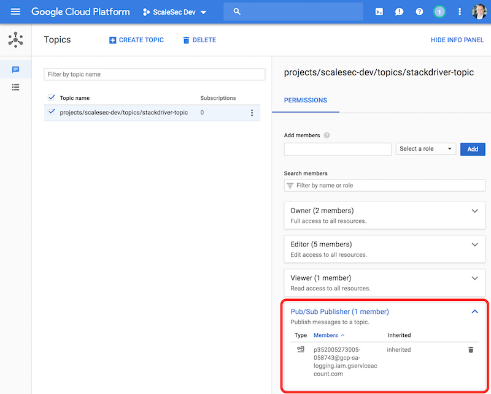

## Create the Logstash VM
(_Some system responses will be omitted in this section for brevity._)

1. Create a VM. In addition to the pubsub scope shown below, note the inclusion of the default recommended scopes to other Google APIs for essential system operation.

        gcloud compute --project=scalesec-dev instances create logstash \
        --zone=us-west1-a \
        --machine-type=n1-standard-1 \
        --subnet=default \
        --service-account=logstash@scalesec-dev.iam.gserviceaccount.com \
        --scopes="https://www.googleapis.com/auth/pubsub,https://www.googleapis.com/auth/devstorage.read_only,https://www.googleapis.com/auth/logging.write,https://www.googleapis.com/auth/monitoring.write,https://www.googleapis.com/auth/servicecontrol,https://www.googleapis.com/auth/service.management.readonly,https://www.googleapis.com/auth/trace.append" \
        --image=ubuntu-1804-bionic-v20180617 \
        --image-project=ubuntu-os-cloud \
        --boot-disk-size=10GB \
        --boot-disk-type=pd-ssd \
        --boot-disk-device-name=logstash

    **Expected Response**  

        Created [https://www.googleapis.com/compute/beta/projects/scalesec-dev/zones/us-west1-a/instances/logstash].
        NAME      ZONE        MACHINE_TYPE   PREEMPTIBLE  INTERNAL_IP  EXTERNAL_IP     STATUS
        logstash  us-west1-a  n1-standard-1               10.138.0.3   35.233.166.234  RUNNING

## Create Elastic Cloud deployment
1. Go to https://cloud.elastic.co/login. A trial account provides suitable service to complete this tutorial.

    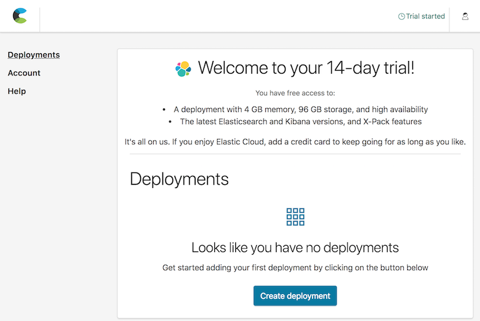

1. Create an Elasticsearch deployment. This example is deployed on Cloud Platform in us-west1. 

    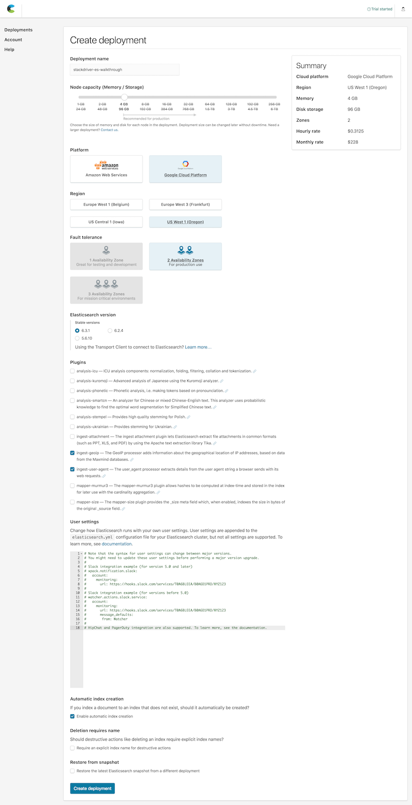

1. While the deployment is finishing up, make sure to capture the credentials and store them in a safe place. While the Cloud ID can be viewed from the deployment page, this is the only time the password for the elastic user is available. Visit the "Security" to reset the password if needed. When considering production environments, create new Elasticsearch credentials with tighter permissions and avoid using the elastic user. As [documented](https://www.elastic.co/guide/en/cloud/master/ec-cloud-id.html): "On a production system, you should adapt these examples by creating a user that can write to and access only the minimally required indices."

    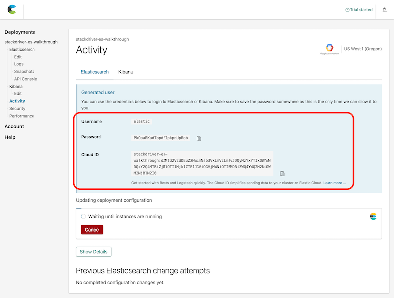

1. Obtain the URI of the Elasticsearch endpoint that has been provisioned. A link to this endpoint can be copied from the Deployments page. This value will be needed to configure Logstash output plugin configuration.

    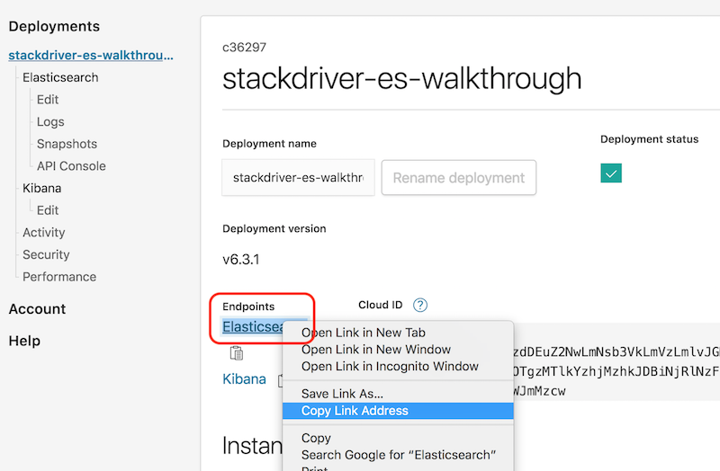

The next section provides steps to complete the setup to send events to the new Elasticsearch deployment.

## Configure the Logstash VM
1. Navigate in the console to the Compute Engine => VM Instances page. Cloud Console provides convenient access to the VM with an embedded SSH console. The example shell commands in this tutorial are concatenated, but if issues are encountered when pasting multiple commands into this console, consider switching to [OS login](https://cloud.google.com/compute/docs/instances/managing-instance-access#enable_oslogin).
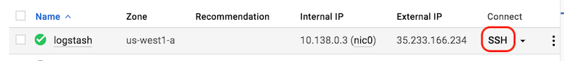

1. Perform typical system updates and install OpenJDK.

        sudo apt-get update && \
        sudo apt-get -y upgrade && \
        sudo apt -y install openjdk-8-jre-headless && \
        echo "export JAVA_HOME=\"/usr/lib/jvm/java-8-openjdk-amd64\"" >> ~/.profile && \
        sudo reboot

    After a few moments the VM will complete its reboot and can be accessed again via SSH.

## Install Logstash
1. Install logstash from Elastic.

        wget -qO - https://artifacts.elastic.co/GPG-KEY-elasticsearch | sudo apt-key add - && \
        echo "deb https://artifacts.elastic.co/packages/6.x/apt stable main" | sudo tee -a /etc/apt/sources.list.d/elastic-6.x.list && \
        sudo apt-get update && sudo apt-get install logstash

1. Install the Logstash Plugin for Cloud Pub/Sub. Version 1.2.0 of the Logstash Pub/Sub plugin is [currently broken](https://github.com/logstash-plugins/logstash-input-google_pubsub/pull/36). Below are the steps to use the previous version until version 1.2.1 is available.

        cd && \
        git clone https://github.com/logstash-plugins/logstash-input-google_pubsub.git && \
        cd logstash-input-google_pubsub && \
        git checkout v1.1.0 && \
        sudo apt-get install -y rubygems && \
        sudo gem build logstash-input-google_pubsub.gemspec && \
        cd /usr/share/logstash && \
        sudo bin/logstash-plugin install  ~/logstash-input-google_pubsub/logstash-input-google_pubsub-1.1.0.gem

    **Expected Response**  

    [after many lines...]

        Validating /home/aaron/logstash-input-google_pubsub/logstash-input-google_pubsub-1.1.0.gem
        Installing logstash-input-google_pubsub
        Installation successful

    When this issue is resolved, it should be possible to replace the git clone/checkout process above with just `sudo -u logstash bin/logstash-plugin install logstash-input-google_pubsub`.

## Configure Logstash
Logstash comes with no default configuration. 

1. Create a new file `/etc/logstash/conf.d/logstash.conf` with these contents, making sure to modify values as needed.

        input
        {
            google_pubsub {
                project_id => "scalesec-dev"
                topic => "stackdriver-topic"
                subscription => "logstash-sub"
                include_metadata => true
                codec => "json"
            }
            # optional, but helpful to generate the ES index and test the plumbing
            heartbeat {
                interval => 10
                type => "heartbeat"
            }
        }
        filter {
        mutate {
            add_field => { "messageId" => "%{[@metadata][pubsub_message][messageId]}" }
        }
        }
        output
        {
            stdout { codec => rubydebug }
            elasticsearch
            {
                hosts => ["https://c36297ebbc024cd4b29c98319dc8c38d.us-west1.gcp.cloud.es.io:9243"]
                user => "elastic"
                password => "NTmWdNJXkzMWL4kkIcIzY8O6"
                index => "logstash-%{+YYYY.MM.dd}"
            }
        }

## Start Logstash
1. Start Logstash.

        sudo service logstash start

1. Monitor the startup logs closely for issues.

        tail -f /var/log/syslog

1. Review log messages. 

    Log messages like these indicate that Logstash is working internally:

        Jul 15 20:43:09 logstash logstash[2537]: {
        Jul 15 20:43:09 logstash logstash[2537]:           "type" => "heartbeat",
        Jul 15 20:43:09 logstash logstash[2537]:      "messageId" => "%{[@metadata][pubsub_message][messageId]}",
        Jul 15 20:43:09 logstash logstash[2537]:        "message" => "ok",
        Jul 15 20:43:09 logstash logstash[2537]:     "@timestamp" => 2018-07-15T20:43:08.367Z,
        Jul 15 20:43:09 logstash logstash[2537]:       "@version" => "1",
        Jul 15 20:43:09 logstash logstash[2537]:           "host" => "logstash"
        Jul 15 20:43:09 logstash logstash[2537]: }

    Log messages like these indicate that Logstash is pulling events from Cloud Pub/Sub. Actual message content will differ.

        Jul 17 20:58:13 logstash logstash[15198]:              "logName" => "projects/scalesec-dev/logs/cloud.googleapis.com%2Fipsec_events",
        Jul 17 20:58:13 logstash logstash[15198]:             "resource" => {
        Jul 17 20:58:13 logstash logstash[15198]:         "labels" => {
        Jul 17 20:58:13 logstash logstash[15198]:             "project_id" => "scalesec-dev",
        Jul 17 20:58:13 logstash logstash[15198]:                 "region" => "us-west1",
        Jul 17 20:58:13 logstash logstash[15198]:             "gateway_id" => "1810546051445508503"
        Jul 17 20:58:13 logstash logstash[15198]:         },
        Jul 17 20:58:13 logstash logstash[15198]:           "type" => "vpn_gateway"
        Jul 17 20:58:13 logstash logstash[15198]:     },
        Jul 17 20:58:13 logstash logstash[15198]:             "severity" => "DEBUG",
        Jul 17 20:58:13 logstash logstash[15198]:           "@timestamp" => 2018-07-17T20:58:12.918Z,
        Jul 17 20:58:13 logstash logstash[15198]:          "textPayload" => "sending packet: from 35.233.211.219[500] to 35.231.4.41[500] (49 bytes)",
        Jul 17 20:58:13 logstash logstash[15198]:             "insertId" => "1e8d5s7f6uc4ap",
        Jul 17 20:58:13 logstash logstash[15198]:            "timestamp" => "2018-07-17T20:58:08.401562594Z",
        Jul 17 20:58:13 logstash logstash[15198]:             "@version" => "1",
        Jul 17 20:58:13 logstash logstash[15198]:               "labels" => {
        Jul 17 20:58:13 logstash logstash[15198]:         "tunnel_id" => "1091689068647389715"
        Jul 17 20:58:13 logstash logstash[15198]:     },
        Jul 17 20:58:13 logstash logstash[15198]:            "messageId" => "146817684320772",
        Jul 17 20:58:13 logstash logstash[15198]:     "receiveTimestamp" => "2018-07-17T20:58:08.65636792Z"

## Configure Kibana
Kibana is a powerful graphical user interface that uses the underlying Elasticsearch data. This is the main console to monitor and triage security events and perform searches and investigations. 

1. Return to the Elasticsearch deployment page and click on the link to Kibana.

    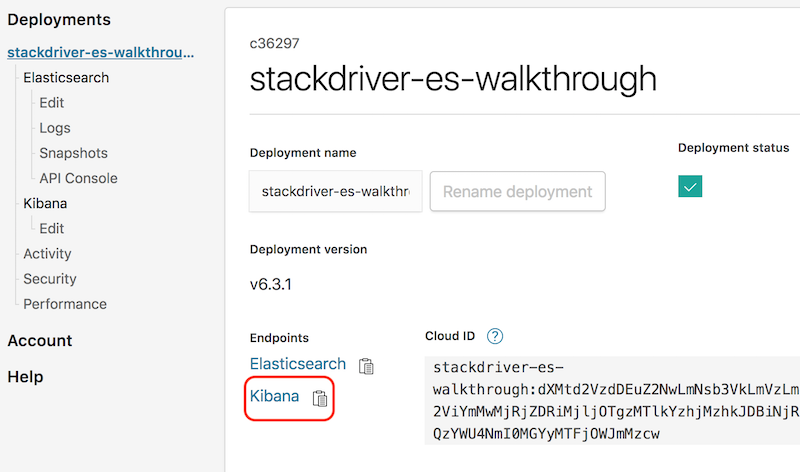

1. Log in as the elastic user.

    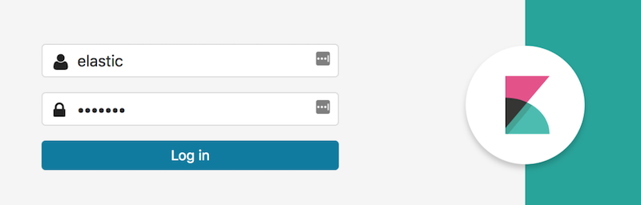

1. Navigate to the Management page to set up Index Patterns for Kibana.

    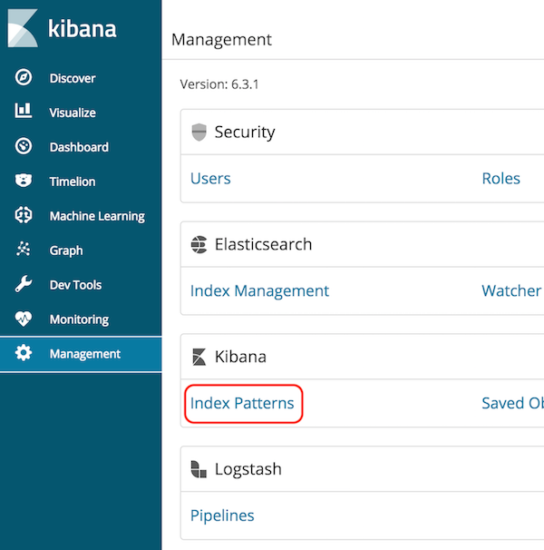

1. Enter `logstash-*`.

    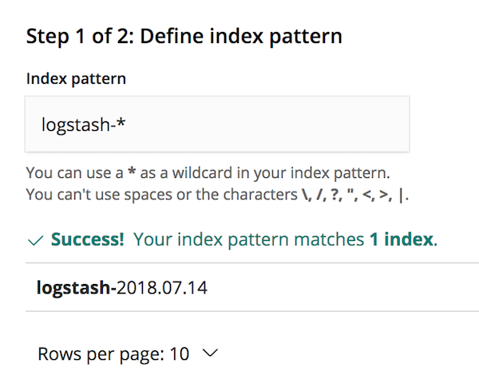

1. Use `@timestamp` for the time filed.

    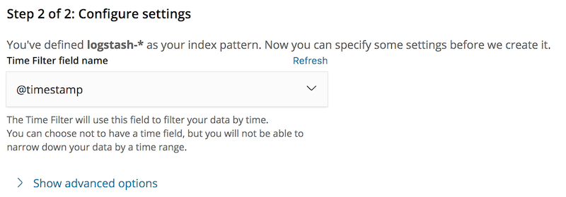

## Verify log flow
Return to the main Kibana dashboard (shown as "Discover" in the navigation menu). The Kibana dashboard should display Stackdriver events similar to those shown below:
    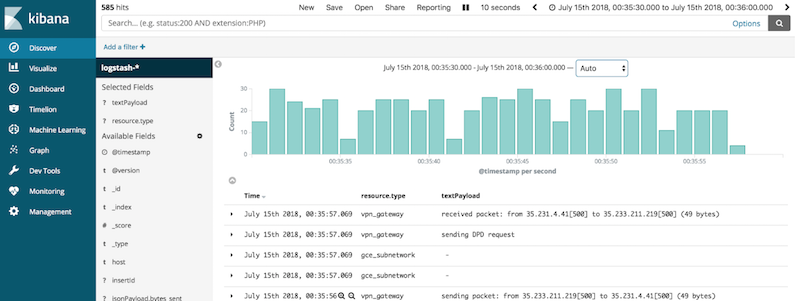

## Conclusion
Regularly analyzing the logs is a crucial component of mature security operations. The next recommended step is to content in Kibana to identify which events are important, and which ones need a quick response. While Elastic Cloud was used as an example in this tutorial, Stackdriver can be used to monitor resources using other logging architectures, other logging systems, other operating systems, and even other cloud providers.