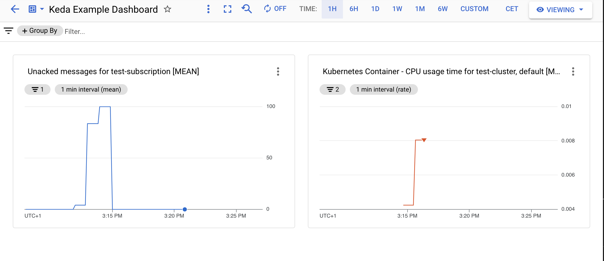

# Scaling to Zero with Keda and GKE Autopilot

GKE Autopilot is a great technology for running your workloads in the cloud. Google SREs take care of operating your Kubernetes cluster, while you can focus on your application. When building event driven applications on GKE Autopilot you might experience that you are running a lot of pods that are not fully utilized. For apps providing an HTTP API or connect to Pub/Sub you could consider using CloudRun. But if you have some other messaging system it can become tougher to scale dynamically. One approach in such a scenario, if your are sufficiently happy to scale from 1 to infinity would be Horizontal Pod Autoscaler. But what if you want to scale to zero, since your workload might just process a few messages a day?

Keda is a great tool for that. It's similar to HPA but with more options towards how you want to scale up and down. In this tutorial we are going to setup a simple application that consumes messages from Pub/Sub and scale the amount of pods using Keda.

### Set up your Environment
Next, you’re going to set up the environment in order for the project to deploy.
  1. [Open a new Cloud Shell session.](https://console.cloud.google.com/?cloudshell=true)
  1. *Run* `git clone https://github.com/GoogleCloudPlatform/community.git` to download the sources to your cloud shell.
  1. `cd ./community/tutorials/gke-autopilot-keda` change directory to the *tutorial* folder.
  1. *Set* required environment variables. Replace [REGION] with the region in which you want to run the resources, e.g. europe-west1
  ```
  export REGION=[REGION]
  ```

You will need to enable the following APIs, in order to follow this tutorial.
* Google Cloud APIs
* Artifact Registry API
* Kubernetes Engine API
* Identity and Access Management (IAM) API
* IAM Service Account Credentials API
* Cloud Pub/Sub API

You can use this command as a shorthand
```
gcloud services enable iam.googleapis.com
gcloud services enable compute.googleapis.com
gcloud services enable artifactregistry.googleapis.com
gcloud services enable container.googleapis.com 
gcloud services enable cloudapis.googleapis.com 
gcloud services enable iamcredentials.googleapis.com 
gcloud services enable pubsub.googleapis.com  
```

Let's create a GKE Autopilot cluster next and retrieve the credentials for access:
```
gcloud container clusters create-auto test-cluster \
    --region $REGION \
    --project=$GOOGLE_CLOUD_PROJECT 
gcloud container clusters get-credentials test-cluster \
    --region $REGION \
    --project $GOOGLE_CLOUD_PROJECT
```

Deploy Keda to the Autopilot cluster.
```
kubectl apply -f https://github.com/kedacore/keda/releases/download/v2.5.0/keda-2.5.0.yaml
```

In order for Keda to track the pending messages in the Pub/Sub queue, we need to link the Kubernetes Service Account(KSA) of Keda (keda-operator) to a Google Service Account(GSA) so we can bind the permissions to access Google Cloud Monitoring.
```
gcloud iam service-accounts create keda-operator --project $GOOGLE_CLOUD_PROJECT
```

Grant Cloud Monitoring viewer access to the GSA next
```
gcloud projects add-iam-policy-binding $GOOGLE_CLOUD_PROJECT \
    --member "serviceAccount:keda-operator@$GOOGLE_CLOUD_PROJECT.iam.gserviceaccount.com" \
    --role "roles/monitoring.viewer"
```

Now we 
gcloud iam service-accounts add-iam-policy-binding keda-operator@$GOOGLE_CLOUD_PROJECT.iam.gserviceaccount.com \
    --role roles/iam.workloadIdentityUser \
    --member "serviceAccount:$GOOGLE_CLOUD_PROJECT.svc.id.goog[keda/keda-operator]" \
    --project $GOOGLE_CLOUD_PROJECT

Connect the GSA and the KSA
kubectl annotate serviceaccount keda-operator \
    --namespace keda \
    iam.gke.io/gcp-service-account=keda-operator@$GOOGLE_CLOUD_PROJECT.iam.gserviceaccount.com

Create artifact repository
gcloud artifacts repositories create test-repo \
    --repository-format=docker \
    --location=$REGION \
    --project $GOOGLE_CLOUD_PROJECT

Setup docker credentials helper
gcloud auth configure-docker $REGION-docker.pkg.dev

Create new PubSub topic
gcloud pubsub topics create test-topic --project $GOOGLE_CLOUD_PROJECT

Create new PubSub subscription
gcloud pubsub subscriptions create test-subscription --topic test-topic --project $GOOGLE_CLOUD_PROJECT

Create KSA Service Account
kubectl create serviceaccount testapp --namespace default

Create a Google Service Account(GSA) for Keda
gcloud iam service-accounts create testapp --project $GOOGLE_CLOUD_PROJECT

Grant access to PubSub to GSA
gcloud projects add-iam-policy-binding $GOOGLE_CLOUD_PROJECT \
    --member "serviceAccount:testapp@$GOOGLE_CLOUD_PROJECT.iam.gserviceaccount.com" \
    --role "roles/pubsub.subscriber"

Make the GSA an Workload Identity User
gcloud iam service-accounts add-iam-policy-binding testapp@$GOOGLE_CLOUD_PROJECT.iam.gserviceaccount.com \
    --role roles/iam.workloadIdentityUser \
    --member "serviceAccount:$GOOGLE_CLOUD_PROJECT.svc.id.goog[default/testapp]" \
    --project $GOOGLE_CLOUD_PROJECT

Connect the GSA and the KSA
kubectl annotate serviceaccount testapp \
    --namespace default \
    iam.gke.io/gcp-service-account=testapp@$GOOGLE_CLOUD_PROJECT.iam.gserviceaccount.com

## Let's build the application
As part of this

### Build application container
docker build -t $REGION-docker.pkg.dev/$GOOGLE_CLOUD_PROJECT/test-repo/app:latest ./app
docker push $REGION-docker.pkg.dev/$GOOGLE_CLOUD_PROJECT/test-repo/app:latest

deploy application
```
envsubst < deployment.yaml | kubectl apply -f -
```

Send message
gcloud pubsub topics publish test-topic --message="Hello World" --project $GOOGLE_CLOUD_PROJECT

Or to generate a 100 messages:
./generate-message.sh

gcloud monitoring dashboards create --config-from-file keda-tutorial-dashboard.yaml --project $GOOGLE_CLOUD_PROJECT --project $GOOGLE_CLOUD_PROJECT

