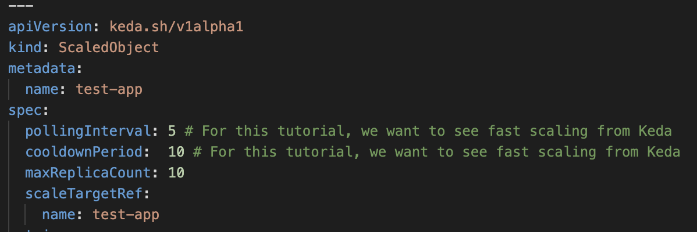
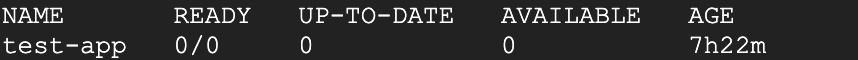
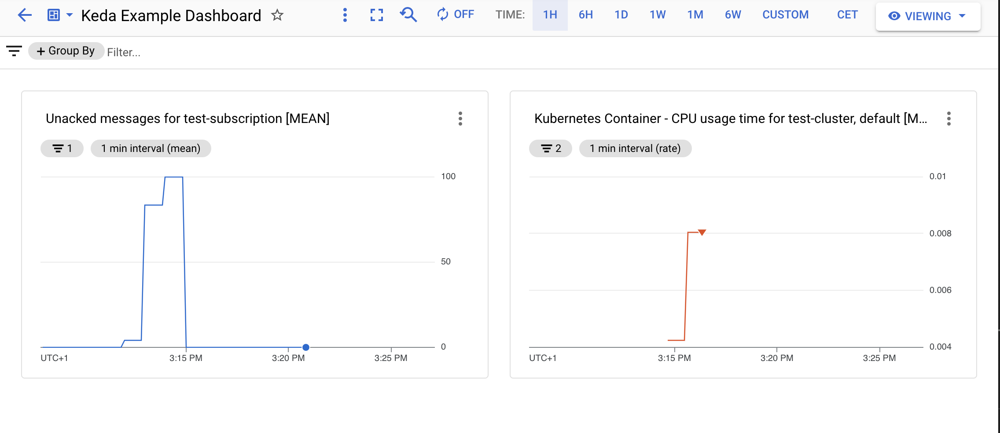

Christoph Grotz | Google

<p style="background-color:#CAFACA;"><i>Contributed by Google employees.</i></p>

GKE Autopilot is a great technology for running your workloads in the cloud. Google SREs take care of operating your Kubernetes cluster, while you can focus on your application. When building event driven applications on GKE Autopilot you might experience that you are running a lot of pods that are not fully utilized. For apps providing an HTTP API or connect to Pub/Sub you could consider using CloudRun. But if you have some other messaging system it can become tougher to scale dynamically. One approach in such a scenario, if your are sufficiently happy to scale from 1 to infinity would be Horizontal Pod Autoscaler. But what if you want to scale to zero, since your workload might just process a few messages a day?

KEDA is a great tool for that. It's similar to HPA but with more options towards how you want to scale up and down. In this tutorial we are going to setup a simple application that consumes messages from Pub/Sub and scale the amount of pods using KEDA.

### Set up your Environment
Next, you’re going to set up the environment in order for the project to deploy.
  1. [Open a new Cloud Shell session.](https://console.cloud.google.com/?cloudshell=true)
  1. *Run* `git clone https://github.com/GoogleCloudPlatform/community.git` to download the sources to your cloud shell.
  1. `cd ./community/tutorials/gke-autopilot-with-keda` change directory to the *tutorial* folder.
  1. *Set* required environment variables. Replace [REGION] with the region in which you want to run the resources, e.g. europe-west1
  ```
  export REGION=[REGION]
  ```

You will need to enable the following APIs, in order to follow this tutorial.
* Google Cloud APIs
* Artifact Registry API
* Kubernetes Engine API
* Identity and Access Management (IAM) API
* IAM Service Account Credentials API
* Cloud Pub/Sub API

You can use this command as a shorthand
```
gcloud services enable iam.googleapis.com
gcloud services enable compute.googleapis.com
gcloud services enable artifactregistry.googleapis.com
gcloud services enable container.googleapis.com 
gcloud services enable cloudapis.googleapis.com 
gcloud services enable iamcredentials.googleapis.com 
gcloud services enable pubsub.googleapis.com  
```

### Setup GKE Autopilot with KEDA

Let's create a GKE Autopilot cluster next and retrieve the credentials for access. This might take some time so trigger the creation and fetch some coffee:
```
gcloud container clusters create-auto test-cluster \
    --region $REGION \
    --project=$GOOGLE_CLOUD_PROJECT 
gcloud container clusters get-credentials test-cluster \
    --region $REGION \
    --project $GOOGLE_CLOUD_PROJECT
```

When the GKE Autopilot cluster is created, we are going to deploy KEDA to the cluster.
```
kubectl apply -f https://github.com/kedacore/keda/releases/download/v2.5.0/keda-2.5.0.yaml
```

In order for KEDA to track the pending messages in the Pub/Sub queue, we need to link the Kubernetes Service Account (KSA) of KEDA (keda-operator) to a Google Service Account (GSA) with the permissions to access Google Cloud Monitoring.
```
gcloud iam service-accounts create keda-operator --project $GOOGLE_CLOUD_PROJECT
```

Grant Cloud Monitoring viewer access to the GSA next and link the service accounts together.
```
gcloud projects add-iam-policy-binding $GOOGLE_CLOUD_PROJECT \
    --member "serviceAccount:keda-operator@$GOOGLE_CLOUD_PROJECT.iam.gserviceaccount.com" \
    --role "roles/monitoring.viewer"

gcloud iam service-accounts add-iam-policy-binding keda-operator@$GOOGLE_CLOUD_PROJECT.iam.gserviceaccount.com \
    --role roles/iam.workloadIdentityUser \
    --member "serviceAccount:$GOOGLE_CLOUD_PROJECT.svc.id.goog[keda/keda-operator]" \
    --project $GOOGLE_CLOUD_PROJECT

kubectl annotate serviceaccount keda-operator \
    --namespace keda \
    iam.gke.io/gcp-service-account=keda-operator@$GOOGLE_CLOUD_PROJECT.iam.gserviceaccount.com
```

### Deploy the demo application

In order to take KEDA for a test drive we are going to deploy a simple application, that consums messages from Pub/Sub and logs them to console. The first step will be to create an Artifact Registry repository for the container image:
```
gcloud artifacts repositories create test-repo \
    --repository-format=docker \
    --location=$REGION \
    --project $GOOGLE_CLOUD_PROJECT
```

You will need to setup the Docker credentials helper for the repo:
```
gcloud auth configure-docker $REGION-docker.pkg.dev
```

Since we want to consume messages from Pub/Sub, we need to create a Pub/Sub topic and subscription:
```
gcloud pubsub topics create test-topic --project $GOOGLE_CLOUD_PROJECT 
gcloud pubsub subscriptions create test-subscription --topic test-topic --project $GOOGLE_CLOUD_PROJECT
```

The application will need a service account with the permission to consume messages from Pub/Sub and that can be used in Workload Identiy:
```
kubectl create serviceaccount testapp --namespace default

gcloud iam service-accounts create testapp --project $GOOGLE_CLOUD_PROJECT

gcloud projects add-iam-policy-binding $GOOGLE_CLOUD_PROJECT \
    --member "serviceAccount:testapp@$GOOGLE_CLOUD_PROJECT.iam.gserviceaccount.com" \
    --role "roles/pubsub.subscriber"
    
gcloud iam service-accounts add-iam-policy-binding testapp@$GOOGLE_CLOUD_PROJECT.iam.gserviceaccount.com \
    --role roles/iam.workloadIdentityUser \
    --member "serviceAccount:$GOOGLE_CLOUD_PROJECT.svc.id.goog[default/testapp]" \
    --project $GOOGLE_CLOUD_PROJECT
    
kubectl annotate serviceaccount testapp \
    --namespace default \
    iam.gke.io/gcp-service-account=testapp@$GOOGLE_CLOUD_PROJECT.iam.gserviceaccount.com
```

Next step before the application can be deployed, is building the container and pushing it to the Artifact Registry repo:

```
docker build -t $REGION-docker.pkg.dev/$GOOGLE_CLOUD_PROJECT/test-repo/app:latest ./app
docker push $REGION-docker.pkg.dev/$GOOGLE_CLOUD_PROJECT/test-repo/app:latest
```

Everything is ready, let's deploy the application:
```
envsubst < deployment.yaml | kubectl apply -f -
```
For the tutorial we configured the scaled object for fast scaling up and down.


When you check the number of replicas via you can see that KEDA automatically scaled the number of replicas down to zero, since there are currently no messages in the subscription waiting to be processed:

```
kubectl get deployments
```



### Publish some messages
You can generate some messages either by repetedly using gcloud:
```
gcloud pubsub topics publish test-topic --message="Hello World" --project $GOOGLE_CLOUD_PROJECT
```
Or generate a 100 messages at once using this script:
```
./generate-message.sh
```

If you check the deployment again, you should see that KEDA increased the amount of desired replicas to process the messages. You can also deploy this nice Google Cloud Monitoring dashboard which shows you both the CPU usage by application pod and pending messages in the Pub/Sub subscription.

```
gcloud monitoring dashboards create --config-from-file keda-tutorial-dashboard.yaml --project $GOOGLE_CLOUD_PROJECT --project $GOOGLE_CLOUD_PROJECT
```



That's it now you have a nice message consumer that can scale down to zero.